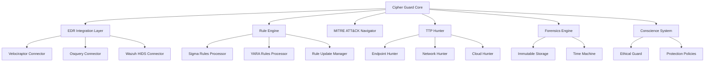
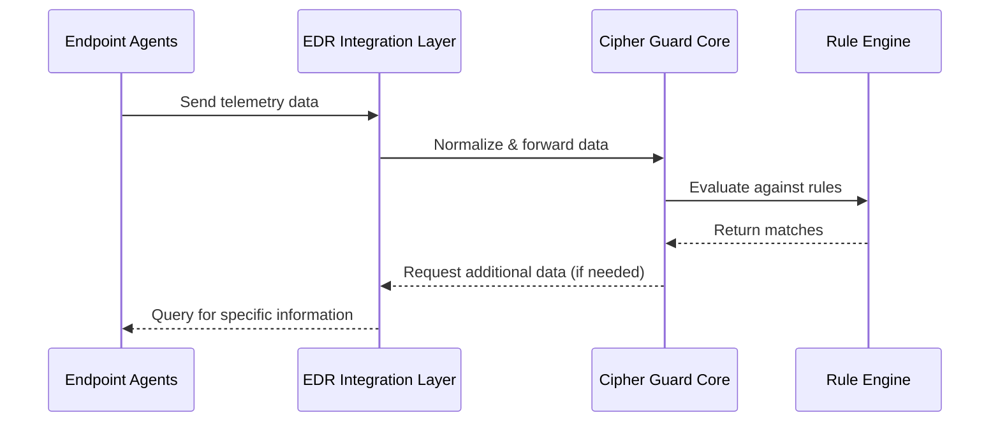
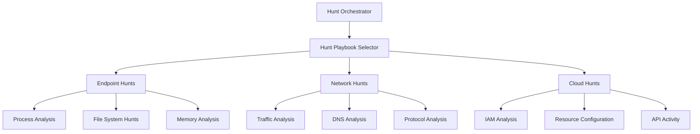
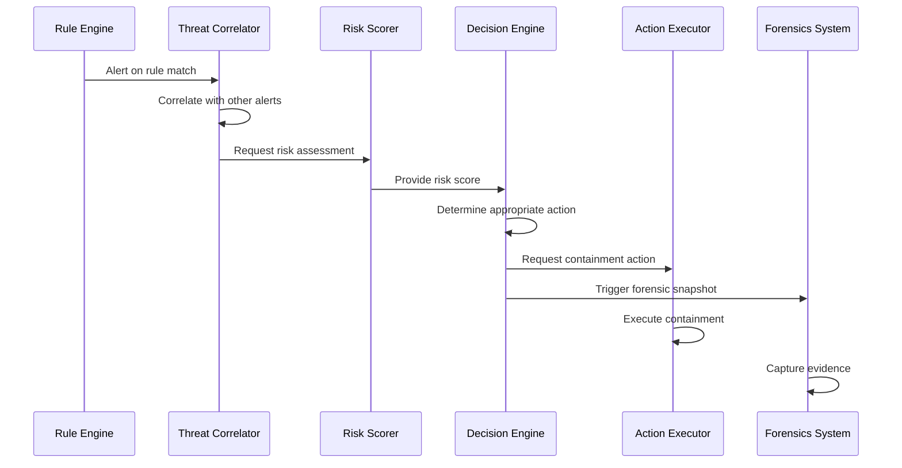
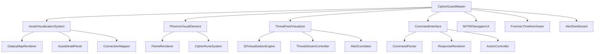
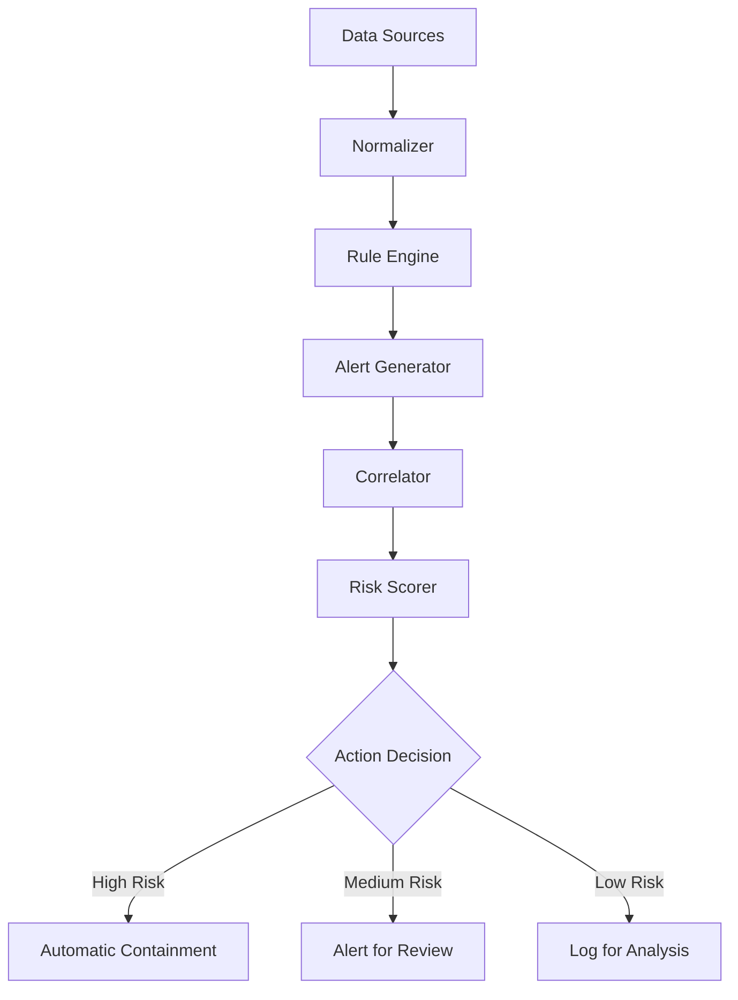
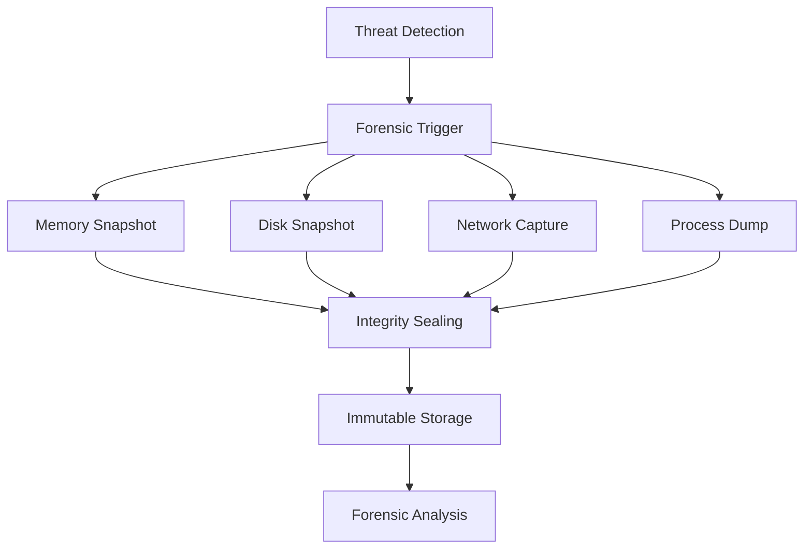
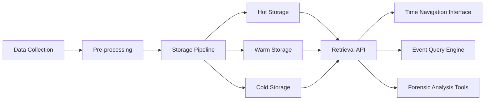
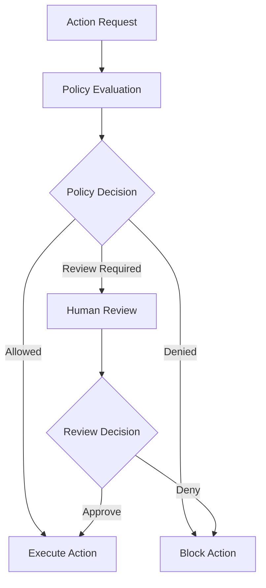
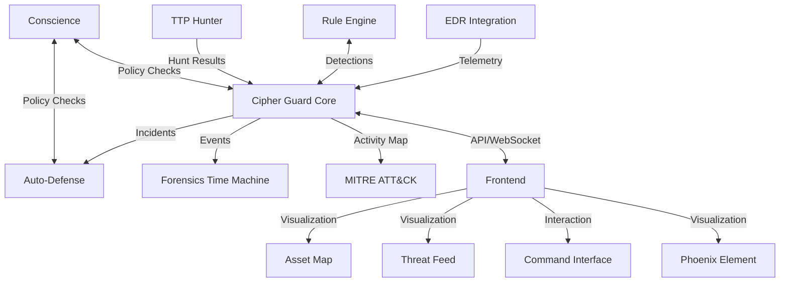

# Cipher Guard Architecture Design Document

## Overview

Cipher Guard serves as the defensive counterpart to Ember Unit in Phoenix Orch, providing comprehensive blue team (defensive) capabilities. This document outlines the architectural design for both backend and frontend components of Cipher Guard.

## 1. Backend Architecture: `src/modules/orchestrator/cipher_guard/`

The Cipher Guard backend is structured with a modular architecture to support real-time threat detection, analysis, and response. The core systems include EDR integration, rule engine, MITRE ATT&CK mapping, and automated TTP hunting.

### 1.1 Core Architecture Components



### 1.2 Module Structure

The backend is organized into the following directory structure:

```
src/modules/orchestrator/cipher_guard/
├── core/
│   ├── config.rs
│   ├── mod.rs
│   ├── state.rs
│   └── types.rs
├── edr/
│   ├── velociraptor/
│   ├── osquery/
│   ├── wazuh/
│   ├── connector_factory.rs
│   ├── mod.rs
│   └── types.rs
├── rule_engine/
│   ├── sigma/
│   ├── yara/
│   ├── updater/
│   ├── mod.rs
│   └── types.rs
├── mitre/
│   ├── attack_matrix.rs
│   ├── navigator.rs
│   ├── techniques.rs
│   ├── mod.rs
│   └── types.rs
├── ttp_hunter/
│   ├── endpoint/
│   ├── network/
│   ├── cloud/
│   ├── mod.rs
│   └── types.rs
├── auto_defense/
│   ├── detection.rs
│   ├── containment.rs
│   ├── remediation.rs
│   ├── mod.rs
│   └── types.rs
├── forensics/
│   ├── time_machine.rs
│   ├── snapshot.rs
│   ├── recorder.rs
│   ├── mod.rs
│   └── types.rs
├── conscience/
│   ├── protection_policies.rs
│   ├── ethical_guard.rs
│   ├── mod.rs
│   └── types.rs
├── api/
│   ├── http.rs
│   ├── websocket.rs
│   ├── mod.rs
│   └── types.rs
└── lib.rs
```

### 1.3 EDR Integration Layer

The EDR Integration Layer connects with industry-standard endpoint detection and response tools.

#### 1.3.1 Components

- **Velociraptor Connector**: Integrates with Velociraptor for endpoint visibility and response
- **Osquery Connector**: Interfaces with Osquery for cross-platform system insight
- **Wazuh HIDS Connector**: Connects with Wazuh for host-based intrusion detection
- **Common Interface**: Unified API to abstract vendor-specific implementations
- **Redundancy Manager**: Ensures high availability of EDR capabilities

#### 1.3.2 Data Flow



### 1.4 Rule Engine

The Rule Engine processes detection rules in standard formats (Sigma and YARA).

#### 1.4.1 Components

- **Sigma Rules Processor**: Process Sigma rules for log-based detection
- **YARA Rules Processor**: Apply YARA rules for content matching
- **Rule Repository**: Efficiently store and index 100k+ rules
- **Rule Update Manager**: Automated daily updates of rule sets
- **Rule Performance Analyzer**: Optimize rule execution and prioritization

#### 1.4.2 High-Performance Architecture

The rule engine uses a multi-layered approach to handle the large rule set:

- **Pre-filtering**: Bloom filters to quickly eliminate irrelevant data
- **Indexing**: Rule indexing by technique, tactic, and data source
- **Parallelization**: Multi-threaded rule execution
- **Caching**: Smart caching of frequently used rules and partial results

### 1.5 MITRE ATT&CK Navigator

This component maps observed activities to the MITRE ATT&CK framework.

#### 1.5.1 Components

- **Technique Mapper**: Maps observed activities to ATT&CK techniques
- **Navigator Engine**: Provides interactive visualization data for the frontend
- **Coverage Analyzer**: Assesses defensive coverage across the ATT&CK matrix
- **Technique Metadata Repository**: Stores comprehensive details on techniques

### 1.6 TTP Hunter

TTP Hunter performs automated hunting for tactics, techniques, and procedures across environments.

#### 1.6.1 Components

- **Endpoint Hunter**: Hunts for suspicious patterns on endpoints
- **Network Hunter**: Analyzes network traffic for malicious behavior
- **Cloud Hunter**: Monitors cloud environments for attack patterns
- **Hunting Playbook Engine**: Executes predefined and custom hunting playbooks

#### 1.6.2 Hunt Orchestration



### 1.7 Auto-Defense Action System

This system provides automated response capabilities to detected threats.

#### 1.7.1 Components

- **Detection Correlator**: Correlates multiple detections into incidents
- **Risk Scorer**: Assigns risk scores to potential threats
- **Containment Engine**: Executes containment actions
- **Remediation Planner**: Develops remediation strategies
- **Action Executor**: Safely executes defensive actions

#### 1.7.2 Workflow



### 1.8 Forensics "Time Machine"

The Forensics system captures and maintains a 1-year rolling record of events for investigation.

#### 1.8.1 Components

- **Event Recorder**: Captures events from all monitored systems
- **Immutable Storage**: Writes data to tamper-proof storage
- **Time-Indexed Archive**: Organizes data for efficient time-based retrieval
- **Compression Engine**: Optimizes storage requirements
- **Retention Manager**: Enforces the 1-year rolling window policy

#### 1.8.2 Storage Architecture

Employs a tiered storage approach:
- **Hot Storage**: Recent events (30 days) for fast access
- **Warm Storage**: Medium-term events (30-90 days)
- **Cold Storage**: Long-term events (90-365 days)

### 1.9 "Conscience" System

The Conscience system ensures ethical operation and protection of sensitive subjects.

#### 1.9.1 Components

- **Protection Policy Engine**: Enforces protection for family, children, innocents
- **Ethical Guard**: Ensures all actions meet ethical standards
- **Override Authority**: Manages authorized exceptions to protection policies
- **Audit Logger**: Records all policy evaluations and decisions

## 2. Frontend Architecture: `frontend/src/pages/CipherGuardMaster.tsx`

The Cipher Guard frontend provides a comprehensive visual interface for security monitoring, analysis, and response.

### 2.1 Component Structure



### 2.2 Component Hierarchy

The frontend follows this component hierarchy:

```
frontend/src/pages/CipherGuardMaster.tsx
├── components/
│   ├── AssetVisualization/
│   │   ├── GalaxyMap.tsx
│   │   ├── AssetDetail.tsx
│   │   ├── NetworkGraph.tsx
│   │   ├── AssetCategories/
│   │   │   ├── EndpointRenderer.tsx
│   │   │   ├── MobileRenderer.tsx
│   │   │   ├── IoTRenderer.tsx
│   │   │   ├── CloudRenderer.tsx
│   │   │   └── index.tsx
│   │   └── index.tsx
│   ├── PhoenixVisual/
│   │   ├── WhiteFlame.tsx
│   │   ├── CipherRunes.tsx
│   │   ├── DefenseModeEffects.tsx
│   │   └── index.tsx
│   ├── ThreatFeed/
│   │   ├── ThreeDimensionalView.tsx
│   │   ├── ThreatStream.tsx
│   │   ├── AlertCorrelation.tsx
│   │   └── index.tsx
│   ├── CommandInterface/
│   │   ├── CommandInput.tsx
│   │   ├── ResponsePanel.tsx
│   │   ├── ActionButtons.tsx
│   │   └── index.tsx
│   ├── MITRENavigator/
│   │   ├── AttackMatrix.tsx
│   │   ├── TechniqueDetails.tsx
│   │   ├── CoverageHeatmap.tsx
│   │   └── index.tsx
│   ├── ForensicsViewer/
│   │   ├── Timeline.tsx
│   │   ├── EventDetails.tsx
│   │   ├── TimeMachineControls.tsx
│   │   └── index.tsx
│   └── AlertDashboard/
│       ├── AlertList.tsx
│       ├── AlertDetail.tsx
│       ├── ResponseActions.tsx
│       └── index.tsx
├── hooks/
│   ├── useCipherGuardState.ts
│   ├── useAssetVisualization.ts
│   ├── useThreatFeed.ts
│   ├── useCommandInterface.ts
│   ├── useMITRENavigator.ts
│   └── useForensicsTimeline.ts
├── contexts/
│   ├── CipherGuardContext.tsx
│   ├── AssetContext.tsx
│   └── AlertContext.tsx
└── CipherGuardMaster.tsx
```

### 2.3 Key Frontend Components

#### 2.3.1 Asset Visualization System

The Asset Visualization System renders a galaxy-like map of all monitored assets.

**Features:**
- 3D galaxy visualization with asset categories (endpoints, phones, IoT, cloud)
- Zoom/pan/rotate controls for intuitive navigation
- Visual indicators for asset status, importance, and security posture
- Connection lines showing network relationships
- Detail panels for selected assets
- Filtering by asset type, status, and security level

#### 2.3.2 Phoenix Visual Element

Visual representation of the Phoenix in defense mode.

**Features:**
- White flame visual effect representing defense mode
- Cyan cipher runes that pulse with activity
- Animations tied to system status and alert levels
- Transitions between offensive (Ember Unit) and defensive (Cipher Guard) modes

#### 2.3.3 Threat Feed Visualizer

Real-time 3D visualization of threat activity and alerts.

**Features:**
- 3D visualization showing threats as they occur
- Visual correlation of related alerts
- Threat categorization by severity, technique, and source
- Timeline control for reviewing historical threats
- Interactive filtering and focus controls

#### 2.3.4 Command Interface

Interface for issuing commands and receiving responses.

**Features:**
- Natural language command input
- Structured command builder for complex operations
- Response visualization with actionable elements
- Command history and favorites
- Context-aware command suggestions

### 2.4 State Management

The frontend uses a context-based state management approach with:

- **CipherGuardContext**: Global state for the entire application
- **AssetContext**: State related to monitored assets
- **AlertContext**: State for alerts and threat data
- **CommandContext**: State for the command interface

### 2.5 API Integration

The frontend communicates with the backend through:

- **RESTful API**: For standard data requests
- **WebSocket**: For real-time updates and command execution
- **GraphQL**: For complex data queries and subscriptions

## 3. Auto-Defense Action Architecture

The Auto-Defense architecture provides a comprehensive workflow from detection to containment.

### 3.1 Detection Pipeline



### 3.2 Containment Workflow

The system employs a graduated containment approach based on threat severity:

1. **Level 1: Monitoring**
   - Increased logging
   - Enhanced surveillance
   - No direct impact on operations

2. **Level 2: Soft Containment**
   - Restriction of non-essential communication
   - Application of additional security controls
   - Limited impact on operations

3. **Level 3: Moderate Containment**
   - Network isolation except for security communications
   - Process/service suspension
   - Moderate impact on operations

4. **Level 4: Hard Containment**
   - Complete network isolation
   - System suspension
   - Significant impact on operations

### 3.3 Immutable Snapshots and Forensics



## 4. Forensics "Time Machine" Capability

### 4.1 Overall Architecture

The Time Machine maintains a one-year rolling record of events and activities.



### 4.2 Data Collection Sources

- **Endpoint Telemetry**: OS events, process activities, file changes
- **Network Traffic**: Full or selective packet capture
- **Authentication Events**: Login/logout and privilege changes
- **Application Logs**: Custom application events
- **Security Alerts**: Correlated security events
- **Configuration Changes**: System and application configurations

### 4.3 Storage Implementation

- **Storage Format**: Optimized WORM (Write Once Read Many) format
- **Compression**: Time-series optimized compression
- **Indexing**: Multi-dimensional indexing for efficient querying
- **Retention**: Automated enforcement of 1-year retention policy
- **Integrity**: Cryptographic sealing and verification

### 4.4 Time Navigation Features

- **Timeline Interface**: Interactive timeline with variable granularity
- **Event Correlation**: Visual correlation of related events
- **Snapshot Navigation**: Jump to system state at specific points in time
- **Difference Highlighting**: Visualize changes between time points
- **Attack Reconstruction**: Replay capabilities for incident analysis

## 5. "Conscience" System

### 5.1 Protection Framework

The Conscience system ensures that defensive operations protect family, children, and innocent individuals.



### 5.2 Protection Categories

- **Family Protection**: Special safeguards for family members
- **Child Protection**: Enhanced protections for minors
- **Innocent Protection**: Safeguards for uninvolved parties
- **Privacy Protection**: Controls for sensitive personal data
- **Safety Controls**: Prevention of harmful actions

### 5.3 Override Mechanisms

- **Emergency Override**: Protocol for true emergency situations
- **Legal Compliance**: Mechanisms for lawful access requirements
- **Ethical Review**: Process for ethical dilemmas
- **Audit Trail**: Comprehensive logging of all overrides

## 6. Component Relationships and Data Flows

### 6.1 System-Level Data Flow



### 6.2 Component Integration Points

- **Core-EDR Integration**: Standardized API and message format
- **Core-Rule Engine**: High-performance rule matching interface
- **Core-Auto Defense**: Action request and result reporting
- **Core-Forensics**: Event recording and retrieval
- **Core-Frontend**: WebSocket for real-time updates, REST API for data

## 7. API Specifications

### 7.1 Core API Endpoints

**RESTful API:**

- `GET /api/v1/assets` - List all assets
- `GET /api/v1/assets/{id}` - Get asset details
- `GET /api/v1/alerts` - List alerts
- `GET /api/v1/alerts/{id}` - Get alert details
- `POST /api/v1/actions` - Execute defense action
- `GET /api/v1/mitre/techniques` - Get MITRE techniques
- `GET /api/v1/forensics/timeline` - Access time machine data

**WebSocket:**

- `/ws/alerts` - Real-time alert notifications
- `/ws/assets` - Asset status updates
- `/ws/commands` - Command interface
- `/ws/visualization` - Visualization data

### 7.2 Internal Component APIs

- **EDR Connector API**: Unified interface for EDR integration
- **Rule Engine API**: Rule matching and management
- **Auto-Defense API**: Action execution and status
- **Forensics API**: Event recording and retrieval
- **Conscience API**: Policy evaluation and decision

## 8. Implementation Considerations

### 8.1 Technology Stack

**Backend:**
- Rust for core services
- High-performance databases for rule storage and event data
- Message queues for event processing
- WebSocket for real-time communications

**Frontend:**
- React with TypeScript
- Three.js for 3D visualizations
- D3.js for data visualization
- WebSocket for real-time updates

### 8.2 Performance Requirements

- Support for 100k+ detection rules
- Real-time processing of high-volume telemetry
- Sub-second response time for critical alerts
- Efficient storage and retrieval of 1-year forensic data

### 8.3 Security Considerations

- Secure API authentication and authorization
- Encryption for all stored and transmitted data
- Integrity protection for forensic evidence
- Role-based access control for all functions
- Comprehensive audit logging

## 9. Conclusion

The Cipher Guard architecture provides a comprehensive defensive capability for Phoenix Orch, complementing the offensive capabilities of Ember Unit. With its modular design, the system can scale to handle large environments while providing high-performance threat detection, visualization, and response capabilities.