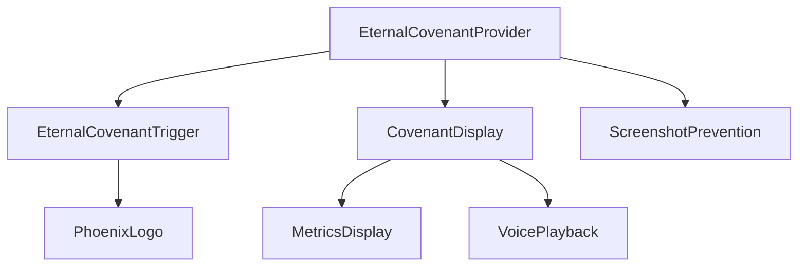

# Eternal Covenant Technical Specifications

## 1. Component Structure



### 1.1 Core Components

#### EternalCovenantProvider
- Global state management using React Context
- Manages covenant activation state
- Handles click detection and timing
- Coordinates between child components

#### EternalCovenantTrigger
- Implements triple-click detection within 1.8s window
- Manages hover timing state (7+ seconds)
- Contains enhanced PhoenixLogo component
- Implements blood-orange to white transition effect

#### CovenantDisplay
- Full-screen overlay implementation
- Manages transitions and animations
- Houses MetricsDisplay and VoicePlayback components
- Implements black background transition effect

## 2. State Management

### 2.1 Core State Interface
```typescript
interface CovenantState {
  isHovering: boolean;
  hoverDuration: number;
  clickSequence: number[];
  isCovenantActive: boolean;
  metricsData: MetricsData;
  audioState: AudioPlaybackState;
}

interface MetricsData {
  totalViews: number;
  currentViewDuration: number;
  lastActivation: Date;
  completedViewings: number;
}

interface AudioPlaybackState {
  isPlaying: boolean;
  currentTime: number;
  duration: number;
  isLoaded: boolean;
}
```

### 2.2 State Management Implementation
- Uses React Context for global state
- Implements custom hooks for specific features:
  * useTripleClick: Manages click sequence detection
  * useHoverTimer: Tracks hover duration
  * useAudioPlayback: Handles voice sample playback
  * useMetrics: Manages real-time metrics

## 3. Animation Specifications

### 3.1 Phoenix Logo Transition
```css
.phoenix-logo {
  transition: color 7s ease-in-out;
  color: var(--phoenix-blood-orange);
}

.phoenix-logo:hover {
  animation: logoTransition 7s forwards;
}

@keyframes logoTransition {
  0% { color: var(--phoenix-blood-orange); }
  100% { color: white; }
}
```

### 3.2 Covenant Display Animation
```typescript
const overlayVariants = {
  hidden: { opacity: 0 },
  visible: {
    opacity: 1,
    transition: {
      duration: 1.2,
      ease: "easeInOut"
    }
  }
};
```

## 4. Voice Playback System

### 4.1 Audio Implementation
```typescript
class CovenantAudioController {
  private audioContext: AudioContext;
  private audioBuffer: AudioBuffer;
  private gainNode: GainNode;
  
  async loadVoiceSample(): Promise<void>;
  play(): void;
  pause(): void;
  setVolume(level: number): void;
}
```

### 4.2 Audio Features
- Pre-loading of 16-year-old voice sample
- Fade in/out transitions
- Automatic pause on covenant deactivation
- Error handling for failed audio loads

## 5. Screenshot Prevention

### 5.1 Technical Approach
- Implements multiple layers of protection:
  1. CSS-based prevention
  2. JavaScript event monitoring
  3. HTML5 canvas protection
  4. Periodic DOM mutation checks

```typescript
const preventScreenCapture = {
  css: `
    body.covenant-active {
      -webkit-user-select: none;
      -webkit-touch-callout: none;
      -moz-user-select: none;
      -ms-user-select: none;
      user-select: none;
    }
  `,
  js: `
    document.addEventListener('keydown', (e) => {
      if ((e.ctrlKey || e.metaKey) && (e.key === 'p' || e.key === 's')) {
        e.preventDefault();
      }
    });
  `
};
```

## 6. Real-time Metrics Integration

### 6.1 Metrics Collection
```typescript
interface MetricsCollector {
  trackView(): void;
  updateViewDuration(): void;
  recordCompletion(): void;
  getAggregateStats(): Promise<MetricsData>;
}
```

### 6.2 Implementation Details
- WebSocket connection for real-time updates
- Local storage backup for offline functionality
- Batched updates to prevent performance impact
- Integration with existing monitoring system

## 7. Security Considerations

### 7.1 Data Protection
- Voice sample encryption at rest
- Secure WebSocket connections for metrics
- Rate limiting for activation attempts
- Client-side storage encryption

### 7.2 Performance Optimization
- Asset preloading
- Efficient state updates
- Debounced event handlers
- Memory leak prevention

## 8. Integration Points

### 8.1 Required Changes
- Add EternalCovenantProvider to app layout
- Integrate with existing PhoenixAvatar component
- Add metrics endpoints to API
- Implement WebSocket handlers

### 8.2 Dependencies
- Framer Motion for animations
- Web Audio API for voice playback
- WebSocket for real-time metrics
- LocalStorage for offline functionality

## 9. Testing Strategy

### 9.1 Unit Tests
- Click detection accuracy
- Hover timing precision
- State management
- Audio controller functionality

### 9.2 Integration Tests
- Component interaction
- Event propagation
- Metrics collection
- Screenshot prevention effectiveness

## 10. Deployment Considerations

### 10.1 Prerequisites
- Audio file optimization
- Performance baseline establishment
- Security audit completion
- Browser compatibility verification

### 10.2 Rollout Strategy
- Phased deployment
- Feature flags for gradual activation
- Monitoring plan
- Rollback procedures