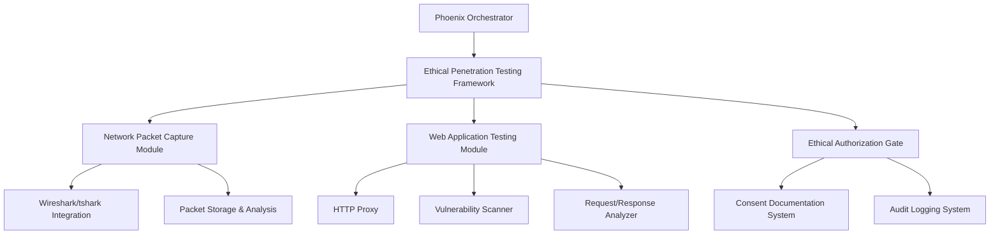

# Ethical Penetration Testing Framework Technical Specifications

## 1. Introduction

### 1.1 Purpose
This document outlines the technical specifications for an ethical penetration testing framework that will be integrated into the Phoenix Orchestrator project. The framework is designed to provide authorized security testing capabilities while maintaining strong ethical safeguards and ensuring proper authorization for all operations.

### 1.2 Scope
The framework encompasses:
- Network packet capture capabilities with Wireshark/tshark integration
- Web application testing functionality similar to Burp Suite
- Comprehensive ethical safeguards and authorization mechanisms
- Secure storage and handling of captured data

### 1.3 Background
The Phoenix Orchestrator already includes several components related to cybersecurity testing, including the RedTeamMaster interface, network scanning capabilities, and an ethical framework. This specification builds upon these existing components to create a cohesive, ethically-bound penetration testing framework.

## 2. System Architecture

### 2.1 High-Level Architecture

The Ethical Penetration Testing Framework sits within the Phoenix Orchestrator ecosystem and consists of the following primary components:



### 2.2 Integration Points

The framework will integrate with existing Phoenix Orchestrator components:

1. **CipherGuard Ethics Module**: Leveraging the existing ethical framework for action evaluation
2. **EmberUnit Conscience Integration**: Utilizing the existing conscience evaluation system
3. **RedTeamMaster UI**: Extending the current UI to accommodate new penetration testing capabilities
4. **Network Scanner**: Enhancing with deep packet capture capabilities

## 3. Network Packet Capture Module

### 3.1 Overview

The Network Packet Capture Module provides capabilities for legitimately capturing and analyzing network traffic using Wireshark/tshark integration. It includes robust authorization controls and secure storage mechanisms for captured data.

### 3.2 Components

#### 3.2.1 Packet Capture Engine

```rust
pub struct PacketCaptureEngine {
    /// Current capture session ID
    session_id: Option<Uuid>,
    /// Authorization token for the current capture session
    auth_token: Option<String>,
    /// Capture configuration
    config: PacketCaptureConfig,
    /// Integration with tshark
    tshark: TsharkIntegration,
    /// Conscience integration for ethical evaluation
    conscience: Arc<Mutex<PhoenixConscienceIntegration>>,
}
```

#### 3.2.2 Packet Capture Configuration

```rust
pub struct PacketCaptureConfig {
    /// Network interface to capture from
    interface: String,
    /// Capture filter expression (BPF format)
    capture_filter: String,
    /// Display filter for analysis
    display_filter: Option<String>,
    /// Maximum packet capture size in bytes
    max_packet_size: u32,
    /// Maximum capture file size in MB
    max_file_size: u32,
    /// Maximum capture duration in seconds (0 = unlimited)
    max_duration: u32,
    /// Whether to capture packet payloads or just headers
    capture_payload: bool,
    /// Whether to resolve IP addresses to hostnames
    resolve_names: bool,
}
```

#### 3.2.3 Tshark Integration

```rust
pub struct TsharkIntegration {
    /// Path to tshark executable
    tshark_path: PathBuf,
    /// Current capture process
    process: Option<Child>,
    /// Output file for current capture
    output_file: Option<PathBuf>,
    /// Capture statistics
    stats: CaptureStatistics,
}
```

#### 3.2.4 Capture Authorization

```rust
pub struct CaptureAuthorization {
    /// ID of the authorized capture session
    session_id: Uuid,
    /// Who authorized the capture
    authorized_by: String,
    /// When the authorization was granted
    authorized_at: DateTime<Utc>,
    /// Purpose of the capture
    purpose: String,
    /// Scope of the capture
    scope: String,
    /// Expiration of the authorization
    expires_at: DateTime<Utc>,
    /// Digital signature of authorization
    signature: String,
}
```

### 3.3 Functionality

#### 3.3.1 Capture Initialization and Authorization

Before any packet capture can begin, proper authorization must be obtained and documented:

1. A capture request must be submitted with:
   - Target network/interfaces
   - Purpose of capture
   - Duration
   - Filtering criteria
   - Data handling plan

2. The request is evaluated by the Ethical Authorization Gate, which requires:
   - Explicit authorization from network owner/administrator
   - Documentation of consent
   - Verification that scope is appropriate
   - Ethical evaluation score above threshold

3. If approved, a signed authorization token is generated with an expiration time

#### 3.3.2 Secure Packet Capture Process

1. The packet capture engine initializes tshark with appropriate parameters
2. Captured packets are streamed to encrypted storage
3. Real-time sanitization removes sensitive data according to policy
4. Periodic authorization checks ensure capture remains authorized
5. Automatic termination occurs if authorization expires or is revoked

#### 3.3.3 Packet Analysis

1. Analysis tools operate on captured data with same authorization constraints
2. Captured packets can be:
   - Filtered using Wireshark/tshark display filters
   - Examined for security issues
   - Exported in various formats for further analysis
   - Visualized through the UI

#### 3.3.4 Data Retention and Cleanup

1. Captured packets are stored with:
   - Encryption at rest
   - Automatic expiration
   - Secure deletion capability
   - Access audit logging

2. When the authorized retention period expires, data is securely wiped

### 3.4 Implementation Approach

1. Implement TsharkIntegration with process spawning and management
2. Create PacketCaptureEngine with authorization checks
3. Develop secure storage mechanism for captured packets
4. Integrate with existing conscience system for ongoing ethical evaluation
5. Build UI components for capture control and analysis

## 4. Web Application Testing Module

### 4.1 Overview

The Web Application Testing Module provides HTTP proxy functionality for inspecting web traffic and conducting authorized vulnerability scanning. It includes controls to prevent unauthorized scanning and maintains comprehensive audit trails.

### 4.2 Components

#### 4.2.1 HTTP Proxy Server

```rust
pub struct HttpProxyServer {
    /// Server configuration
    config: ProxyConfig,
    /// Active proxy sessions
    sessions: HashMap<Uuid, ProxySession>,
    /// Conscience integration for ethical evaluation
    conscience: Arc<Mutex<PhoenixConscienceIntegration>>,
    /// TLS certificate authority
    certificate_authority: CertificateAuthority,
}
```

#### 4.2.2 Proxy Configuration

```rust
pub struct ProxyConfig {
    /// Proxy listen address
    listen_address: String,
    /// Proxy listen port
    port: u16,
    /// Whether to intercept HTTPS connections
    intercept_https: bool,
    /// Whether to automatically forward requests
    auto_forward: bool,
    /// Default timeout for requests
    timeout: Duration,
    /// Maximum request size
    max_request_size: usize,
    /// Content types to exclude from interception
    exclusion_patterns: Vec<String>,
}
```

#### 4.2.3 Proxy Session

```rust
pub struct ProxySession {
    /// Session ID
    id: Uuid,
    /// Authorization for this session
    authorization: ProxyAuthorization,
    /// History of requests and responses
    history: Vec<RequestResponsePair>,
    /// Active interception rules
    interception_rules: Vec<InterceptionRule>,
    /// Session statistics
    stats: ProxyStatistics,
}
```

#### 4.2.4 Vulnerability Scanner

```rust
pub struct VulnerabilityScanner {
    /// Scanner configuration
    config: ScannerConfig,
    /// Available scan modules
    modules: HashMap<String, ScanModule>,
    /// Active scans
    active_scans: HashMap<Uuid, ScanSession>,
    /// Conscience integration for ethical evaluation
    conscience: Arc<Mutex<PhoenixConscienceIntegration>>,
}
```

### 4.3 Functionality

#### 4.3.1 HTTP Proxy Capabilities

1. **Traffic Interception**:
   - Intercept HTTP and HTTPS traffic (with proper consent)
   - View and modify requests and responses
   - Implement patterns for conditional interception

2. **Request History**:
   - Maintain a secure history of requests and responses
   - Filter and search capabilities
   - Export functionality with proper authorization

3. **Request Manipulation**:
   - Modify headers, parameters, cookies
   - Test for input validation issues
   - Replay requests with modifications

4. **Response Analysis**:
   - Examine responses for security issues
   - Highlight potential vulnerabilities
   - Extract security-relevant information

#### 4.3.2 Vulnerability Scanning

1. **Scan Configuration**:
   - Define scan scope and parameters
   - Select appropriate scan modules
   - Set rate limiting and impact controls

2. **Scanning Process**:
   - Authorization required before scanning begins
   - Real-time ethical evaluation during scanning
   - Automatic throttling to prevent target impact
   - Immediate termination capability

3. **Reporting**:
   - Detailed vulnerability reports
   - Severity ratings and remediation advice
   - Evidence capture with sensitive data sanitization

### 4.4 Implementation Approach

1. Implement HTTP proxy using Rust with async I/O
2. Create TLS interception capabilities with proper warnings and controls
3. Develop vulnerability scanning modules with safety checks
4. Integrate with conscience system for continuous ethical evaluation
5. Build UI components for proxy control and vulnerability scanning

## 5. Ethical Safeguards and Authorization Mechanisms

### 5.1 Overview

The ethical safeguards and authorization mechanisms ensure that all penetration testing activities are conducted ethically, with proper consent, and within authorized scope. These mechanisms are designed to prevent abuse and maintain accountability.

### 5.2 Components

#### 5.2.1 Authorization Control System

```rust
pub struct AuthorizationControl {
    /// Active authorizations
    active_authorizations: HashMap<Uuid, PentestAuthorization>,
    /// Authorization requests pending approval
    pending_requests: HashMap<Uuid, AuthorizationRequest>,
    /// Authorization policies
    policies: Vec<AuthorizationPolicy>,
    /// Integration with ethical framework
    ethical_framework: EthicalFramework,
}
```

#### 5.2.2 Penetration Test Authorization

```rust
pub struct PentestAuthorization {
    /// Authorization ID
    id: Uuid,
    /// Target systems/applications
    targets: Vec<String>,
    /// Authorized testing scope
    scope: TestScope,
    /// Authorized techniques
    authorized_techniques: Vec<Technique>,
    /// Excluded techniques (explicitly prohibited)
    excluded_techniques: Vec<Technique>,
    /// Authorization period
    valid_from: DateTime<Utc>,
    /// Authorization expiration
    valid_until: DateTime<Utc>,
    /// Authorizing parties
    authorized_by: Vec<AuthorizingParty>,
    /// Digital signatures
    signatures: Vec<DigitalSignature>,
}
```

#### 5.2.3 Consent Documentation System

```rust
pub struct ConsentDocumentation {
    /// Associated authorization ID
    authorization_id: Uuid,
    /// Consent document
    document: ConsentDocument,
    /// Consent signatories
    signatories: Vec<Signatory>,
    /// Consent verification records
    verification_records: Vec<VerificationRecord>,
}
```

#### 5.2.4 Advanced Audit Logging System

```rust
pub struct AuditLoggingSystem {
    /// System configuration
    config: AuditConfig,
    /// Log storage
    storage: LogStorage,
    /// Integrity verification
    integrity_checker: IntegrityChecker,
    /// Alerting system for audit anomalies
    alerting: AlertSystem,
}
```

### 5.3 Functionality

#### 5.3.1 Explicit Authorization Process

1. **Authorization Request**:
   - Detailed scope definition
   - Identification of target systems
   - Proposed testing techniques
   - Testing schedule
   - Risk assessment

2. **Multi-party Authorization**:
   - Approval from system owner
   - Approval from security team
   - Additional stakeholder approvals
   - Digital signatures for non-repudiation

3. **Authorization Enforcement**:
   - Authorization token required for all testing actions
   - Continuous validation against authorized scope
   - Automatic expiration at end of authorized period
   - Revocation capability for emergency situations

#### 5.3.2 Consent Documentation

1. **Consent Collection**:
   - Standardized consent forms
   - Plain language explanation of testing
   - Clear delineation of scope and impact
   - Opt-out options for sensitive systems

2. **Verification**:
   - Identity verification of consenting parties
   - Timestamp and location recording
   - Digital signature requirements
   - Secure storage of consent artifacts

#### 5.3.3 Safeguards Against Credential Harvesting

1. **Credential Protection**:
   - Automatic detection of credential data
   - Real-time sanitization of captured credentials
   - Hash-only storage when credentials are encountered
   - Strict access controls for credential hashes

2. **Scope Enforcement**:
   - Domain boundary enforcement
   - Automatic blocking of out-of-scope credential access
   - Alert generation for potential scope violations

#### 5.3.4 Comprehensive Audit Logging

1. **Detailed Activity Logging**:
   - All penetration testing actions logged
   - Actor, action, timestamp, and context recorded
   - Success/failure outcomes documented
   - Authorization reference included

2. **Log Integrity**:
   - Cryptographic signing of log entries
   - Tamper-evident log storage
   - Blockchain-inspired chaining for sequence integrity
   - Distributed verification capability

3. **Review and Alerting**:
   - Real-time review capability for suspicious actions
   - Automated alerts for policy violations
   - Escalation procedures for serious concerns
   - Reporting and forensic analysis tools

### 5.4 Implementation Approach

1. Enhance existing EthicalFramework to support penetration testing
2. Implement the AuthorizationControl system with multi-party approval
3. Develop the ConsentDocumentation system with secure storage
4. Create advanced audit logging with tamper protection
5. Integrate with Phoenix Conscience Integration for continuous evaluation

## 6. Data Security

### 6.1 Secure Storage of Captured Data

1. **Encryption**:
   - End-to-end encryption for all captured data
   - Encryption key management with proper rotation
   - Separate keys for different capture sessions
   - Key escrow for authorized recovery

2. **Data Minimization**:
   - Configurable filters to exclude sensitive data
   - Automatic redaction of personally identifiable information
   - Sanitization of passwords and authentication tokens
   - Retention limitations with automatic expiry

3. **Access Controls**:
   - Role-based access to captured data
   - Multi-factor authentication for sensitive data
   - Temporary access grants with expiration
   - Full access audit trail

### 6.2 Data Handling Policies

1. **Classification**:
   - Automated data classification based on sensitivity
   - Handling requirements based on classification
   - Marking and tagging for clear identification

2. **Isolation**:
   - Separate storage for different penetration tests
   - Logical separation between client environments
   - Network isolation for data processing

3. **Secure Deletion**:
   - Secure wiping procedures for data deletion
   - Certificate of destruction generation
   - Verification of successful deletion

## 7. User Interface

### 7.1 Penetration Testing Dashboard

The dashboard will extend the existing RedTeamMaster component to include:

1. **Capture Control**:
   - Interface for configuring packet capture
   - Real-time status of active captures
   - Visualization of capture statistics

2. **Web Testing**:
   - Proxy configuration and control
   - Request/response inspection
   - Vulnerability scan management

3. **Authorization Management**:
   - Status of current authorizations
   - Configuration of authorization requests
   - Documentation of consent

4. **Reporting**:
   - Generation of test reports
   - Evidence management
   - Findings documentation

### 7.2 Ethical Status Indicators

Prominent visual indicators will show:

1. **Authorization Status**:
   - Visual indicator of current authorization
   - Countdown to authorization expiry
   - Scope boundaries indication

2. **Ethical Evaluation**:
   - Real-time conscience score
   - Warning indicators for potential issues
   - Emergency stop button for immediate termination

## 8. API Specifications

### 8.1 Network Packet Capture API

```rust
// Core API for packet capture operations
pub trait PacketCaptureApi {
    /// Request authorization for a packet capture
    async fn request_authorization(&self, request: CaptureRequest) -> Result<AuthorizationResponse>;
    
    /// Start a packet capture session
    async fn start_capture(&self, config: PacketCaptureConfig, auth: CaptureAuthorization) -> Result<CaptureSession>;
    
    /// Stop an active capture session
    async fn stop_capture(&self, session_id: Uuid) -> Result<CaptureResult>;
    
    /// Retrieve capture statistics
    async fn get_statistics(&self, session_id: Uuid) -> Result<CaptureStatistics>;
    
    /// List available capture files
    async fn list_capture_files(&self) -> Result<Vec<CaptureFileInfo>>;
    
    /// Analyze a capture file
    async fn analyze_capture(&self, file_id: Uuid, filter: Option<String>) -> Result<AnalysisResult>;
    
    /// Export a capture file (with authorization)
    async fn export_capture(&self, file_id: Uuid, format: ExportFormat, auth: ExportAuthorization) -> Result<ExportResult>;
}
```

### 8.2 Web Testing API

```rust
// Core API for web testing operations
pub trait WebTestingApi {
    /// Start a proxy session
    async fn start_proxy(&self, config: ProxyConfig, auth: ProxyAuthorization) -> Result<ProxySession>;
    
    /// Stop an active proxy session
    async fn stop_proxy(&self, session_id: Uuid) -> Result<()>;
    
    /// Get proxy history
    async fn get_history(&self, session_id: Uuid, filter: HistoryFilter) -> Result<Vec<RequestResponsePair>>;
    
    /// Set interception rules
    async fn set_interception_rules(&self, session_id: Uuid, rules: Vec<InterceptionRule>) -> Result<()>;
    
    /// Start vulnerability scan
    async fn start_scan(&self, config: ScanConfig, auth: ScanAuthorization) -> Result<ScanSession>;
    
    /// Get scan results
    async fn get_scan_results(&self, scan_id: Uuid) -> Result<ScanResults>;
}
```

### 8.3 Authorization API

```rust
// Core API for authorization operations
pub trait AuthorizationApi {
    /// Submit an authorization request
    async fn submit_request(&self, request: AuthorizationRequest) -> Result<RequestId>;
    
    /// Check request status
    async fn check_request_status(&self, request_id: Uuid) -> Result<RequestStatus>;
    
    /// Approve an authorization request
    async fn approve_request(&self, request_id: Uuid, approver: Approver, signature: Signature) -> Result<Authorization>;
    
    /// Verify an authorization
    async fn verify_authorization(&self, auth_id: Uuid) -> Result<VerificationResult>;
    
    /// Revoke an authorization
    async fn revoke_authorization(&self, auth_id: Uuid, reason: String) -> Result<RevocationResult>;
    
    /// Register consent documentation
    async fn register_consent(&self, auth_id: Uuid, consent: ConsentDocument) -> Result<ConsentId>;
}
```

## 9. Implementation Plan

### 9.1 Phase 1: Core Framework and Authorization System

1. Define core data structures and interfaces
2. Implement the ethical authorization system
3. Enhance the existing ethical framework for penetration testing
4. Develop consent documentation system
5. Create advanced audit logging system

### 9.2 Phase 2: Network Packet Capture Module

1. Implement TsharkIntegration with process management
2. Create PacketCaptureEngine with authorization controls
3. Develop secure storage for packet captures
4. Build UI components for packet capture and analysis
5. Implement packet analysis tools

### 9.3 Phase 3: Web Application Testing Module

1. Implement HTTP proxy server with TLS interception
2. Create request/response inspection interface
3. Develop vulnerability scanning modules
4. Build UI components for web testing
5. Integrate with authorization system

### 9.4 Phase 4: Integration and Testing

1. Integrate all modules with Phoenix Orchestrator
2. Perform security testing of the framework itself
3. Conduct ethical review of implementation
4. Develop comprehensive documentation
5. Train users on ethical usage

## 10. Security Considerations

### 10.1 Framework Security

1. **Access Controls**:
   - Strong authentication for framework access
   - Role-based permissions for different operations
   - Principle of least privilege enforcement

2. **Code Security**:
   - Regular security reviews of code
   - Dependency vulnerability scanning
   - Secure coding practices enforcement

3. **Operational Security**:
   - Secure configuration management
   - Regular security patching
   - Monitoring for unauthorized usage

### 10.2 Ethical Considerations

1. **Harm Prevention**:
   - Impact assessment before testing activities
   - Automated safety checks during operations
   - Emergency stop capabilities for all functions

2. **Privacy Protection**:
   - Data minimization by default
   - Privacy impact assessments
   - Consent-based operations

3. **Transparent Operation**:
   - Clear documentation of all activities
   - Regular ethical reviews
   - Open reporting of framework enhancements

## 11. Conclusion

This technical specification outlines a comprehensive ethical penetration testing framework for integration into the Phoenix Orchestrator project. By implementing strong ethical safeguards, proper authorization mechanisms, and robust technical capabilities, the framework will enable legitimate security testing while preventing misuse.

The framework builds upon existing Phoenix Orchestrator components while adding new capabilities specifically designed for ethical penetration testing. The implementation approach prioritizes security, ethics, and usability, ensuring that penetration testing activities can be conducted responsibly and effectively.