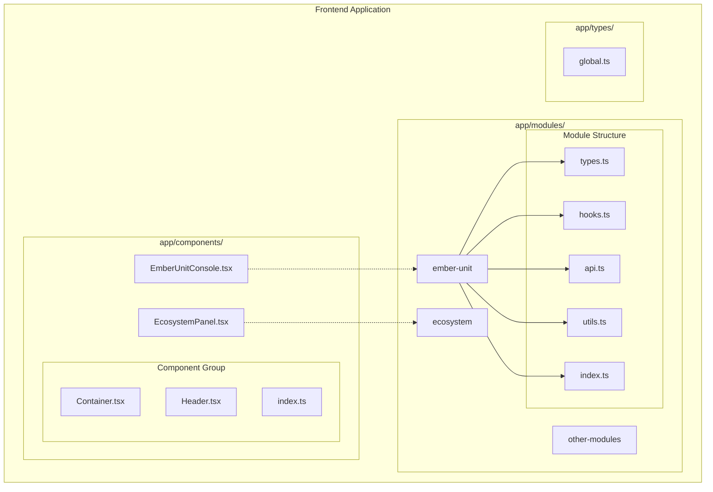
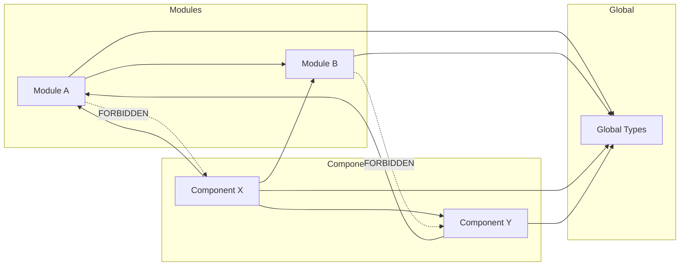

# Module/Feature Boundary Enforcement Architecture

This document defines the architecture and structure for enforcing strict boundaries between modules and components in our frontend application.

## Core Principles

1. **Strict Separation of Concerns**
   - **Modules**: Pure business logic only (no UI)
   - **Components**: Pure UI only (no business logic)
   - Clear import/dependency rules

2. **Predictable File Structure**
   - Standardized module structure
   - Standardized component structure
   - Global TypeScript types

3. **Maintainable & Scalable**
   - Testable code
   - Reduced coupling
   - Clear boundaries

## Module Structure (Business Logic)

### 1. Location and Purpose

All business logic must be placed in the `app/modules/` directory. Each module represents a distinct functional domain of the application, completely separate from UI representation.

```
app/modules/
├── ember-unit/        # Example module
├── ecosystem/         # Example module
└── ...
```

### 2. Standard Module Files

Each module should have the following standard files:

```
app/modules/module-name/
├── types.ts           # Type definitions for this module
├── hooks.ts           # React hooks for this module
├── api.ts             # API interactions (if needed)
├── constants.ts       # Constants used by this module (if needed)
├── utils.ts           # Utility functions (if needed)
├── context.ts         # React context providers (if needed)
└── index.ts           # Main export file
```

#### 2.1. Required Files

- **types.ts**: Contains TypeScript interfaces, types, and enums specific to this module
- **hooks.ts**: Contains React hooks that interact with module logic, data fetching, etc.
- **index.ts**: Exports the module's public API

#### 2.2. Optional Files

- **api.ts**: Contains functions for API interactions
- **constants.ts**: Contains constants specific to this module
- **utils.ts**: Contains pure utility functions
- **context.ts**: Contains React context providers if needed
- **state.ts**: Contains state management (Redux slices, Zustand stores, etc.)

### 3. Module Index File

The `index.ts` file serves as the public API for your module. Only export what is meant to be used by components:

```typescript
// app/modules/ember-unit/index.ts
export * from './types';
export { useEmberUnit, useEmberActivation } from './hooks';
export { fetchEmberStatus } from './api';
```

## Component Structure (UI)

### 1. Location and Purpose

All UI components must be placed in the `app/components/` directory. Components should be purely presentational and import their business logic from modules.

```
app/components/
├── EmberUnitConsole.tsx         # Top-level component
├── TwinFlameIndicator.tsx       # Top-level component
├── ember-unit/                  # Component group directory
│   ├── Console.tsx
│   ├── StatusIndicator.tsx
│   └── ...
└── ...
```

### 2. Component Organization

Two acceptable patterns:

#### 2.1. Single File Components

For simple, standalone components that don't need sub-components:

```
app/components/
├── Button.tsx
├── Card.tsx
└── ...
```

#### 2.2. Component Groups

For more complex components that might have related sub-components:

```
app/components/ember-unit/
├── Container.tsx       # Main component 
├── Header.tsx          # Sub-component
├── StatusPanel.tsx     # Sub-component
└── index.ts            # Re-exports all components
```

### 3. Component Index File

For component groups, include an `index.ts` that exports all components:

```typescript
// app/components/ember-unit/index.ts
export { Container } from './Container';
export { Header } from './Header';
export { StatusPanel } from './StatusPanel';
```

## Global TypeScript Types

### 1. Location

Global types should be defined in:

```
app/types/global.ts
```

### 2. Structure

```typescript
// app/types/global.ts

/**
 * Core application context
 */
export interface PhoenixContext {
  user: {
    id: string;
    name: string;
    role: UserRole;
  };
  settings: {
    theme: 'light' | 'dark' | 'system';
    notifications: boolean;
  };
  version: string;
}

/**
 * Event emitted by subconscious processing
 */
export interface SubconsciousEvent {
  id: string;
  timestamp: string;
  type: SubconsciousEventType;
  data: Record<string, any>;
  priority: 'low' | 'medium' | 'high' | 'critical';
}

/**
 * Possible subconscious event types
 */
export enum SubconsciousEventType {
  INSIGHT = 'insight',
  WARNING = 'warning',
  CRITICAL = 'critical',
  DISCOVERY = 'discovery'
}

/**
 * User roles in the system
 */
export enum UserRole {
  ADMIN = 'admin',
  OPERATOR = 'operator',
  VIEWER = 'viewer'
}

// Other global types...
```

## Import/Dependency Rules

### 1. Allowed Dependencies

| Source | Can Import From |
|--------|----------------|
| **Modules** | - Other modules<br>- Global types<br>- External libraries<br>- Utilities  |
| **Components** | - Modules<br>- Other components<br>- Global types<br>- External libraries<br>- Utilities |

### 2. Forbidden Dependencies

| Source | Cannot Import From |
|--------|-------------------|
| **Modules** | - Components |

### 3. Import Examples

#### Good Examples

```typescript
// Component importing from a module (GOOD)
import { useEmberUnit, EmberUnitStatus } from '@/app/modules/ember-unit';

// Module importing from another module (GOOD)
import { EcosystemStatus } from '@/app/modules/ecosystem/types';

// Component importing global types (GOOD)
import { PhoenixContext } from '@/app/types/global';
```

#### Bad Examples

```typescript
// Module importing from a component (BAD)
import { EmberUnitConsole } from '@/app/components/EmberUnitConsole';

// Component with embedded business logic (BAD)
// This logic should be in a module
const MyComponent = () => {
  const fetchData = async () => {
    const response = await fetch('/api/data');
    return response.json();
  };
  // Rest of component...
}
```

## Example: Proper Module/Component Boundary

### Module Example (Business Logic)

```typescript
// app/modules/ember-unit/types.ts
export interface EmberUnitStatus {
  status: 'active' | 'inactive' | 'error';
  lastActive: string;
  memoryUsage: number;
}

// app/modules/ember-unit/hooks.ts
import { useState, useEffect } from 'react';
import { EmberUnitStatus } from './types';

export function useEmberUnit() {
  const [status, setStatus] = useState<EmberUnitStatus>({
    status: 'inactive',
    lastActive: '',
    memoryUsage: 0
  });
  
  useEffect(() => {
    const fetchStatus = async () => {
      // Fetch logic here
    };
    
    fetchStatus();
    const interval = setInterval(fetchStatus, 5000);
    return () => clearInterval(interval);
  }, []);
  
  return status;
}

// app/modules/ember-unit/index.ts
export * from './types';
export { useEmberUnit } from './hooks';
```

### Component Example (UI)

```typescript
// app/components/EmberUnitConsole.tsx
import { useEmberUnit, EmberUnitStatus } from '@/app/modules/ember-unit';

export function EmberUnitConsole() {
  const status = useEmberUnit();
  
  return (
    <div className="ember-unit-console">
      <h2>Ember Unit Console</h2>
      <div className="status">
        <span className={`status-indicator ${status.status}`} />
        <span>{status.status.toUpperCase()}</span>
      </div>
      <div className="metrics">
        <p>Last Active: {new Date(status.lastActive).toLocaleString()}</p>
        <p>Memory Usage: {status.memoryUsage}MB</p>
      </div>
    </div>
  );
}
```

## Architecture Diagrams

### Module and Component Structure



### Allowed Dependencies



## Migration Strategy

1. **Move UI Components**: Move all UI components from `app/modules/*/components/` to `app/components/`
2. **Extract Business Logic**: Extract business logic from components into proper modules
3. **Create Global Types**: Identify shared types and move them to `app/types/global.ts`
4. **Update Imports**: Update import statements throughout the codebase
5. **Add Type Checking**: Implement TypeScript checks to enforce boundaries

## Tooling & Enforcement

1. **ESLint Rules**: Add custom ESLint rules to prevent forbidden imports
2. **TypeScript Paths**: Use TypeScript path aliases to make imports cleaner
3. **Code Reviews**: Add this architecture document to code review checklist
4. **Documentation**: Document all modules and components according to this standard