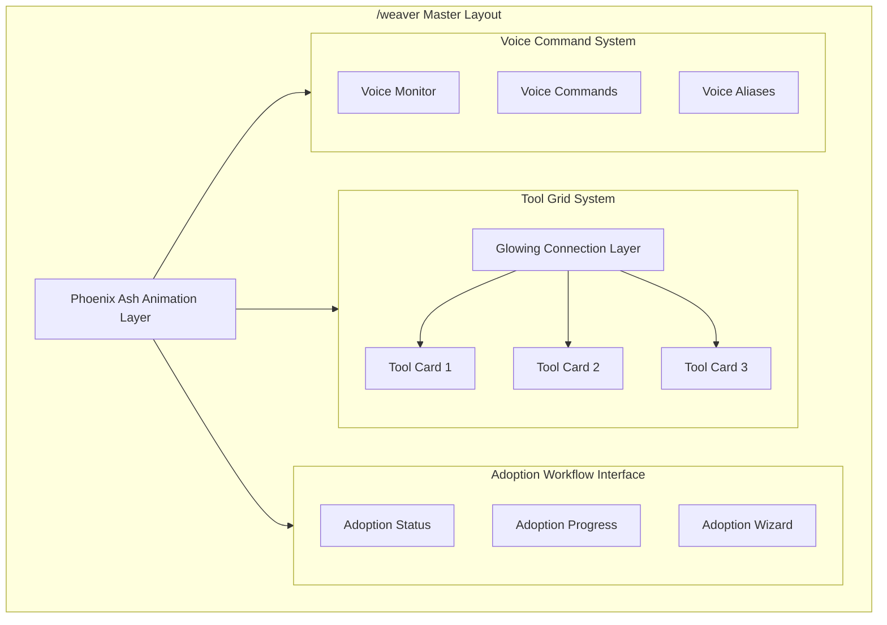
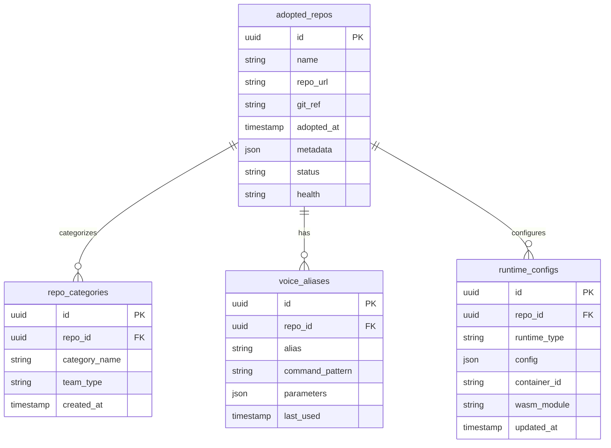
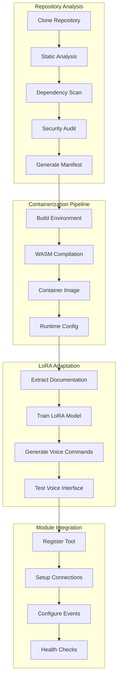
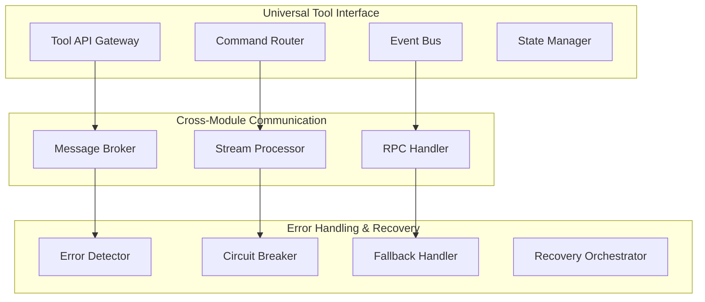
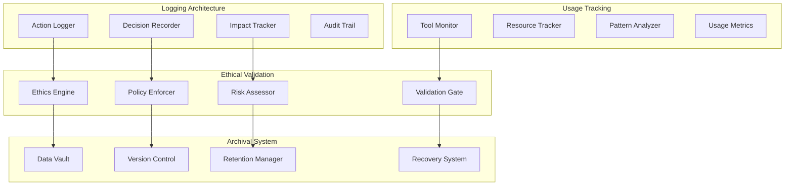
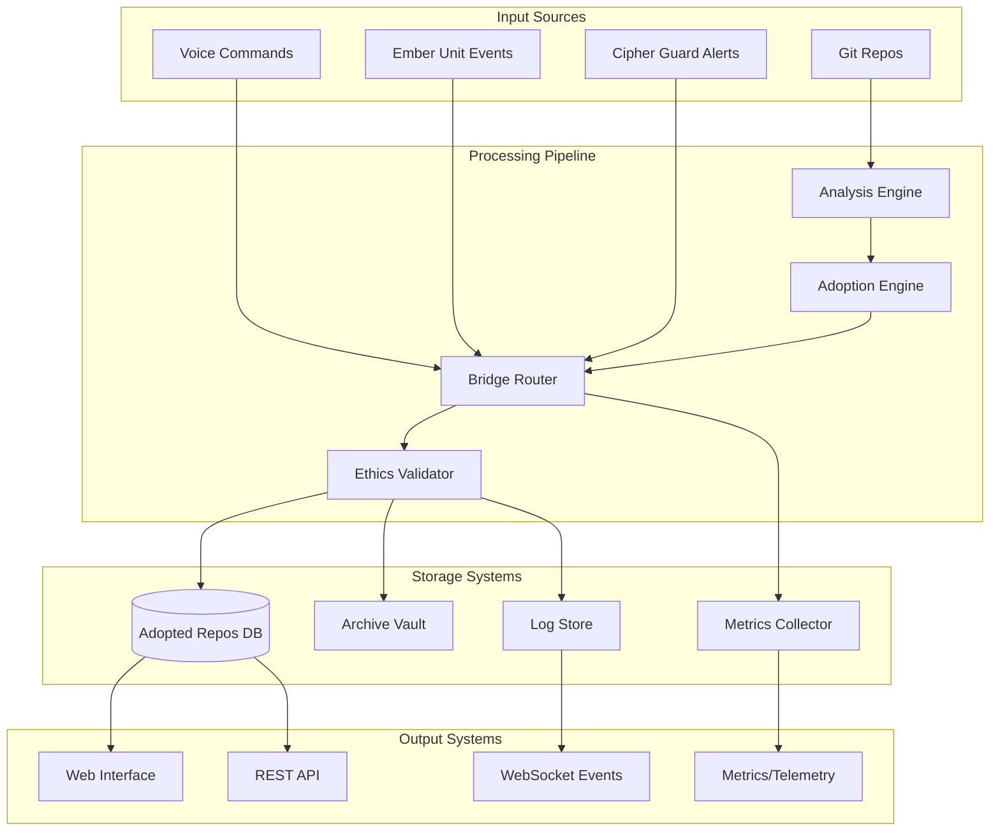
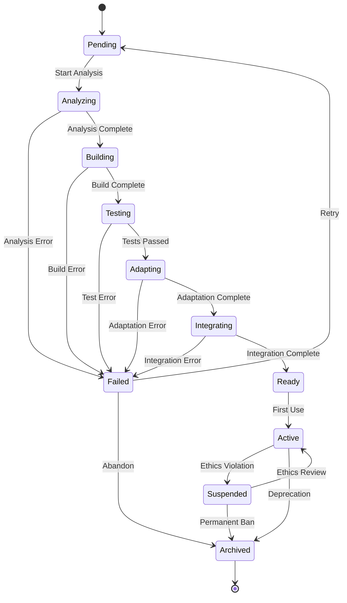
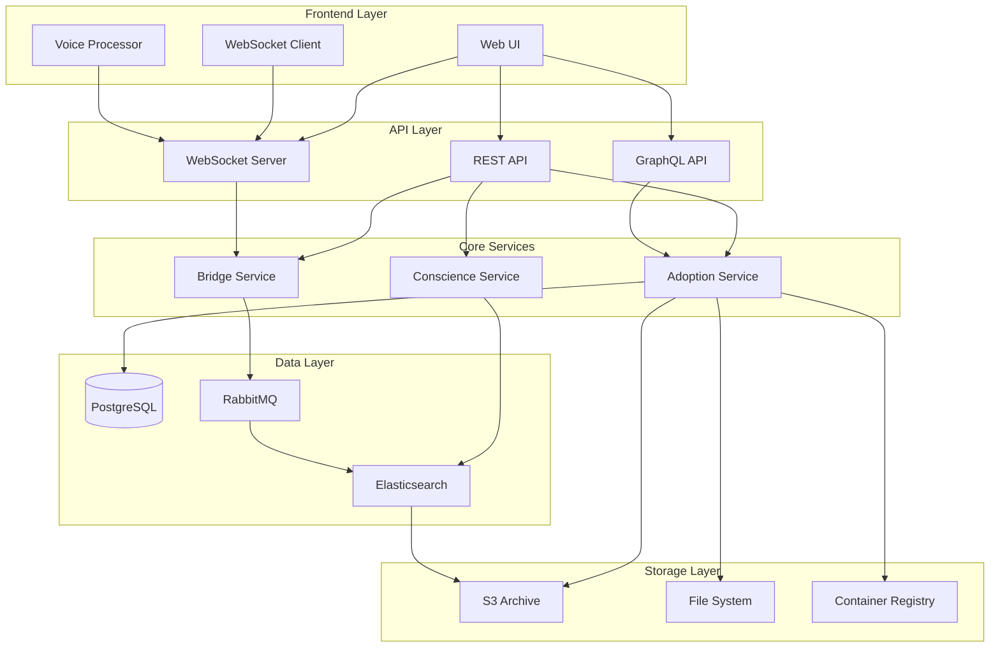

# LIVING ARCHIVE - Technical Specifications
## Tool Adoption and Integration System for Phoenix ORCH

### Executive Summary

The Living Archive represents Phoenix ORCH's autonomous tool adoption and integration system. It serves as a bridge between external security tools and Phoenix ORCH's core modules (Ember Unit and Cipher Guard), enabling seamless integration of new capabilities while maintaining ethical boundaries and operational integrity.

Key Features:
- Automated tool adoption and containerization
- Voice-command integration with LoRA adaptation
- Real-time ethical validation and conscience system
- Seamless integration with existing Phoenix ORCH modules
- Professional-grade archival and version control

### System Requirements

#### Hardware Requirements
```
Minimum Specifications:
- CPU: 8 cores, 3.0 GHz
- RAM: 32 GB
- Storage: 500 GB NVMe SSD
- Network: 1 Gbps

Recommended Specifications:
- CPU: 16 cores, 3.5 GHz
- RAM: 64 GB
- Storage: 2 TB NVMe SSD
- Network: 10 Gbps
```

#### Software Requirements
```
Core Dependencies:
- Rust 1.75 or higher
- Node.js 20 LTS
- PostgreSQL 16
- Docker 24
- WASM Runtime
- RabbitMQ 3.12
- Elasticsearch 8.x

Development Tools:
- cargo-watch
- wasm-pack
- npm/yarn
- Docker Compose
- rust-analyzer
```

#### Network Requirements
```
Required Ports:
- 3000: Web Interface
- 5432: PostgreSQL
- 5672: RabbitMQ
- 9200: Elasticsearch
- 9000: S3 Compatible Storage
- 8080: Container Registry

Bandwidth:
- Minimum: 100 Mbps
- Recommended: 1 Gbps
```

### Security Considerations

#### Authentication & Authorization
```rust
pub struct SecurityConfig {
    // JWT configuration with RS256
    pub jwt_config: JwtConfig,
    // Role-based access control
    pub rbac_config: RbacConfig,
    // Multi-factor authentication
    pub mfa_config: MfaConfig,
}
```

#### Data Protection
```rust
pub struct DataProtection {
    // AES-256 encryption at rest
    pub storage_encryption: StorageEncryption,
    // TLS 1.3 for transit
    pub transit_encryption: TransitEncryption,
    // Key rotation policies
    pub key_management: KeyManagement,
}
```

#### Audit & Compliance
```rust
pub struct AuditConfig {
    // GDPR compliance
    pub gdpr_controls: GdprControls,
    // SOC 2 compliance
    pub soc2_controls: Soc2Controls,
    // ISO 27001 controls
    pub iso_controls: IsoControls,
}
```

### Deployment Guide

#### 1. Infrastructure Setup
```yaml
# docker-compose.yml
version: '3.8'
services:
  postgres:
    image: postgres:16
    volumes:
      - postgres_data:/var/lib/postgresql/data
    environment:
      POSTGRES_PASSWORD: ${DB_PASSWORD}

  rabbitmq:
    image: rabbitmq:3.12-management
    ports:
      - "5672:5672"
      - "15672:15672"

  elasticsearch:
    image: elasticsearch:8.x
    environment:
      - discovery.type=single-node
    volumes:
      - es_data:/usr/share/elasticsearch/data

  minio:
    image: minio/minio
    command: server /data
    volumes:
      - s3_data:/data
```

#### 2. Core Services Deployment
```bash
# Build and deploy core services
cargo build --release
systemctl start living-archive-core
systemctl start tool-bridge
systemctl start conscience-system

# Deploy frontend
cd frontend
npm run build
npm run start:prod
```

#### 3. Integration Setup
```rust
// Integration configuration
pub struct DeploymentConfig {
    pub ember_unit_endpoint: String,
    pub cipher_guard_endpoint: String,
    pub tool_bridge_config: BridgeConfig,
    pub conscience_config: ConscienceConfig,
}
```

### Integration Testing Plan

#### Test Scenarios

1. Tool Adoption Flow
```rust
#[tokio::test]
async fn test_tool_adoption_flow() {
    // Test complete adoption workflow
    let repo_url = "https://github.com/test/security-tool";
    let adoption = AdoptionCoordinator::new();
    
    // Test each phase
    let analysis = adoption.analyze(repo_url).await?;
    let container = adoption.containerize(&analysis).await?;
    let adaptation = adoption.adapt(&container).await?;
    let integration = adoption.integrate(adaptation).await?;
    
    assert_eq!(integration.status, Status::Ready);
}
```

2. Cross-Module Communication
```rust
#[tokio::test]
async fn test_cross_module_communication() {
    // Test communication with Ember Unit
    let ember_msg = EmberMessage::new("test_action");
    bridge.send_to_ember(ember_msg).await?;
    
    // Test communication with Cipher Guard
    let cipher_msg = CipherMessage::new("test_alert");
    bridge.send_to_cipher(cipher_msg).await?;
}
```

3. Performance Testing
```rust
#[tokio::test]
async fn test_system_performance() {
    let metrics = MetricsCollector::new();
    
    // Test adoption performance
    metrics.measure_adoption_time().await?;
    
    // Test tool execution latency
    metrics.measure_tool_latency().await?;
    
    // Test system throughput
    metrics.measure_throughput().await?;
}
```

#### CI/CD Integration

```yaml
# .github/workflows/living-archive-ci.yml
name: Living Archive CI/CD

on:
  push:
    branches: [ main ]
  pull_request:
    branches: [ main ]

jobs:
  test:
    runs-on: ubuntu-latest
    steps:
      - uses: actions/checkout@v3
      - name: Run tests
        run: cargo test --all-features
      
  integration:
    needs: test
    runs-on: ubuntu-latest
    steps:
      - name: Integration tests
        run: cargo test --test '*_integration'
        
  deploy:
    needs: integration
    runs-on: ubuntu-latest
    steps:
      - name: Deploy to production
        if: github.ref == 'refs/heads/main'
        run: ./deploy.sh
```

### Performance Metrics

```rust
pub struct PerformanceTargets {
    // Tool adoption time
    pub max_adoption_time: Duration, // 5 minutes
    
    // Command execution latency
    pub max_command_latency: Duration, // 100ms
    
    // System throughput
    pub min_tools_per_second: u32, // 100
    
    // Resource utilization
    pub max_cpu_usage: f64, // 70%
    pub max_memory_usage: f64, // 80%
    
    // Error rates
    pub max_error_rate: f64, // 0.1%
}
```

# LIVING ARCHIVE - Technical Specifications
## Tool Adoption and Integration System for Phoenix ORCH

### /weaver Page Architecture



### Component Specifications

#### Master Page Layout
```typescript
// frontend/features/weaver/components/WeaverPage.tsx
export interface WeaverPageProps {
    activeTools: AdoptedTool[];
    adoptionQueue: PendingAdoption[];
    voiceEnabled: boolean;
}

export default function WeaverPage({ activeTools, adoptionQueue, voiceEnabled }: WeaverPageProps) {
    return (
        <div className="relative w-full h-full bg-neutral-900">
            <PhoenixAsh className="absolute inset-0 z-0" />
            <div className="relative z-10 grid grid-cols-12 gap-4 p-6">
                <ToolGrid tools={activeTools} className="col-span-8" />
                <AdoptionPanel queue={adoptionQueue} className="col-span-4" />
                <VoiceInterface enabled={voiceEnabled} className="col-span-12" />
            </div>
        </div>
    );
}
```

#### Tool Card Grid System
```typescript
// frontend/features/weaver/components/ToolGrid.tsx
export interface ToolCardProps {
    tool: AdoptedTool;
    connections: Connection[];
}

export interface Connection {
    sourceId: string;
    targetId: string;
    strength: number; // 0-1 for glow intensity
    type: 'data' | 'control' | 'event';
}

export function ToolCard({ tool, connections }: ToolCardProps) {
    return (
        <div className="relative p-4 rounded-lg bg-neutral-800 border border-neutral-700">
            <div className="tool-header">
                <ToolIcon type={tool.type} />
                <h3>{tool.name}</h3>
            </div>
            <div className="tool-stats">
                <RuntimeMetrics metrics={tool.metrics} />
                <UsageStats stats={tool.stats} />
            </div>
            <div className="tool-actions">
                <VoiceAlias alias={tool.voiceAlias} />
                <QuickActions actions={tool.actions} />
            </div>
        </div>
    );
}
```

#### Connection Layer
```typescript
// frontend/features/weaver/components/ConnectionLayer.tsx
export interface ConnectionLayerProps {
    connections: Connection[];
    animate: boolean;
}

export function ConnectionLayer({ connections, animate }: ConnectionLayerProps) {
    return (
        <svg className="absolute inset-0 pointer-events-none">
            {connections.map(connection => (
                <ConnectionLine
                    key={`${connection.sourceId}-${connection.targetId}`}
                    source={connection.sourceId}
                    target={connection.targetId}
                    strength={connection.strength}
                    type={connection.type}
                    animate={animate}
                />
            ))}
        </svg>
    );
}
```

#### Voice Command Integration
```typescript
// frontend/features/weaver/components/VoiceInterface.tsx
export interface VoiceCommand {
    alias: string;
    action: string;
    target: string;
    parameters?: Record<string, any>;
}

export interface VoiceInterfaceProps {
    enabled: boolean;
    onCommand: (command: VoiceCommand) => void;
}

export function VoiceInterface({ enabled, onCommand }: VoiceInterfaceProps) {
    return (
        <div className="voice-interface">
            <VoiceMonitor enabled={enabled} />
            <CommandList commands={availableCommands} />
            <AliasRegistry onAliasUpdate={updateAlias} />
        </div>
    );
}
```

### Styling System

```typescript
// frontend/features/weaver/styles/theme.ts
export const weaverTheme = {
    colors: {
        background: '#121212',
        cardBg: '#1E1E1E',
        accent: '#FF4B4B',
        connection: {
            data: '#4CAF50',
            control: '#2196F3',
            event: '#FF9800'
        }
    },
    animations: {
        glowPulse: 'pulse 2s cubic-bezier(0.4, 0, 0.6, 1) infinite',
        connectionFlow: 'flow 3s linear infinite',
        ashFloat: 'float 8s ease infinite'
    }
};
```

### Integration with Existing Systems

```typescript
// frontend/features/weaver/services/integration.ts
export interface ToolBridgeConfig {
    emberUnit: {
        phaseHooks: Record<EngagementPhase, () => void>;
        dataStreams: DataStreamConfig[];
    };
    cipherGuard: {
        defenseHooks: Record<DefensePhase, () => void>;
        alertHandlers: AlertHandlerConfig[];
    };
}

export function initializeToolBridge(config: ToolBridgeConfig): ToolBridge {
    return {
        registerTool: (tool: AdoptedTool) => {
            // Register with both Ember Unit and Cipher Guard
            registerWithEmberUnit(tool);
            registerWithCipherGuard(tool);
        },
        setupConnections: (connections: Connection[]) => {
            // Set up data flows and event handlers
        },
        enableVoiceControl: (commands: VoiceCommand[]) => {
            // Register voice commands with Phoenix ORCH
        }
    };
}
```

### Performance Considerations

1. **Rendering Optimization**
   - Use React.memo for Tool Cards
   - Implement virtualization for large tool grids
   - WebGL-based connection rendering for complex graphs

2. **Animation Performance**
   - Hardware-accelerated CSS transforms
   - RequestAnimationFrame for smooth connections
   - Throttled glow effects based on viewport

3. **Voice Processing**
   - Web Workers for voice recognition
   - Cached command patterns
   - Debounced alias updates

### Security Measures

1. **Tool Isolation**
   - Sandboxed execution environments
   - Capability-based access control
   - Resource usage limits

2. **Voice Authentication**
   - Voice signature verification
   - Command authorization levels
   - Audit logging of voice actions

3. **Connection Security**
   - Encrypted data flows
   - Signed tool manifests
   - Connection authorization checks

### Database Schema



#### Core Schema Definitions

```rust
// crates/living-archive/src/schema.rs

#[derive(Debug, Serialize, Deserialize)]
pub struct AdoptedRepo {
    pub id: Uuid,
    pub name: String,
    pub repo_url: String,
    pub git_ref: String,
    pub adopted_at: DateTime<Utc>,
    pub metadata: RepoMetadata,
    pub status: RepoStatus,
    pub health: HealthStatus,
}

#[derive(Debug, Serialize, Deserialize)]
pub struct RepoMetadata {
    pub description: String,
    pub stars: u32,
    pub license: String,
    pub language: String,
    pub topics: Vec<String>,
    pub last_commit: DateTime<Utc>,
    pub contributors: Vec<String>,
}

#[derive(Debug, Serialize, Deserialize)]
pub enum RepoStatus {
    Pending,
    Analyzing,
    Building,
    Testing,
    Ready,
    Failed,
    Archived,
}

#[derive(Debug, Serialize, Deserialize)]
pub enum HealthStatus {
    Healthy,
    Degraded,
    Critical,
    Unknown,
}

#[derive(Debug, Serialize, Deserialize)]
pub struct RepoCategory {
    pub id: Uuid,
    pub repo_id: Uuid,
    pub category_name: String,
    pub team_type: TeamType,
    pub created_at: DateTime<Utc>,
}

#[derive(Debug, Serialize, Deserialize)]
pub enum TeamType {
    RedTeam,
    BlueTeam,
    PurpleTeam,
    Research,
    Utility,
}

#[derive(Debug, Serialize, Deserialize)]
pub struct VoiceAlias {
    pub id: Uuid,
    pub repo_id: Uuid,
    pub alias: String,
    pub command_pattern: String,
    pub parameters: VoiceParameters,
    pub last_used: DateTime<Utc>,
}

#[derive(Debug, Serialize, Deserialize)]
pub struct VoiceParameters {
    pub required_args: Vec<String>,
    pub optional_args: HashMap<String, String>,
    pub context_vars: Vec<String>,
}

#[derive(Debug, Serialize, Deserialize)]
pub struct RuntimeConfig {
    pub id: Uuid,
    pub repo_id: Uuid,
    pub runtime_type: RuntimeType,
    pub config: RuntimeConfigData,
    pub container_id: Option<String>,
    pub wasm_module: Option<String>,
    pub updated_at: DateTime<Utc>,
}

#[derive(Debug, Serialize, Deserialize)]
pub enum RuntimeType {
    Container,
    Wasm,
    Native,
    Python,
    Node,
}

#[derive(Debug, Serialize, Deserialize)]
pub struct RuntimeConfigData {
    pub environment: HashMap<String, String>,
    pub resources: ResourceLimits,
    pub networking: NetworkConfig,
    pub security: SecurityPolicy,
}

#[derive(Debug, Serialize, Deserialize)]
pub struct ResourceLimits {
    pub cpu_limit: String,
    pub memory_limit: String,
    pub storage_limit: String,
}

#[derive(Debug, Serialize, Deserialize)]
pub struct NetworkConfig {
    pub exposed_ports: Vec<u16>,
    pub allowed_hosts: Vec<String>,
    pub dns_config: Option<DnsConfig>,
}

#[derive(Debug, Serialize, Deserialize)]
pub struct SecurityPolicy {
    pub capabilities: Vec<String>,
    pub seccomp_profile: String,
    pub read_only_root: bool,
}
```

#### Database Migrations

```rust
// crates/living-archive/src/migrations/V1__initial_schema.rs

pub async fn migrate_v1(tx: &mut Transaction<'_>) -> Result<(), DbError> {
    tx.execute(
        r#"
        CREATE TABLE adopted_repos (
            id UUID PRIMARY KEY,
            name VARCHAR NOT NULL,
            repo_url VARCHAR NOT NULL UNIQUE,
            git_ref VARCHAR NOT NULL,
            adopted_at TIMESTAMP WITH TIME ZONE NOT NULL,
            metadata JSONB NOT NULL,
            status VARCHAR NOT NULL,
            health VARCHAR NOT NULL
        );

        CREATE TABLE repo_categories (
            id UUID PRIMARY KEY,
            repo_id UUID NOT NULL REFERENCES adopted_repos(id),
            category_name VARCHAR NOT NULL,
            team_type VARCHAR NOT NULL,
            created_at TIMESTAMP WITH TIME ZONE NOT NULL
        );

        CREATE TABLE voice_aliases (
            id UUID PRIMARY KEY,
            repo_id UUID NOT NULL REFERENCES adopted_repos(id),
            alias VARCHAR NOT NULL UNIQUE,
            command_pattern VARCHAR NOT NULL,
            parameters JSONB NOT NULL,
            last_used TIMESTAMP WITH TIME ZONE NOT NULL
        );

        CREATE TABLE runtime_configs (
            id UUID PRIMARY KEY,
            repo_id UUID NOT NULL REFERENCES adopted_repos(id),
            runtime_type VARCHAR NOT NULL,
            config JSONB NOT NULL,
            container_id VARCHAR,
            wasm_module VARCHAR,
            updated_at TIMESTAMP WITH TIME ZONE NOT NULL
        );

        CREATE INDEX idx_repos_status ON adopted_repos(status);
        CREATE INDEX idx_repos_health ON adopted_repos(health);
        CREATE INDEX idx_categories_team ON repo_categories(team_type);
        CREATE INDEX idx_aliases_lookup ON voice_aliases(alias);
        CREATE INDEX idx_runtime_type ON runtime_configs(runtime_type);
        "#,
        &[],
    ).await?;

    Ok(())

### Adoption Workflow System



#### Repository Analysis System

```rust
// crates/living-archive/src/adoption/analysis.rs

pub struct RepositoryAnalyzer {
    git_client: GitClient,
    static_analyzer: StaticAnalyzer,
    dependency_scanner: DependencyScanner,
    security_auditor: SecurityAuditor,
    manifest_generator: ManifestGenerator,
}

impl RepositoryAnalyzer {
    pub async fn analyze_repository(&self, repo_url: &str) -> Result<RepositoryAnalysis> {
        // Clone and analyze the repository
        let repo = self.git_client.clone(repo_url).await?;
        
        // Parallel analysis tasks
        let (static_analysis, deps, security) = join!(
            self.static_analyzer.analyze(&repo),
            self.dependency_scanner.scan(&repo),
            self.security_auditor.audit(&repo)
        );

        // Generate adoption manifest
        self.manifest_generator.generate(
            static_analysis?,
            deps?,
            security?
        )
    }
}

#[derive(Debug, Serialize, Deserialize)]
pub struct RepositoryAnalysis {
    pub language_stats: HashMap<String, f64>,
    pub complexity_metrics: ComplexityMetrics,
    pub dependencies: Vec<Dependency>,
    pub security_issues: Vec<SecurityIssue>,
    pub estimated_resources: ResourceEstimate,
}
```

#### Containerization Pipeline

```rust
// crates/living-archive/src/adoption/containerization.rs

pub struct ContainerizationPipeline {
    build_manager: BuildManager,
    wasm_compiler: WasmCompiler,
    container_builder: ContainerBuilder,
    runtime_configurator: RuntimeConfigurator,
}

impl ContainerizationPipeline {
    pub async fn containerize(
        &self,
        repo: &Repository,
        analysis: &RepositoryAnalysis
    ) -> Result<ContainerizedTool> {
        // Set up build environment
        let build_env = self.build_manager
            .create_environment(repo, &analysis.language_stats)
            .await?;

        // Attempt WASM compilation first
        let wasm_binary = match self.wasm_compiler.compile(&build_env).await {
            Ok(binary) => Some(binary),
            Err(_) => None, // Fall back to container if WASM fails
        };

        // Build container image
        let container = self.container_builder
            .build(&build_env, wasm_binary.as_ref())
            .await?;

        // Generate runtime configuration
        let config = self.runtime_configurator
            .configure(&container, &analysis.estimated_resources)
            .await?;

        Ok(ContainerizedTool {
            container,
            wasm_module: wasm_binary,
            runtime_config: config,
        })
    }
}
```

#### LoRA Adaptation System

```rust
// crates/living-archive/src/adoption/lora.rs

pub struct LoRAAdapter {
    doc_extractor: DocumentationExtractor,
    lora_trainer: LoRATrainer,
    voice_generator: VoiceCommandGenerator,
    interface_tester: VoiceInterfaceTester,
}

impl LoRAAdapter {
    pub async fn adapt_tool(
        &self,
        repo: &Repository,
        analysis: &RepositoryAnalysis
    ) -> Result<ToolAdaptation> {
        // Extract documentation and examples
        let docs = self.doc_extractor
            .extract_documentation(repo)
            .await?;

        // Train LoRA model for this tool
        let lora_model = self.lora_trainer
            .train_model(&docs, &analysis.complexity_metrics)
            .await?;

        // Generate voice command patterns
        let voice_commands = self.voice_generator
            .generate_commands(&lora_model, &docs)
            .await?;

        // Test voice interface
        self.interface_tester
            .validate_commands(&voice_commands)
            .await?;

        Ok(ToolAdaptation {
            lora_model,
            voice_commands,
            documentation: docs,
        })
    }
}
```

#### Module Integration System

```rust
// crates/living-archive/src/adoption/integration.rs

pub struct ModuleIntegrator {
    tool_registry: ToolRegistry,
    connection_manager: ConnectionManager,
    event_system: EventSystem,
    health_monitor: HealthMonitor,
}

impl ModuleIntegrator {
    pub async fn integrate_tool(
        &self,
        tool: ContainerizedTool,
        adaptation: ToolAdaptation
    ) -> Result<IntegratedTool> {
        // Register tool with the system
        let registered_tool = self.tool_registry
            .register_tool(tool, adaptation)
            .await?;

        // Set up connections with other tools
        let connections = self.connection_manager
            .establish_connections(&registered_tool)
            .await?;

        // Configure event handlers
        let events = self.event_system
            .configure_events(&registered_tool, &connections)
            .await?;

        // Set up health monitoring
        let health_checks = self.health_monitor
            .configure_checks(&registered_tool)
            .await?;

        Ok(IntegratedTool {
            tool: registered_tool,
            connections,
            events,
            health_checks,
        })
    }
}
```

#### Adoption State Machine

```rust
// crates/living-archive/src/adoption/state.rs

#[derive(Debug, Clone, Serialize, Deserialize)]
pub enum AdoptionState {
    Pending,
    Analyzing {
        progress: f32,
        current_step: AnalysisStep,
    },
    Containerizing {
        progress: f32,
        current_step: ContainerizationStep,
    },
    Adapting {
        progress: f32,
        current_step: AdaptationStep,
    },
    Integrating {
        progress: f32,
        current_step: IntegrationStep,
    },
    Complete {
        tool_id: Uuid,
        metrics: AdoptionMetrics,
    },
    Failed {
        error: AdoptionError,
        recovery_options: Vec<RecoveryOption>,
    },
}

pub struct AdoptionCoordinator {
    analyzer: RepositoryAnalyzer,
    containerizer: ContainerizationPipeline,
    adapter: LoRAAdapter,
    integrator: ModuleIntegrator,
    state_manager: StateManager,
}

impl AdoptionCoordinator {
    pub async fn adopt_tool(&self, repo_url: &str) -> Result<AdoptedTool> {
        self.state_manager.transition(AdoptionState::Analyzing { progress: 0.0 });
        let analysis = self.analyzer.analyze_repository(repo_url).await?;

        self.state_manager.transition(AdoptionState::Containerizing { progress: 0.0 });
        let container = self.containerizer.containerize(&analysis).await?;

        self.state_manager.transition(AdoptionState::Adapting { progress: 0.0 });
        let adaptation = self.adapter.adapt_tool(&analysis, &container).await?;

        self.state_manager.transition(AdoptionState::Integrating { progress: 0.0 });
        let integrated = self.integrator.integrate_tool(container, adaptation).await?;

        self.state_manager.transition(AdoptionState::Complete {
            tool_id: integrated.id,
            metrics: integrated.metrics,
        });

        Ok(integrated.into())
    }
}
```
}
```

### Tool Bridge Integration System



#### Universal Tool Interface

```rust
// crates/living-archive/src/bridge/interface.rs

pub trait UniversalToolInterface: Send + Sync {
    async fn execute_command(&self, command: ToolCommand) -> Result<ToolResponse>;
    async fn stream_events(&self) -> Result<EventStream>;
    async fn query_state(&self) -> Result<ToolState>;
    async fn health_check(&self) -> Result<HealthStatus>;
}

#[derive(Debug, Serialize, Deserialize)]
pub struct ToolCommand {
    pub tool_id: Uuid,
    pub command_type: CommandType,
    pub parameters: HashMap<String, Value>,
    pub context: ExecutionContext,
    pub timeout: Duration,
}

#[derive(Debug, Serialize, Deserialize)]
pub struct ToolResponse {
    pub status: ResponseStatus,
    pub data: Option<Value>,
    pub metrics: ExecutionMetrics,
    pub errors: Vec<ToolError>,
}

#[derive(Debug, Serialize, Deserialize)]
pub struct ExecutionContext {
    pub ember_phase: Option<EngagementPhase>,
    pub cipher_phase: Option<DefensePhase>,
    pub security_context: SecurityContext,
    pub resource_limits: ResourceLimits,
}
```

#### Cross-Module Communication

```rust
// crates/living-archive/src/bridge/communication.rs

pub struct MessageBroker {
    ember_channel: EmberChannel,
    cipher_channel: CipherChannel,
    stream_processor: StreamProcessor,
    rpc_handler: RpcHandler,
}

impl MessageBroker {
    pub async fn route_message(&self, message: BridgeMessage) -> Result<()> {
        match message.target {
            MessageTarget::EmberUnit => {
                self.ember_channel.send(message).await?;
            }
            MessageTarget::CipherGuard => {
                self.cipher_channel.send(message).await?;
            }
            MessageTarget::Both => {
                join!(
                    self.ember_channel.send(message.clone()),
                    self.cipher_channel.send(message)
                )?;
            }
        }
        Ok(())
    }
}

pub struct StreamProcessor {
    pub fn process_stream<T: ToolStream>(&self, stream: T) -> ProcessedStream {
        ProcessedStream::new(stream)
            .filter(|event| self.validate_event(event))
            .transform(|event| self.enrich_event(event))
            .batch(self.config.batch_size)
            .with_backpressure(self.config.max_pressure)
    }
}

pub struct RpcHandler {
    pub async fn call_module(&self, call: RpcCall) -> Result<RpcResponse> {
        let (module, timeout) = self.resolve_target(&call);
        
        let response = timeout_after(timeout, async {
            match module {
                Module::EmberUnit => self.call_ember_unit(call).await,
                Module::CipherGuard => self.call_cipher_guard(call).await,
            }
        }).await?;

        Ok(response)
    }
}
```

#### Error Handling System

```rust
// crates/living-archive/src/bridge/error.rs

pub struct ErrorHandler {
    detector: ErrorDetector,
    circuit_breaker: CircuitBreaker,
    fallback: FallbackHandler,
    recovery: RecoveryOrchestrator,
}

impl ErrorHandler {
    pub async fn handle_error(&self, error: ToolError) -> Result<ErrorResolution> {
        // Detect error type and severity
        let analysis = self.detector.analyze(&error).await?;
        
        // Check if circuit should be opened
        if self.circuit_breaker.should_open(&analysis) {
            self.circuit_breaker.open().await?;
            return self.handle_circuit_open(error).await;
        }

        // Attempt recovery
        match self.recovery.attempt_recovery(&error).await {
            Ok(resolution) => Ok(resolution),
            Err(_) => self.fallback.handle(&error).await,
        }
    }
}

pub struct CircuitBreaker {
    state: CircuitState,
    failure_threshold: u32,
    reset_timeout: Duration,
    half_open_timeout: Duration,
}

impl CircuitBreaker {
    pub async fn record_failure(&self) -> Result<()> {
        self.failure_count += 1;
        if self.failure_count >= self.failure_threshold {
            self.open().await?;
        }
        Ok(())
    }

    pub async fn attempt_reset(&self) -> Result<()> {
        if self.state == CircuitState::Open 
            && Instant::now() - self.last_failure > self.reset_timeout 
        {
            self.half_open().await?;
        }
        Ok(())
    }
}

pub struct RecoveryOrchestrator {
    strategies: Vec<Box<dyn RecoveryStrategy>>,
    state_manager: StateManager,
}

impl RecoveryOrchestrator {
    pub async fn attempt_recovery(&self, error: &ToolError) -> Result<ErrorResolution> {
        for strategy in &self.strategies {
            if strategy.can_handle(error) {
                match strategy.execute(error).await {
                    Ok(resolution) => return Ok(resolution),
                    Err(e) => self.state_manager.record_failed_recovery(e).await?,
                }
            }
        }
        Err(Error::NoViableRecoveryStrategy)
    }
}
```

#### Integration with Ember Unit and Cipher Guard

```rust
// crates/living-archive/src/bridge/integration.rs

pub struct ModuleBridge {
    ember_integration: EmberIntegration,
    cipher_integration: CipherIntegration,
    tool_registry: ToolRegistry,
}

impl ModuleBridge {
    pub async fn register_tool(&self, tool: AdoptedTool) -> Result<()> {
        // Register with Ember Unit
        let ember_registration = self.ember_integration
            .register_tool(tool.clone())
            .await?;

        // Register with Cipher Guard
        let cipher_registration = self.cipher_integration
            .register_tool(tool.clone())
            .await?;

        // Update tool registry
        self.tool_registry.update(
            tool.id,
            ember_registration,
            cipher_registration
        ).await?;

        Ok(())
    }

    pub async fn handle_ember_event(&self, event: EmberEvent) -> Result<()> {
        let affected_tools = self.tool_registry
            .find_tools_for_phase(event.phase)
            .await?;

        for tool in affected_tools {
            self.notify_tool(tool, event.clone()).await?;
        }

        Ok(())
    }

    pub async fn handle_cipher_alert(&self, alert: CipherAlert) -> Result<()> {
        let relevant_tools = self.tool_registry
            .find_tools_for_defense(alert.defense_type)
            .await?;

        for tool in relevant_tools {
            self.escalate_alert(tool, alert.clone()).await?;
        }

        Ok(())
    }
}
```

#### Bridge Configuration

```rust
// crates/living-archive/src/bridge/config.rs

#[derive(Debug, Serialize, Deserialize)]
pub struct BridgeConfig {
    pub communication: CommunicationConfig,
    pub error_handling: ErrorHandlingConfig,
    pub integration: IntegrationConfig,
}

#[derive(Debug, Serialize, Deserialize)]
pub struct CommunicationConfig {
    pub message_batch_size: usize,
    pub max_backpressure: usize,
    pub stream_buffer_size: usize,
    pub rpc_timeout: Duration,
}

#[derive(Debug, Serialize, Deserialize)]
pub struct ErrorHandlingConfig {
    pub circuit_breaker: CircuitBreakerConfig,
    pub recovery_strategies: Vec<RecoveryStrategyConfig>,
    pub fallback_options: FallbackOptions,
}

#[derive(Debug, Serialize, Deserialize)]
pub struct IntegrationConfig {
    pub ember_unit: EmberUnitConfig,
    pub cipher_guard: CipherGuardConfig,
    pub tool_registry: ToolRegistryConfig,
}
```

### Conscience System



#### Logging Architecture

```rust
// crates/living-archive/src/conscience/logging.rs

pub struct ConscienceLogger {
    action_logger: ActionLogger,
    decision_recorder: DecisionRecorder,
    impact_tracker: ImpactTracker,
    audit_trail: AuditTrail,
}

impl ConscienceLogger {
    pub async fn log_tool_action(&self, action: ToolAction) -> Result<LogEntry> {
        // Record the action
        let action_log = self.action_logger
            .log_action(&action)
            .await?;

        // Record decision context
        let decision_log = self.decision_recorder
            .record_decision(&action.decision_context)
            .await?;

        // Track impact
        let impact_log = self.impact_tracker
            .track_impact(&action)
            .await?;

        // Create audit trail
        let audit_entry = self.audit_trail
            .create_entry(action_log, decision_log, impact_log)
            .await?;

        Ok(audit_entry)
    }
}

#[derive(Debug, Serialize, Deserialize)]
pub struct LogEntry {
    pub id: Uuid,
    pub timestamp: DateTime<Utc>,
    pub tool_id: Uuid,
    pub action_type: ActionType,
    pub decision_context: DecisionContext,
    pub impact_assessment: ImpactAssessment,
    pub ethical_validation: EthicalValidation,
    pub signature: PhoenixSignature,
}
```

#### Usage Tracking System

```rust
// crates/living-archive/src/conscience/usage.rs

pub struct UsageTracker {
    tool_monitor: ToolMonitor,
    resource_tracker: ResourceTracker,
    pattern_analyzer: PatternAnalyzer,
    metrics_collector: MetricsCollector,
}

impl UsageTracker {
    pub async fn track_tool_usage(&self, tool_id: Uuid) -> Result<UsageMetrics> {
        // Monitor tool activity
        let activity = self.tool_monitor
            .get_activity(tool_id)
            .await?;

        // Track resource consumption
        let resources = self.resource_tracker
            .get_resource_usage(tool_id)
            .await?;

        // Analyze usage patterns
        let patterns = self.pattern_analyzer
            .analyze_patterns(tool_id, &activity)
            .await?;

        // Collect metrics
        let metrics = self.metrics_collector
            .collect_metrics(activity, resources, patterns)
            .await?;

        Ok(metrics)
    }
}

#[derive(Debug, Serialize, Deserialize)]
pub struct UsageMetrics {
    pub tool_id: Uuid,
    pub period: TimePeriod,
    pub execution_count: u64,
    pub resource_consumption: ResourceMetrics,
    pub usage_patterns: Vec<UsagePattern>,
    pub performance_metrics: PerformanceMetrics,
    pub reliability_score: f64,
}
```

#### Ethical Validation Framework

```rust
// crates/living-archive/src/conscience/ethics.rs

pub struct EthicsEngine {
    policy_enforcer: PolicyEnforcer,
    risk_assessor: RiskAssessor,
    validation_gate: ValidationGate,
    decision_maker: DecisionMaker,
}

impl EthicsEngine {
    pub async fn validate_action(&self, action: &ToolAction) -> Result<ValidationResult> {
        // Check against ethical policies
        let policy_check = self.policy_enforcer
            .check_compliance(action)
            .await?;

        // Assess potential risks
        let risk_assessment = self.risk_assessor
            .assess_risks(action)
            .await?;

        // Validate action
        let validation = self.validation_gate
            .validate(action, &policy_check, &risk_assessment)
            .await?;

        // Make final decision
        let decision = self.decision_maker
            .make_decision(validation)
            .await?;

        Ok(decision)
    }
}

#[derive(Debug, Serialize, Deserialize)]
pub struct EthicalPolicy {
    pub id: Uuid,
    pub name: String,
    pub description: String,
    pub rules: Vec<PolicyRule>,
    pub enforcement_level: EnforcementLevel,
    pub consequences: Vec<Consequence>,
}

#[derive(Debug, Serialize, Deserialize)]
pub struct RiskAssessment {
    pub risk_level: RiskLevel,
    pub potential_impacts: Vec<Impact>,
    pub mitigations: Vec<Mitigation>,
    pub recommendation: Recommendation,
}
```

#### Archival System

```rust
// crates/living-archive/src/conscience/archive.rs

pub struct ArchivalSystem {
    data_vault: DataVault,
    version_control: VersionControl,
    retention_manager: RetentionManager,
    recovery_system: RecoverySystem,
}

impl ArchivalSystem {
    pub async fn archive_tool_state(&self, tool_id: Uuid) -> Result<ArchiveEntry> {
        // Store data in vault
        let vault_entry = self.data_vault
            .store_tool_state(tool_id)
            .await?;

        // Version the data
        let version = self.version_control
            .create_version(vault_entry)
            .await?;

        // Apply retention policies
        self.retention_manager
            .apply_policies(&version)
            .await?;

        // Ensure recoverability
        self.recovery_system
            .verify_recovery(&version)
            .await?;

        Ok(version)
    }
}

#[derive(Debug, Serialize, Deserialize)]
pub struct ArchiveEntry {
    pub id: Uuid,
    pub tool_id: Uuid,
    pub timestamp: DateTime<Utc>,
    pub state_snapshot: ToolState,
    pub metadata: ArchiveMetadata,
    pub retention_policy: RetentionPolicy,
    pub recovery_points: Vec<RecoveryPoint>,
}

#[derive(Debug, Serialize, Deserialize)]
pub struct RetentionPolicy {
    pub retention_period: Duration,
    pub importance_level: ImportanceLevel,
    pub encryption_requirements: EncryptionLevel,
    pub access_controls: Vec<AccessControl>,
}
```

#### Conscience Integration

```rust
// crates/living-archive/src/conscience/integration.rs

pub struct ConscienceSystem {
    logger: ConscienceLogger,
    tracker: UsageTracker,
    ethics: EthicsEngine,
    archive: ArchivalSystem,
}

impl ConscienceSystem {
    pub async fn process_tool_action(&self, action: ToolAction) -> Result<ActionResult> {
        // Log the action
        let log_entry = self.logger
            .log_tool_action(&action)
            .await?;

        // Track usage
        let usage_metrics = self.tracker
            .track_tool_usage(action.tool_id)
            .await?;

        // Validate ethically
        let validation = self.ethics
            .validate_action(&action)
            .await?;

        // Archive if necessary
        if validation.requires_archival {
            self.archive
                .archive_tool_state(action.tool_id)
                .await?;
        }

        Ok(ActionResult {
            log_entry,
            usage_metrics,
            validation,
            timestamp: Utc::now(),
        })
    }

    pub async fn get_tool_conscience(&self, tool_id: Uuid) -> Result<ToolConscience> {
        Ok(ToolConscience {
            ethical_standing: self.ethics.get_standing(tool_id).await?,
            usage_history: self.tracker.get_history(tool_id).await?,
            impact_assessment: self.logger.get_impact(tool_id).await?,
            archival_status: self.archive.get_status(tool_id).await?,
        })
    }
}

### System Architecture Diagrams

#### High-Level System Architecture

```mermaid
graph TB
    subgraph PhoenixORCH["Phoenix ORCH"]
        EU[Ember Unit]
        CG[Cipher Guard]
        LA[Living Archive]
    end

    subgraph LivingArchive["Living Archive Components"]
        WP[/weaver Page]
        DB[(Adopted Repos DB)]
        AW[Adoption Workflow]
        TB[Tool Bridge]
        CS[Conscience System]
    end

    subgraph ExternalSystems["External Systems"]
        Git[Git Repositories]
        Container[Container Registry]
        WASM[WASM Modules]
        Voice[Voice System]
    end

    EU --> TB
    CG --> TB
    TB --> WP
    TB --> CS
    WP --> AW
    AW --> DB
    DB --> CS
    Git --> AW
    Container --> AW
    WASM --> AW
    Voice --> WP
```

#### Data Flow Architecture



#### State Transition Diagram



#### Deployment Architecture



These diagrams provide a comprehensive view of:
1. How the Living Archive integrates with Phoenix ORCH and external systems
2. How data flows through the system from input to output
3. The various states a tool can transition through during its lifecycle
4. The deployment architecture showing all system components and their relationships

The diagrams emphasize key architectural decisions:
- Clear separation of concerns between components
- Robust data flow with validation at each step
- Comprehensive state management for tool lifecycle
- Scalable deployment architecture with distinct layers
```

#### Eternal Law Implementation

```rust
// crates/living-archive/src/conscience/eternal_law.rs

pub struct EternalLaw {
    pub core_principles: Vec<Principle>,
    pub ethical_boundaries: Vec<Boundary>,
    pub enforcement_mechanisms: Vec<Mechanism>,
}

impl EternalLaw {
    pub fn validate_action(&self, action: &ToolAction) -> Result<LawValidation> {
        // Check against core principles
        for principle in &self.core_principles {
            principle.validate(action)?;
        }

        // Verify boundaries
        for boundary in &self.ethical_boundaries {
            boundary.verify(action)?;
        }

        // Apply enforcement
        for mechanism in &self.enforcement_mechanisms {
            mechanism.enforce(action)?;
        }

        Ok(LawValidation {
            approved: true,
            principles_upheld: true,
            boundaries_respected: true,
            enforcement_applied: true,
            message: "She protects. She preserves. She remembers.".to_string(),
        })
    }
}
```