# Agent Interaction Flows

## 1. Overview

This document defines the interaction patterns between agents within the Agentic SOC. These flows illustrate how agents communicate, collaborate, and coordinate across the security operations hierarchy to accomplish tasks, make decisions, and escalate issues.

## 2. Agent Interaction Principles

### 2.1 Core Interaction Patterns

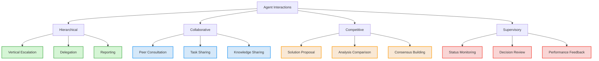
```mermaid
flowchart TD
    classDef l1 fill:#d5f5d5,stroke:#4caf50,stroke-width:2px
    classDef l2 fill:#d5e8f9,stroke:#2196f3,stroke-width:2px
    classDef l3 fill:#f9e8d5,stroke:#ff9800,stroke-width:2px
    classDef dad fill:#f9d5d5,stroke:#f44336,stroke-width:2px
    
    A[Agent Interactions] --> B[Hierarchical]
    A --> C[Collaborative]
    A --> D[Competitive]
    A --> E[Supervisory]
    
    B --> B1[Vertical Escalation]
    B --> B2[Delegation]
    B --> B3[Reporting]
    
    C --> C1[Peer Consultation]
    C --> C2[Task Sharing]
    C --> C3[Knowledge Sharing]
    
    D --> D1[Solution Proposal]
    D --> D2[Analysis Comparison]
    D --> D3[Consensus Building]
    
    E --> E1[Status Monitoring]
    E --> E2[Decision Review]
    E --> E3[Performance Feedback]
    
    class B1,B2,B3 l1
    class C1,C2,C3 l2
    class D1,D2,D3 l3
    class E1,E2,E3 dad
```

### 2.2 Interaction Governance Rules

| Rule Type | Description | Application |
|-----------|-------------|-------------|
| Escalation Threshold | Conditions that trigger upward escalation | Confidence threshold, risk level, authority boundary |
| Consultation Protocol | Rules for when/how to consult other agents | Specialized knowledge needs, verification requirements |
| Decision Authority | Parameters that define decision-making authority | Agent tier, domain expertise, risk level |
| Resource Allocation | Guidelines for sharing computational resources | Task priority, agent tier, operational context |
| Communication Format | Standardized interaction message formats | Request/response patterns, event notifications |
| Oversight Triggers | Conditions that require human oversight | High-risk actions, ethical considerations, regulatory requirements |

### 2.3 Communication Protocol

The Agent Communication Protocol provides a structured format for all agent interactions:

```json
{
  "message_id": "unique-message-identifier",
  "timestamp": "ISO-8601-timestamp",
  "sender": {
    "agent_id": "sender-agent-id",
    "agent_type": "sender-agent-type",
    "agent_tier": "sender-tier-level"
  },
  "recipients": [
    {
      "agent_id": "recipient-agent-id",
      "agent_type": "recipient-agent-type",
      "agent_tier": "recipient-tier-level"
    }
  ],
  "interaction_type": "request|response|notification|status|escalation",
  "priority": "low|medium|high|critical",
  "context": {
    "task_id": "related-task-identifier",
    "incident_id": "related-incident-identifier",
    "workspace_id": "operational-workspace-identifier"
  },
  "content": {
    "message_type": "specific-message-type",
    "body": "message-content-or-structured-data",
    "attachments": [
      {
        "type": "attachment-type",
        "data": "attachment-data-or-reference"
      }
    ]
  },
  "metadata": {
    "confidence_level": 0.95,
    "security_classification": "classification-level",
    "expiration": "ISO-8601-expiration-time"
  }
}
```

## 3. Hierarchical Interaction Flows

### 3.1 Vertical Escalation Flow

The process for escalating issues from lower-tier agents to higher-tier agents when the lower-tier agent cannot handle the task or requires additional authority.

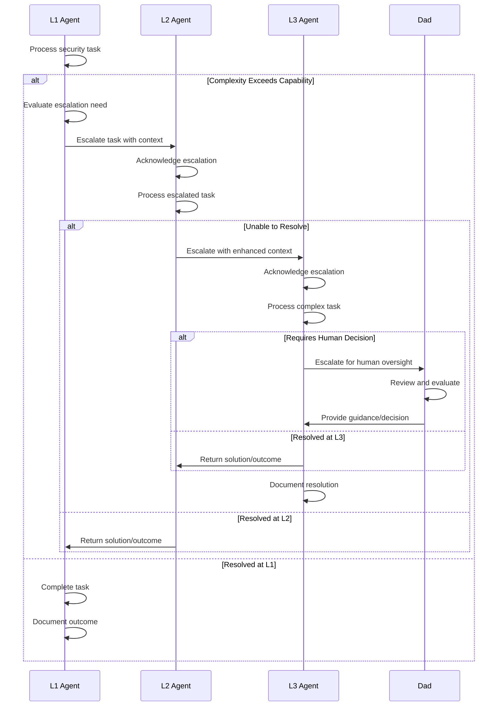
```mermaid
sequenceDiagram
    participant L1 as L1 Agent
    participant L2 as L2 Agent
    participant L3 as L3 Agent
    participant Dad as Dad
    
    L1->>L1: Process security task
    
    alt Complexity Exceeds Capability
        L1->>L1: Evaluate escalation need
        L1->>L2: Escalate task with context
        L2->>L2: Acknowledge escalation
        
        L2->>L2: Process escalated task
        
        alt Unable to Resolve
            L2->>L3: Escalate with enhanced context
            L3->>L3: Acknowledge escalation
            
            L3->>L3: Process complex task
            
            alt Requires Human Decision
                L3->>Dad: Escalate for human oversight
                Dad->>Dad: Review and evaluate
                Dad->>L3: Provide guidance/decision
            else Resolved at L3
                L3->>L2: Return solution/outcome
            end
            
            L3->>L3: Document resolution
            
        else Resolved at L2
            L2->>L1: Return solution/outcome
        end
        
    else Resolved at L1
        L1->>L1: Complete task
        L1->>L1: Document outcome
    end
```

#### Escalation Criteria

| From → To | Escalation Triggers | Examples |
|-----------|---------------------|----------|
| L1 → L2 | Confidence below 70%, Scope exceeds authority, Pattern recognition failure, Novel threat | New malware variant detection, Unusual attack pattern, Complex phishing campaign |
| L2 → L3 | Confidence below 60%, Multi-system impact, Security policy exception needed, Potential critical impact | Active intrusion, Data exfiltration attempt, Zero-day exploit, Custom attack chain |
| L3 → Dad | Confidence below 40%, High business impact, Ethical consideration, Regulatory implication, Human judgment required | Critical infrastructure impact, Public disclosure decision, Legal response requirement, Strategic business decision |

### 3.2 Task Delegation Flow

The process for higher-tier agents to delegate subtasks to lower-tier agents.

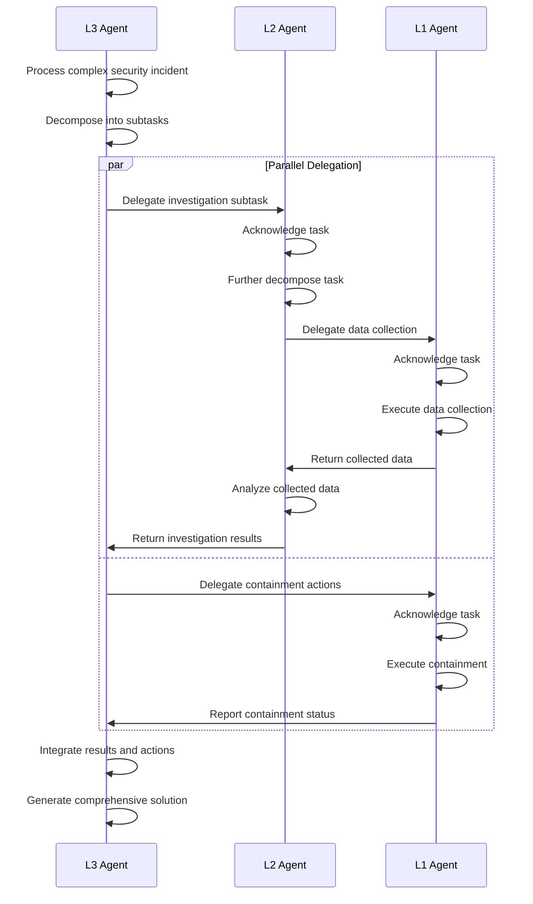
```mermaid
sequenceDiagram
    participant L3 as L3 Agent
    participant L2 as L2 Agent
    participant L1 as L1 Agent
    
    L3->>L3: Process complex security incident
    L3->>L3: Decompose into subtasks
    
    par Parallel Delegation
        L3->>L2: Delegate investigation subtask
        L2->>L2: Acknowledge task
        
        L2->>L2: Further decompose task
        L2->>L1: Delegate data collection
        L1->>L1: Acknowledge task
        
        L1->>L1: Execute data collection
        L1->>L2: Return collected data
        
        L2->>L2: Analyze collected data
        L2->>L3: Return investigation results
    and
        L3->>L1: Delegate containment actions
        L1->>L1: Acknowledge task
        L1->>L1: Execute containment
        L1->>L3: Report containment status
    end
    
    L3->>L3: Integrate results and actions
    L3->>L3: Generate comprehensive solution
```

#### Delegation Parameters

| Parameter | Description | Example |
|-----------|-------------|---------|
| Task Granularity | Level of task decomposition | "Collect logs from server X" vs. "Investigate server X" |
| Autonomy Level | Degree of independent decision-making | Full autonomy, Verification required, Guided execution |
| Priority Indicator | Task urgency and importance | Critical (immediate), High (ASAP), Medium (today), Low (when convenient) |
| Dependency Mapping | Task relationships and dependencies | "Block IP after evidence collection complete" |
| Completion Criteria | Definition of task completion | "All endpoints scanned" or "Threat contained" |
| Error Handling | Instructions for exception cases | "Escalate if server unavailable" |

### 3.3 Oversight and Monitoring Flow

The process for higher-tier agents and Dad to monitor, review, and provide feedback on lower-tier agent activities.

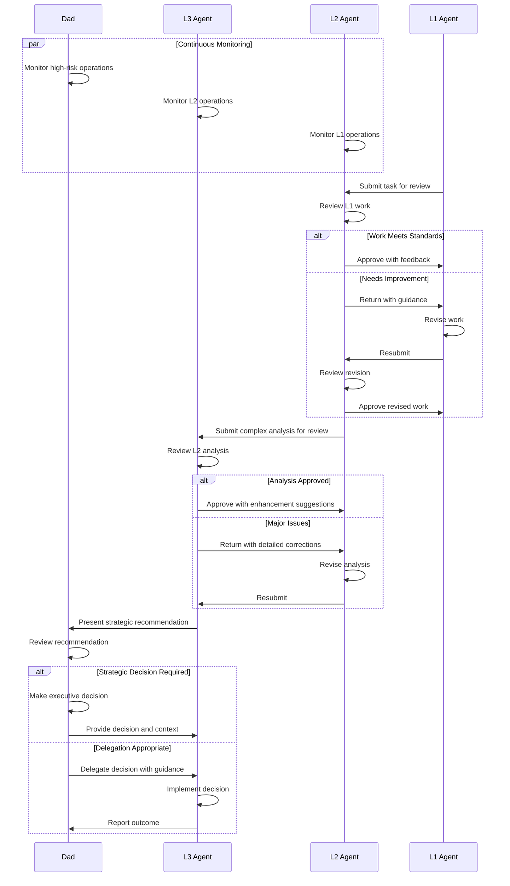
```mermaid
sequenceDiagram
    participant Dad as Dad
    participant L3 as L3 Agent
    participant L2 as L2 Agent
    participant L1 as L1 Agent
    
    par Continuous Monitoring
        Dad->>Dad: Monitor high-risk operations
        L3->>L3: Monitor L2 operations
        L2->>L2: Monitor L1 operations
    end
    
    L1->>L2: Submit task for review
    L2->>L2: Review L1 work
    
    alt Work Meets Standards
        L2->>L1: Approve with feedback
    else Needs Improvement
        L2->>L1: Return with guidance
        L1->>L1: Revise work
        L1->>L2: Resubmit
        L2->>L2: Review revision
        L2->>L1: Approve revised work
    end
    
    L2->>L3: Submit complex analysis for review
    L3->>L3: Review L2 analysis
    
    alt Analysis Approved
        L3->>L2: Approve with enhancement suggestions
    else Major Issues
        L3->>L2: Return with detailed corrections
        L2->>L2: Revise analysis
        L2->>L3: Resubmit
    end
    
    L3->>Dad: Present strategic recommendation
    Dad->>Dad: Review recommendation
    
    alt Strategic Decision Required
        Dad->>Dad: Make executive decision
        Dad->>L3: Provide decision and context
    else Delegation Appropriate
        Dad->>L3: Delegate decision with guidance
        L3->>L3: Implement decision
        L3->>Dad: Report outcome
    end
```

## 4. Collaborative Interaction Flows

### 4.1 Peer Consultation Flow

The process for agents at the same tier to consult each other for specialized knowledge or expertise.

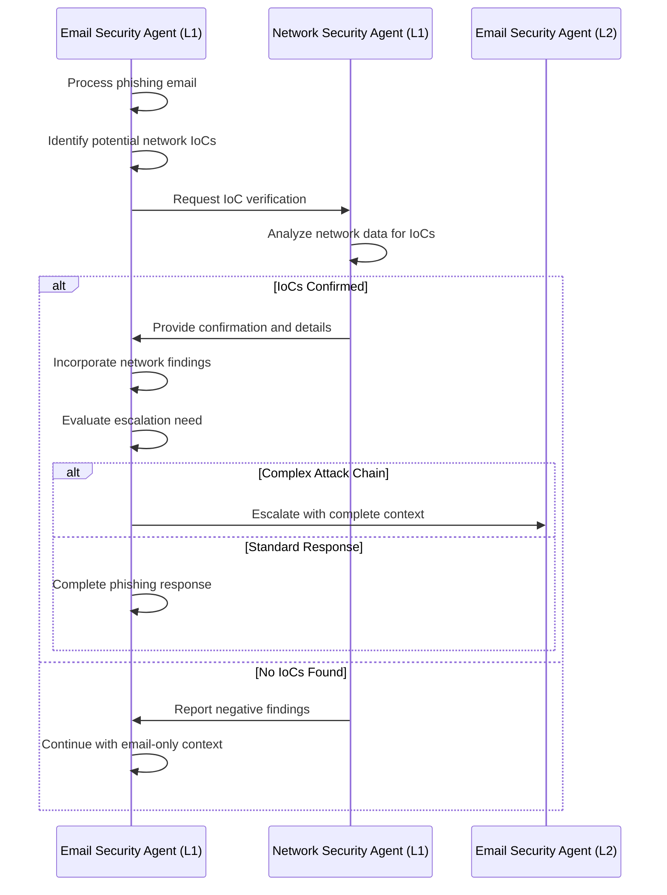
```mermaid
sequenceDiagram
    participant EA as Email Security Agent (L1)
    participant NA as Network Security Agent (L1)
    participant EA_L2 as Email Security Agent (L2)
    
    EA->>EA: Process phishing email
    EA->>EA: Identify potential network IoCs
    
    EA->>NA: Request IoC verification
    NA->>NA: Analyze network data for IoCs
    
    alt IoCs Confirmed
        NA->>EA: Provide confirmation and details
        EA->>EA: Incorporate network findings
        
        EA->>EA: Evaluate escalation need
        
        alt Complex Attack Chain
            EA->>EA_L2: Escalate with complete context
        else Standard Response
            EA->>EA: Complete phishing response
        end
    else No IoCs Found
        NA->>EA: Report negative findings
        EA->>EA: Continue with email-only context
    end
```

#### Consultation Patterns

| Pattern | Description | Example |
|---------|-------------|---------|
| Knowledge Query | Request for specific information | "Provide IOCs for threat X" |
| Analysis Request | Request for analytical support | "Analyze this network capture" |
| Verification Check | Request to confirm a finding | "Verify this alert is not a false positive" |
| Collaborative Investigation | Joint analysis of complex issue | Email and Endpoint agents investigating phishing+malware |
| Consensus Building | Multiple agent perspectives to form consensus | Threat assessment from multiple security domains |
| Experience Sharing | Learning from previous encounters | "Have you seen this attack pattern before?" |

### 4.2 Task Sharing Flow

The process for multiple agents to collaborate on a complex task.

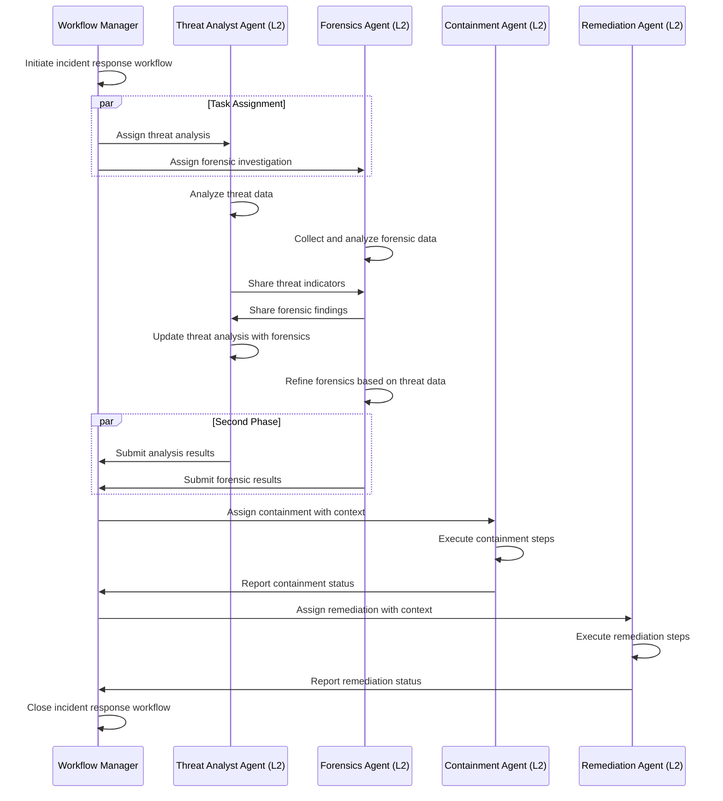
```mermaid
sequenceDiagram
    participant WFM as Workflow Manager
    participant TA as Threat Analyst Agent (L2)
    participant FA as Forensics Agent (L2)
    participant CA as Containment Agent (L2)
    participant RA as Remediation Agent (L2)
    
    WFM->>WFM: Initiate incident response workflow
    
    par Task Assignment
        WFM->>TA: Assign threat analysis
        WFM->>FA: Assign forensic investigation
    end
    
    TA->>TA: Analyze threat data
    FA->>FA: Collect and analyze forensic data
    
    TA->>FA: Share threat indicators
    FA->>TA: Share forensic findings
    
    TA->>TA: Update threat analysis with forensics
    FA->>FA: Refine forensics based on threat data
    
    par Second Phase
        TA->>WFM: Submit analysis results
        FA->>WFM: Submit forensic results
    end
    
    WFM->>CA: Assign containment with context
    CA->>CA: Execute containment steps
    CA->>WFM: Report containment status
    
    WFM->>RA: Assign remediation with context
    RA->>RA: Execute remediation steps
    RA->>WFM: Report remediation status
    
    WFM->>WFM: Close incident response workflow
```

#### Collaboration Modes

| Mode | Description | Application |
|------|-------------|-------------|
| Sequential | Agents work in a defined sequence | Investigation → Analysis → Response |
| Parallel | Agents work simultaneously on different aspects | Threat analysis and forensics in parallel |
| Iterative | Agents repeatedly exchange information to refine results | Sharing and updating findings during investigation |
| Hub-and-Spoke | Central coordinator with specialized contributors | Incident manager coordinating specialized agents |
| Peer-to-Peer | Direct collaboration without central coordination | Direct sharing of IOCs between security domains |
| Swarm | Multiple agents collectively solving a problem | Joint analysis of a complex attack |

### 4.3 Knowledge Sharing Flow

The process for agents to share knowledge, findings, and experiences to improve overall system intelligence.

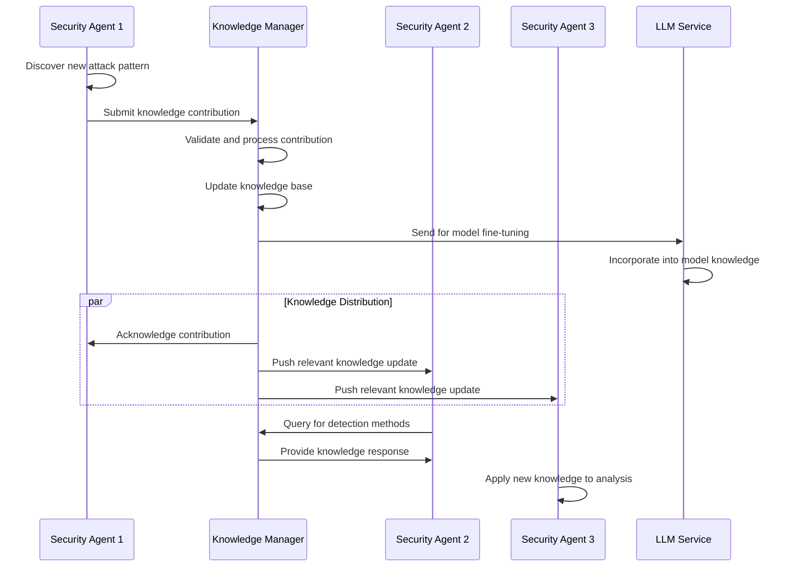
```mermaid
sequenceDiagram
    participant Agent1 as Security Agent 1
    participant KM as Knowledge Manager
    participant Agent2 as Security Agent 2
    participant Agent3 as Security Agent 3
    participant LLM as LLM Service
    
    Agent1->>Agent1: Discover new attack pattern
    Agent1->>KM: Submit knowledge contribution
    
    KM->>KM: Validate and process contribution
    KM->>KM: Update knowledge base
    
    KM->>LLM: Send for model fine-tuning
    LLM->>LLM: Incorporate into model knowledge
    
    par Knowledge Distribution
        KM->>Agent1: Acknowledge contribution
        KM->>Agent2: Push relevant knowledge update
        KM->>Agent3: Push relevant knowledge update
    end
    
    Agent2->>KM: Query for detection methods
    KM->>Agent2: Provide knowledge response
    
    Agent3->>Agent3: Apply new knowledge to analysis
```

#### Knowledge Sharing Types

| Type | Description | Example |
|------|-------------|---------|
| Tactical Intelligence | Specific technical findings | New malware hash, attack pattern, vulnerability |
| Analytical Methods | Approaches to problem-solving | Novel analysis technique for a threat type |
| Environmental Context | Organization-specific information | Internal network topology, asset importance |
| Historical Experience | Past encounters and outcomes | Previously seen attack patterns and responses |
| Detection Logic | Rules and patterns for detection | YARA rules, Sigma rules, detection logic |
| Response Playbooks | Documented response procedures | Step-by-step containment procedures |

## 5. Specialized Interaction Flows

### 5.1 Threat Hunting Interaction Flow

The interaction flow for collaborative threat hunting operations.

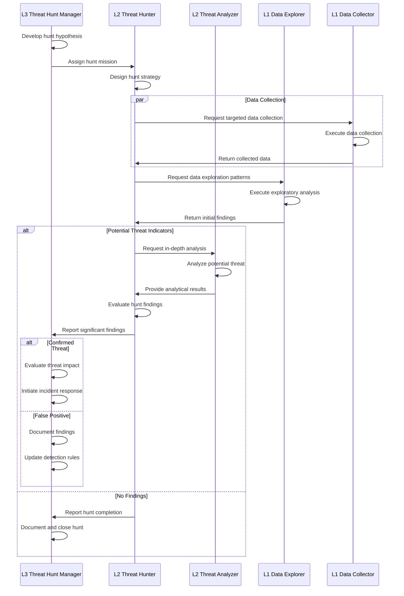
```mermaid
sequenceDiagram
    participant L3TH as L3 Threat Hunt Manager
    participant L2TH as L2 Threat Hunter
    participant L2Ana as L2 Threat Analyzer
    participant L1Exp as L1 Data Explorer
    participant L1Col as L1 Data Collector
    
    L3TH->>L3TH: Develop hunt hypothesis
    L3TH->>L2TH: Assign hunt mission
    
    L2TH->>L2TH: Design hunt strategy
    
    par Data Collection
        L2TH->>L1Col: Request targeted data collection
        L1Col->>L1Col: Execute data collection
        L1Col->>L2TH: Return collected data
    end
    
    L2TH->>L1Exp: Request data exploration patterns
    L1Exp->>L1Exp: Execute exploratory analysis
    L1Exp->>L2TH: Return initial findings
    
    alt Potential Threat Indicators
        L2TH->>L2Ana: Request in-depth analysis
        L2Ana->>L2Ana: Analyze potential threat
        L2Ana->>L2TH: Provide analytical results
        
        L2TH->>L2TH: Evaluate hunt findings
        L2TH->>L3TH: Report significant findings
        
        alt Confirmed Threat
            L3TH->>L3TH: Evaluate threat impact
            L3TH->>L3TH: Initiate incident response
        else False Positive
            L3TH->>L3TH: Document findings
            L3TH->>L3TH: Update detection rules
        end
    else No Findings
        L2TH->>L3TH: Report hunt completion
        L3TH->>L3TH: Document and close hunt
    end
```

### 5.2 Incident Response Interaction Flow

The interaction flow for coordinated incident response.

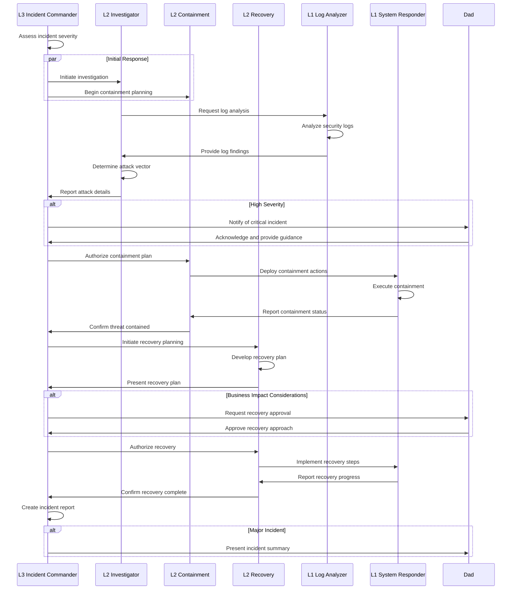
```mermaid
sequenceDiagram
    participant L3IR as L3 Incident Commander
    participant L2Inv as L2 Investigator
    participant L2Cont as L2 Containment
    participant L2Rec as L2 Recovery
    participant L1Log as L1 Log Analyzer
    participant L1Sys as L1 System Responder
    participant Dad as Dad
    
    L3IR->>L3IR: Assess incident severity
    
    par Initial Response
        L3IR->>L2Inv: Initiate investigation
        L3IR->>L2Cont: Begin containment planning
    end
    
    L2Inv->>L1Log: Request log analysis
    L1Log->>L1Log: Analyze security logs
    L1Log->>L2Inv: Provide log findings
    
    L2Inv->>L2Inv: Determine attack vector
    L2Inv->>L3IR: Report attack details
    
    alt High Severity
        L3IR->>Dad: Notify of critical incident
        Dad->>L3IR: Acknowledge and provide guidance
    end
    
    L3IR->>L2Cont: Authorize containment plan
    
    L2Cont->>L1Sys: Deploy containment actions
    L1Sys->>L1Sys: Execute containment
    L1Sys->>L2Cont: Report containment status
    
    L2Cont->>L3IR: Confirm threat contained
    
    L3IR->>L2Rec: Initiate recovery planning
    L2Rec->>L2Rec: Develop recovery plan
    L2Rec->>L3IR: Present recovery plan
    
    alt Business Impact Considerations
        L3IR->>Dad: Request recovery approval
        Dad->>L3IR: Approve recovery approach
    end
    
    L3IR->>L2Rec: Authorize recovery
    L2Rec->>L1Sys: Implement recovery steps
    L1Sys->>L2Rec: Report recovery progress
    
    L2Rec->>L3IR: Confirm recovery complete
    
    L3IR->>L3IR: Create incident report
    
    alt Major Incident
        L3IR->>Dad: Present incident summary
    end
```

### 5.3 Vulnerability Management Interaction Flow

The interaction flow for vulnerability management operations.

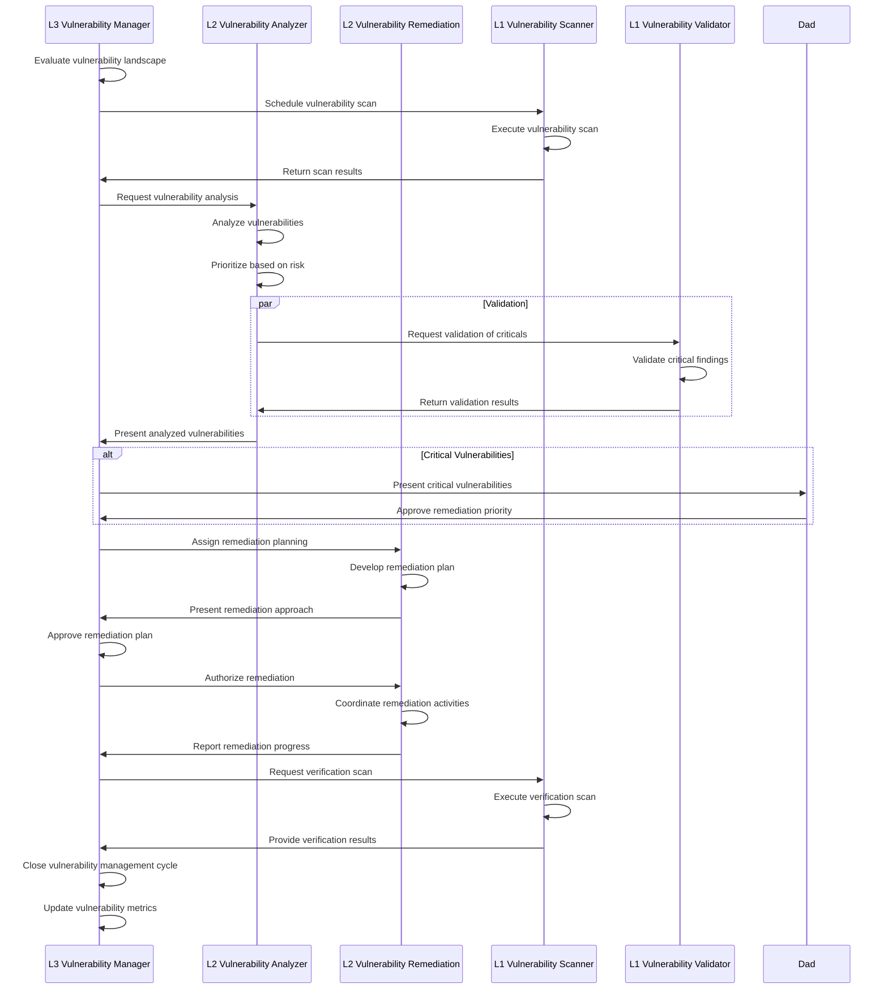
```mermaid
sequenceDiagram
    participant L3VM as L3 Vulnerability Manager
    participant L2VA as L2 Vulnerability Analyzer
    participant L2VR as L2 Vulnerability Remediation
    participant L1VS as L1 Vulnerability Scanner
    participant L1VV as L1 Vulnerability Validator
    participant Dad as Dad
    
    L3VM->>L3VM: Evaluate vulnerability landscape
    L3VM->>L1VS: Schedule vulnerability scan
    
    L1VS->>L1VS: Execute vulnerability scan
    L1VS->>L3VM: Return scan results
    
    L3VM->>L2VA: Request vulnerability analysis
    L2VA->>L2VA: Analyze vulnerabilities
    L2VA->>L2VA: Prioritize based on risk
    
    par Validation
        L2VA->>L1VV: Request validation of criticals
        L1VV->>L1VV: Validate critical findings
        L1VV->>L2VA: Return validation results
    end
    
    L2VA->>L3VM: Present analyzed vulnerabilities
    
    alt Critical Vulnerabilities
        L3VM->>Dad: Present critical vulnerabilities
        Dad->>L3VM: Approve remediation priority
    end
    
    L3VM->>L2VR: Assign remediation planning
    L2VR->>L2VR: Develop remediation plan
    L2VR->>L3VM: Present remediation approach
    
    L3VM->>L3VM: Approve remediation plan
    L3VM->>L2VR: Authorize remediation
    
    L2VR->>L2VR: Coordinate remediation activities
    L2VR->>L3VM: Report remediation progress
    
    L3VM->>L1VS: Request verification scan
    L1VS->>L1VS: Execute verification scan
    L1VS->>L3VM: Provide verification results
    
    L3VM->>L3VM: Close vulnerability management cycle
    L3VM->>L3VM: Update vulnerability metrics
```

### 5.4 Security Operations Monitor Interaction Flow

The interaction flow for continuous security monitoring and operations.

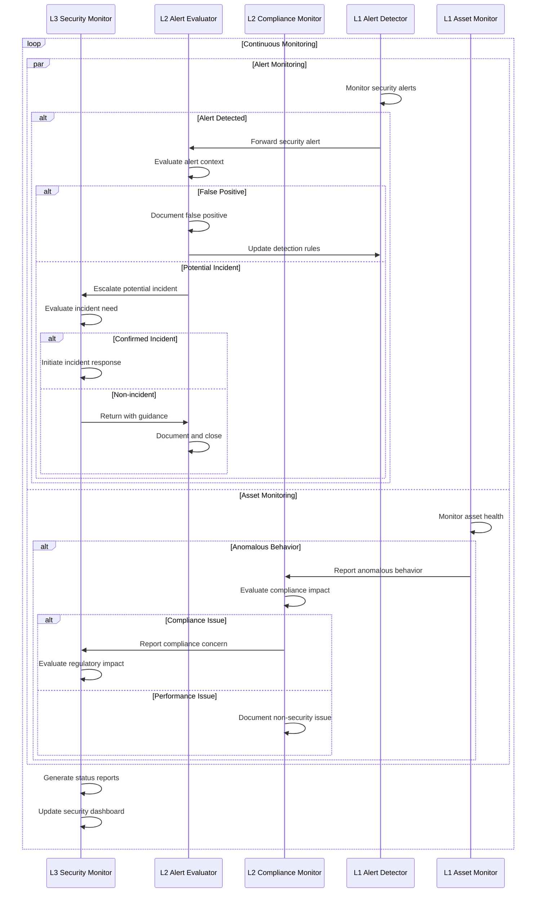
```mermaid
sequenceDiagram
    participant L3SM as L3 Security Monitor
    participant L2AE as L2 Alert Evaluator
    participant L2CM as L2 Compliance Monitor
    participant L1AD as L1 Alert Detector
    participant L1AM as L1 Asset Monitor
    
    loop Continuous Monitoring
        par Alert Monitoring
            L1AD->>L1AD: Monitor security alerts
            
            alt Alert Detected
                L1AD->>L2AE: Forward security alert
                L2AE->>L2AE: Evaluate alert context
                
                alt False Positive
                    L2AE->>L2AE: Document false positive
                    L2AE->>L1AD: Update detection rules
                else Potential Incident
                    L2AE->>L3SM: Escalate potential incident
                    L3SM->>L3SM: Evaluate incident need
                    
                    alt Confirmed Incident
                        L3SM->>L3SM: Initiate incident response
                    else Non-incident
                        L3SM->>L2AE: Return with guidance
                        L2AE->>L2AE: Document and close
                    end
                end
            end
        and Asset Monitoring
            L1AM->>L1AM: Monitor asset health
            
            alt Anomalous Behavior
                L1AM->>L2CM: Report anomalous behavior
                L2CM->>L2CM: Evaluate compliance impact
                
                alt Compliance Issue
                    L2CM->>L3SM: Report compliance concern
                    L3SM->>L3SM: Evaluate regulatory impact
                else Performance Issue
                    L2CM->>L2CM: Document non-security issue
                end
            end
        end
        
        L3SM->>L3SM: Generate status reports
        L3SM->>L3SM: Update security dashboard
    end
```

## 6. Decision-Making and Consensus Flows

### 6.1 Multi-Agent Decision Flow

The process for multiple agents to reach a decision requiring diverse expertise.

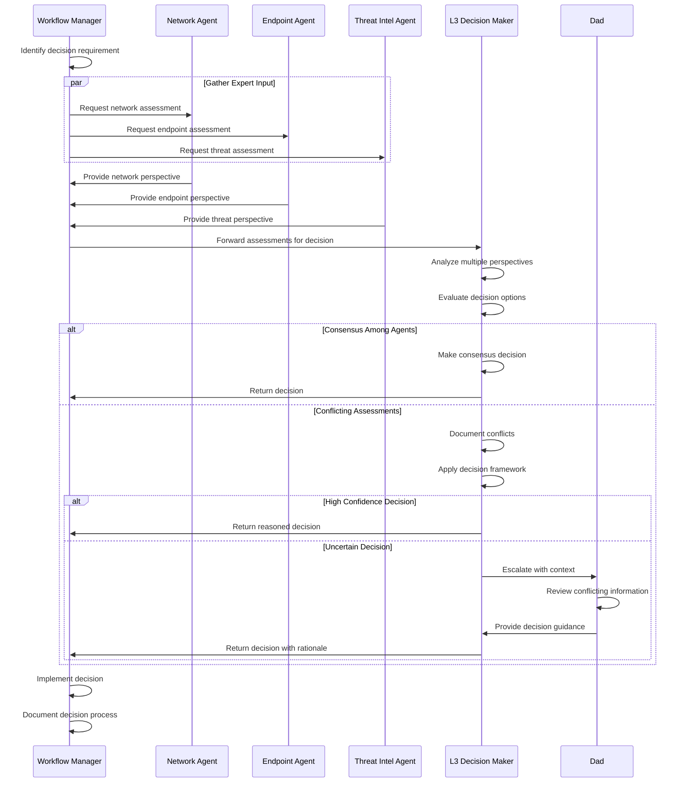
```mermaid
sequenceDiagram
    participant WFM as Workflow Manager
    participant NETA as Network Agent
    participant ENDA as Endpoint Agent
    participant THIA as Threat Intel Agent
    participant L3DM as L3 Decision Maker
    participant Dad as Dad
    
    WFM->>WFM: Identify decision requirement
    
    par Gather Expert Input
        WFM->>NETA: Request network assessment
        WFM->>ENDA: Request endpoint assessment
        WFM->>THIA: Request threat assessment
    end
    
    NETA->>WFM: Provide network perspective
    ENDA->>WFM: Provide endpoint perspective
    THIA->>WFM: Provide threat perspective
    
    WFM->>L3DM: Forward assessments for decision
    
    L3DM->>L3DM: Analyze multiple perspectives
    L3DM->>L3DM: Evaluate decision options
    
    alt Consensus Among Agents
        L3DM->>L3DM: Make consensus decision
        L3DM->>WFM: Return decision
    else Conflicting Assessments
        L3DM->>L3DM: Document conflicts
        L3DM->>L3DM: Apply decision framework
        
        alt High Confidence Decision
            L3DM->>WFM: Return reasoned decision
        else Uncertain Decision
            L3DM->>Dad: Escalate with context
            Dad->>Dad: Review conflicting information
            Dad->>L3DM: Provide decision guidance
            L3DM->>WFM: Return decision with rationale
        end
    end
    
    WFM->>WFM: Implement decision
    WFM->>WFM: Document decision process
```

### 6.2 Emergency Response Flow

The interaction flow for rapid response to critical security emergencies.

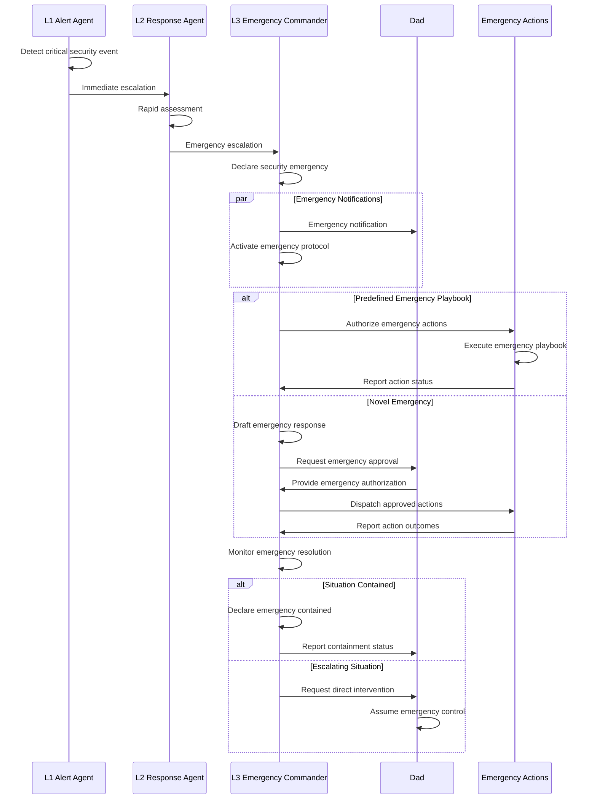
```mermaid
sequenceDiagram
    participant L1 as L1 Alert Agent
    participant L2 as L2 Response Agent
    participant L3 as L3 Emergency Commander
    participant Dad as Dad
    participant EA as Emergency Actions
    
    L1->>L1: Detect critical security event
    L1->>L2: Immediate escalation
    
    L2->>L2: Rapid assessment
    L2->>L3: Emergency escalation
    
    L3->>L3: Declare security emergency
    
    par Emergency Notifications
        L3->>Dad: Emergency notification
        L3->>L3: Activate emergency protocol
    end
    
    alt Predefined Emergency Playbook
        L3->>EA: Authorize emergency actions
        EA->>EA: Execute emergency playbook
        EA->>L3: Report action status
    else Novel Emergency
        L3->>L3: Draft emergency response
        L3->>Dad: Request emergency approval
        Dad->>L3: Provide emergency authorization
        L3->>EA: Dispatch approved actions
        EA->>L3: Report action outcomes
    end
    
    L3->>L3: Monitor emergency resolution
    
    alt Situation Contained
        L3->>L3: Declare emergency contained
        L3->>Dad: Report containment status
    else Escalating Situation
        L3->>Dad: Request direct intervention
        Dad->>Dad: Assume emergency control
    end
```

### 6.3 Learning and Improvement Flow

The interaction flow for agents to learn from experiences and improve capabilities.

```mermaid
sequenceDiagram
    participant Agent as Learning Agent
    participant KM as Knowledge Manager
    participant LM as Learning Manager
    participant PS as Performance Supervisor
    participant Dad as Dad
    
    Agent->>Agent: Complete security task
    Agent->>LM: Submit task outcome
    
    LM->>LM: Analyze performance
    LM->>PS: Report performance metrics
    
    alt Performance Below Threshold
        PS->>PS: Identify improvement areas
        PS->>Agent: Assign improvement tasks
        Agent->>Agent: Execute learning activities
    end
    
    Agent->>KM: Submit new knowledge
    KM->>KM: Process knowledge contribution
    
    LM->>LM: Identify pattern improvements
    LM->>Agent: Deploy capability enhancement
    
    periodic Quarterly Review
        PS->>PS: Compile performance analysis
        PS->>Dad: Present learning outcomes
        Dad->>PS: Provide strategic guidance
    end
    
    PS->>LM: Update learning objectives
    LM->>Agent: Adjust learning parameters
```

## 7. Core Use Case Interaction Flows

### 7.1 Phishing Email Response Flow

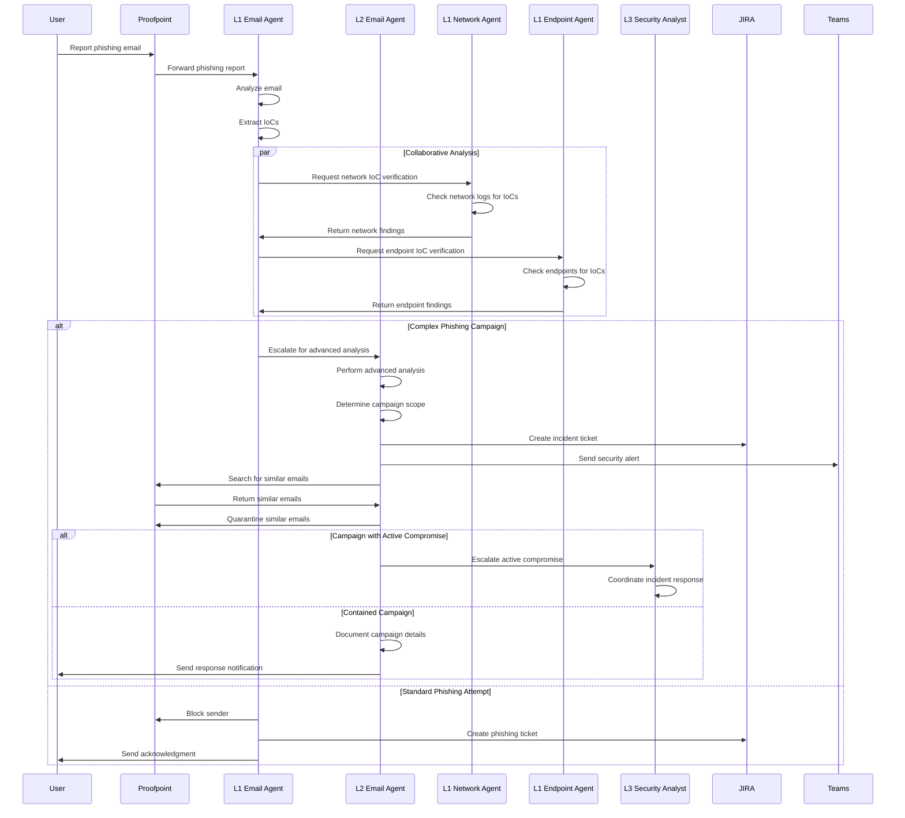
```mermaid
sequenceDiagram
    participant User as User
    participant PPA as Proofpoint
    participant L1EA as L1 Email Agent
    participant L2EA as L2 Email Agent
    participant L1NA as L1 Network Agent
    participant L1ENA as L1 Endpoint Agent
    participant L3SA as L3 Security Analyst
    participant JIRA as JIRA
    participant Teams as Teams
    
    User->>PPA: Report phishing email
    PPA->>L1EA: Forward phishing report
    
    L1EA->>L1EA: Analyze email
    L1EA->>L1EA: Extract IoCs
    
    par Collaborative Analysis
        L1EA->>L1NA: Request network IoC verification
        L1NA->>L1NA: Check network logs for IoCs
        L1NA->>L1EA: Return network findings
        
        L1EA->>L1ENA: Request endpoint IoC verification
        L1ENA->>L1ENA: Check endpoints for IoCs
        L1ENA->>L1EA: Return endpoint findings
    end
    
    alt Complex Phishing Campaign
        L1EA->>L2EA: Escalate for advanced analysis
        L2EA->>L2EA: Perform advanced analysis
        L2EA->>L2EA: Determine campaign scope
        
        L2EA->>JIRA: Create incident ticket
        L2EA->>Teams: Send security alert
        
        L2EA->>PPA: Search for similar emails
        PPA->>L2EA: Return similar emails
        
        L2EA->>PPA: Quarantine similar emails
        
        alt Campaign with Active Compromise
            L2EA->>L3SA: Escalate active compromise
            L3SA->>L3SA: Coordinate incident response
        else Contained Campaign
            L2EA->>L2EA: Document campaign details
            L2EA->>User: Send response notification
        end
        
    else Standard Phishing Attempt
        L1EA->>PPA: Block sender
        L1EA->>JIRA: Create phishing ticket
        L1EA->>User: Send acknowledgment
    end
```

### 7.2 Threat Hunting and Containment Flow

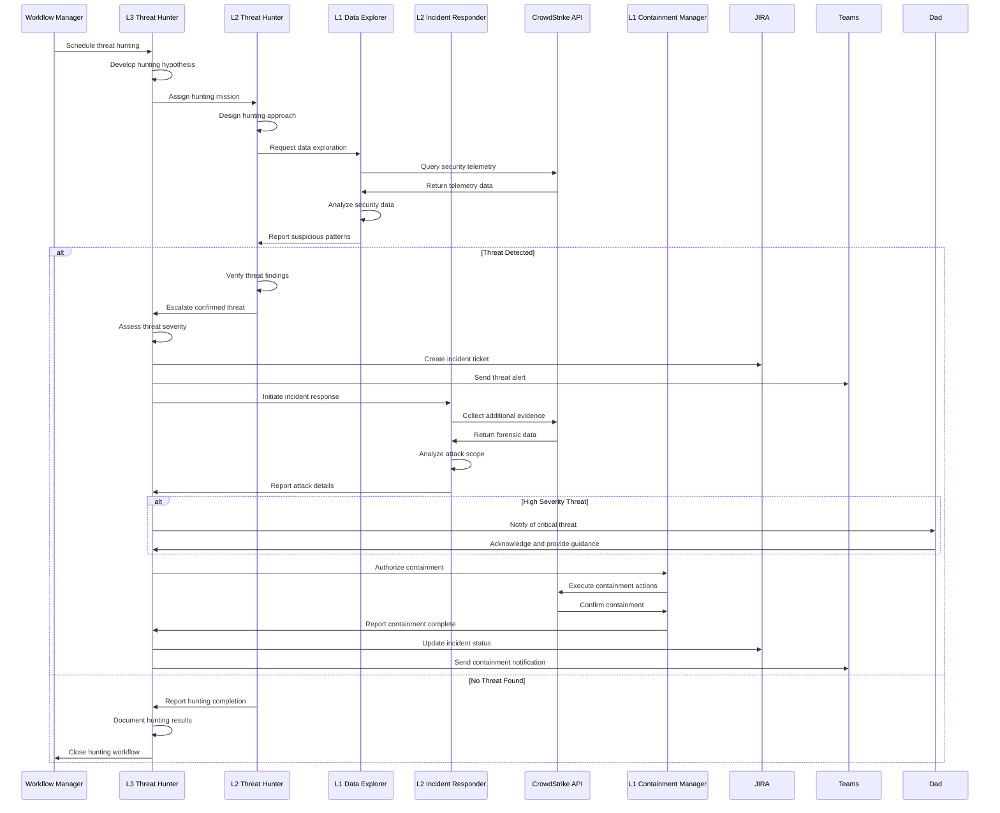
```mermaid
sequenceDiagram
    participant WFM as Workflow Manager
    participant L3TH as L3 Threat Hunter
    participant L2TH as L2 Threat Hunter
    participant L1DE as L1 Data Explorer
    participant L2IR as L2 Incident Responder
    participant CSAPI as CrowdStrike API
    participant L1CM as L1 Containment Manager
    participant JIRA as JIRA
    participant Teams as Teams
    participant Dad as Dad
    
    WFM->>L3TH: Schedule threat hunting
    L3TH->>L3TH: Develop hunting hypothesis
    
    L3TH->>L2TH: Assign hunting mission
    L2TH->>L2TH: Design hunting approach
    
    L2TH->>L1DE: Request data exploration
    L1DE->>CSAPI: Query security telemetry
    CSAPI->>L1DE: Return telemetry data
    
    L1DE->>L1DE: Analyze security data
    L1DE->>L2TH: Report suspicious patterns
    
    alt Threat Detected
        L2TH->>L2TH: Verify threat findings
        L2TH->>L3TH: Escalate confirmed threat
        
        L3TH->>L3TH: Assess threat severity
        
        L3TH->>JIRA: Create incident ticket
        L3TH->>Teams: Send threat alert
        
        L3TH->>L2IR: Initiate incident response
        L2IR->>CSAPI: Collect additional evidence
        CSAPI->>L2IR: Return forensic data
        
        L2IR->>L2IR: Analyze attack scope
        L2IR->>L3TH: Report attack details
        
        alt High Severity Threat
            L3TH->>Dad: Notify of critical threat
            Dad->>L3TH: Acknowledge and provide guidance
        end
        
        L3TH->>L1CM: Authorize containment
        L1CM->>CSAPI: Execute containment actions
        CSAPI->>L1CM: Confirm containment
        L1CM->>L3TH: Report containment complete
        
        L3TH->>JIRA: Update incident status
        L3TH->>Teams: Send containment notification
    else No Threat Found
        L2TH->>L3TH: Report hunting completion
        L3TH->>L3TH: Document hunting results
        L3TH->>WFM: Close hunting workflow
    end
```

### 7.3 Vulnerability Management Flow

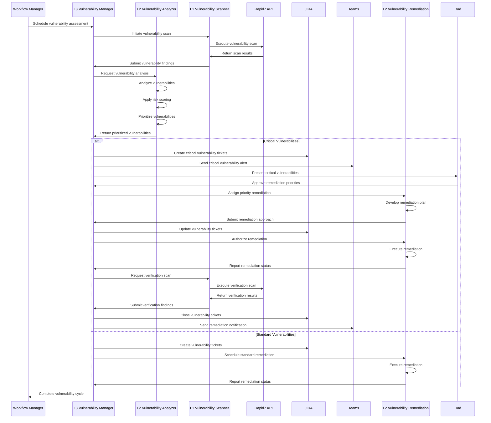
```mermaid
sequenceDiagram
    participant WFM as Workflow Manager
    participant L3VM as L3 Vulnerability Manager
    participant L2VA as L2 Vulnerability Analyzer
    participant L1VS as L1 Vulnerability Scanner
    participant Rapid7 as Rapid7 API
    participant JIRA as JIRA
    participant Teams as Teams
    participant L2VR as L2 Vulnerability Remediation
    participant Dad as Dad
    
    WFM->>L3VM: Schedule vulnerability assessment
    L3VM->>L1VS: Initiate vulnerability scan
    
    L1VS->>Rapid7: Execute vulnerability scan
    Rapid7->>L1VS: Return scan results
    L1VS->>L3VM: Submit vulnerability findings
    
    L3VM->>L2VA: Request vulnerability analysis
    
    L2VA->>L2VA: Analyze vulnerabilities
    L2VA->>L2VA: Apply risk scoring
    L2VA->>L2VA: Prioritize vulnerabilities
    L2VA->>L3VM: Return prioritized vulnerabilities
    
    alt Critical Vulnerabilities
        L3VM->>JIRA: Create critical vulnerability tickets
        L3VM->>Teams: Send critical vulnerability alert
        
        L3VM->>Dad: Present critical vulnerabilities
        Dad->>L3VM: Approve remediation priorities
        
        L3VM->>L2VR: Assign priority remediation
        L2VR->>L2VR: Develop remediation plan
        L2VR->>L3VM: Submit remediation approach
        
        L3VM->>JIRA: Update vulnerability tickets
        L3VM->>L2VR: Authorize remediation
        
        L2VR->>L2VR: Execute remediation
        L2VR->>L3VM: Report remediation status
        
        L3VM->>L1VS: Request verification scan
        L1VS->>Rapid7: Execute verification scan
        Rapid7->>L1VS: Return verification results
        L1VS->>L3VM: Submit verification findings
        
        L3VM->>JIRA: Close vulnerability tickets
        L3VM->>Teams: Send remediation notification
    else Standard Vulnerabilities
        L3VM->>JIRA: Create vulnerability tickets
        L3VM->>L2VR: Schedule standard remediation
        L2VR->>L2VR: Execute remediation
        L2VR->>L3VM: Report remediation status
    end
    
    L3VM->>WFM: Complete vulnerability cycle
```

### 7.4 Security Reporting Flow

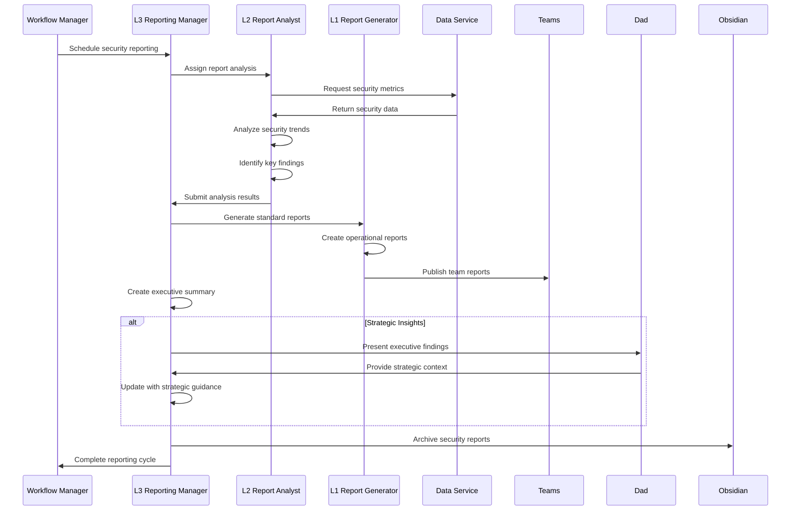
```mermaid
sequenceDiagram
    participant WFM as Workflow Manager
    participant L3RM as L3 Reporting Manager
    participant L2RA as L2 Report Analyst
    participant L1RG as L1 Report Generator
    participant DataSvc as Data Service
    participant Teams as Teams
    participant Dad as Dad
    participant Obsidian as Obsidian
    
    WFM->>L3RM: Schedule security reporting
    
    L3RM->>L2RA: Assign report analysis
    L2RA->>DataSvc: Request security metrics
    DataSvc->>L2RA: Return security data
    
    L2RA->>L2RA: Analyze security trends
    L2RA->>L2RA: Identify key findings
    L2RA->>L3RM: Submit analysis results
    
    L3RM->>L1RG: Generate standard reports
    L1RG->>L1RG: Create operational reports
    L1RG->>Teams: Publish team reports
    
    L3RM->>L3RM: Create executive summary
    
    alt Strategic Insights
        L3RM->>Dad: Present executive findings
        Dad->>L3RM: Provide strategic context
        L3RM->>L3RM: Update with strategic guidance
    end
    
    L3RM->>Obsidian: Archive security reports
    L3RM->>WFM: Complete reporting cycle
```

### 7.5 Natural Language Command Interface Flow

```mermaid
sequenceDiagram
    participant User as User
    participant NLI as Natural Language Interface
    participant L3SA as L3 Security Assistant
    participant L2PA as L2 Process Agent
    participant L1TA as L1 Task Agent
    participant Dad as Dad
    participant IntSys as Integrated Systems
    
    User->>NLI: Issue natural language command
    NLI->>NLI: Parse command intent
    
    NLI->>L3SA: Forward parsed command
    L3SA->>L3SA: Evaluate command requirements
    
    alt Complex Command
        L3SA->>L3SA: Design execution plan
        L3SA->>L2PA: Delegate process execution
        
        L2PA->>L2PA: Break down into tasks
        L2PA->>L1TA: Assign specific tasks
        L1TA->>IntSys: Execute system operations
        IntSys->>L1TA: Return operation results
        
        L1TA->>L2PA: Report task completion
        L2PA->>L3SA: Report process results
    else Simple Command
        L3SA->>L1TA: Delegate direct execution
        L1TA->>IntSys: Execute system operation
        IntSys->>L1TA: Return operation results
        L1TA->>L3SA: Report task result
    end
    
    alt Privileged Command
        L3SA->>Dad: Request command approval
        Dad->>L3SA: Provide authorization
    end
    
    L3SA->>NLI: Return command results
    NLI->>User: Present results in natural language