# Agentic SOC Architecture

## 1. Overall System Architecture

The Cipher Guard Agentic SOC architecture is designed as a comprehensive, hierarchical system of autonomous agents powered by advanced AI models, operating within a structured workflow engine to provide continuous security operations capabilities.

```mermaid
graph TB
    %% Main Components
    subgraph "Agentic SOC Core"
        AgentOrchestratorEngine["Agent Orchestrator Engine"]
        WorkflowEngine["Autonomous Workflow Engine"]
        NLInterface["Natural Language Interface"]
        AICore["AI Core System"]
        KnowledgeBase["Security Knowledge Base"]
    end

    subgraph "Hierarchical Agent Structure"
        L1Agents["L1 Security Agents"]
        L2Agents["L2 Security Agents"]
        L3Agents["L3 Security Agents"]
        DadInterface["Dad Oversight Interface"]
    end

    subgraph "Specialized Agent Pools"
        PhishingAgents["Phishing Defense Agents"]
        ThreatHuntAgents["Threat Hunting Agents"]
        VulnAgents["Vulnerability Management Agents"]
        EndpointAgents["Endpoint Security Agents"]
        NetworkAgents["Network Security Agents"]
        CloudAgents["Cloud Security Agents"]
        ForensicsAgents["Forensic Analysis Agents"]
        ReportingAgents["Reporting Agents"]
        ComplianceAgents["Compliance Agents"]
        PurpleTeamAgents["Purple Team Agents"]
    end

    subgraph "AI Model Integration"
        LLM["Llama-3.1-70B"]
        DeepseekCoder["DeepSeek-Coder-V2"]
        EmbeddingEngine["Embedding Engine"]
        AgentRAGSystem["Agent RAG System"]
    end

    subgraph "External Integrations"
        SecurityTools["Security Tools"]
        CollaborationTools["Collaboration Tools"]
        ThreatIntel["Threat Intelligence"]
        CMDB["CMDB & Asset Inventory"]
    end

    subgraph "Data Layer"
        EventStore["Security Event Store"]
        AgentMemory["Agent Memory System"]
        AuditTrail["Immutable Audit Trail"]
        IncidentRepository["Incident Repository"]
        EvidenceVault["Evidence Vault"]
    end

    subgraph "Operational Components"
        MonitoringSystem["System Monitoring"]
        SelfHealing["Self-Healing System"]
        PerformanceOptimizer["Performance Optimizer"]
        AnomalyDetection["Anomaly Detection"]
    end

    %% Main Component Connections
    AgentOrchestratorEngine <--> WorkflowEngine
    AgentOrchestratorEngine <--> NLInterface
    AgentOrchestratorEngine <--> AICore
    AgentOrchestratorEngine <--> KnowledgeBase
    
    %% Hierarchical Agent Structure Connections
    AgentOrchestratorEngine <--> L1Agents
    AgentOrchestratorEngine <--> L2Agents
    AgentOrchestratorEngine <--> L3Agents
    AgentOrchestratorEngine <--> DadInterface
    
    L1Agents --> L2Agents
    L2Agents --> L3Agents
    L3Agents --> DadInterface

    %% Agent Pool Connections
    L1Agents <--> PhishingAgents
    L1Agents <--> EndpointAgents
    L1Agents <--> NetworkAgents
    L1Agents <--> ReportingAgents
    
    L2Agents <--> ThreatHuntAgents
    L2Agents <--> VulnAgents
    L2Agents <--> CloudAgents
    L2Agents <--> ComplianceAgents
    
    L3Agents <--> ForensicsAgents
    L3Agents <--> PurpleTeamAgents
    
    %% AI Model Connections
    AICore <--> LLM
    AICore <--> DeepseekCoder
    AICore <--> EmbeddingEngine
    AICore <--> AgentRAGSystem
    
    %% External Integration Connections
    AgentOrchestratorEngine <--> SecurityTools
    AgentOrchestratorEngine <--> CollaborationTools
    AgentOrchestratorEngine <--> ThreatIntel
    AgentOrchestratorEngine <--> CMDB
    
    %% Data Layer Connections
    AgentOrchestratorEngine <--> EventStore
    AgentOrchestratorEngine <--> AgentMemory
    AgentOrchestratorEngine <--> AuditTrail
    AgentOrchestratorEngine <--> IncidentRepository
    AgentOrchestratorEngine <--> EvidenceVault
    
    %% Operational Component Connections
    AgentOrchestratorEngine <--> MonitoringSystem
    AgentOrchestratorEngine <--> SelfHealing
    AgentOrchestratorEngine <--> PerformanceOptimizer
    AgentOrchestratorEngine <--> AnomalyDetection

    %% Security Tool Details
    SecurityTools --> Proofpoint["Proofpoint"]
    SecurityTools --> CrowdStrike["CrowdStrike/Falcon"]
    SecurityTools --> Rapid7["Rapid7"]
    SecurityTools --> SIEM["SIEM Platforms"]
    SecurityTools --> NDR["NDR Solutions"]
    SecurityTools --> CloudSecurity["Cloud Security Platforms"]

    %% Collaboration Tool Details
    CollaborationTools --> JIRA["JIRA"]
    CollaborationTools --> Teams["Microsoft Teams"]
    CollaborationTools --> Obsidian["Obsidian"]
    CollaborationTools --> ServiceNow["ServiceNow"]
    CollaborationTools --> Slack["Slack"]
```

## 2. Architecture Overview

The Agentic SOC architecture is built on several core principles:

1. **Hierarchical Intelligence**: A tiered structure of increasingly sophisticated security agents (L1 → L2 → L3 → Dad) that handle progressively more complex tasks and decisions.

2. **Specialized Expertise**: 50+ specialized security agents covering all security domains and technologies, organized into functional pools.

3. **AI-Powered Analysis**: Integrated advanced language models (Llama-3.1-70B and DeepSeek-Coder-V2) providing deep analytical capabilities and code analysis abilities.

4. **Autonomous Workflow**: A comprehensive workflow engine orchestrating 24/7 operations, automated task generation, and execution across the agent hierarchy.

5. **Human Oversight**: Selective human involvement through the Dad Oversight Interface for complex decisions, approvals, and guidance.

6. **Comprehensive Integration**: Seamless connections with the enterprise security stack and collaboration tools.

The architecture consists of the following major components:

## 3. Core Components

### 3.1 Agent Orchestrator Engine

The central nervous system of the Agentic SOC, responsible for:

- Managing the hierarchical agent structure
- Distributing tasks to appropriate agents
- Coordinating agent interactions and collaborations
- Managing escalations between agent tiers
- Supervising agent performance and health
- Implementing agent learning and improvement

### 3.2 Autonomous Workflow Engine

Enables continuous 24/7 operations through:

- Automated playbook execution
- Dynamic workflow generation based on events
- Parallel workflow processing
- Task scheduling and prioritization
- Workflow state management
- Handoff coordination between operational periods

### 3.3 Natural Language Interface

Provides human-like interaction capabilities:

- Command and query interpretation
- Natural language response generation
- Context-aware conversational abilities
- Multi-turn dialogue management
- Intent classification and entity extraction
- Query-to-action translation

### 3.4 AI Core System

The intelligence foundation of the Agentic SOC:

- AI model orchestration and routing
- Prompt engineering and optimization
- Context window management
- Response validation and quality control
- Model performance monitoring
- Model versioning and deployment

### 3.5 Security Knowledge Base

Centralized repository of security knowledge:

- MITRE ATT&CK framework integration
- Security best practices and standards
- Detection and response procedures
- Historical incident patterns
- Vulnerability knowledge
- Threat actor profiles

## 4. Hierarchical Agent Structure

### 4.1 L1 Security Agents

First-line security operations handling routine tasks:

- Alert triage and initial assessment
- Known threat detection and response
- Basic security monitoring
- Standard operating procedure execution
- Data collection and enrichment
- Simple reporting and notification

### 4.2 L2 Security Agents

Second-tier operations addressing more complex security tasks:

- Alert correlation and incident determination
- Advanced threat analysis
- Cross-domain investigation
- Custom detection development
- Standard incident response
- Vulnerability assessment

### 4.3 L3 Security Agents

Advanced security operations requiring deeper expertise:

- Complex incident management
- Advanced hunting and investigation
- Novel threat analysis
- Custom defensive strategy development
- Security architecture recommendations
- Cross-functional security coordination

### 4.4 Dad Oversight Interface

Human supervision and intervention layer:

- Critical decision approval
- Strategic guidance and direction
- Complex incident oversight
- Performance evaluation and feedback
- Exceptional situation handling
- Knowledge transfer and teaching

## 5. Specialized Agent Pools

### 5.1 Phishing Defense Agents

Specialized for email-borne threats:

- Email content analysis
- Link and attachment inspection
- Credential phishing detection
- BEC (Business Email Compromise) identification
- User awareness coordination
- Email security improvement

### 5.2 Threat Hunting Agents

Proactive threat detection specialists:

- Hypothesis-driven hunting
- IOC/TTP-based hunting
- Behavioral anomaly hunting
- Environment-specific hunting
- Hunt planning and execution
- Hunt results analysis

### 5.3 Vulnerability Management Agents

Focus on vulnerability lifecycle:

- Vulnerability scanning coordination
- Vulnerability triage and prioritization
- Remediation planning
- Patch verification
- Compensating control implementation
- Risk assessment and acceptance

### 5.4 Endpoint Security Agents

Securing endpoint devices:

- Endpoint detection and response
- Malware analysis and containment
- Host-based intrusion detection
- Endpoint configuration assessment
- Endpoint remediation
- Endpoint forensics

### 5.5 Network Security Agents

Network-focused security:

- Network traffic analysis
- Network-based threat detection
- Network configuration assessment
- Network segmentation verification
- Network forensics
- Network containment actions

### 5.6 Cloud Security Agents

Securing cloud environments:

- Cloud configuration assessment
- Cloud-native threat detection
- Cloud security posture management
- Container security
- Serverless security
- Cloud incident response

### 5.7 Forensic Analysis Agents

Specialized in digital forensics:

- Forensic data collection
- Memory analysis
- Disk forensics
- Network forensics
- Timeline reconstruction
- Evidence preservation

### 5.8 Reporting Agents

Focused on communication outputs:

- Report generation and formatting
- Metrics collection and analysis
- Executive summary creation
- Compliance reporting
- Visualization generation
- Trend analysis

### 5.9 Compliance Agents

Regulatory and policy specialists:

- Compliance framework mapping
- Control assessment
- Gap identification
- Evidence collection
- Compliance reporting
- Remediation tracking

### 5.10 Purple Team Agents

Combining offensive and defensive perspectives:

- Attack simulation
- Defense validation
- Attack path modeling
- Control testing
- Defense evasion testing
- Improvement recommendation

## 6. AI Model Integration

### 6.1 Llama-3.1-70B

Large language model for complex reasoning:

- Security analysis and reasoning
- Natural language understanding
- Context-rich decision making
- Multi-step planning capabilities
- Threat analysis and correlation
- Report generation

### 6.2 DeepSeek-Coder-V2

Specialized for code and technical analysis:

- Code vulnerability assessment
- Exploit analysis
- Malware code analysis
- Detection rule development
- Automation script generation
- Technical documentation analysis

### 6.3 Embedding Engine

Semantic understanding system:

- Text and data vectorization
- Semantic similarity analysis
- Anomaly detection
- Pattern matching
- Efficient knowledge retrieval
- Concept relationship mapping

### 6.4 Agent RAG System

Retrieval-augmented generation for agents:

- Knowledge base integration
- Context-specific knowledge retrieval
- Response grounding in facts
- Citation and reference management
- Knowledge freshness assessment
- Knowledge gap identification

## 7. External Integrations

### 7.1 Security Tools

Integration with enterprise security stack:

- Proofpoint (Email security)
- CrowdStrike/Falcon (Endpoint security)
- Rapid7 (Vulnerability management)
- SIEM platforms
- NDR solutions
- Cloud security platforms

### 7.2 Collaboration Tools

Integration with operational systems:

- JIRA (Ticketing and workflow)
- Microsoft Teams (Communication)
- Obsidian (Documentation and knowledge)
- ServiceNow (Service management)
- Slack (Communication)

### 7.3 Threat Intelligence

External intelligence sources:

- Commercial threat feeds
- Open source intelligence
- Industry-specific intelligence
- Vulnerability databases
- Exploit repositories
- Threat actor tracking

### 7.4 CMDB & Asset Inventory

Enterprise asset context:

- Asset discovery and inventory
- Asset classification and categorization
- Business context for assets
- Ownership and responsibility mapping
- Asset relationship mapping
- Criticality assessment

## 8. Data Layer

### 8.1 Security Event Store

Central repository for security events:

- Raw event storage
- Event normalization
- Event enrichment
- Event correlation
- Historical search capabilities
- Event retention management

### 8.2 Agent Memory System

Agent knowledge persistence:

- Short-term operational memory
- Long-term knowledge persistence
- Episodic memory for incidents
- Procedural memory for tasks
- Collaborative memory across agents
- Experience-based learning storage

### 8.3 Immutable Audit Trail

Unalterable record of all actions:

- Agent action logging
- Decision justification recording
- Command execution trails
- Data access records
- Configuration changes
- Authority invocations

### 8.4 Incident Repository

Repository of security incidents:

- Incident categorization
- Investigation notes
- Response actions
- Evidence linking
- Timeline reconstruction
- Lessons learned

### 8.5 Evidence Vault

Secure storage for forensic data:

- Chain of custody management
- Evidence integrity verification
- Evidence metadata
- Legal hold capability
- Evidence correlation
- Evidence retrieval

## 9. Operational Components

### 9.1 System Monitoring

Health and performance tracking:

- Agent health monitoring
- System performance metrics
- Resource utilization tracking
- API call monitoring
- Integration status tracking
- Alert generation for system issues

### 9.2 Self-Healing System

Autonomous system maintenance:

- Automated recovery procedures
- Resource reallocation
- Component restart capabilities
- Failover mechanisms
- Configuration adjustment
- Error correction

### 9.3 Performance Optimizer

System efficiency improvement:

- Performance analysis
- Bottleneck identification
- Resource optimization
- Query optimization
- Workflow streamlining
- Caching strategies

### 9.4 Anomaly Detection

System behavior monitoring:

- Baseline establishment
- Deviation detection
- Trend analysis
- Resource consumption anomalies
- Operational pattern changes
- Potential compromise indicators