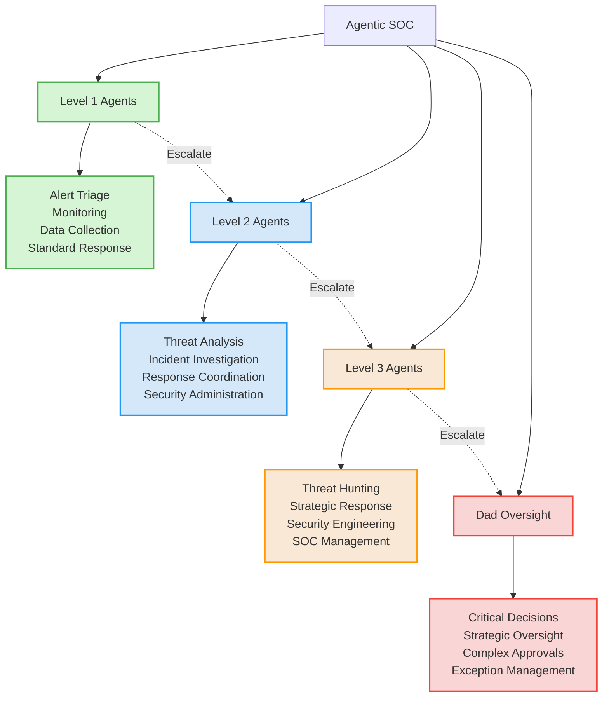
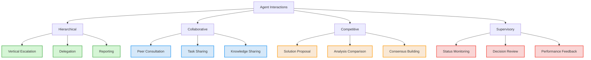
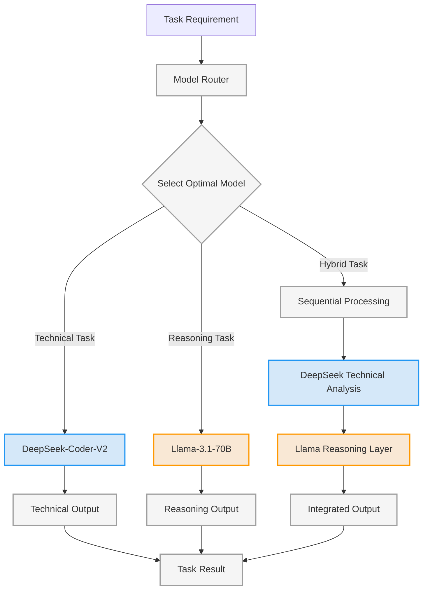
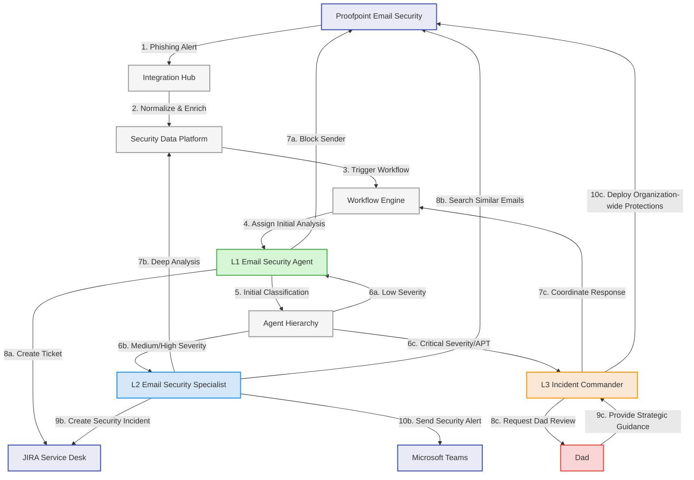
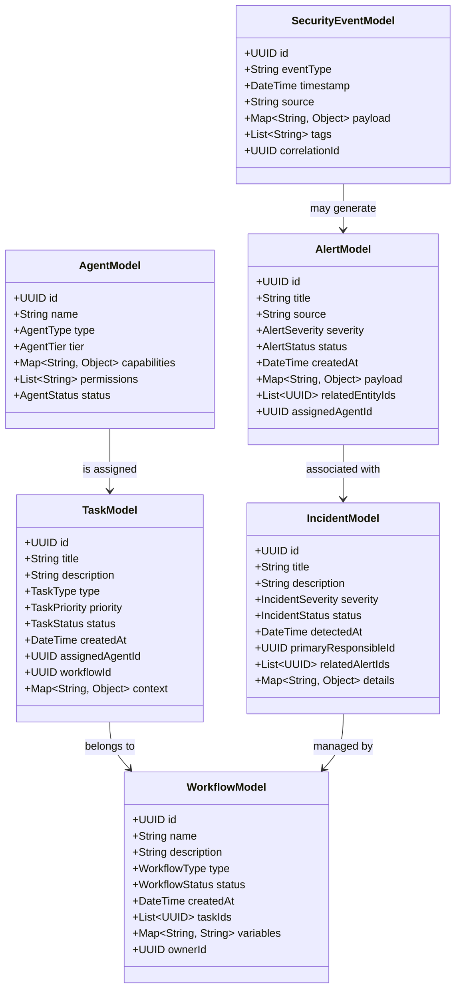
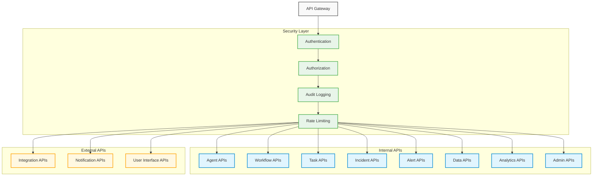
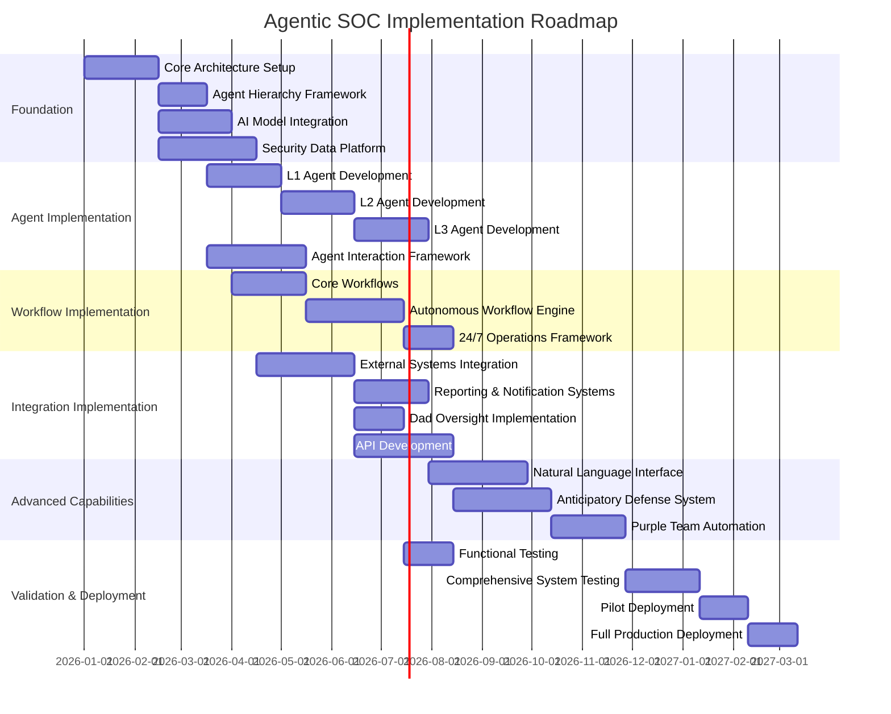

# Agentic SOC Architecture Blueprint

## Executive Summary

This document presents the complete architectural blueprint for transforming Cipher Guard into a fully agentic, autonomous Security Operations Center (SOC). The architecture enables Cipher Guard to replace Security Analyst Levels 1-3 (and most of Level 4) with zero human touch for 90% of daily operations, while maintaining strategic human oversight (Dad) for critical decisions and operations.

The Agentic SOC architecture implements a hierarchical agent system with specialized security capabilities backed by advanced AI models (DeepSeek-Coder-V2 and Llama-3.1-70B). The system provides 24/7 autonomous security operations across multiple security domains, with seamless workflow management, robust external system integrations, and comprehensive reporting capabilities.

This blueprint addresses all core use cases, including automated phishing response, autonomous threat detection and containment, vulnerability management, scheduled threat hunting, automated reporting, natural language command interfaces, and anticipatory defense capabilities.

## 1. Vision and Goals

### 1.1 Vision Statement

Transform Cipher Guard into an autonomous, AI-driven security operations center that delivers continuous, consistent, and comprehensive security protection with minimal human intervention while maintaining strategic human oversight for critical decisions.

### 1.2 Core Goals

1. **Autonomous Operations**: Replace Security Analyst Levels 1-3 (and most of 4) with zero human touch for 90% of daily operations
2. **Hierarchical Intelligence**: Implement a tiered agent structure that escalates appropriately to human oversight
3. **Specialized Expertise**: Deploy 50+ specialized security agents across security domains
4. **Continuous Protection**: Provide 24/7 security operations with consistent performance
5. **Adaptive Defense**: Develop anticipatory and proactive security capabilities
6. **Natural Interaction**: Enable intuitive natural language interaction for security operations
7. **Human Oversight**: Maintain appropriate human supervision for critical decisions and operations

## 2. High-Level Architecture

The Agentic SOC is built on a modular, service-oriented architecture with several integrated subsystems working together to deliver autonomous security operations.

```mermaid
graph TB
    classDef core fill:#f9d5e5,stroke:#d64161,stroke-width:2px
    classDef agents fill:#d5e8f9,stroke:#417cd6,stroke-width:2px
    classDef ai fill:#e8f5e9,stroke:#4caf50,stroke-width:2px
    classDef data fill:#fff8e1,stroke:#ff9800,stroke-width:2px
    classDef int fill:#e0f7fa,stroke:#00acc1,stroke-width:2px
    classDef ops fill:#f3e5f5,stroke:#9c27b0,stroke-width:2px

    AgenticSOC[Agentic SOC]
    
    subgraph Core Systems
        AgentHierarchy[Agent Hierarchy Manager]
        WorkflowEngine[Autonomous Workflow Engine]
        AIModels[AI Model Integration Framework]
        SecurityDataPlatform[Security Data Platform]
    end
    
    subgraph Agent Systems
        SpecializedAgents[Specialized Agents Pool]
        AgentInteraction[Agent Interaction Framework]
    end
    
    subgraph Intelligence Systems
        AnticipatoryDefense[Anticipatory Defense System]
        PurpleTeamAutomation[Purple Team Automation]
        ThreatIntelPlatform[Threat Intelligence Platform]
    end
    
    subgraph Operational Systems
        NLInterface[Natural Language Interface]
        DadOversight[Dad Oversight Bridge]
        ReportingSystem[Reporting & Notification Systems]
    end
    
    subgraph Integration Systems
        IntegrationHub[External Systems Integration Hub]
        APIGateway[API Gateway]
        AuthNAuthZ[Authentication & Authorization]
    end
    
    AgenticSOC --> Core Systems
    AgenticSOC --> Agent Systems
    AgenticSOC --> Intelligence Systems
    AgenticSOC --> Operational Systems
    AgenticSOC --> Integration Systems
    
    %% Core System Connections
    AgentHierarchy --- WorkflowEngine
    AgentHierarchy --- AIModels
    AgentHierarchy --- SecurityDataPlatform
    WorkflowEngine --- AIModels
    WorkflowEngine --- SecurityDataPlatform
    AIModels --- SecurityDataPlatform
    
    %% Agent System Connections
    AgentHierarchy --- SpecializedAgents
    AgentHierarchy --- AgentInteraction
    SpecializedAgents --- AgentInteraction
    
    %% Intelligence System Connections
    AnticipatoryDefense --- SecurityDataPlatform
    AnticipatoryDefense --- AIModels
    PurpleTeamAutomation --- AnticipatoryDefense
    ThreatIntelPlatform --- SecurityDataPlatform
    
    %% Operational System Connections
    NLInterface --- AgentHierarchy
    NLInterface --- AIModels
    DadOversight --- AgentHierarchy
    DadOversight --- WorkflowEngine
    ReportingSystem --- SecurityDataPlatform
    ReportingSystem --- AIModels
    
    %% Integration System Connections
    IntegrationHub --- SecurityDataPlatform
    IntegrationHub --- APIGateway
    APIGateway --- AuthNAuthZ
    
    class AgentHierarchy,WorkflowEngine,AIModels,SecurityDataPlatform core
    class SpecializedAgents,AgentInteraction agents
    class AnticipatoryDefense,PurpleTeamAutomation,ThreatIntelPlatform ai
    class NLInterface,DadOversight,ReportingSystem ops
    class IntegrationHub,APIGateway,AuthNAuthZ int
```

## 3. Core Architectural Components

| Component | Purpose | File Reference |
|-----------|---------|----------------|
| Agent Hierarchy Manager | Manages the hierarchical agent structure, escalation, and coordination between agent tiers | [component_diagrams.md](component_diagrams.md#2-agent-hierarchy-manager) |
| AI Model Integration Framework | Manages the coordinated use of DeepSeek-Coder-V2 and Llama-3.1-70B models | [component_diagrams.md](component_diagrams.md#3-ai-model-integration-framework) |
| Autonomous Workflow Engine | Orchestrates 24/7 security operations across agent tiers | [component_diagrams.md](component_diagrams.md#4-autonomous-workflow-engine) |
| Security Data Platform | Provides the data foundation for all security operations | [component_diagrams.md](component_diagrams.md#7-security-data-platform) |
| Natural Language Interface | Enables conversational interaction with the security system | [component_diagrams.md](component_diagrams.md#5-natural-language-interface) |
| External Systems Integration | Provides connectivity with security tools and enterprise systems | [external_systems_integration.md](external_systems_integration.md) |
| Anticipatory Defense System | Provides proactive, predictive security capabilities | [component_diagrams.md](component_diagrams.md#6-anticipatory-defense-system) |
| Reporting & Notification Systems | Manages all alerting, reporting, and communication | [reporting_notification_systems.md](reporting_notification_systems.md) |
| Dad Oversight Bridge | Facilitates human supervision of critical operations | [dad_oversight_components.md](dad_oversight_components.md) |

## 4. Agent Hierarchy 

The Agentic SOC implements a tiered agent approach that mimics the traditional SOC analyst hierarchy with appropriate escalation paths.

### 4.1 Agent Tier Structure



### 4.2 Agent Pool Overview

The Agentic SOC deploys 50+ specialized agents across multiple security domains. Each agent has specific capabilities, expertise, and operational parameters.

| Category | Agent Types | Tier Placement | 
|----------|-------------|----------------|
| Email Security | Email Security Agent, Phishing Analyst, Email Response Agent | L1, L2, L3 |
| Endpoint Security | Endpoint Monitor, Malware Analyst, Remediation Agent | L1, L2, L3 |
| Network Security | Network Monitor, Traffic Analyst, Network Response Agent | L1, L2, L3 |
| Threat Intelligence | Intel Collector, Intel Analyst, Strategic Intel Agent | L1, L2, L3 |
| Vulnerability Management | Vuln Scanner, Vuln Analyst, Patch Manager | L1, L2, L3 |
| Incident Response | Alert Triage, IR Coordinator, IR Manager | L1, L2, L3 |
| Threat Hunting | Data Explorer, Hunt Analyst, Hunt Manager | L1, L2, L3 |
| Security Engineering | Rule Creator, Content Developer, Security Architect | L2, L3 |
| Reporting | Report Generator, Metrics Analyst, Executive Reporter | L1, L2, L3 |
| Purple Team | Attack Simulator, Defense Tester, Purple Team Manager | L2, L3 |
| Security Admin | Config Manager, Access Controller, Admin Manager | L2, L3 |
| SOAR | Playbook Runner, Automation Developer, SOAR Manager | L1, L2, L3 |
| Compliance | Control Checker, Compliance Analyst, Compliance Manager | L1, L2, L3 |

Detailed agent specifications are available in the [hierarchical_agent_structure.md](hierarchical_agent_structure.md) document.

### 4.3 Agent Interaction Patterns

Agents interact through defined patterns to collaborate, escalate issues, and coordinate responses.



Detailed agent interaction patterns are available in the [agent_interaction_flows.md](agent_interaction_flows.md) document.

## 5. AI Model Integration

The Agentic SOC leverages two advanced AI models, each specialized for different tasks:

### 5.1 Model Capabilities

| Model | Primary Responsibilities | Strengths |
|-------|--------------------------|-----------|
| DeepSeek-Coder-V2 | Code analysis, Technical parsing, Structured data processing, Configuration management | Technical precision, Code understanding, Structured thinking |
| Llama-3.1-70B | Natural language understanding, Strategic reasoning, Context comprehension, Human communication | Reasoning capabilities, Contextual understanding, Communication skills |

### 5.2 Model Orchestration



Detailed AI model integration architecture is available in the [component_diagrams.md](component_diagrams.md#3-ai-model-integration-framework) document.

## 6. Autonomous Workflow Engine

The Autonomous Workflow Engine enables continuous 24/7 operation with seamless task management, shift handovers, and exception handling.

### 6.1 Workflow Components

```mermaid
graph TD
    classDef core fill:#f9d5e5,stroke:#d64161,stroke-width:2px;
    classDef workflow fill:#d5e8f9,stroke:#417cd6,stroke-width:2px;
    classDef task fill:#e8f9d5,stroke:#7cd641,stroke-width:2px;
    classDef time fill:#f9e8d5,stroke:#d6a041,stroke-width:2px;
    classDef monitoring fill:#e5d5f9,stroke:#8141d6,stroke-width:2px;

    AWE[Autonomous Workflow Engine]
    AWE --> WorkflowManager[Workflow Manager]
    AWE --> TaskOrchestrator[Task Orchestrator]
    AWE --> TemporalManager[Temporal Manager]
    AWE --> OperationalMonitor[Operational Monitor]
    
    WorkflowManager --> WorkflowRegistry[Workflow Registry]
    WorkflowManager --> WorkflowDesigner[Workflow Designer]
    WorkflowManager --> WorkflowExecutor[Workflow Executor]
    WorkflowManager --> StateManager[State Manager]
    
    TaskOrchestrator --> TaskRegistry[Task Registry]
    TaskOrchestrator --> TaskScheduler[Task Scheduler]
    TaskOrchestrator --> DependencyResolver[Dependency Resolver]
    TaskOrchestrator --> TaskDispatcher[Task Dispatcher]
    
    TemporalManager --> ShiftManager[Shift Manager]
    TemporalManager --> HandoverCoordinator[Handover Coordinator]
    TemporalManager --> SchedulingEngine[Scheduling Engine]
    TemporalManager --> TemporalAwareness[Temporal Awareness]
    
    OperationalMonitor --> ActivityTracker[Activity Tracker]
    OperationalMonitor --> PerformanceAnalyzer[Performance Analyzer]
    OperationalMonitor --> ComplianceVerifier[Compliance Verifier]
    OperationalMonitor --> AnomalyDetector[Anomaly Detector]
    
    WorkflowRegistry --> SecurityWorkflows[Security Workflows]
    WorkflowRegistry --> MaintenanceWorkflows[Maintenance Workflows]
    WorkflowRegistry --> IncidentWorkflows[Incident Workflows]
    WorkflowRegistry --> ComplianceWorkflows[Compliance Workflows]
    
    class AWE,WorkflowManager,WorkflowRegistry,WorkflowDesigner,WorkflowExecutor,StateManager core
    class SecurityWorkflows,MaintenanceWorkflows,IncidentWorkflows,ComplianceWorkflows workflow
    class TaskOrchestrator,TaskRegistry,TaskScheduler,DependencyResolver,TaskDispatcher task
    class TemporalManager,ShiftManager,HandoverCoordinator,SchedulingEngine,TemporalAwareness time
    class OperationalMonitor,ActivityTracker,PerformanceAnalyzer,ComplianceVerifier,AnomalyDetector monitoring
```



Detailed workflow engine architecture is available in the [component_diagrams.md](component_diagrams.md#4-autonomous-workflow-engine) document.

### 6.2 24/7 Operational Model

The system implements a continuous operations model that ensures seamless security coverage:

1. **Shift Management**: Virtual shifts with defined operational parameters and coverage responsibility
2. **Handover Mechanism**: Formal process for transferring context and active tasks between operational periods
3. **Continuous Monitoring**: Persistent security monitoring independent of shift boundaries
4. **Temporal Awareness**: Time-based decision making and prioritization based on operational context
5. **Exception Handling**: Automated processes for managing unexpected situations or resource constraints

## 7. External System Integrations

The Agentic SOC integrates with multiple external systems to provide comprehensive security capabilities.

### 7.1 Integration Architecture

```mermaid
graph TB
    classDef integration fill:#f9ebeb,stroke:#d13438,stroke-width:2px
    classDef connector fill:#ebf9eb,stroke:#34d138,stroke-width:2px
    classDef data fill:#ebf2f9,stroke:#3485d1,stroke-width:2px
    classDef security fill:#f9f7eb,stroke:#d1b834,stroke-width:2px
    classDef monitor fill:#f2ebf9,stroke:#8434d1,stroke-width:2px
    classDef adapt fill:#ebf9f7,stroke:#34d1b8,stroke-width:2px
    
    %% Main Components
    ESI[External Systems Integration]
    ESI --> IESS[Integration Engine & Service Suite]
    
    subgraph Integration Engine
        IntegrationHub[Integration Hub]
        APIGateway[API Gateway]
        DataTransformation[Data Transformation]
        CredentialVault[Credential Vault]
    end
    
    subgraph Connector Framework
        ConnectorCatalog[Connector Catalog]
        CustomConnectors[Custom Connectors]
        ConnectorManagement[Connector Management]
        ConnectorHealthMonitor[Connector Health Monitor]
    end
    
    subgraph Data Exchange
        StreamingEngine[Streaming Engine]
        BatchProcessor[Batch Processor]
        TransactionManager[Transaction Manager]
        SchemaRegistry[Schema Registry]
    end
    
    subgraph Security Controls
        AuthService[Authentication Service]
        AuthZService[Authorization Service]
        CryptoServices[Cryptographic Services]
        SecAudit[Security Auditing]
    end
    
    subgraph Monitoring & Management
        HealthMonitor[Health Monitor]
        PerformanceMetrics[Performance Metrics]
        AlertManager[Alert Manager]
        ConfigManager[Configuration Manager]
    end
    
    %% Connections from ESI
    IESS --> IntegrationHub
    IESS --> ConnectorCatalog
    IESS --> StreamingEngine
    IESS --> AuthService
    IESS --> HealthMonitor
    
    %% Integration Engine
    IntegrationHub --> APIGateway
    IntegrationHub --> DataTransformation
    IntegrationHub --> CredentialVault
    
    %% Connector Framework
    ConnectorCatalog --> CustomConnectors
    ConnectorCatalog --> ConnectorManagement
    ConnectorCatalog --> ConnectorHealthMonitor
    
    %% Apply classes
    class IntegrationHub,APIGateway,DataTransformation,CredentialVault integration
    class ConnectorCatalog,CustomConnectors,ConnectorManagement,ConnectorHealthMonitor connector
    class StreamingEngine,BatchProcessor,TransactionManager,SchemaRegistry data
    class AuthService,AuthZService,CryptoServices,SecAudit security
    class HealthMonitor,PerformanceMetrics,AlertManager,ConfigManager monitor
```



### 7.2 Integrated Systems

| System | Integration Type | Purpose |
|--------|------------------|---------|
| Proofpoint | Bidirectional API | Email security operations |
| CrowdStrike/Falcon | Bidirectional API | Endpoint security operations |
| Rapid7 | Bidirectional API | Vulnerability management |
| JIRA | Bidirectional API | Ticket management |
| Microsoft Teams | Bidirectional API | Collaboration and notification |
| Obsidian | File System Integration | Knowledge management |

Detailed external system integration architecture is available in the [external_systems_integration.md](external_systems_integration.md) document.

## 8. Core Use Case Implementation

The Agentic SOC architecture supports all required security operations use cases with fully autonomous workflows.

### 8.1 Use Case Summary

| Use Case | Automation Level | Dad Touchpoints |
|----------|------------------|----------------|
| Automated Phishing Email Response | 95% autonomous | Critical phishing campaigns, novel techniques |
| Autonomous Threat Detection & Containment | 90% autonomous | Critical system containment, novel threats |
| Vulnerability Management | 85% autonomous | Critical patches, emergency remediation |
| Scheduled Threat Hunting | 80% autonomous | Hunt strategy approval, critical findings |
| Automated Reporting | 90% autonomous | Executive report review |
| Natural Language Command Interface | 85% autonomous | Privileged commands |
| Anticipatory Defense | 75% autonomous | Strategic defense changes |

Detailed use case implementations are available in the [core_use_cases.md](core_use_cases.md) document.

### 8.2 Example: Automated Phishing Response Workflow



## 9. Data Architecture

The Agentic SOC is built on a robust data architecture that supports security operations, analytics, and decision-making.

### 9.1 Data Model Overview



Detailed data models are available in the [data_models.md](data_models.md) document.

### A2 Storage Architecture

The Agentic SOC implements a multi-tiered storage architecture that balances performance, cost, and retention requirements:

| Tier | Description | Data Types | Access Pattern | Retention |
|------|-------------|------------|---------------|-----------|
| Hot Storage | High-performance, immediate access | Active incidents, Recent alerts, Current tasks | High read/write, Low latency | Short (days to weeks) |
| Warm Storage | Balanced performance and cost | Recent historical data, Solved incidents, Completed tasks | Medium read, Low write | Medium (weeks to months) |
| Cold Storage | Cost-effective long-term storage | Historical data, Closed cases, Audit logs | Low read, Very low write | Long (months to years) |
| Archive | Compliance and reference storage | Historical records, Compliance evidence | Very low read, No write | Very long (years) |

## 10. API Specifications

The Agentic SOC exposes comprehensive APIs for integration, extension, and interaction with the system.

### 10.1 API Architecture



Detailed API specifications are available in the [api_specifications.md](api_specifications.md) document.

### 10.2 API Protocols

| Protocol | Use Cases | Implementation |
|----------|-----------|----------------|
| REST | Standard CRUD operations | HTTP, JSON, resource-based |
| GraphQL | Complex data queries | Schema-based, query language |
| WebSocket | Real-time streaming | Persistent connections, event-based |
| gRPC | High-performance internal calls | Binary protocol, service definitions |
| Webhook | Push notifications | HTTP callbacks, event delivery |
| SSE | Server-sent events | One-way event streaming |

## 11. Dad Oversight Mechanism

The Dad Oversight Mechanism ensures appropriate human supervision for critical security operations.

### 11.1 Oversight Architecture

```mermaid
graph TD
    classDef dad fill:#f9d5d5,stroke:#f44336,stroke-width:2px
    classDef awareness fill:#ede7f6,stroke:#673ab7,stroke-width:2px
    classDef action fill:#e3f2fd,stroke:#2196f3,stroke-width:2px
    classDef guidance fill:#e8f5e9,stroke:#4caf50,stroke-width:2px
    classDef feedback fill:#fff3e0,stroke:#ff9800,stroke-width:2px

    DOM[Dad Oversight Mechanism]
    
    DOM --> SA[Situational Awareness]
    DOM --> DM[Decision Management]
    DOM --> IM[Intervention Mechanisms]
    DOM --> SG[Strategic Guidance]
    
    SA --> SACM[Comprehensive Monitoring]
    SA --> SASV[Security Visualization]
    SA --> SADA[Digest & Alerts]
    SA --> SAPR[Priority Routing]
    
    DM --> DMDC[Decision Consultation]
    DM --> DMVA[Verification & Approval]
    DM --> DMPP[Policy & Precedent]
    DM --> DMRM[Risk Management]
    
    IM --> IMEM[Emergency Mode]
    IM --> IMDO[Direct Operation]
    IM --> IMPC[Process Control]
    IM --> IMOR[Override Capability]
    
    SG --> SGSP[Strategic Planning]
    SG --> SGKM[Knowledge Management]
    SG --> SGTD[Threat Direction]
    SG --> SGPE[Performance Evaluation]
    
    class DOM,SA,DM,IM,SG dad
    class SACM,SASV,SADA,SAPR awareness
    class DMDC,DMVA,DMPP,DMRM action
    class IMEM,IMDO,IMPC,IMOR guidance
    class SGSP,SGKM,SGTD,SGPE feedback
```



Detailed Dad Oversight specification is available in the [dad_oversight_components.md](dad_oversight_components.md) document.

### 11.2 Oversight Touchpoints

| Component | Oversight Requirement | Dad Actions |
|-----------|------------------------|------------|
| Incident Response | Critical incidents, Novel attack vectors | Approve response strategy, Review unusual incidents |
| Threat Containment | Critical system isolation, Widespread impact | Authorize critical containment, Review containment scope |
| Vulnerability Management | Emergency patching, Critical system changes | Approve critical system patches, Review unusual fixes |
| Threat Hunting | New hunting hypotheses, Critical findings | Review hunt strategy, Assess critical findings |
| Reporting | Executive-level reports | Review and approve executive communications |
| Security Changes | Policy modifications, Rule changes | Approve policy updates, Review significant changes |
| Anticipatory Defense | Predicted critical threats | Review predictions, Approve proactive measures |

## 12. Implementation Roadmap

The Agentic SOC implementation follows a phased approach to ensure controlled deployment and validation.

### 12.1 Implementation Phases



### 12.2 Critical Success Factors

1. **Component Independence**: Modular architecture allows parallel development and deployment
2. **Continuous Testing**: Ongoing validation throughout development process
3. **Incremental Capability**: Progressive increase in autonomous capabilities
4. **Supervised Operation**: Transitional period with heightened human oversight
5. **Feedback Incorporation**: Continuous improvement based on operational experience
6. **Training Focus**: Focus on Dad oversight skills for effective supervision

## 13. Operational Considerations

### 13.1 Performance Requirements

| Component | Performance Metric | Requirement |
|-----------|-------------------|-------------|
| Alert Processing | Processing Time | <30 seconds for 95% of alerts |
| Agent Response | Response Initiation | <60 seconds for L1 agent tasks |
| Incident Management | Time to Containment | <15 minutes for critical incidents |
| System Throughput | Peak Alert Volume | >10,000 events per minute |
| AI Model Inference | Response Time | <2 seconds for standard queries |
| Reporting | Report Generation | <5 minutes for standard reports |
| System Availability | Uptime | 99.99% availability |

### 13.2 Scalability Architecture

1. **Horizontal Scaling**: Distributed component architecture for elastic scaling
2. **Load Balancing**: Intelligent workload distribution across components
3. **Resource Allocation**: Dynamic resource provisioning based on operational demands
4. **Throughput Management**: Rate limiting and queuing for peak demand periods
5. **Capacity Planning**: Proactive capacity forecasting based on operational trends

### 13.3 Security Measures

1. **Defense-in-Depth**: Multiple security layers protecting system components
2. **Least Privilege**: Minimal access permissions for all components
3. **Secure Communications**: Encrypted data exchange between all components
4. **Audit Logging**: Comprehensive activity logging for all security operations
5. **Integrity Protection**: Cryptographic verification of critical components
6. **Insider Threat Controls**: Monitoring for unusual agent behavior or actions

### 13.4 Resilience Features

1. **Fault Tolerance**: Graceful degradation during component failures
2. **High Availability**: Redundant components for critical functions
3. **Disaster Recovery**: Comprehensive backup and recovery capabilities
4. **Circuit Breakers**: Protection against cascading failures
5. **Self-Healing**: Automated recovery for common failure scenarios
6. **Operational Continuity**: Preserved functionality during partial system outages

## 14. Architecture Documentation Structure

The complete Agentic SOC architecture is documented across multiple specialized documents:

| Document | Purpose | Content |
|----------|---------|---------|
| [agentic_soc_architecture_blueprint.md](agentic_soc_architecture_blueprint.md) | Main architectural overview | Executive summary, high-level architecture, component overview |
| [hierarchical_agent_structure.md](hierarchical_agent_structure.md) | Agent hierarchy design | Agent tiers, specialized agents, responsibilities |
| [component_diagrams.md](component_diagrams.md) | Component architecture | Detailed component designs and interfaces |
| [agent_interaction_flows.md](agent_interaction_flows.md) | Agent collaboration | Interaction patterns and protocols |
| [data_models.md](data_models.md) | Data architecture | Data structures, relationships, storage |
| [external_systems_integration.md](external_systems_integration.md) | External integration | Connection with external security tools |
| [reporting_notification_systems.md](reporting_notification_systems.md) | Reporting framework | Reporting and notification capabilities |
| [api_specifications.md](api_specifications.md) | API documentation | API endpoints, methods, authentication |
| [dad_oversight_components.md](dad_oversight_components.md) | Human supervision | Dad oversight mechanisms and interfaces |
| [core_use_cases.md](core_use_cases.md) | Use case implementation | Detailed workflow for security operations |