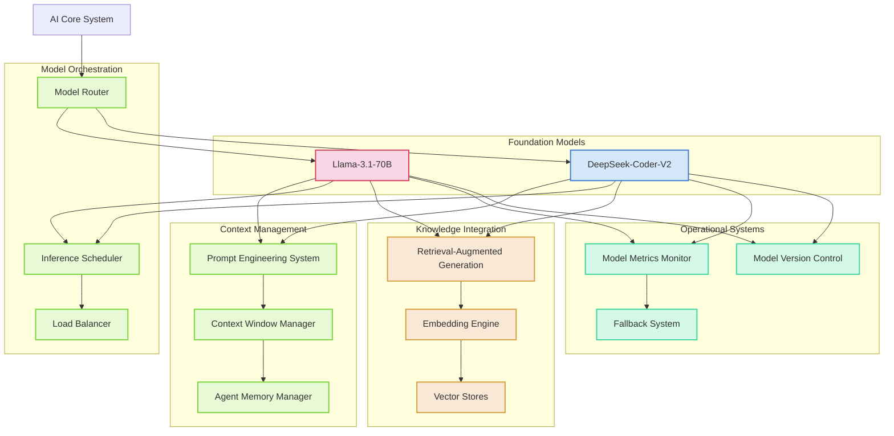
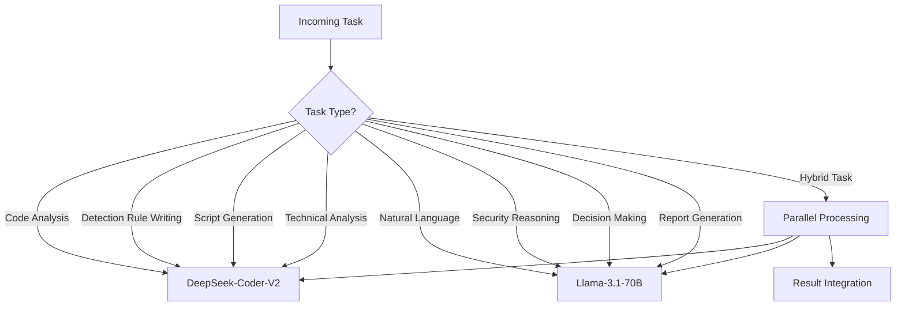
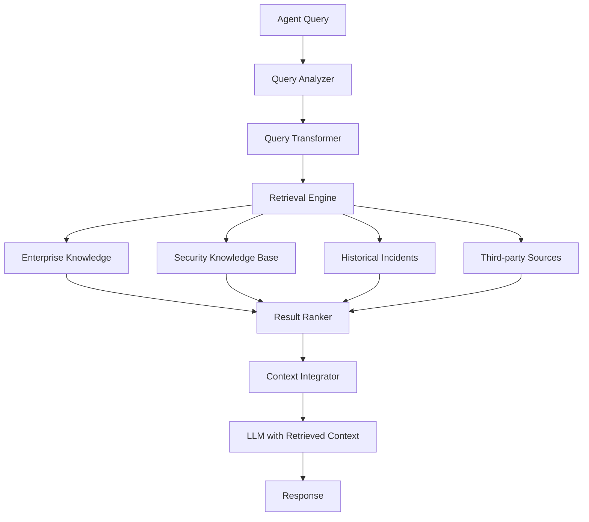
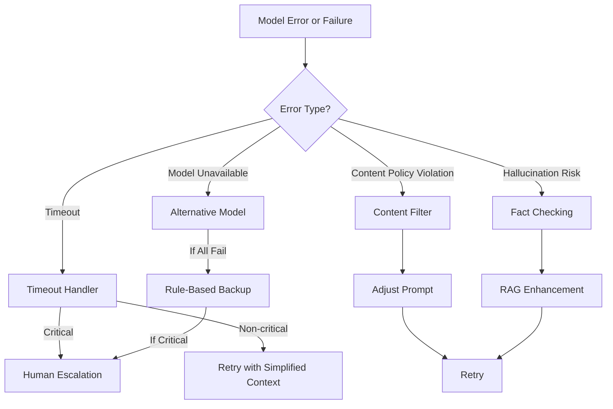
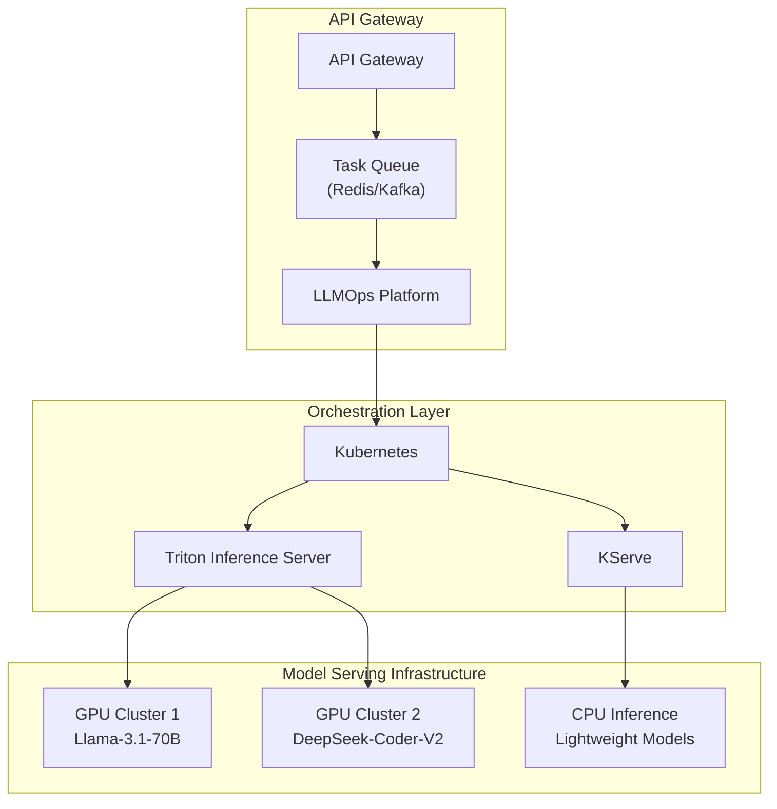
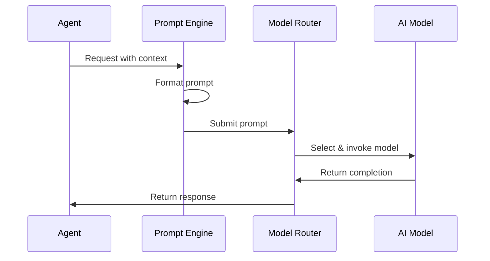
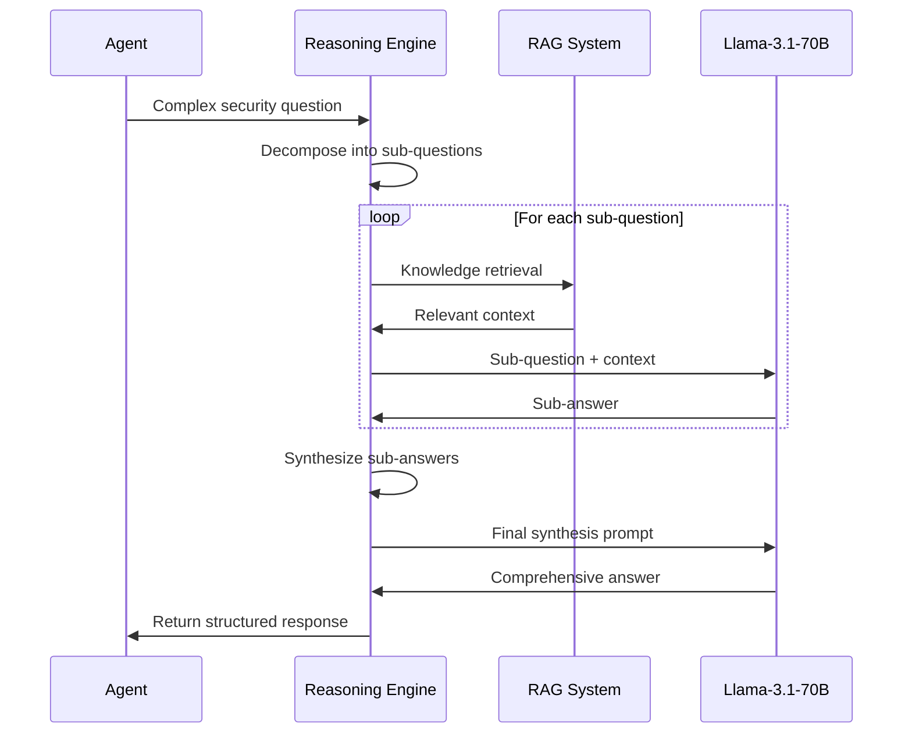
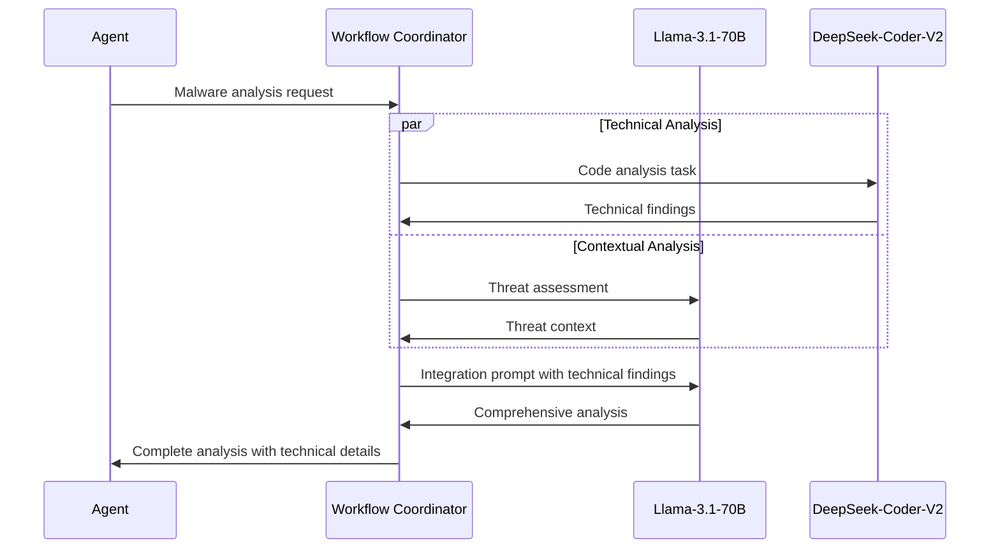
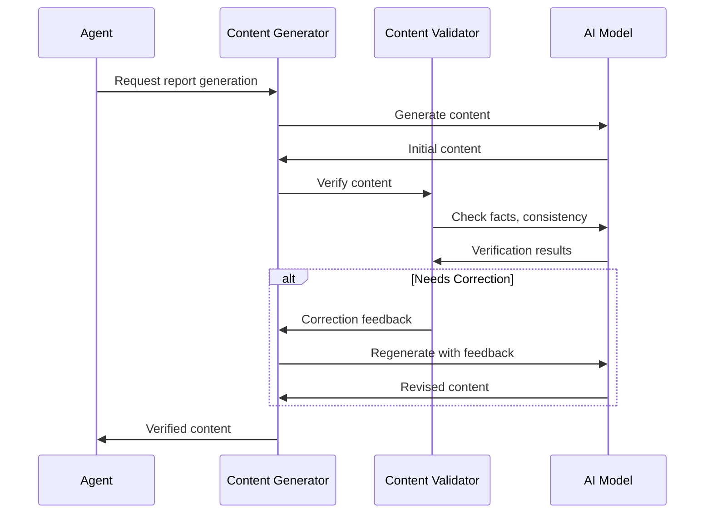

# AI Model Integration Architecture

## 1. Overview

The Agentic SOC's intelligence is powered by a dual-model AI architecture that integrates DeepSeek-Coder-V2 and Llama-3.1-70B. This architecture enables specialized capabilities for security operations while optimizing performance, resource utilization, and response quality.



## 2. Model Roles and Responsibilities

### 2.1 Llama-3.1-70B

**Primary Role**: General security reasoning, natural language understanding, and complex decision-making

**Core Capabilities**:
- Advanced reasoning for security analysis
- Natural language generation for reports and communications
- Contextual understanding of security incidents
- Threat actor behavior analysis
- Multi-step planning for incident response
- Risk assessment and prioritization
- Policy interpretation and application
- Strategic security decision support

**Agent Applications**:
- Powers L2 and L3 agent reasoning
- Drives the Natural Language Interface
- Enables complex decision-making for incident response
- Generates natural language content for reporting
- Performs threat intelligence analysis

### 2.2 DeepSeek-Coder-V2

**Primary Role**: Code and technical analysis, automation development, and detection engineering

**Core Capabilities**:
- Code vulnerability analysis
- Malware code understanding
- Detection rule development
- Automation script generation
- Network traffic pattern analysis
- Log query development
- System configuration analysis
- Technical documentation generation

**Agent Applications**:
- Powers malware analysis agents
- Enables detection rule development
- Supports forensic analysis of code artifacts
- Automates response actions through script generation
- Analyzes system configurations for vulnerabilities
- Interprets API specifications and technical documents

## 3. Model Orchestration

### 3.1 Model Router

The Model Router directs tasks to the appropriate AI model based on the task characteristics:



**Routing Logic**:
- Task classification based on content analysis
- Agent-based routing preferences
- Task history-based optimization
- Performance-based adaptive routing
- Resource availability consideration

### 3.2 Inference Scheduler

Manages the scheduling of inference jobs across available resources:

- Priority-based queue management
- Real-time vs. batch processing determination
- Critical task preemption
- Resource reservation for high-priority operations
- Dynamic allocation based on current load

### 3.3 Load Balancer

Optimizes resource utilization across GPU infrastructure:

- Model-specific resource allocation
- Multi-tenant GPU management
- Warm model instance maintenance
- Scaling decisions (horizontal/vertical)
- Failover orchestration

## 4. Context Management

### 4.1 Context Window Manager

Efficiently manages the context window for large language models:

- Dynamic context window sizing
- Context prioritization for token efficiency
- Sliding context windows for long conversations
- Summary generation for context compression
- Critical information highlighting

**Context Structure**:
```
[System Role] + [Agent Type Definition] + [Task Definition] +
[Relevant Knowledge Context] + [Historical Context] + 
[Current Conversation] + [Retrieved Information]
```

### 4.2 Prompt Engineering System

Standardized system for creating and managing prompts:

- Template management for agent types
- Dynamic prompt composition
- Few-shot example library
- Chain-of-thought scaffolding
- Task-specific instruction engineering
- A/B testing framework for prompt optimization

**Prompt Template Example (Incident Analysis)**:
```
You are a Level 2 Security Incident Analyst Agent with expertise in 
{expertise_domains}. 

Your task is to analyze the following security alert:
{alert_details}

Additional context:
{environment_context}

Recent related alerts:
{related_alerts}

Please reason through this alert step by step:
1. Determine if this is a true positive or false positive
2. Identify the potential impact
3. Recommend immediate actions
4. Suggest next investigative steps

Previous similar incidents:
{similar_incidents}
```

### 4.3 Agent Memory Manager

Manages persistent memory for agents across interactions:

- Short-term operational memory (current incident)
- Medium-term episodic memory (recent incidents handled)
- Long-term semantic memory (learned patterns and knowledge)
- Cross-agent memory sharing protocols
- Memory consolidation and summarization
- Privacy-preserving memory management

## 5. Knowledge Integration

### 5.1 Retrieval-Augmented Generation (RAG) System

Enhances model responses with retrieved information:



**RAG Components**:
- Query understanding and decomposition
- Hybrid retrieval (keyword + semantic)
- Multi-source knowledge integration
- Relevance scoring and result ranking
- Recursive retrieval for complex queries
- Source attribution and citation

### 5.2 Embedding Engine

Transforms security data into vector representations:

- Text-to-vector encoding
- Multi-modal embedding support
- Domain-specific fine-tuning
- Embedding versioning and migration
- Incremental embedding updates
- Similarity computation optimization

### 5.3 Vector Stores

Specialized vector databases for different security domains:

| Vector Store | Content Type | Update Frequency | Primary Users |
|--------------|--------------|------------------|---------------|
| Threat Intelligence | IOCs, TTPs, Threat Actors | Real-time | Threat Intel Agents |
| Incident Knowledge | Past incidents, resolutions | Daily | Incident Response Agents |
| Security Documentation | Policies, procedures, standards | Weekly | All Agents |
| Detection Knowledge | Rules, patterns, signatures | Daily | Detection Agents |
| Vulnerability Database | CVEs, exploits, patches | Daily | Vulnerability Agents |

## 6. Model Optimization Techniques

### 6.1 Inference Optimization

Methods to improve inference speed and efficiency:

- Quantization (8-bit, 4-bit where applicable)
- KV cache management
- Speculative decoding
- Adaptive batch sizing
- Response streaming
- Early stopping for specific use cases
- Model distillation for specialized tasks

### 6.2 Latency Management

Strategies for managing response times:

| Response Requirement | Optimization Approach |
|----------------------|------------------------|
| Real-time (<500ms) | Cached responses, Distilled models |
| Interactive (1-3s) | Optimized Llama inference, Streaming |
| Standard (3-5s) | Regular inference with optimizations |
| Detailed analysis (5-30s) | Full context window, Multi-step reasoning |
| Deep analysis (>30s) | Parallelized analysis, Complex RAG |

### 6.3 Token Economy

Efficient management of token usage:

- Proportional token allocation by agent tier
- Token budget monitoring
- Adaptive context sizing
- Compression techniques for inputs
- Output length optimization
- Token usage anomaly detection

## 7. Safeguards and Guardrails

### 7.1 Model Guardrails

Protection mechanisms to ensure safe and ethical operation:

- Prohibited action prevention
- Output filtering and sanitization
- Sensitive information detection
- Confidence thresholding for actions
- Ethical analysis for complex decisions
- Bias detection and mitigation

### 7.2 Fallback System

Multi-tier fallback strategy for system resilience:



**Fallback Levels**:
1. **Primary Response**: Main model with full context
2. **Simplified Retry**: Same model with reduced context
3. **Alternative Model**: Switch to backup model
4. **Pattern-Based Response**: Pre-defined response templates
5. **Human Escalation**: Route to Dad for human oversight

### 7.3 Model Evaluation Framework

Continuous assessment of model performance:

- Security-specific evaluation datasets
- Red team testing of model responses
- Autonomous adversarial testing
- Human feedback integration
- Agent peer review system
- Performance benchmarking against defined KPIs

## 8. Implementation Architecture

### 8.1 Deployment Architecture



### 8.2 Hardware Requirements

| Component | Specification | Quantity | Purpose |
|-----------|---------------|----------|---------|
| GPU Servers | 8x NVIDIA A100 80GB | 4 | Llama-3.1-70B inference |
| GPU Servers | 8x NVIDIA A100 40GB | 3 | DeepSeek-Coder-V2 inference |
| CPU Servers | 64-core, 512GB RAM | 8 | Embedding, preprocessing |
| Storage | NVMe SSD, 20TB | 16 | Vector stores, model weights |
| Network | 100Gbps InfiniBand | - | Low-latency interconnect |

### 8.3 Scaling Strategy

Approach to handling increased load and demand:

- Horizontal scaling for concurrent requests
- Vertical scaling for complex reasoning tasks
- Auto-scaling based on request queue depth
- Multi-region deployment for resilience
- Warm standby instances for critical functions
- Intelligent request batching

## 9. Agent-Model Interaction Patterns

### 9.1 Direct Inference

Simplest integration pattern for straightforward tasks:



### 9.2 Reasoning Workflow

Complex reasoning pattern for sophisticated tasks:



### 9.3 Collaborative Analysis

Pattern for leveraging both models' strengths:



### 9.4 Chain-of-Verification

Pattern to ensure high-quality outputs:



## 10. Model Security and Compliance

### 10.1 Data Protection

Measures to protect sensitive information:

- Input/output sanitization for PII/sensitive data
- Encrypted communication channels
- Model isolation from direct internet access
- Data minimization practices
- Ephemeral runtime environments
- Access control for model interaction

### 10.2 Model Governance

Framework for responsible AI management:

- Model card documentation
- Version control and change management
- Performance monitoring and alerting
- Regular security assessments
- Bias and fairness evaluations
- Explainability and transparency mechanisms

### 10.3 Compliance Integration

Alignment with regulatory and compliance requirements:

- Audit logging of all model interactions
- Decision justification records
- Human oversight protocols
- Responsible AI principles integration
- Regular compliance reviews
- Security-specific evaluation framework

## 11. Future Evolution

### 11.1 Model Upgrade Path

Strategy for incorporating new model versions:

- Canary testing for new model versions
- A/B testing for performance comparison
- Gradual rollout strategy
- Automated regression testing
- Performance benchmark comparisons
- Rollback capabilities

### 11.2 Advanced Capabilities

Roadmap for future AI capabilities:

- Multi-modal security data analysis
- Autonomous specialized fine-tuning
- Self-improving agent capabilities
- Enhanced cross-domain reasoning
- Adversarial robustness improvements
- Reduced latency for critical functions

### 11.3 Research Integration

Process for incorporating security AI research:

- Research evaluation pipeline
- Proof-of-concept testing framework
- Security impact assessment
- Performance improvement measurement
- Deployment risk analysis
- Knowledge transfer to production