# Anticipatory Defense and Purple Team Automation

## 1. Overview

The Anticipatory Defense and Purple Team Automation components provide proactive security capabilities that enable the Agentic SOC to predict, test against, and mitigate emerging threats before they can impact the organization. This system combines offensive security techniques with defensive measures to continuously validate and improve the organization's security posture.

```mermaid
graph TB
    classDef threat fill:#f9d5e5,stroke:#d64161,stroke-width:2px
    classDef attack fill:#d5e8f9,stroke:#417cd6,stroke-width:2px
    classDef defense fill:#e8f9d5,stroke:#7cd641,stroke-width:2px
    classDef validate fill:#f9e8d5,stroke:#d6a041,stroke-width:2px
    classDef intel fill:#d5f9e8,stroke:#41d6a0,stroke-width:2px
    classDef adaptation fill:#e5d5f9,stroke:#8141d6,stroke-width:2px
    
    %% Main Components
    ADPT["Anticipatory Defense & Purple Team"]
    
    subgraph "Threat Prediction System"
        ThreatForecasting["Threat Forecasting Engine"]
        EmergingThreatAnalysis["Emerging Threat Analysis"]
        AttackPrediction["Attack Prediction Models"]
        AdversaryEmulation["Adversary Emulation Framework"]
    end
    
    subgraph "Purple Team Automation"
        PurpleTeamOrchestrator["Purple Team Orchestrator"]
        SecurityTestEngine["Security Test Engine"]
        BreachSimulator["Breach Simulation System"]
        ScenarioGenerator["Scenario Generator"]
    end
    
    subgraph "Defensive Validation"
        DefenseValidator["Defense Validation Engine"]
        ControlTester["Security Control Tester"]
        CoverageAnalyzer["Coverage Analyzer"]
        DetectionTuner["Detection Tuner"]
    end
    
    subgraph "Mitigation Automation"
        MitigationEngine["Mitigation Engine"]
        CompensatingControlManager["Compensating Control Manager"]
        DefenseRecommender["Defense Recommender"]
        SecurityHardener["Security Hardener"]
    end
    
    subgraph "Intelligence Integration"
        ThreatIntelAggregator["Threat Intel Aggregator"]
        VulnerabilityMonitor["Vulnerability Monitor"]
        ExploitTracker["Exploit Tracker"]
        TTDForecaster["Time-to-Detection Forecaster"]
    end
    
    subgraph "Adaptation Systems"
        AdaptiveTuning["Adaptive Tuning System"]
        DefenseEvolution["Defense Evolution Engine"]
        LessonsCaptured["Lessons Captured System"]
        SecurityPostureOptimizer["Security Posture Optimizer"]
    end
    
    %% Connections
    ADPT --> ThreatForecasting
    ADPT --> EmergingThreatAnalysis
    ADPT --> AttackPrediction
    ADPT --> AdversaryEmulation
    
    ADPT --> PurpleTeamOrchestrator
    ADPT --> SecurityTestEngine
    ADPT --> BreachSimulator
    ADPT --> ScenarioGenerator
    
    PurpleTeamOrchestrator --> DefenseValidator
    PurpleTeamOrchestrator --> ControlTester
    PurpleTeamOrchestrator --> CoverageAnalyzer
    PurpleTeamOrchestrator --> DetectionTuner
    
    DefenseValidator --> MitigationEngine
    ControlTester --> CompensatingControlManager
    CoverageAnalyzer --> DefenseRecommender
    DetectionTuner --> SecurityHardener
    
    ThreatForecasting --> ThreatIntelAggregator
    EmergingThreatAnalysis --> VulnerabilityMonitor
    AttackPrediction --> ExploitTracker
    AdversaryEmulation --> TTDForecaster
    
    MitigationEngine --> AdaptiveTuning
    CompensatingControlManager --> DefenseEvolution
    DefenseRecommender --> LessonsCaptured
    SecurityHardener --> SecurityPostureOptimizer
    
    %% Classes
    class ThreatForecasting,EmergingThreatAnalysis,AttackPrediction,AdversaryEmulation threat
    class PurpleTeamOrchestrator,SecurityTestEngine,BreachSimulator,ScenarioGenerator attack
    class DefenseValidator,ControlTester,CoverageAnalyzer,DetectionTuner defense
    class MitigationEngine,CompensatingControlManager,DefenseRecommender,SecurityHardener validate
    class ThreatIntelAggregator,VulnerabilityMonitor,ExploitTracker,TTDForecaster intel
    class AdaptiveTuning,DefenseEvolution,LessonsCaptured,SecurityPostureOptimizer adaptation
```

## 2. Threat Prediction System

The Threat Prediction System anticipates emerging threats and attack patterns before they materialize in the organization's environment.

### 2.1 Threat Forecasting Engine

**Responsibilities**:
- Analyze global threat landscape changes
- Predict emerging attack vectors
- Forecast likely attacker targets
- Track threat actor evolution
- Generate strategic early warnings
- Project threat trends and trajectories

**Key Features**:
- **Temporal Analysis**: Projects threat developments over time
- **Threat Modeling**: Maps potential attack vectors
- **Actor Behavior Prediction**: Anticipates attacker actions
- **Forecasting Confidence Scoring**: Quantifies prediction reliability
- **Strategic Warning System**: Provides advance notice of threats
- **Industry-specific Forecasting**: Tailors predictions to sector

### 2.2 Emerging Threat Analysis

**Responsibilities**:
- Monitor emerging threats across the landscape
- Assess new vulnerability exploitability
- Evaluate novel attack techniques
- Analyze zero-day vulnerability reports
- Track development of new attack tools
- Assess applicability to the organization

**Key Features**:
- **Zero-day Monitoring**: Tracks emerging vulnerability disclosures
- **Exploit Prediction**: Estimates likelihood of exploit development
- **Attack Chain Modeling**: Maps how emerging threats fit into attack chains
- **Proof-of-concept Tracking**: Monitors early exploit development
- **Relevancy Assessment**: Determines organizational impact
- **Time-to-Exploit Estimation**: Projects exploitation timeline

### 2.3 Attack Prediction Models

**Responsibilities**:
- Build predictive models of attacker behavior
- Create attack pattern forecasts
- Model attack progression sequences
- Simulate likely attack paths
- Predict attack timing and triggers
- Assess attack success probabilities

**Prediction Model Types**:

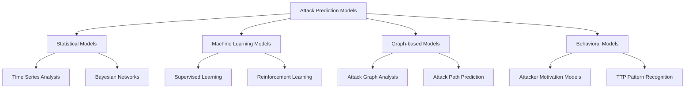
```mermaid
flowchart TD
    A[Attack Prediction Models] --> B[Statistical Models]
    A --> C[Machine Learning Models]
    A --> D[Graph-based Models]
    A --> E[Behavioral Models]
    
    B --> B1[Time Series Analysis]
    B --> B2[Bayesian Networks]
    
    C --> C1[Supervised Learning]
    C --> C2[Reinforcement Learning]
    
    D --> D1[Attack Graph Analysis]
    D --> D2[Attack Path Prediction]
    
    E --> E1[Attacker Motivation Models]
    E --> E2[TTP Pattern Recognition]
```

**Key Features**:
- **Multi-model Approach**: Combines various prediction techniques
- **Historical Pattern Analysis**: Learns from past attack data
- **Attacker Psychology Modeling**: Incorporates attacker motivation
- **Target Attractiveness Modeling**: Assesses target value
- **Contextual Environment Factors**: Considers environmental variables
- **Probability Distribution**: Provides likelihood ranges

### 2.4 Adversary Emulation Framework

**Responsibilities**:
- Emulate known threat actor behaviors
- Model attack techniques and procedures
- Create realistic threat actor profiles
- Generate adversary playbooks
- Evolve emulated behaviors over time
- Support realistic attack simulations

**Emulation Framework Components**:

| Component | Purpose | Implementation |
|-----------|---------|----------------|
| Actor Profiles | Model specific threat actors | Behavior, capability, and motivation profiles |
| TTP Library | Repository of techniques | MITRE ATT&CK-mapped technique implementations |
| Command & Control | Simulate C2 infrastructure | Realistic C2 channel emulation |
| Payload Generator | Create safe test payloads | Non-destructive payload emulation |
| Infrastructure Emulation | Replicate attack infrastructure | Realistic attack source modeling |

**Key Features**:
- **Actor-specific Emulation**: Replicates specific threat actors
- **Chain Execution**: Performs complete attack chains
- **Safe Execution**: Ensures non-destructive operation
- **Realistic Artifacts**: Generates authentic indicators
- **Behavior Randomization**: Varies attack patterns realistically
- **Progressive Evolution**: Emulates actor learning and adaptation

## 3. Purple Team Automation

The Purple Team Automation system combines offensive (red team) and defensive (blue team) capabilities to continuously validate security controls.

### 3.1 Purple Team Orchestrator

**Responsibilities**:
- Coordinate red and blue team activities
- Schedule automated security testing
- Manage test execution workflows
- Balance testing and operational needs
- Prioritize testing activities
- Track testing outcomes and metrics

**Orchestration Workflow**:

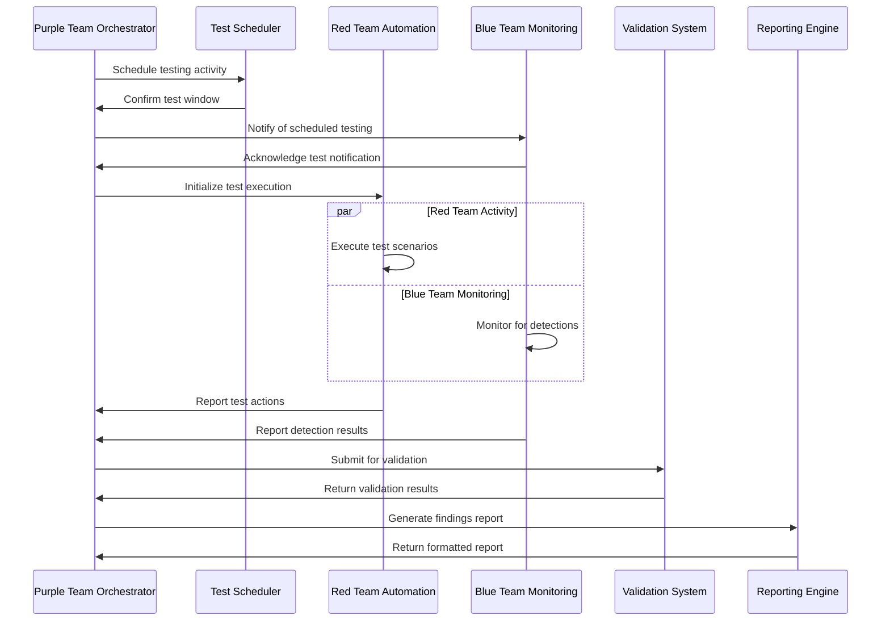
```mermaid
sequenceDiagram
    participant Orchestrator as Purple Team Orchestrator
    participant Scheduler as Test Scheduler
    participant Red as Red Team Automation
    participant Blue as Blue Team Monitoring
    participant Validator as Validation System
    participant Reporter as Reporting Engine
    
    Orchestrator->>Scheduler: Schedule testing activity
    Scheduler->>Orchestrator: Confirm test window
    
    Orchestrator->>Blue: Notify of scheduled testing
    Blue->>Orchestrator: Acknowledge test notification
    
    Orchestrator->>Red: Initialize test execution
    
    par Red Team Activity
        Red->>Red: Execute test scenarios
    and Blue Team Monitoring
        Blue->>Blue: Monitor for detections
    end
    
    Red->>Orchestrator: Report test actions
    Blue->>Orchestrator: Report detection results
    
    Orchestrator->>Validator: Submit for validation
    Validator->>Orchestrator: Return validation results
    
    Orchestrator->>Reporter: Generate findings report
    Reporter->>Orchestrator: Return formatted report
```

**Key Features**:
- **Balanced Orchestration**: Coordinates interplay of attack and defense
- **Scheduling Intelligence**: Optimizes testing schedules
- **Resource Management**: Allocates resources efficiently
- **Scenario Management**: Organizes test scenarios
- **Impact Mitigation**: Prevents operational disruption
- **Cross-team Coordination**: Synchronizes different team activities

### 3.2 Security Test Engine

**Responsibilities**:
- Execute security tests against systems
- Manage test case libraries
- Adapt tests to environment changes
- Ensure safe test execution
- Validate test results
- Track test coverage

**Test Categories**:

| Test Type | Purpose | Examples |
|-----------|---------|----------|
| Penetration Tests | Validate system security | Network penetration, web application testing |
| Vulnerability Validation | Verify vulnerability presence | Exploitation validation, patch testing |
| Detection Tests | Verify detection capabilities | Signature testing, behavior detection validation |
| Evasion Testing | Test defensive bypass resilience | Signature evasion, behavior obfuscation |
| Configuration Tests | Validate security configurations | Hardening verification, policy compliance |
| Resilience Tests | Test incident recovery | Service disruption recovery, backup validation |

**Key Features**:
- **Comprehensive Test Library**: Extensive security test collection
- **Safe Execution Framework**: Prevents operational damage
- **Adaptive Testing**: Adjusts to environment changes
- **Test Dependency Management**: Handles test prerequisites
- **Idempotent Design**: Consistent, repeatable tests
- **Progressive Difficulty**: Escalating test complexity

### 3.3 Breach Simulation System

**Responsibilities**:
- Simulate complete breach scenarios
- Model full attack chains
- Replicate sophisticated attack campaigns
- Test detection and response processes
- Evaluate security resilience
- Identify breach indicators

**Breach Simulation Process**:

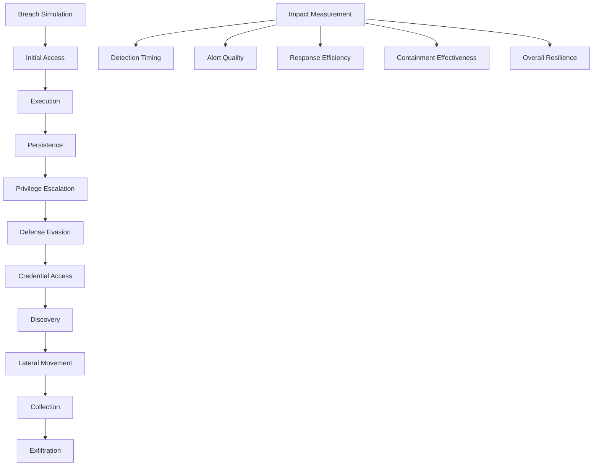
```mermaid
graph TD
    A[Breach Simulation] --> B[Initial Access]
    B --> C[Execution]
    C --> D[Persistence]
    D --> E[Privilege Escalation]
    E --> F[Defense Evasion]
    F --> G[Credential Access]
    G --> H[Discovery]
    H --> I[Lateral Movement]
    I --> J[Collection]
    J --> K[Exfiltration]
    
    IM[Impact Measurement] --> IM1[Detection Timing]
    IM --> IM2[Alert Quality]
    IM --> IM3[Response Efficiency]
    IM --> IM4[Containment Effectiveness]
    IM --> IM5[Overall Resilience]
```

**Key Features**:
- **End-to-End Scenarios**: Complete attack chain simulation
- **Safe Execution**: Non-destructive breach simulation
- **Progressive Disclosure**: Reveals simulation stages appropriately
- **Blue Team Integration**: Coordinates with defense teams
- **Custom Scenario Builder**: Creates tailored breach scenarios
- **Real-world Emulation**: Mirrors actual breach tactics

### 3.4 Scenario Generator

**Responsibilities**:
- Generate realistic test scenarios
- Create targeted test cases
- Develop scenarios based on threat intelligence
- Build customized scenarios for specific environments
- Generate variant attack scenarios
- Scale scenario complexity appropriately

**Scenario Generation Process**:

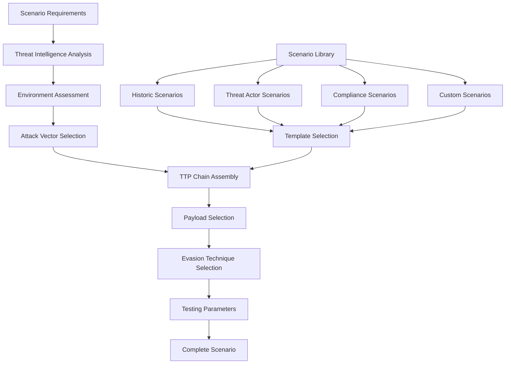
```mermaid
flowchart TD
    A[Scenario Requirements] --> B[Threat Intelligence Analysis]
    B --> C[Environment Assessment]
    C --> D[Attack Vector Selection]
    D --> E[TTP Chain Assembly]
    E --> F[Payload Selection]
    F --> G[Evasion Technique Selection]
    G --> H[Testing Parameters]
    H --> I[Complete Scenario]
    
    J[Scenario Library] --> K[Historic Scenarios]
    J --> L[Threat Actor Scenarios]
    J --> M[Compliance Scenarios]
    J --> N[Custom Scenarios]
    
    K & L & M & N --> O[Template Selection]
    O --> E
```

**Key Features**:
- **Intelligence-driven Generation**: Based on real threat data
- **Environmental Customization**: Adapts to specific environments
- **Sectoral Focus**: Industry-specific scenarios
- **Variant Generation**: Creates scenario mutations
- **Progressive Complexity**: Graduated difficulty levels
- **Goal-oriented Design**: Focused on specific testing objectives

## 4. Defensive Validation

The Defensive Validation system verifies the effectiveness of security controls and identifies gaps in defensive coverage.

### 4.1 Defense Validation Engine

**Responsibilities**:
- Validate security control effectiveness
- Verify defensive coverage
- Test detection capabilities
- Assess prevention mechanisms
- Validate response procedures
- Measure defense-in-depth implementation

**Validation Process**:

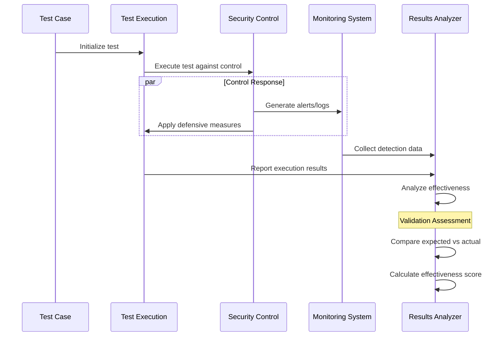
```mermaid
sequenceDiagram
    participant Test as Test Case
    participant Execution as Test Execution
    participant Control as Security Control
    participant Monitor as Monitoring System
    participant Results as Results Analyzer
    
    Test->>Execution: Initialize test
    Execution->>Control: Execute test against control
    
    par Control Response
        Control->>Monitor: Generate alerts/logs
        Control->>Execution: Apply defensive measures
    end
    
    Monitor->>Results: Collect detection data
    Execution->>Results: Report execution results
    Results->>Results: Analyze effectiveness
    
    Note over Results: Validation Assessment
    
    Results->>Results: Compare expected vs actual
    Results->>Results: Calculate effectiveness score
```

**Key Features**:
- **Comprehensive Validation**: Tests all defensive layers
- **Multi-vector Testing**: Tests varied attack vectors
- **Control Isolation**: Tests individual controls
- **Defense-in-depth Validation**: Tests layered defenses
- **Gap Identification**: Finds defensive coverage gaps
- **Effectiveness Measurement**: Quantifies control effectiveness

### 4.2 Security Control Tester

**Responsibilities**:
- Test individual security controls
- Verify control configuration
- Validate control operations
- Assess control bypass resistance
- Test control failure modes
- Verify control integration points

**Control Testing Matrix**:

| Control Category | Test Approach | Validation Criteria |
|------------------|---------------|---------------------|
| Prevention Controls | Attempt to bypass | Prevention success rate |
| Detection Controls | Generate trigger conditions | Detection accuracy, timing |
| Response Controls | Initiate response conditions | Response timeliness, appropriateness |
| Recovery Controls | Simulate recovery scenarios | Recovery time, completeness |
| Administrative Controls | Validate policy enforcement | Policy compliance rate |

**Key Features**:
- **Granular Testing**: Tests individual control components
- **Configuration Validation**: Verifies proper configuration
- **Performance Measurement**: Assesses control performance
- **Bypass Testing**: Tests evasion resistance
- **Failure Mode Analysis**: Examines degraded operation
- **Integration Validation**: Tests control interactions

### 4.3 Coverage Analyzer

**Responsibilities**:
- Analyze defensive coverage across the environment
- Map security controls to attack techniques
- Identify coverage gaps
- Assess control overlap
- Evaluate coverage depth
- Recommend coverage improvements

**Coverage Assessment Approach**:

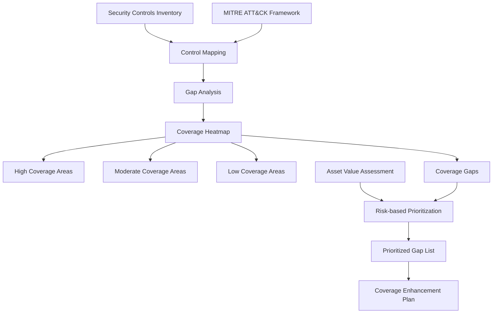
```mermaid
graph TD
    A[Security Controls Inventory] --> B[Control Mapping]
    C[MITRE ATT&CK Framework] --> B
    
    B --> D[Gap Analysis]
    D --> E[Coverage Heatmap]
    
    E --> F[High Coverage Areas]
    E --> G[Moderate Coverage Areas]
    E --> H[Low Coverage Areas]
    E --> I[Coverage Gaps]
    
    J[Asset Value Assessment] --> K[Risk-based Prioritization]
    I --> K
    
    K --> L[Prioritized Gap List]
    L --> M[Coverage Enhancement Plan]
```

**Key Features**:
- **MITRE ATT&CK Mapping**: Maps controls to ATT&CK matrix
- **Gap Visualization**: Visual representation of coverage gaps
- **Coverage Scoring**: Quantitative coverage assessment
- **Risk-based Analysis**: Prioritizes by risk impact
- **Multi-layer Mapping**: Analyzes coverage across layers
- **Trend Analysis**: Tracks coverage evolution over time

### 4.4 Detection Tuner

**Responsibilities**:
- Optimize detection mechanisms
- Tune detection rule parameters
- Reduce false positive rates
- Improve detection timing
- Enhance detection fidelity
- Adapt detection to evolving threats

**Tuning Methodology**:

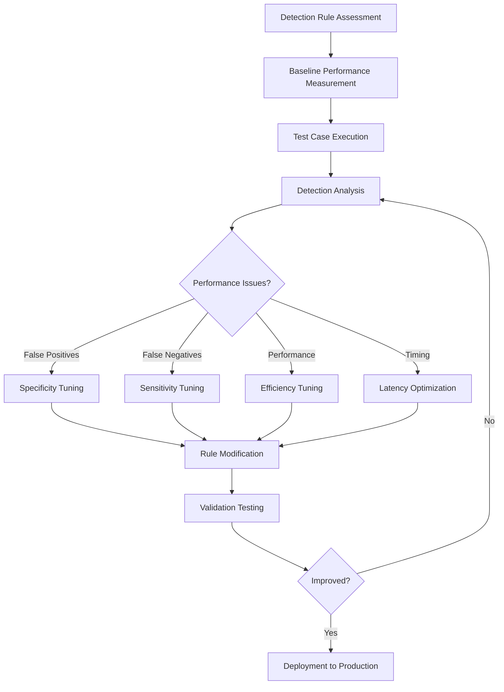
```mermaid
flowchart TD
    A[Detection Rule Assessment] --> B[Baseline Performance Measurement]
    B --> C[Test Case Execution]
    C --> D[Detection Analysis]
    
    D --> E{Performance Issues?}
    
    E -->|False Positives| F[Specificity Tuning]
    E -->|False Negatives| G[Sensitivity Tuning]
    E -->|Performance| H[Efficiency Tuning]
    E -->|Timing| I[Latency Optimization]
    
    F & G & H & I --> J[Rule Modification]
    J --> K[Validation Testing]
    K --> L{Improved?}
    
    L -->|Yes| M[Deployment to Production]
    L -->|No| D
```

**Key Features**:
- **Data-driven Tuning**: Uses test results for optimization
- **A/B Testing**: Compares rule variations
- **Performance Analysis**: Balances detection and performance
- **FP/FN Analysis**: Reduces false results
- **Detection Timing**: Improves detection speed
- **Detection Evolution**: Adapts to changing threats

## 5. Mitigation Automation

The Mitigation Automation system implements defensive improvements and security hardening based on findings.

### 5.1 Mitigation Engine

**Responsibilities**:
- Implement security mitigations
- Prioritize mitigation actions
- Orchestrate mitigation workflows
- Track mitigation effectiveness
- Manage mitigation approvals
- Handle mitigation dependencies

**Mitigation Process**:

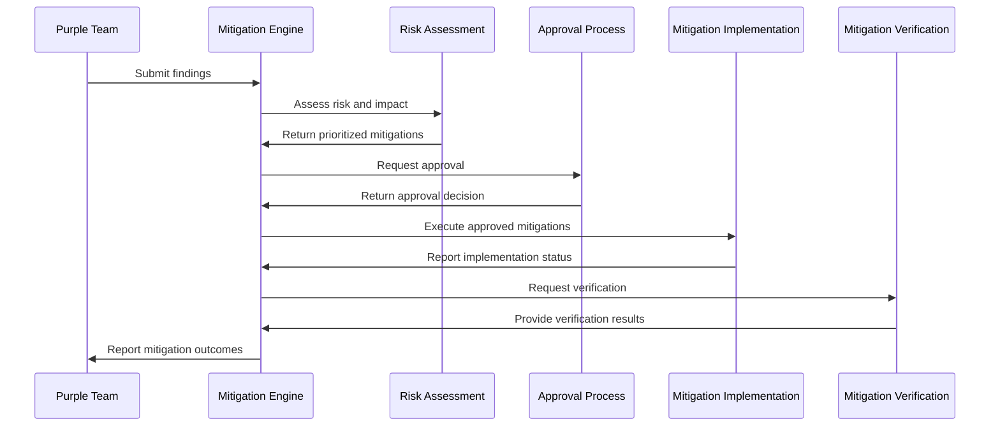
```mermaid
sequenceDiagram
    participant PT as Purple Team
    participant ME as Mitigation Engine
    participant RA as Risk Assessment
    participant AP as Approval Process
    participant MI as Mitigation Implementation
    participant MV as Mitigation Verification
    
    PT->>ME: Submit findings
    ME->>RA: Assess risk and impact
    RA->>ME: Return prioritized mitigations
    
    ME->>AP: Request approval
    AP->>ME: Return approval decision
    
    ME->>MI: Execute approved mitigations
    MI->>ME: Report implementation status
    
    ME->>MV: Request verification
    MV->>ME: Provide verification results
    
    ME->>PT: Report mitigation outcomes
```

**Key Features**:
- **Orchestrated Workflow**: Manages end-to-end mitigation
- **Risk-based Prioritization**: Focuses on highest risks
- **Automated Implementation**: Implements mitigations automatically
- **Change Management Integration**: Follows change processes
- **Dependency Resolution**: Handles prerequisite mitigations
- **Verification Framework**: Confirms mitigation effectiveness

### 5.2 Compensating Control Manager

**Responsibilities**:
- Implement temporary compensating controls
- Create stopgap security measures
- Manage compensating control lifecycle
- Track control dependencies
- Monitor control effectiveness
- Transition to permanent controls

**Compensating Control Framework**:

| Control Type | Implementation Approach | Lifecycle Stage |
|--------------|-------------------------|-----------------|
| Detection Enhancement | Increased monitoring | Immediate |
| Traffic Filtering | Network-level restrictions | Short-term |
| Access Restrictions | Temporary privilege reduction | Medium-term |
| Isolation Controls | System/network isolation | Emergency |
| Alternative Processes | Procedural workarounds | Transitional |
| Enhanced Validation | Additional verification steps | Supportive |

**Key Features**:
- **Rapid Deployment**: Quickly implements controls
- **Minimal Disruption**: Balances security and functionality
- **Effectiveness Monitoring**: Tracks control performance
- **Temporal Management**: Handles control lifecycle
- **Risk Acceptance**: Manages residual risk
- **Transition Planning**: Plans for permanent solutions

### 5.3 Defense Recommender

**Responsibilities**:
- Generate defensive improvement recommendations
- Prioritize recommendations by impact
- Develop comprehensive defense plans
- Customize recommendations by environment
- Create strategic defense roadmaps
- Track recommendation implementation

**Recommendation Framework**:

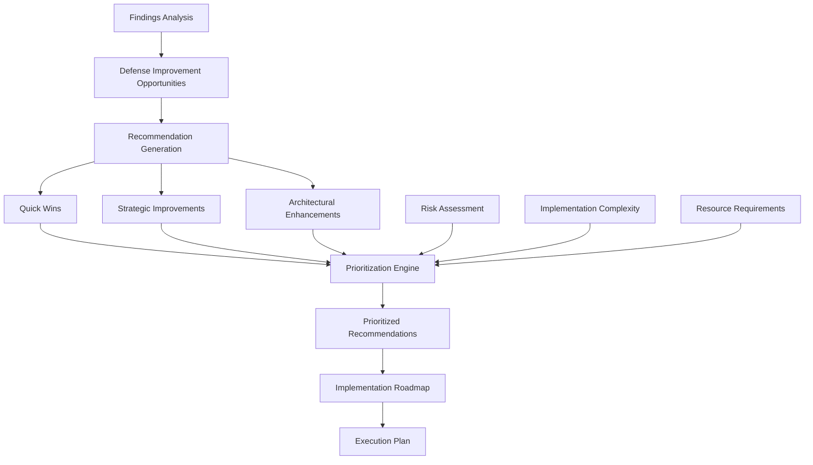
```mermaid
flowchart TD
    A[Findings Analysis] --> B[Defense Improvement Opportunities]
    B --> C[Recommendation Generation]
    
    C --> D[Quick Wins]
    C --> E[Strategic Improvements]
    C --> F[Architectural Enhancements]
    
    D & E & F --> G[Prioritization Engine]
    
    H[Risk Assessment] --> G
    I[Implementation Complexity] --> G
    J[Resource Requirements] --> G
    
    G --> K[Prioritized Recommendations]
    K --> L[Implementation Roadmap]
    L --> M[Execution Plan]
```

**Key Features**:
- **Multi-tier Recommendations**: Tactical to strategic suggestions
- **Contextualized Advice**: Environment-specific recommendations
- **Impact Assessment**: Projected security improvement
- **Implementation Guidance**: Detailed implementation steps
- **Resource Estimation**: Required resource projections
- **Alignment with Standards**: Maps to security frameworks

### 5.4 Security Hardener

**Responsibilities**:
- Implement system hardening measures
- Apply security configuration improvements
- Enforce security baselines
- Remediate configuration drift
- Apply secure defaults
- Validate hardening effectiveness

**Hardening Categories**:

| Hardening Category | Focus Areas | Implementation Approach |
|--------------------|-------------|-------------------------|
| OS Hardening | Services, permissions, features | Baseline enforcement |
| Network Hardening | Firewall rules, segmentation, protocols | Zero-trust implementation |
| Application Hardening | Configurations, permissions, features | Least-privilege enforcement |
| Cloud Hardening | IAM, services, networking | Security baseline automation |
| Container Hardening | Images, orchestration, runtime | Security policy enforcement |
| Account Hardening | Authentication, authorization, privileges | Principle of least privilege |

**Key Features**:
- **Automated Implementation**: Programmatically applies hardening
- **Baseline Enforcement**: Enforces security baselines
- **Drift Remediation**: Corrects security configuration drift
- **Validation Steps**: Verifies hardening effectiveness
- **Environment Adaptation**: Tailors to specific environments
- **Standards Alignment**: Aligns with security standards

## 6. Intelligence Integration

The Intelligence Integration system incorporates external and internal threat intelligence into the anticipatory defense process.

### 6.1 Threat Intel Aggregator

**Responsibilities**:
- Aggregate threat intelligence from multiple sources
- Normalize intelligence formats
- Deduplicate intelligence data
- Assess intelligence credibility
- Enrich raw intelligence
- Distribute processed intelligence

**Intelligence Sources**:

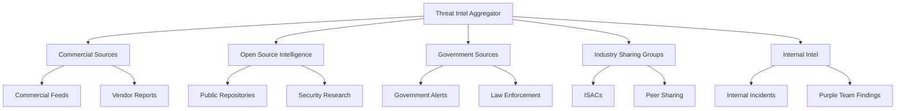
```mermaid
flowchart TD
    A[Threat Intel Aggregator] --> B[Commercial Sources]
    A --> C[Open Source Intelligence]
    A --> D[Government Sources]
    A --> E[Industry Sharing Groups]
    A --> F[Internal Intel]
    
    B --> B1[Commercial Feeds]
    B --> B2[Vendor Reports]
    
    C --> C1[Public Repositories]
    C --> C2[Security Research]
    
    D --> D1[Government Alerts]
    D --> D2[Law Enforcement]
    
    E --> E1[ISACs]
    E --> E2[Peer Sharing]
    
    F --> F1[Internal Incidents]
    F --> F2[Purple Team Findings]
```

**Key Features**:
- **Multi-source Aggregation**: Combines diverse sources
- **Format Standardization**: Normalizes varied formats
- **Quality Assessment**: Evaluates intelligence reliability
- **Contextual Enrichment**: Adds organizational context
- **Relevancy Filtering**: Focuses on applicable intelligence
- **Automated Distribution**: Routes to appropriate consumers

### 6.2 Vulnerability Monitor

**Responsibilities**:
- Track newly discovered vulnerabilities
- Assess vulnerability relevance to environment
- Prioritize vulnerabilities by risk
- Monitor vulnerability exploitation status
- Track vulnerability remediation
- Predict vulnerability impact

**Vulnerability Lifecycle Management**:

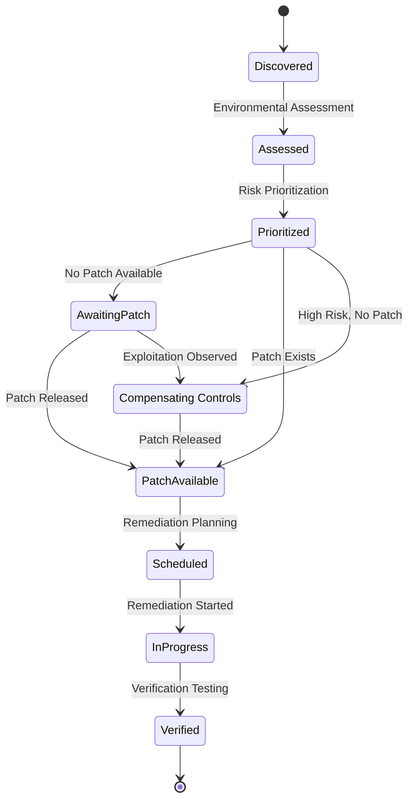
```mermaid
stateDiagram-v2
    [*] --> Discovered
    Discovered --> Assessed: Environmental Assessment
    Assessed --> Prioritized: Risk Prioritization
    
    Prioritized --> AwaitingPatch: No Patch Available
    AwaitingPatch --> PatchAvailable: Patch Released
    
    Prioritized --> PatchAvailable: Patch Exists
    PatchAvailable --> Scheduled: Remediation Planning
    Scheduled --> InProgress: Remediation Started
    InProgress --> Verified: Verification Testing
    Verified --> [*]
    
    state "Compensating Controls" as CC
    Prioritized --> CC: High Risk, No Patch
    AwaitingPatch --> CC: Exploitation Observed
    CC --> PatchAvailable: Patch Released
```

**Key Features**:
- **Real-time Monitoring**: Tracks vulnerability disclosures
- **Impact Analysis**: Assesses organizational relevance
- **Exploitation Tracking**: Monitors active exploitation
- **Risk-based Prioritization**: Ranks by organizational risk
- **Remediation Tracking**: Monitors fix implementation
- **SLA Management**: Tracks remediation timelines

### 6.3 Exploit Tracker

**Responsibilities**:
- Monitor exploit development for vulnerabilities
- Track exploit availability and maturity
- Assess exploit reliability and impact
- Monitor exploit usage in the wild
- Evaluate exploit sophistication
- Predict exploit development timelines

**Exploit Development Tracking**:

| Stage | Characteristics | Risk Level | Response |
|-------|----------------|------------|----------|
| Theoretical | Conceptual vulnerability | Low | Monitor |
| Proof-of-Concept | Basic demonstration | Moderate | Prepare |
| Functional | Working exploit, limited scope | High | Prioritize |
| Weaponized | Reliable, automated exploitation | Critical | Urgent Action |
| In-the-Wild | Active use by attackers | Severe | Immediate Response |

**Key Features**:
- **Development Monitoring**: Tracks exploit progression
- **Source Tracking**: Monitors exploit repositories
- **Maturity Assessment**: Evaluates exploit reliability
- **Usage Monitoring**: Tracks exploitation attempts
- **Weaponization Alerting**: Warns of weaponized exploits
- **Time-to-Exploit Metrics**: Measures development pace

### 6.4 Time-to-Detection Forecaster

**Responsibilities**:
- Predict detection timing for attack scenarios
- Estimate time-to-detection for specific TTPs
- Assess detection gaps by technique
- Model detection probability over time
- Predict alert fidelity by detection type
- Recommend detection improvements

**Time-to-Detection Modeling**:

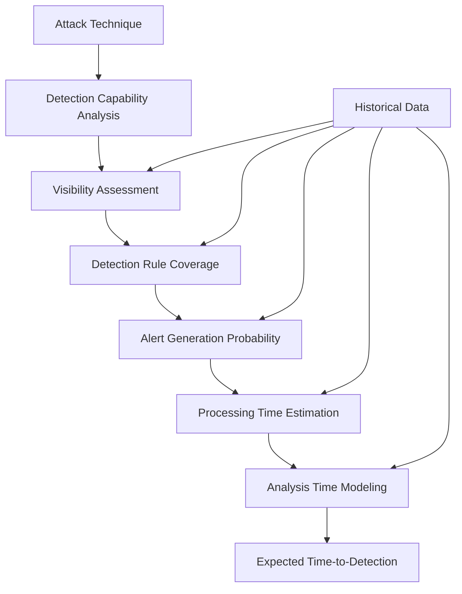
```mermaid
graph TD
    A[Attack Technique] --> B[Detection Capability Analysis]
    B --> C[Visibility Assessment]
    C --> D[Detection Rule Coverage]
    D --> E[Alert Generation Probability]
    E --> F[Processing Time Estimation]
    F --> G[Analysis Time Modeling]
    G --> H[Expected Time-to-Detection]
    
    I[Historical Data] --> C
    I --> D
    I --> E
    I --> F
    I --> G
```

**Key Features**:
- **Technique-specific Modeling**: Assesses each technique
- **Detection Probability**: Predicts likelihood of detection
- **Timing Prediction**: Estimates detection timeframes
- **Coverage Gap Analysis**: Identifies detection blind spots
- **Alert Quality Assessment**: Predicts alert fidelity
- **Improvement Modeling**: Projects enhancement impacts

## 7. Adaptation Systems

The Adaptation Systems enable the anticipatory defense capabilities to evolve and improve over time.

### 7.1 Adaptive Tuning System

**Responsibilities**:
- Automatically tune security controls
- Optimize detection rule parameters
- Adjust security thresholds
- Balance security and usability
- Reduce false positive rates
- Enhance detection coverage

**Adaptive Tuning Process**:

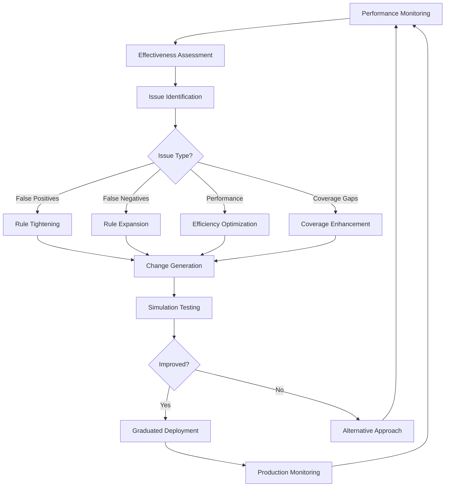
```mermaid
flowchart TD
    A[Performance Monitoring] --> B[Effectiveness Assessment]
    B --> C[Issue Identification]
    
    C --> D{Issue Type?}
    
    D -->|False Positives| E[Rule Tightening]
    D -->|False Negatives| F[Rule Expansion]
    D -->|Performance| G[Efficiency Optimization]
    D -->|Coverage Gaps| H[Coverage Enhancement]
    
    E & F & G & H --> I[Change Generation]
    I --> J[Simulation Testing]
    J --> K{Improved?}
    
    K -->|Yes| L[Graduated Deployment]
    K -->|No| M[Alternative Approach]
    
    L --> N[Production Monitoring]
    N --> A
    
    M --> A
```

**Key Features**:
- **Continuous Improvement**: Constantly refines controls
- **Data-driven Optimization**: Uses operational data
- **A/B Testing**: Tests alternative configurations
- **Graduated Deployment**: Progressive implementation
- **Performance Balancing**: Optimizes security and performance
- **Self-learning**: Improves from operational experience

### 7.2 Defense Evolution Engine

**Responsibilities**:
- Evolve defensive strategies over time
- Adapt to changing threat landscape
- Implement defensive innovations
- Transition legacy controls to modern approaches
- Develop novel defensive techniques
- Ensure defense relevancy

**Defense Evolution Framework**:

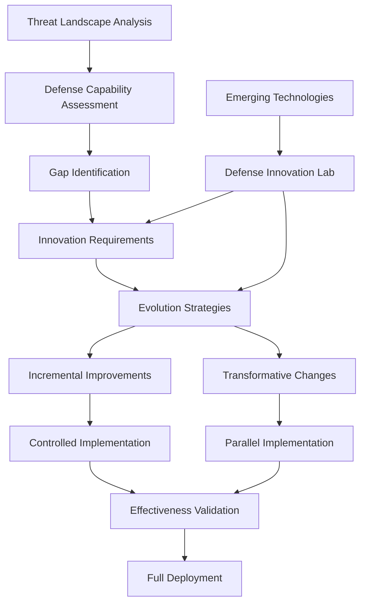
```mermaid
graph TD
    A[Threat Landscape Analysis] --> B[Defense Capability Assessment]
    B --> C[Gap Identification]
    C --> D[Innovation Requirements]
    
    D --> E[Evolution Strategies]
    E --> F[Incremental Improvements]
    E --> G[Transformative Changes]
    
    F --> H[Controlled Implementation]
    G --> I[Parallel Implementation]
    
    H & I --> J[Effectiveness Validation]
    J --> K[Full Deployment]
    
    L[Emerging Technologies] --> M[Defense Innovation Lab]
    M --> D
    M --> E
```

**Key Features**:
- **Forward-looking Strategy**: Anticipates defense needs
- **Innovation Integration**: Incorporates security innovations
- **Legacy Transition**: Manages defensive modernization
- **Novel Technique Development**: Creates new defenses
- **Defensive Adaptation**: Responds to threat evolution
- **Strategic Evolution**: Ensures long-term relevance

### 7.3 Lessons Captured System

**Responsibilities**:
- Capture security lessons learned
- Document effective defensive strategies
- Record attack detection patterns
- Catalog successful response techniques
- Maintain historical knowledge
- Share operational insights

**Knowledge Management Approach**:

| Knowledge Type | Capture Method | Application |
|----------------|----------------|-------------|
| Tactical Lessons | Incident reviews | Immediate improvements |
| Detection Patterns | Detection analysis | Rule optimization |
| Attacker TTP Insights | Attack analysis | Defense adaptation |
| Response Techniques | Response evaluation | Playbook enhancement |
| Strategic Insights | Long-term analysis | Strategic planning |
| Environmental Specifics | Contextual analysis | Tailored defenses |

**Key Features**:
- **Structured Capture**: Systematic knowledge acquisition
- **Pattern Identification**: Recognizes recurring themes
- **Contextual Documentation**: Preserves situational context
- **Knowledge Dissemination**: Shares insights appropriately
- **Continuous Learning**: Builds organizational memory
- **Operational Application**: Applies lessons to practice

### 7.4 Security Posture Optimizer

**Responsibilities**:
- Optimize overall security posture
- Balance security investments
- Maximize security ROI
- Eliminate redundant controls
- Fill strategic security gaps
- Ensure defense-in-depth implementation

**Optimization Methodology**:

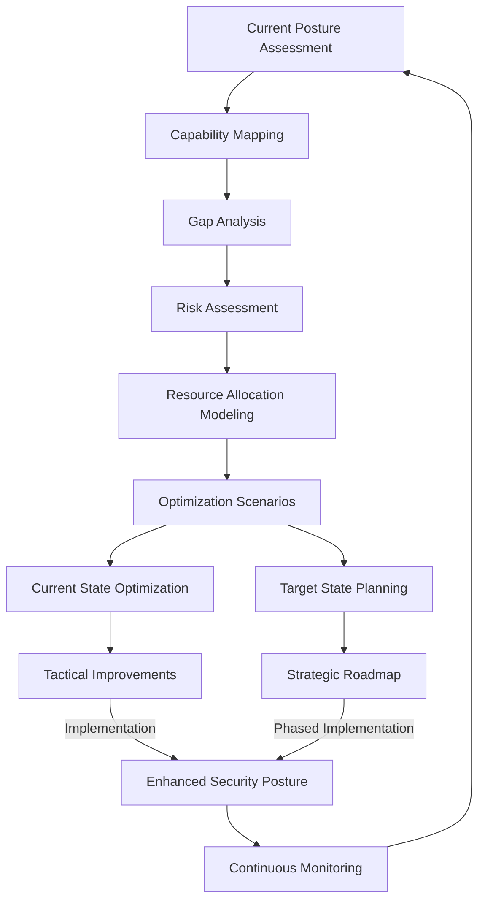
```mermaid
flowchart TD
    A[Current Posture Assessment] --> B[Capability Mapping]
    B --> C[Gap Analysis]
    C --> D[Risk Assessment]
    
    D --> E[Resource Allocation Modeling]
    E --> F[Optimization Scenarios]
    
    F --> G[Current State Optimization]
    F --> H[Target State Planning]
    
    G --> I[Tactical Improvements]
    H --> J[Strategic Roadmap]
    
    I -->|Implementation| K[Enhanced Security Posture]
    J -->|Phased Implementation| K
    
    K --> L[Continuous Monitoring]
    L --> A
```

**Key Features**:
- **Holistic Approach**: Considers entire security program
- **Resource Optimization**: Maximizes security investment
- **Risk-based Prioritization**: Focuses on highest risks
- **ROI Optimization**: Ensures security value
- **Strategic Alignment**: Aligns with business strategy
- **Continuous Improvement**: Drives ongoing enhancement

## 8. Offensive Security Automation

The Offensive Security Automation components provide safe, controlled offensive security capabilities to test defenses.

### 8.1 Attack Simulation Framework

**Responsibilities**:
- Safely simulate attacker techniques
- Execute controlled attack scenarios
- Test defensive controls
- Generate realistic attack indicators
- Create appropriate attack artifacts
- Validate detection capabilities

**Simulation Components**:

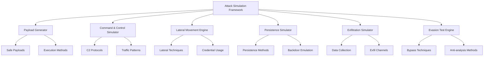
```mermaid
graph TD
    A[Attack Simulation Framework] --> B[Payload Generator]
    A --> C[Command & Control Simulator]
    A --> D[Lateral Movement Engine]
    A --> E[Persistence Simulator]
    A --> F[Exfiltration Simulator]
    A --> G[Evasion Test Engine]
    
    B --> B1[Safe Payloads]
    B --> B2[Execution Methods]
    
    C --> C1[C2 Protocols]
    C --> C2[Traffic Patterns]
    
    D --> D1[Lateral Techniques]
    D --> D2[Credential Usage]
    
    E --> E1[Persistence Methods]
    E --> E2[Backdoor Emulation]
    
    F --> F1[Data Collection]
    F --> F2[Exfil Channels]
    
    G --> G1[Bypass Techniques]
    G --> G2[Anti-analysis Methods]
```

**Key Features**:
- **Safe-by-design**: Non-destructive implementation
- **MITRE ATT&CK Alignment**: Maps to ATT&CK techniques
- **Realistic Simulation**: Creates authentic attack patterns
- **Controlled Impact**: Manages operational effects
- **Detailed Reporting**: Documents simulation activities
- **Custom Scenarios**: Supports tailored simulations

### 8.2 Automated Red Teaming

**Responsibilities**:
- Conduct automated red team exercises
- Execute multi-stage attack campaigns
- Identify defensive weaknesses
- Test blue team responsiveness
- Validate security controls
- Generate improvement recommendations

**Red Team Operation Workflow**:

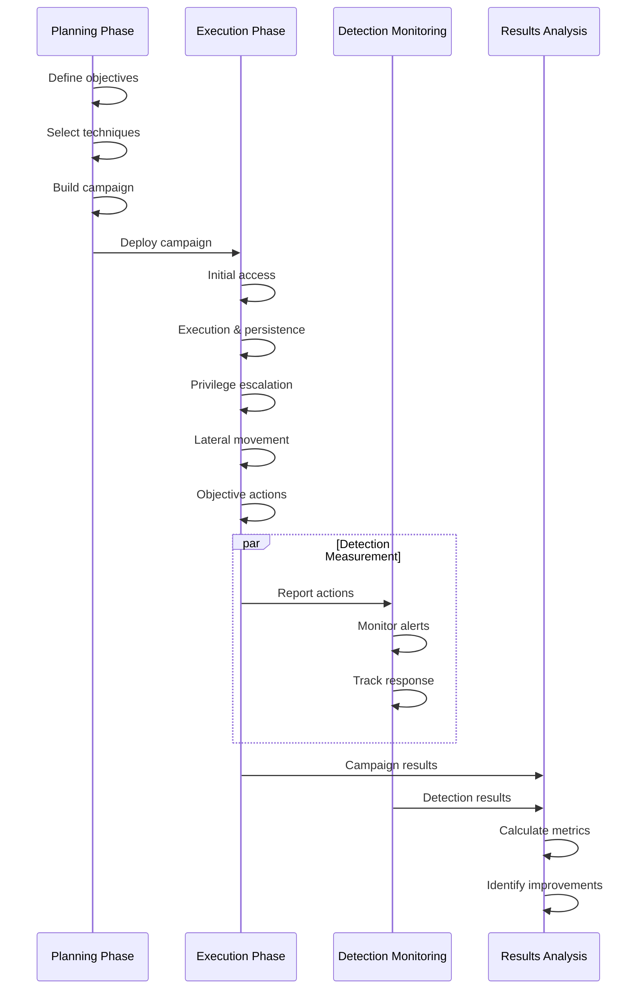
```mermaid
sequenceDiagram
    participant Planning as Planning Phase
    participant Execution as Execution Phase
    participant Detection as Detection Monitoring
    participant Analysis as Results Analysis
    
    Planning->>Planning: Define objectives
    Planning->>Planning: Select techniques
    Planning->>Planning: Build campaign
    
    Planning->>Execution: Deploy campaign
    
    Execution->>Execution: Initial access
    Execution->>Execution: Execution & persistence
    Execution->>Execution: Privilege escalation
    Execution->>Execution: Lateral movement
    Execution->>Execution: Objective actions
    
    par Detection Measurement
        Execution->>Detection: Report actions
        Detection->>Detection: Monitor alerts
        Detection->>Detection: Track response
    end
    
    Execution->>Analysis: Campaign results
    Detection->>Analysis: Detection results
    
    Analysis->>Analysis: Calculate metrics
    Analysis->>Analysis: Identify improvements
```

**Key Features**:
- **Full Campaign Automation**: End-to-end operation automation
- **Multi-technique Campaigns**: Complex, chained attacks
- **Adaptive Execution**: Adjusts based on defenses
- **Operation Metrics**: Measures attack effectiveness
- **Defensive Insights**: Generates defensive recommendations
- **Benign Operation**: Ensures safe execution

### 8.3 Exploit Development and Testing

**Responsibilities**:
- Develop safe exploit implementations
- Test vulnerability exploitation
- Validate vulnerability existence
- Test patch effectiveness
- Create exploit signatures
- Support vulnerability prioritization

**Exploit Development Process**:

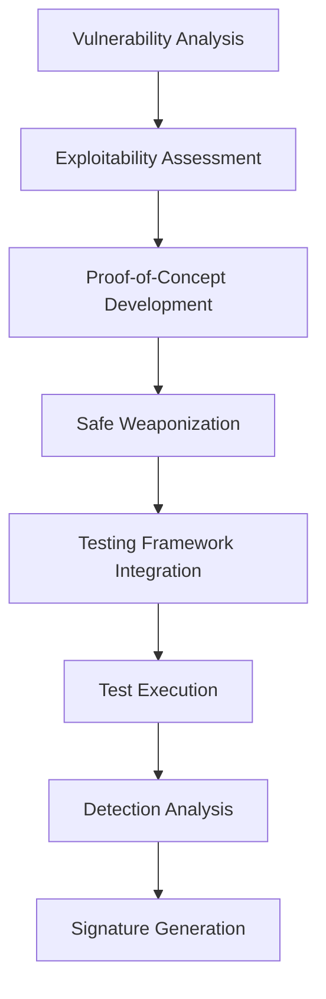
```mermaid
flowchart TD
    A[Vulnerability Analysis] --> B[Exploitability Assessment]
    B --> C[Proof-of-Concept Development]
    C --> D[Safe Weaponization]
    D --> E[Testing Framework Integration]
    E --> F[Test Execution]
    F --> G[Detection Analysis]
    G --> H[Signature Generation]
```

**Key Features**:
- **Safe Implementations**: Non-weaponized exploits
- **Vulnerability Validation**: Confirms exploitability
- **Controlled Testing**: Safe testing framework
- **Patch Validation**: Confirms remediation effectiveness
- **Signature Development**: Creates detection signatures
- **Risk Calibration**: Informs vulnerability prioritization

### 8.4 Attack Path Mapping

**Responsibilities**:
- Map potential attack paths through environment
- Identify critical attack chokepoints
- Discover attack path vulnerabilities
- Assess attack path difficulty
- Prioritize attack path remediation
- Visualize attack surfaces

**Attack Path Analysis**:

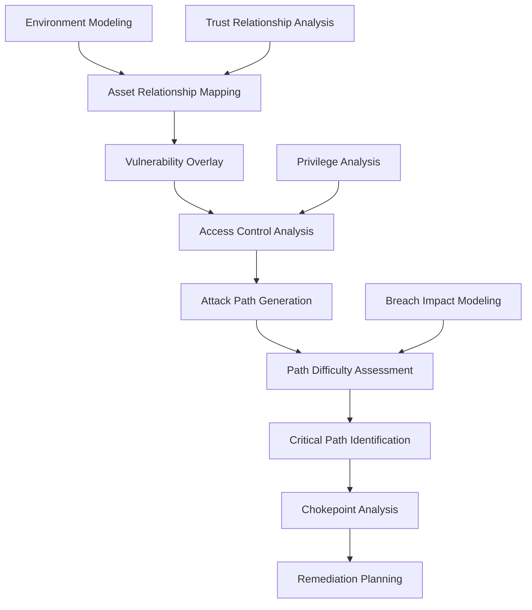
```mermaid
flowchart TD
    A[Environment Modeling] --> B[Asset Relationship Mapping]
    B --> C[Vulnerability Overlay]
    C --> D[Access Control Analysis]
    D --> E[Attack Path Generation]
    
    E --> F[Path Difficulty Assessment]
    F --> G[Critical Path Identification]
    G --> H[Chokepoint Analysis]
    H --> I[Remediation Planning]
    
    J[Breach Impact Modeling] --> F
    K[Privilege Analysis] --> D
    L[Trust Relationship Analysis] --> B
```

**Key Features**:
- **Graph-based Modeling**: Maps interconnections
- **Multi-factor Path Analysis**: Considers multiple factors
- **Breach Impact Prediction**: Assesses potential impacts
- **Remediation Prioritization**: Identifies critical fixes
- **Visual Representation**: Graphically displays paths
- **What-if Analysis**: Models remediation effectiveness

## 9. Use Cases and Applications

This section outlines the primary use cases for the Anticipatory Defense and Purple Team Automation systems.

### 9.1 Emerging Threat Preparedness

**Overview**: Proactively prepare for emerging threats before they impact the organization.

**Workflow**:

```mermaid
sequenceDiagram
    participant TI as Threat Intelligence
    participant TA as Threat Analysis
    participant DS as Defense Strategy
    participant PT as Purple Team
    participant DV as Defense Validation
    
    TI->>TA: New threat intelligence
    TA->>TA: Analyze relevance & impact
    TA->>DS: Develop defense strategy
    
    DS->>PT: Create test scenarios
    PT->>PT: Develop threat emulation
    PT->>DV: Execute validation tests
    
    DV->>DV: Validate defensive readiness
    DV->>DS: Report capability gaps
    
    DS->>DS: Implement improvements
    DS->>DV: Verify enhancements
```

**Key Components**:
- Threat forecasting for early warning
- Defensive control adaptation
- Validation testing against emerging TTPs
- Rapid response playbook development
- Proactive security control implementation

### 9.2 Continuous Security Validation

**Overview**: Continuously validate security controls against evolving threats.

**Implementation Pattern**:

1. **Regular Automated Testing**
   - Schedule daily/weekly/monthly testing
   - Cover critical security controls
   - Test across security layers

2. **Multi-technique Validation**
   - Test prevention capabilities
   - Validate detection mechanisms
   - Exercise response procedures

3. **Comprehensive Reporting**
   - Control effectiveness trends
   - Coverage reporting
   - Improvement tracking

4. **Continuous Improvement**
   - Automated tuning
   - Control enhancement
   - Gap remediation

### 9.3 Vulnerability Impact Analysis

**Overview**: Assess the true impact of vulnerabilities in the organization's context.

**Analysis Process**:

```mermaid
flowchart TD
    A[New Vulnerability] --> B[Applicability Assessment]
    B --> C{Relevant?}
    
    C -->|No| D[Monitor]
    C -->|Yes| E[Exploitation Analysis]
    
    E --> F[Validate in Test Environment]
    F --> G[Map Attack Paths]
    G --> H[Impact Assessment]
    
    H --> I{Risk Level?}
    
    I -->|Critical| J[Immediate Remediation]
    I -->|High| K[Prioritized Remediation]
    I -->|Medium| L[Standard Remediation]
    I -->|Low| M[Scheduled Remediation]
    
    J & K --> N[Validate Mitigations]
    L & M --> O[Track Remediation]
```

**Key Components**:
- Contextual vulnerability assessment
- Exploitation validation testing
- Attack path modeling
- Impact projection
- Risk-based prioritization

### 9.4 Security Architecture Validation

**Overview**: Validate the effectiveness of the overall security architecture.

**Validation Approach**:

1. **Architectural Testing**
   - Validate security boundaries
   - Test segmentation effectiveness
   - Verify defense-in-depth implementation

2. **Breach Impact Simulation**
   - Model breach propagation
   - Assess containment capabilities
   - Test isolation effectiveness

3. **Detection Architecture Testing**
   - Validate detection coverage
   - Test alert correlation
   - Assess visibility gaps

4. **Resilience Verification**
   - Test recovery capabilities
   - Validate redundancy
   - Assess business continuity

### 9.5 Zero-Day Defense Validation

**Overview**: Validate defenses against potential zero-day threats.

**Defense Strategy**:

```mermaid
flowchart TD
    A[Potential Zero-Day] --> B[Unknown Vulnerability Model]
    B --> C[Defense-in-Depth Analysis]
    
    C --> D[Prevention Analysis]
    C --> E[Detection Analysis]
    C --> F[Containment Analysis]
    
    D & E & F --> G[Gap Identification]
    G --> H[Compensating Control Development]
    
    H --> I[Simulate Exploitation]
    I --> J[Validate Controls]
    J --> K{Effective?}
    
    K -->|Yes| L[Document Strategy]
    K -->|No| M[Enhance Controls]
    M --> I
```

**Key Components**:
- Zero-day vulnerability modeling
- Behavior-based detection testing
- Anomaly detection validation
- Unknown threat containment testing
- Defense-in-depth verification

### 9.6 Purple Team Exercises

**Overview**: Conduct collaborative exercises combining red and blue team perspectives.

**Exercise Structure**:

1. **Preparation Phase**
   - Define objectives and scope
   - Establish exercise parameters
   - Brief participants

2. **Execution Phase**
   - Red team: Execute attack scenarios
   - Blue team: Monitor and respond
   - Purple team: Facilitate and coordinate

3. **Real-time Analysis**
   - Track detection effectiveness
   - Measure response timing
   - Identify improvement areas

4. **Post-Exercise Activities**
   - Conduct debrief
   - Document findings
   - Develop improvement plans

## 10. Implementation Strategy

The Implementation Strategy outlines the approach to deploying the Anticipatory Defense and Purple Team Automation capabilities.

### 10.1 Phased Implementation

**Implementation Phases**:

| Phase | Focus | Components | Timeline |
|-------|-------|------------|----------|
| Foundation | Core capabilities | Intelligence Integration, Basic Purple Team | Months 1-3 |
| Enhancement | Advanced testing | Attack Simulation, Defense Validation | Months 4-6 |
| Optimization | Continuous improvement | Adaptive Systems, Mitigation Automation | Months 7-9 |
| Maturity | Comprehensive capability | Threat Prediction, Advanced Scenarios | Months 10-12 |

**Phase Dependencies**:

```mermaid
graph TD
    A[Foundation Phase] --> B[Enhancement Phase]
    B --> C[Optimization Phase]
    C --> D[Maturity Phase]
    
    A1[Intelligence Integration] -->|Prerequisite| B1[Attack Simulation]
    A2[Basic Purple Team] -->|Prerequisite| B2[Defense Validation]
    
    B1 -->|Prerequisite| C1[Adaptive Systems]
    B2 -->|Prerequisite| C2[Mitigation Automation]
    
    C1 -->|Prerequisite| D1[Threat Prediction]
    C2 -->|Prerequisite| D2[Advanced Scenarios]
```

### 10.2 Integration Requirements

**Integration Points**:

1. **Agent Integration**
   - Interface with L1/L2/L3 agent hierarchy
   - Integrate with Dad oversight

2. **System Integration**
   - Connect with security tools
   - Interface with workflow engine
   - Integrate with knowledge base

3. **Data Integration**
   - Access telemetry data
   - Interface with security event store
   - Connect to asset inventory

4. **Process Integration**
   - Align with incident response
   - Interface with change management
   - Connect to risk management

### 10.3 Operational Considerations

**Operational Requirements**:

1. **Risk Management**
   - Safe testing protocols
   - Production safeguards
   - Authorized testing periods

2. **Change Control**
   - Controlled implementation
   - Testing notification
   - Validation procedures

3. **Performance Impact**
   - Minimized operational impact
   - Resource usage controls
   - Scheduling optimization

4. **Governance**
   - Testing authorization
   - Result reporting
   - Improvement tracking

### 10.4 Success Metrics

**Key Performance Indicators**:

| Category | Metric | Target |
|----------|--------|--------|
| Prevention | % of tests prevented | 95%+ |
| Detection | % of tests detected | 98%+ |
| Timing | Mean time to detect | < 15 minutes |
| Response | Mean time to respond | < 30 minutes |
| Improvement | Time to implement fixes | < 7 days |
| Coverage | ATT&CK technique coverage | 90%+ |
| Readiness | Emerging threat readiness | 85%+ |
| Efficiency | Automation level | 95%+ |

**Measurement Approach**:
- Automated metrics collection
- Regular reporting cycle
- Trend analysis
- Comparative benchmarking
- Goal tracking