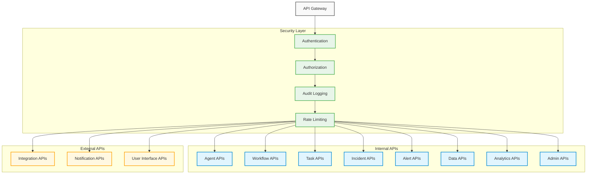
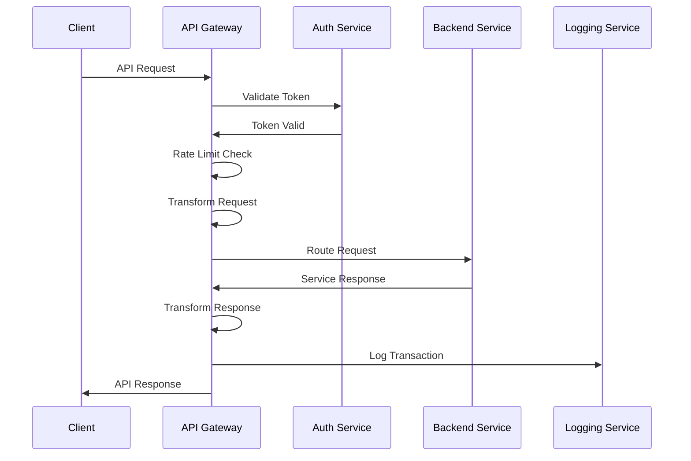

# API Specifications

## 1. Overview

This document defines the API specifications for the Agentic SOC, including both internal component interfaces and external integration interfaces. These APIs enable secure, efficient communication between system components and external security tools.

### 1.1 API Architecture



### 1.2 API Design Principles

| Principle | Description | Implementation |
|-----------|-------------|----------------|
| API-First | APIs designed before implementation | OpenAPI/Swagger specifications |
| Consistency | Uniform patterns across all APIs | Standard response formats, error codes, and naming conventions |
| Versioning | Controlled API evolution | URI version prefixes (v1, v2) |
| Security | Protection at all levels | OAuth 2.0, JWT, RBAC, rate limiting |
| Documentation | Complete, accessible documentation | Interactive API documentation, examples, and guides |
| Hypermedia | Self-describing APIs | HATEOAS links for resource discovery |
| Validation | Input validation on all endpoints | Schema validation, strong typing |
| Pagination | Efficient handling of large result sets | Cursor-based pagination, metadata |
| Filtering | Flexible data retrieval | Standardized query parameters |
| Idempotency | Safe repeated operations | Idempotency keys, operation tokens |

### 1.3 API Protocol Support

| Protocol | Use Cases | Implementation |
|----------|-----------|----------------|
| REST | Standard CRUD operations | HTTP, JSON, resource-based |
| GraphQL | Complex data queries | Schema-based, query language |
| WebSocket | Real-time streaming | Persistent connections, event-based |
| gRPC | High-performance internal calls | Binary protocol, service definitions |
| Webhook | Push notifications | HTTP callbacks, event delivery |
| SSE | Server-sent events | One-way event streaming |

## 2. Core API Components

### 2.1 API Gateway

The API Gateway serves as the unified entry point for all API requests, handling authentication, routing, and common cross-cutting concerns.

**Responsibilities**:
- Request routing
- Authentication verification
- Rate limiting
- Request/response logging
- API analytics collection
- Response caching
- Error handling standardization

**Example Gateway Request Flow**:



### 2.2 Authentication & Authorization

The Security Layer provides authentication, authorization, and audit logging for all API requests.

#### Authentication API

**Base Endpoint**: `/api/v1/auth`

| Endpoint | Method | Purpose | Request | Response |
|----------|--------|---------|---------|----------|
| `/token` | POST | Obtain authentication token | `{ "clientId": "string", "clientSecret": "string", "grantType": "string" }` | `{ "accessToken": "string", "tokenType": "string", "expiresIn": "integer", "refreshToken": "string" }` |
| `/token/refresh` | POST | Refresh authentication token | `{ "refreshToken": "string" }` | `{ "accessToken": "string", "tokenType": "string", "expiresIn": "integer", "refreshToken": "string" }` |
| `/token/revoke` | POST | Revoke token | `{ "token": "string", "tokenTypeHint": "string" }` | `{ "status": "string" }` |
| `/token/validate` | POST | Validate token | `{ "token": "string" }` | `{ "valid": "boolean", "claims": { ... } }` |

#### Authorization Model

**Permission-Based Access Control**:

```json
{
  "permission": {
    "action": "string",    // e.g., "read", "write", "execute"
    "resource": "string",  // e.g., "incident", "agent", "task"
    "conditions": [        // optional constraints
      {
        "field": "string",
        "operator": "string",
        "value": "any"
      }
    ]
  }
}
```

**Role-Based Access Control**:

```json
{
  "role": {
    "name": "string",      // e.g., "L1_agent", "incident_manager"
    "permissions": [
      {
        "action": "string",
        "resource": "string",
        "conditions": [...]
      }
    ]
  }
}
```

### 2.3 Common API Patterns

#### Standard Response Format

```json
{
  "status": "string",      // "success" or "error"
  "data": "any",           // Response data (null if error)
  "error": {               // Error information (null if success)
    "code": "string",      // Error code
    "message": "string",   // User-friendly message
    "details": "any"       // Additional error details
  },
  "meta": {                // Metadata (pagination, etc.)
    "pagination": {
      "totalCount": "integer",
      "pageSize": "integer",
      "currentPage": "integer",
      "totalPages": "integer",
      "hasNextPage": "boolean",
      "hasPreviousPage": "boolean"
    }
  },
  "links": {               // HATEOAS links
    "self": "string",
    "next": "string",
    "prev": "string",
    "first": "string",
    "last": "string"
  }
}
```

#### Filtering and Sorting

**Query Parameters**:

| Parameter | Description | Example |
|-----------|-------------|---------|
| `filter[field]` | Filter by field value | `filter[status]=active` |
| `filter[field][operator]` | Filter with operator | `filter[createdAt][gt]=2023-01-01` |
| `sort` | Sort fields (prefix with - for desc) | `sort=-priority,createdAt` |
| `page[size]` | Page size for pagination | `page[size]=25` |
| `page[cursor]` | Cursor for pagination | `page[cursor]=eyJpZCI6MTAwfQ==` |
| `include` | Include related resources | `include=assignedAgent,tasks` |
| `fields[resource]` | Select specific fields | `fields[incident]=id,title,severity` |

#### Error Codes

| HTTP Status | Error Code | Description |
|-------------|------------|-------------|
| 400 | INVALID_REQUEST | Request format or parameters are invalid |
| 401 | UNAUTHORIZED | Authentication required or failed |
| 403 | FORBIDDEN | Permission denied for authenticated user |
| 404 | NOT_FOUND | Requested resource not found |
| 409 | CONFLICT | Request conflicts with current state |
| 422 | VALIDATION_FAILED | Request validation failed |
| 429 | RATE_LIMITED | Too many requests |
| 500 | SERVER_ERROR | Unexpected server error |
| 503 | SERVICE_UNAVAILABLE | Service temporarily unavailable |

## 3. Agent API

The Agent API provides interfaces for managing, controlling, and interacting with security agents within the system.

### 3.1 REST API

**Base Endpoint**: `/api/v1/agents`

#### Agent Management

| Endpoint | Method | Purpose | Request | Response |
|----------|--------|---------|---------|----------|
| `/` | GET | List agents | Query parameters for filtering | Array of agent objects |
| `/{id}` | GET | Get agent details | - | Agent object |
| `/` | POST | Create agent | Agent creation object | Created agent object |
| `/{id}` | PUT | Update agent | Agent update object | Updated agent object |
| `/{id}` | DELETE | Deactivate agent | - | Status confirmation |
| `/{id}/capabilities` | GET | Get agent capabilities | - | Array of capability objects |
| `/{id}/tasks` | GET | Get agent assigned tasks | - | Array of task objects |
| `/{id}/metrics` | GET | Get agent performance metrics | - | Metrics object |

#### Agent Control

| Endpoint | Method | Purpose | Request | Response |
|----------|--------|---------|---------|----------|
| `/{id}/activate` | POST | Activate agent | - | Status confirmation |
| `/{id}/deactivate` | POST | Deactivate agent | - | Status confirmation |
| `/{id}/train` | POST | Train agent | Training parameters | Training status object |
| `/{id}/execute` | POST | Execute agent capability | `{ "capability": "string", "parameters": {} }` | Execution result object |
| `/{id}/escalate` | POST | Escalate from agent | Escalation object | Escalation status |

### 3.2 GraphQL API

**Endpoint**: `/graphql/agents`

#### Schema Excerpts

```graphql
type Agent {
  id: ID!
  name: String!
  type: AgentType!
  tier: AgentTier!
  status: AgentStatus!
  capabilities: [Capability!]!
  assignedTasks: [Task!]
  metrics: AgentMetrics
  createdAt: DateTime!
  updatedAt: DateTime!
}

enum AgentType {
  SECURITY_AGENT
  ANALYSIS_AGENT
  RESPONSE_AGENT
  SUPPORT_AGENT
}

enum AgentTier {
  L1
  L2
  L3
}

enum AgentStatus {
  ACTIVE
  INACTIVE
  TRAINING
  MAINTENANCE
}

type Capability {
  id: ID!
  name: String!
  description: String
  parameters: [CapabilityParameter!]
}

type AgentMetrics {
  accuracy: Float
  responseTime: Float
  decisionsPerHour: Float
  escalationRate: Float
}

type Query {
  agents(
    filter: AgentFilterInput
    sort: [AgentSortInput!]
    pagination: PaginationInput
  ): AgentConnection!
  
  agent(id: ID!): Agent
  
  agentCapabilities(
    agentId: ID!
    filter: CapabilityFilterInput
  ): [Capability!]!
  
  agentMetrics(
    agentId: ID!
    timeframe: TimeframeInput
  ): AgentMetrics!
}

type Mutation {
  createAgent(input: CreateAgentInput!): AgentMutationResponse!
  updateAgent(id: ID!, input: UpdateAgentInput!): AgentMutationResponse!
  activateAgent(id: ID!): AgentMutationResponse!
  deactivateAgent(id: ID!): AgentMutationResponse!
  trainAgent(id: ID!, input: TrainAgentInput!): AgentMutationResponse!
  executeCapability(agentId: ID!, input: ExecuteCapabilityInput!): ExecutionResponse!
  escalateFromAgent(agentId: ID!, input: EscalationInput!): EscalationResponse!
}
```

#### Example Queries

**Get Active Agents with Capabilities**:

```graphql
query GetActiveAgents {
  agents(
    filter: { status: { eq: ACTIVE } }
    sort: [{ field: tier, direction: ASC }]
  ) {
    edges {
      node {
        id
        name
        type
        tier
        capabilities {
          id
          name
          description
        }
        metrics {
          accuracy
          responseTime
        }
      }
    }
    pageInfo {
      hasNextPage
      endCursor
    }
    totalCount
  }
}
```

**Execute Agent Capability**:

```graphql
mutation ExecuteAgentCapability {
  executeCapability(
    agentId: "agent-123",
    input: {
      capabilityId: "capability-456",
      parameters: {
        target: "192.168.1.1",
        scanType: "VULNERABILITY_SCAN",
        options: { depth: "FULL" }
      }
    }
  ) {
    status
    executionId
    result {
      status
      data
    }
    error {
      code
      message
    }
  }
}
```

### 3.3 WebSocket API

**Endpoint**: `/ws/agents`

#### Agent Real-time Events

| Event Type | Description | Payload |
|------------|-------------|---------|
| `agent.status.changed` | Agent status changes | `{ "agentId": "string", "prevStatus": "string", "newStatus": "string", "timestamp": "string" }` |
| `agent.task.assigned` | New task assigned to agent | `{ "agentId": "string", "taskId": "string", "priority": "string", "timestamp": "string" }` |
| `agent.task.completed` | Agent completed a task | `{ "agentId": "string", "taskId": "string", "result": {}, "timestamp": "string" }` |
| `agent.escalation.initiated` | Agent initiated escalation | `{ "agentId": "string", "escalationId": "string", "reason": "string", "targetTier": "string", "timestamp": "string" }` |
| `agent.capability.executed` | Agent executed capability | `{ "agentId": "string", "capabilityId": "string", "executionId": "string", "status": "string", "timestamp": "string" }` |

#### Example WebSocket Communication

```javascript
// Client-side code
const socket = new WebSocket('wss://soc.example.com/ws/agents');

socket.onopen = () => {
  // Subscribe to specific agent events
  socket.send(JSON.stringify({
    type: 'subscribe',
    channels: [
      'agent.status.changed',
      'agent.escalation.initiated'
    ],
    filter: {
      agentTier: 'L2',
      agentType: 'SECURITY_AGENT'
    }
  }));
};

socket.onmessage = (event) => {
  const data = JSON.parse(event.data);
  console.log(`Event: ${data.eventType}`, data.payload);
  
  // Acknowledge receipt of the event
  socket.send(JSON.stringify({
    type: 'ack',
    eventId: data.eventId
  }));
};
```

## 4. Task and Workflow API

The Task and Workflow API provides interfaces for managing security tasks and workflows within the system.

### 4.1 REST API

**Base Endpoints**: 
- `/api/v1/tasks`
- `/api/v1/workflows`

#### Task Management

| Endpoint | Method | Purpose | Request | Response |
|----------|--------|---------|---------|----------|
| `/tasks` | GET | List tasks | Query parameters for filtering | Array of task objects |
| `/tasks/{id}` | GET | Get task details | - | Task object |
| `/tasks` | POST | Create task | Task creation object | Created task object |
| `/tasks/{id}` | PUT | Update task | Task update object | Updated task object |
| `/tasks/{id}/assign` | POST | Assign task | `{ "agentId": "string" }` | Assignment confirmation |
| `/tasks/{id}/start` | POST | Start task | - | Task status update |
| `/tasks/{id}/complete` | POST | Complete task | `{ "result": {} }` | Task completion status |
| `/tasks/{id}/cancel` | POST | Cancel task | `{ "reason": "string" }` | Cancellation confirmation |
| `/tasks/{id}/subtasks` | GET | Get subtasks | - | Array of subtask objects |
| `/tasks/{id}/subtasks` | POST | Create subtask | Subtask creation object | Created subtask object |

#### Workflow Management

| Endpoint | Method | Purpose | Request | Response |
|----------|--------|---------|---------|----------|
| `/workflows` | GET | List workflows | Query parameters for filtering | Array of workflow objects |
| `/workflows/{id}` | GET | Get workflow details | - | Workflow object |
| `/workflows` | POST | Create workflow | Workflow creation object | Created workflow object |
| `/workflows/{id}` | PUT | Update workflow | Workflow update object | Updated workflow object |
| `/workflows/{id}/start` | POST | Start workflow execution | `{ "context": {} }` | Execution status |
| `/workflows/{id}/pause` | POST | Pause workflow | - | Pause confirmation |
| `/workflows/{id}/resume` | POST | Resume workflow | - | Resume confirmation |
| `/workflows/{id}/terminate` | POST | Terminate workflow | `{ "reason": "string" }` | Termination confirmation |
| `/workflows/{id}/tasks` | GET | Get workflow tasks | - | Array of tasks in workflow |
| `/workflows/templates` | GET | Get workflow templates | - | Array of template objects |
| `/workflows/templates/{id}` | GET | Get template details | - | Template object |

### 4.2 GraphQL API

**Endpoint**: `/graphql/workflows`

#### Schema Excerpts

```graphql
type Task {
  id: ID!
  title: String!
  description: String
  type: TaskType!
  priority: TaskPriority!
  status: TaskStatus!
  createdAt: DateTime!
  updatedAt: DateTime!
  deadlineAt: DateTime
  assignedAgent: Agent
  createdBy: Agent
  workflow: Workflow
  parentTask: Task
  subtasks: [Task!]
  dependencies: [Task!]
  context: JSONObject
  result: TaskResult
}

enum TaskStatus {
  PENDING
  ASSIGNED
  IN_PROGRESS
  PAUSED
  COMPLETED
  FAILED
}

type Workflow {
  id: ID!
  name: String!
  description: String
  type: WorkflowType!
  template: String
  status: WorkflowStatus!
  priority: WorkflowPriority!
  createdAt: DateTime!
  updatedAt: DateTime!
  startedAt: DateTime
  completedAt: DateTime
  owner: Agent
  tasks: [Task!]
  variables: JSONObject
  context: JSONObject
}

enum WorkflowStatus {
  DRAFT
  ACTIVE
  PAUSED
  COMPLETED
  FAILED
  TERMINATED
}

type Query {
  tasks(
    filter: TaskFilterInput
    sort: [TaskSortInput!]
    pagination: PaginationInput
  ): TaskConnection!
  
  task(id: ID!): Task
  
  workflows(
    filter: WorkflowFilterInput
    sort: [WorkflowSortInput!]
    pagination: PaginationInput
  ): WorkflowConnection!
  
  workflow(id: ID!): Workflow
  
  workflowTemplates(
    filter: TemplateFilterInput
  ): [WorkflowTemplate!]!
}

type Mutation {
  createTask(input: CreateTaskInput!): TaskMutationResponse!
  updateTask(id: ID!, input: UpdateTaskInput!): TaskMutationResponse!
  assignTask(id: ID!, agentId: ID!): TaskMutationResponse!
  startTask(id: ID!): TaskMutationResponse!
  completeTask(id: ID!, input: CompleteTaskInput!): TaskMutationResponse!
  
  createWorkflow(input: CreateWorkflowInput!): WorkflowMutationResponse!
  updateWorkflow(id: ID!, input: UpdateWorkflowInput!): WorkflowMutationResponse!
  startWorkflow(id: ID!, input: StartWorkflowInput!): WorkflowMutationResponse!
  pauseWorkflow(id: ID!): WorkflowMutationResponse!
  resumeWorkflow(id: ID!): WorkflowMutationResponse!
  terminateWorkflow(id: ID!, reason: String!): WorkflowMutationResponse!
}
```

#### Example Queries

**Get Active Workflows with Tasks**:

```graphql
query GetActiveWorkflows {
  workflows(
    filter: { status: { eq: ACTIVE } }
    sort: [{ field: priority, direction: DESC }]
  ) {
    edges {
      node {
        id
        name
        type
        status
        tasks {
          id
          title
          status
          assignedAgent {
            id
            name
          }
        }
        context
      }
    }
    pageInfo {
      hasNextPage
      endCursor
    }
  }
}
```

**Create and Start Workflow**:

```graphql
mutation CreateAndStartWorkflow {
  createWorkflow(
    input: {
      name: "Incident Response: Suspicious Login",
      type: INCIDENT_RESPONSE,
      template: "incident_response_standard",
      priority: HIGH,
      context: {
        incidentId: "incident-789",
        sourceIp: "203.0.113.1"
      }
    }
  ) {
    workflow {
      id
      status
    }
    error {
      code
      message
    }
  }
  
  # Using the ID from the previous mutation
  startWorkflow(
    id: "workflow-123",
    input: {
      variables: {
        skipEmailNotification: false
      }
    }
  ) {
    workflow {
      id
      status
      startedAt
    }
    error {
      code
      message
    }
  }
}
```

### 4.3 WebSocket API

**Endpoint**: `/ws/workflows`

#### Task and Workflow Events

| Event Type | Description | Payload |
|------------|-------------|---------|
| `task.created` | New task created | `{ "taskId": "string", "title": "string", "priority": "string", "timestamp": "string" }` |
| `task.assigned` | Task assigned to agent | `{ "taskId": "string", "agentId": "string", "timestamp": "string" }` |
| `task.status.changed` | Task status changed | `{ "taskId": "string", "prevStatus": "string", "newStatus": "string", "timestamp": "string" }` |
| `task.completed` | Task completed | `{ "taskId": "string", "result": {}, "timestamp": "string" }` |
| `workflow.created` | New workflow created | `{ "workflowId": "string", "name": "string", "type": "string", "timestamp": "string" }` |
| `workflow.status.changed` | Workflow status changed | `{ "workflowId": "string", "prevStatus": "string", "newStatus": "string", "timestamp": "string" }` |
| `workflow.task.added` | Task added to workflow | `{ "workflowId": "string", "taskId": "string", "timestamp": "string" }` |
| `workflow.completed` | Workflow completed | `{ "workflowId": "string", "outcome": {}, "timestamp": "string" }` |

## 5. Incident and Alert API

The Incident and Alert API provides interfaces for managing security incidents and alerts within the system.

### 5.1 REST API

**Base Endpoints**: 
- `/api/v1/incidents`
- `/api/v1/alerts`

#### Incident Management

| Endpoint | Method | Purpose | Request | Response |
|----------|--------|---------|---------|----------|
| `/incidents` | GET | List incidents | Query parameters for filtering | Array of incident objects |
| `/incidents/{id}` | GET | Get incident details | - | Incident object |
| `/incidents` | POST | Create incident | Incident creation object | Created incident object |
| `/incidents/{id}` | PUT | Update incident | Incident update object | Updated incident object |
| `/incidents/{id}/escalate` | POST | Escalate incident | `{ "targetTier": "string", "reason": "string" }` | Escalation confirmation |
| `/incidents/{id}/assign` | POST | Assign incident | `{ "assigneeId": "string" }` | Assignment confirmation |
| `/incidents/{id}/status` | PUT | Update incident status | `{ "status": "string", "reason": "string" }` | Status update confirmation |
| `/incidents/{id}/timeline` | GET | Get incident timeline | - | Array of timeline events |
| `/incidents/{id}/timeline` | POST | Add timeline event | Timeline event object | Created event object |
| `/incidents/{id}/evidence` | GET | Get incident evidence | - | Array of evidence objects |
| `/incidents/{id}/evidence` | POST | Add incident evidence | Evidence object | Created evidence object |
| `/incidents/{id}/notes` | GET | Get incident notes | - | Array of note objects |
| `/incidents/{id}/notes` | POST | Add incident note | `{ "content": "string" }` | Created note object |
| `/incidents/{id}/related` | GET | Get related incidents | - | Array of related incident objects |

#### Alert Management

| Endpoint | Method | Purpose | Request | Response |
|----------|--------|---------|---------|----------|
| `/alerts` | GET | List alerts | Query parameters for filtering | Array of alert objects |
| `/alerts/{id}` | GET | Get alert details | - | Alert object |
| `/alerts` | POST | Create alert | Alert creation object | Created alert object |
| `/alerts/{id}` | PUT | Update alert | Alert update object | Updated alert object |
| `/alerts/{id}/assign` | POST | Assign alert | `{ "assigneeId": "string" }` | Assignment confirmation |
| `/alerts/{id}/status` | PUT | Update alert status | `{ "status": "string", "reason": "string" }` | Status update confirmation |
| `/alerts/{id}/escalate` | POST | Escalate to incident | `{ "incidentTemplate": "string" }` | Created incident object |
| `/alerts/bulk` | PUT | Bulk update alerts | `{ "alertIds": ["string"], "updates": {} }` | Bulk update confirmation |

### 5.2 GraphQL API

**Endpoint**: `/graphql/security`

#### Schema Excerpts

```graphql
type Incident {
  id: ID!
  title: String!
  description: String
  severity: IncidentSeverity!
  status: IncidentStatus!
  type: String
  source: String
  detectedAt: DateTime!
  reportedAt: DateTime
  assignedAt: DateTime
  containedAt: DateTime
  remediatedAt: DateTime
  resolvedAt: DateTime
  primaryResponsible: Agent
  relatedAlerts: [Alert!]
  parentIncident: Incident
  childIncidents: [Incident!]
  affectedAssets: [Asset!]
  timeline: [TimelineEvent!]
  indicators: [Indicator!]
  tags: [String!]
  metrics: IncidentMetrics
  workflow: Workflow
}

enum IncidentSeverity {
  CRITICAL
  HIGH
  MEDIUM
  LOW
  INFORMATIONAL
}

enum IncidentStatus {
  NEW
  INVESTIGATING
  CONTAINED
  REMEDIATED
  RESOLVED
  CLOSED
}

type Alert {
  id: ID!
  title: String!
  description: String
  source: String
  sourceType: SourceType
  severity: AlertSeverity!
  confidence: Float
  status: AlertStatus!
  createdAt: DateTime!
  eventTime: DateTime
  assignedAgent: Agent
  incident: Incident
  indicators: [Indicator!]
  enrichments: [Enrichment!]
  actions: [AlertAction!]
}

enum AlertStatus {
  NEW
  INVESTIGATING
  ACKNOWLEDGED
  FALSE_POSITIVE
  TRUE_POSITIVE
  IGNORED
}

type Query {
  incidents(
    filter: IncidentFilterInput
    sort: [IncidentSortInput!]
    pagination: PaginationInput
  ): IncidentConnection!
  
  incident(id: ID!): Incident
  
  alerts(
    filter: AlertFilterInput
    sort: [AlertSortInput!]
    pagination: PaginationInput
  ): AlertConnection!
  
  alert(id: ID!): Alert
}

type Mutation {
  createIncident(input: CreateIncidentInput!): IncidentMutationResponse!
  updateIncident(id: ID!, input: UpdateIncidentInput!): IncidentMutationResponse!
  escalateIncident(id: ID!, input: EscalateIncidentInput!): IncidentMutationResponse!
  assignIncident(id: ID!, assigneeId: ID!): IncidentMutationResponse!
  updateIncidentStatus(id: ID!, status: IncidentStatus!, reason: String): IncidentMutationResponse!
  addIncidentNote(id: ID!, content: String!): NoteMutationResponse!
  
  createAlert(input: CreateAlertInput!): AlertMutationResponse!
  updateAlert(id: ID!, input: UpdateAlertInput!): AlertMutationResponse!
  escalateAlertToIncident(id: ID!, input: EscalateAlertInput!): IncidentMutationResponse!
  bulkUpdateAlerts(input: BulkUpdateAlertsInput!): BulkAlertMutationResponse!
}
```

#### Example Queries

**Get Critical Incidents with Related Alerts**:

```graphql
query GetCriticalIncidents {
  incidents(
    filter: { 
      severity: { eq: CRITICAL },
      status: { in: [NEW, INVESTIGATING] }
    }
    sort: [{ field: detectedAt, direction: DESC }]
  ) {
    edges {
      node {
        id
        title
        severity
        status
        detectedAt
        primaryResponsible {
          id
          name
        }
        relatedAlerts {
          id
          title
          source
          severity
        }
        affectedAssets {
          id
          name
          type
        }
        indicators {
          type
          value
          confidence
        }
      }
    }
    pageInfo {
      hasNextPage
      endCursor
    }
    totalCount
  }
}
```

**Create and Escalate Alert**:

```graphql
mutation ProcessSecurityAlert {
  createAlert(
    input: {
      title: "Suspicious Authentication Activity",
      description: "Multiple failed login attempts from unusual location",
      source: "Auth System",
      sourceType: INTERNAL,
      severity: HIGH,
      confidence: 0.85,
      eventTime: "2023-06-15T14:22:31Z",
      indicators: [
        { type: "IP", value: "203.0.113.100", confidence: 0.9 },
        { type: "USER", value: "admin", confidence: 0.95 }
      ]
    }
  ) {
    alert {
      id
      status
    }
    error {
      code
      message
    }
  }
  
  escalateAlertToIncident(
    id: "alert-456",
    input: {
      incidentTemplate: "suspicious_auth_incident",
      additionalContext: {
        priorityOverride: "CRITICAL",
        notifyUsers: ["security-team"]
      }
    }
  ) {
    incident {
      id
      title
      severity
      status
    }
    error {
      code
      message
    }
  }
}
```

### 5.3 WebSocket API

**Endpoint**: `/ws/security`

#### Incident and Alert Events

| Event Type | Description | Payload |
|------------|-------------|---------|
| `incident.created` | New incident created | `{ "incidentId": "string", "title": "string", "severity": "string", "timestamp": "string" }` |
| `incident.updated` | Incident details updated | `{ "incidentId": "string", "changes": {}, "timestamp": "string" }` |
| `incident.status.changed` | Incident status changed | `{ "incidentId": "string", "prevStatus": "string", "newStatus": "string", "timestamp": "string" }` |
| `incident.escalated` | Incident escalated | `{ "incidentId": "string", "fromTier": "string", "toTier": "string", "reason": "string", "timestamp": "string" }` |
| `incident.assigned` | Incident assigned | `{ "incidentId": "string", "assigneeId": "string", "timestamp": "string" }` |
| `alert.created` | New alert created | `{ "alertId": "string", "title": "string", "severity": "string", "timestamp": "string" }` |
| `alert.status.changed` | Alert status changed | `{ "alertId": "string", "prevStatus": "string", "newStatus": "string", "timestamp": "string" }` |
| `alert.escalated` | Alert escalated to incident | `{ "alertId": "string", "incidentId": "string", "timestamp": "string" }` |

## 6. Integration API

The Integration API provides interfaces for external systems to interact with the Agentic SOC.

### 6.1 REST API

**Base Endpoint**: `/api/v1/integrations`

#### System Integration

| Endpoint | Method | Purpose | Request | Response |
|----------|--------|---------|---------|----------|
| `/systems` | GET | List integrated systems | Query parameters for filtering | Array of system objects |
| `/systems/{id}` | GET | Get system details | - | System object |
| `/systems` | POST | Register new system | System registration object | Created system object |
| `/systems/{id}` | PUT | Update system | System update object | Updated system object |
| `/systems/{id}/status` | GET | Get system status | - | Status object |
| `/systems/{id}/test` | POST | Test system connection | - | Test result object |

#### Data Integration

| Endpoint | Method | Purpose | Request | Response |
|----------|--------|---------|---------|----------|
| `/ingest/events` | POST | Ingest security events | Array of event objects or single event | Ingestion confirmation |
| `/ingest/alerts` | POST | Ingest security alerts | Array of alert objects or single alert | Ingestion confirmation |
| `/ingest/indicators` | POST | Ingest threat indicators | Array of indicator objects or single indicator | Ingestion confirmation |
| `/ingest/vulnerabilities` | POST | Ingest vulnerability data | Array of vulnerability objects or single vulnerability | Ingestion confirmation |
| `/ingest/assets` | POST | Ingest asset information | Array of asset objects or single asset | Ingestion confirmation |
| `/sync/status` | GET | Get data sync status | Query parameters for system | Sync status object |
| `/sync/start` | POST | Start data synchronization | Sync parameters | Sync job object |

#### External Actions

| Endpoint | Method | Purpose | Request | Response |
|----------|--------|---------|---------|----------|
| `/actions` | GET | List available actions | Query parameters for filtering | Array of action objects |
| `/actions/{id}` | GET | Get action details | - | Action object |
| `/actions/{id}/execute` | POST | Execute integration action | Action parameters | Execution result |
| `/actions/batch` | POST | Execute batch of actions | Array of action requests | Array of execution results |

### 6.2 Webhook API

**Base Endpoint**: `/api/v1/webhooks`

#### Webhook Management

| Endpoint | Method | Purpose | Request | Response |
|----------|--------|---------|---------|----------|
| `/` | GET | List registered webhooks | Query parameters for filtering | Array of webhook objects |
| `/{id}` | GET | Get webhook details | - | Webhook object |
| `/` | POST | Register webhook | Webhook registration object | Created webhook object |
| `/{id}` | PUT | Update webhook | Webhook update object | Updated webhook object |
| `/{id}` | DELETE | Delete webhook | - | Deletion confirmation |
| `/{id}/test` | POST | Send test event | - | Test result object |
| `/events` | GET | List webhook event types | - | Array of event type objects |

#### Webhook Payload Format

```json
{
  "id": "uuid",                   // Webhook delivery ID
  "timestamp": "ISO8601",         // Event timestamp
  "event": {
    "type": "string",             // Event type
    "subtype": "string"           // Event subtype
  },
  "data": {                       // Event-specific data
    "id": "string",               // Resource ID
    "type": "string",             // Resource type
    "attributes": {},             // Resource attributes
    "relationships": {}           // Related resources
  },
  "metadata": {                   // Additional context
    "origin": "string",           // Event origin
    "correlationId": "string"     // For event correlation
  },
  "signature": "string"           // HMAC signature for verification
}
```

#### Webhook Event Types

| Category | Event Types | Description |
|----------|-------------|-------------|
| Incidents | `incident.created`, `incident.updated`, `incident.status.changed`, `incident.closed` | Incident lifecycle events |
| Alerts | `alert.created`, `alert.updated`, `alert.status.changed` | Alert lifecycle events |
| Tasks | `task.created`, `task.completed`, `task.failed` | Task execution events |
| Agents | `agent.status.changed`, `agent.action.performed` | Agent operation events |
| Integration | `integration.sync.completed`, `integration.action.executed` | Integration operation events |

### 6.3 Streaming API

**Base Endpoint**: `/api/v1/streams`

#### Stream Management

| Endpoint | Method | Purpose | Request | Response |
|----------|--------|---------|---------|----------|
| `/` | GET | List available streams | Query parameters for filtering | Array of stream objects |
| `/{id}` | GET | Get stream details | - | Stream object |
| `/subscribe` | POST | Subscribe to stream | Subscription parameters | Subscription object |
| `/unsubscribe` | POST | Unsubscribe from stream | `{ "subscriptionId": "string" }` | Unsubscription confirmation |

#### Stream Types

| Stream Type | Description | Data Format |
|-------------|-------------|-------------|
| `security.events` | Security event stream | Event objects |
| `security.alerts` | Security alert stream | Alert objects |
| `security.incidents` | Security incident stream | Incident objects |
| `system.metrics` | System metrics stream | Metric objects |
| `agent.activities` | Agent activity stream | Activity objects |

## 7. Reporting and Analytics API

The Reporting and Analytics API provides interfaces for generating reports and performing security analytics.

### 7.1 REST API

**Base Endpoint**: `/api/v1/reporting`

#### Report Management

| Endpoint | Method | Purpose | Request | Response |
|----------|--------|---------|---------|----------|
| `/reports` | GET | List available reports | Query parameters for filtering | Array of report objects |
| `/reports/{id}` | GET | Get report details | - | Report object |
| `/reports/generate` | POST | Generate custom report | Report parameters | Report generation job object |
| `/reports/templates` | GET | List report templates | Query parameters for filtering | Array of template objects |
| `/reports/templates/{id}` | GET | Get template details | - | Template object |
| `/reports/schedules` | GET | List scheduled reports | Query parameters for filtering | Array of schedule objects |
| `/reports/schedules` | POST | Schedule new report | Schedule parameters | Created schedule object |
| `/reports/schedules/{id}` | PUT | Update schedule | Schedule update parameters | Updated schedule object |
| `/reports/schedules/{id}` | DELETE | Delete schedule | - | Deletion confirmation |

#### Analytics

| Endpoint | Method | Purpose | Request | Response |
|----------|--------|---------|---------|----------|
| `/analytics/metrics` | GET | Get security metrics | Query parameters for metrics and timeframe | Metrics result object |
| `/analytics/trends` | GET | Get trend analysis | Trend parameters | Trend result object |
| `/analytics/dashboard/{id}` | GET | Get dashboard data | Query parameters for timeframe | Dashboard data object |
| `/analytics/search` | POST | Perform analytical search | Search parameters | Search results |
| `/analytics/query` | POST | Execute analytics query | Query object | Query results |
| `/analytics/export` | POST | Export analytics data | Export parameters | Export job object |

### 7.2 GraphQL API

**Endpoint**: `/graphql/analytics`

#### Schema Excerpts

```graphql
type Report {
  id: ID!
  name: String!
  description: String
  type: ReportType!
  template: ReportTemplate
  format: ReportFormat!
  createdAt: DateTime!
  generatedAt: DateTime
  status: ReportStatus!
  parameters: JSONObject
  metrics: [ReportMetric!]
  visualizations: [Visualization!]
  data: ReportData
}

type ReportTemplate {
  id: ID!
  name: String!
  description: String
  type: ReportType!
  parameters: [TemplateParameter!]
  sections: [TemplateSection!]
}

type ReportSchedule {
  id: ID!
  reportTemplate: ReportTemplate!
  name: String!
  frequency: ScheduleFrequency!
  parameters: JSONObject
  lastRun: DateTime
  nextRun: DateTime
  recipients: [String!]
  enabled: Boolean!
}

type SecurityMetric {
  id: ID!
  name: String!
  description: String
  value: Float!
  trend: TrendDirection
  unit: String
  timeframe: Timeframe!
  breakdown: [MetricBreakdown!]
}

type Query {
  reports(
    filter: ReportFilterInput
    sort: [ReportSortInput!]
    pagination: PaginationInput
  ): ReportConnection!
  
  report(id: ID!): Report
  
  reportTemplates(
    filter: TemplateFilterInput
  ): [ReportTemplate!]!
  
  reportSchedules(
    filter: ScheduleFilterInput
  ): [ReportSchedule!]!
  
  securityMetrics(
    metrics: [String!]!
    timeframe: TimeframeInput!
    breakdown: [String!]
  ): [SecurityMetric!]!
  
  securityTrends(
    metrics: [String!]!
    timeframe: TimeframeInput!
    interval: String!
  ): [TrendAnalysis!]!
  
  dashboardData(
    dashboardId: ID!
    timeframe: TimeframeInput
  ): Dashboard!
}

type Mutation {
  generateReport(
    input: GenerateReportInput!
  ): ReportGenerationResponse!
  
  createReportSchedule(
    input: CreateScheduleInput!
  ): ScheduleMutationResponse!
  
  updateReportSchedule(
    id: ID!,
    input: UpdateScheduleInput!
  ): ScheduleMutationResponse!
  
  deleteReportSchedule(
    id: ID!
  ): ScheduleMutationResponse!
  
  executeAnalyticsQuery(
    query: AnalyticsQueryInput!
  ): QueryResponse!
  
  exportAnalyticsData(
    input: ExportDataInput!
  ): ExportResponse!
}
```

#### Example Queries

**Generate Security Posture Report**:

```graphql
mutation GenerateSecurityReport {
  generateReport(
    input: {
      templateId: "security-posture-executive",
      parameters: {
        timeframe: {
          start: "2023-05-01T00:00:00Z",
          end: "2023-05-31T23:59:59Z"
        },
        includeMetrics: [
          "incident.count",
          "alert.count",
          "mttr",
          "mean.time.to.detect"
        ],
        groupBy: ["severity"],
        compareWithPrevious: true,
        format: "PDF"
      },
      deliveryOptions: {
        email: ["security-director@example.com"],
        storeInRepository: true
      }
    }
  ) {
    reportJob {
      id
      status
      estimatedCompletionTime
    }
    error {
      code
      message
    }
  }
}
```

**Get Security Metrics Dashboard**:

```graphql
query GetSecurityDashboard {
  dashboardData(
    dashboardId: "security-operations-overview",
    timeframe: {
      start: "2023-06-01T00:00:00Z",
      end: "2023-06-15T23:59:59Z"
    }
  ) {
    id
    name
    lastUpdated
    sections {
      id
      title
      metrics {
        name
        value
        trend
        sparkline {
          data
          labels
        }
      }
      visualizations {
        id
        type
        title
        data
        config
      }
    }
  }
}
```

## 8. Admin and System Management API

The Admin API provides interfaces for system configuration, user management, and operational controls.

### 8.1 REST API

**Base Endpoint**: `/api/v1/admin`

#### System Configuration

| Endpoint | Method | Purpose | Request | Response |
|----------|--------|---------|---------|----------|
| `/config` | GET | Get system configuration | Query parameters for component | Configuration object |
| `/config` | PUT | Update system configuration | Configuration update object | Updated configuration object |
| `/config/validate` | POST | Validate configuration | Configuration object | Validation result |
| `/config/backup` | POST | Create config backup | Backup parameters | Backup job object |
| `/config/restore` | POST | Restore from backup | Restore parameters | Restore job object |

#### User and Permission Management

| Endpoint | Method | Purpose | Request | Response |
|----------|--------|---------|---------|----------|
| `/users` | GET | List users | Query parameters for filtering | Array of user objects |
| `/users/{id}` | GET | Get user details | - | User object |
| `/users` | POST | Create user | User creation object | Created user object |
| `/users/{id}` | PUT | Update user | User update object | Updated user object |
| `/users/{id}` | DELETE | Disable user | - | Disabling confirmation |
| `/roles` | GET | List roles | Query parameters for filtering | Array of role objects |
| `/roles/{id}` | GET | Get role details | - | Role object |
| `/roles` | POST | Create role | Role creation object | Created role object |
| `/roles/{id}` | PUT | Update role | Role update object | Updated role object |
| `/roles/{id}/permissions` | GET | Get role permissions | - | Array of permission objects |
| `/roles/{id}/permissions` | PUT | Update role permissions | Array of permission IDs | Updated permissions confirmation |

#### System Operations

| Endpoint | Method | Purpose | Request | Response |
|----------|--------|---------|---------|----------|
| `/system/status` | GET | Get system status | - | System status object |
| `/system/health` | GET | Get system health | - | Health check object |
| `/system/metrics` | GET | Get system metrics | Query parameters for metrics and timeframe | System metrics object |
| `/system/logs` | GET | Get system logs | Query parameters for filtering | Array of log objects |
| `/system/audits` | GET | Get audit logs | Query parameters for filtering | Array of audit objects |
| `/system/maintenance` | POST | Schedule maintenance | Maintenance parameters | Maintenance job object |

### 8.2 GraphQL API

**Endpoint**: `/graphql/admin`

#### Schema Excerpts

```graphql
type SystemConfiguration {
  id: ID!
  component: String!
  settings: JSONObject!
  lastUpdated: DateTime!
  updatedBy: User
  version: String!
  status: ConfigurationStatus!
}

type User {
  id: ID!
  username: String!
  email: String!
  firstName: String
  lastName: String
  status: UserStatus!
  roles: [Role!]!
  lastLogin: DateTime
  createdAt: DateTime!
  updatedAt: DateTime!
}

type Role {
  id: ID!
  name: String!
  description: String
  permissions: [Permission!]!
  users: [User!]
  createdAt: DateTime!
  updatedAt: DateTime!
}

type Permission {
  id: ID!
  name: String!
  description: String
  action: String!
  resource: String!
  conditions: [PermissionCondition!]
}

type SystemStatus {
  status: SystemOperationalStatus!
  components: [ComponentStatus!]!
  lastUpdated: DateTime!
  activeIncidents: Int!
  activeAlerts: Int!
  activeAgents: Int!
  resourceUtilization: ResourceUtilization!
  uptime: Duration!
}

type AuditLog {
  id: ID!
  timestamp: DateTime!
  actor: Actor!
  action: String!
  resource: AuditResource!
  outcome: String!
  details: JSONObject
}

type Query {
  systemConfiguration(
    component: String!
  ): SystemConfiguration
  
  users(
    filter: UserFilterInput
    sort: [UserSortInput!]
    pagination: PaginationInput
  ): UserConnection!
  
  user(id: ID!): User
  
  roles(
    filter: RoleFilterInput
  ): [Role!]!
  
  role(id: ID!): Role
  
  permissions(
    filter: PermissionFilterInput
  ): [Permission!]!
  
  systemStatus: SystemStatus!
  
  systemHealth: SystemHealth!
  
  systemMetrics(
    metrics: [String!]!
    timeframe: TimeframeInput!
  ): [SystemMetric!]!
  
  auditLogs(
    filter: AuditFilterInput
    sort: [AuditSortInput!]
    pagination: PaginationInput
  ): AuditLogConnection!
}

type Mutation {
  updateSystemConfiguration(
    component: String!
    input: ConfigurationInput!
  ): ConfigurationMutationResponse!
  
  createUser(
    input: CreateUserInput!
  ): UserMutationResponse!
  
  updateUser(
    id: ID!,
    input: UpdateUserInput!
  ): UserMutationResponse!
  
  createRole(
    input: CreateRoleInput!
  ): RoleMutationResponse!
  
  updateRole(
    id: ID!,
    input: UpdateRoleInput!
  ): RoleMutationResponse!
  
  updateRolePermissions(
    id: ID!,
    permissions: [ID!]!
  ): RoleMutationResponse!
  
  scheduleSystemMaintenance(
    input: MaintenanceInput!
  ): MaintenanceResponse!
}
```

#### Example Queries

**Get System Status with Component Health**:

```graphql
query GetSystemStatus {
  systemStatus {
    status
    lastUpdated
    activeIncidents
    activeAlerts
    activeAgents
    uptime
    components {
      name
      status
      message
      lastChecked
      metrics {
        name
        value
        unit
      }
    }
    resourceUtilization {
      cpu
      memory
      storage
      network
    }
  }
  
  systemHealth {
    status
    checks {
      component
      status
      details
    }
  }
}
```

**Manage User Roles**:

```graphql
mutation ManageUserRoles {
  createRole(
    input: {
      name: "Security Analyst",
      description: "SOC analyst with investigation privileges",
      permissions: [
        "incident:read",
        "incident:update",
        "alert:read",
        "alert:update",
        "task:read",
        "task:write"
      ]
    }
  ) {
    role {
      id
      name
      permissions {
        id
        name
        action
        resource
      }
    }
    error {
      code
      message
    }
  }
  
  updateUser(
    id: "user-123",
    input: {
      roles: ["role-456", "role-789"]
    }
  ) {
    user {
      id
      username
      roles {
        id
        name
      }
    }
    error {
      code
      message
    }
  }
}
```

## 9. Integration Patterns and Best Practices

### 9.1 API Usage Patterns

#### Pagination

**Cursor-based Pagination**:
```
GET /api/v1/incidents?page[size]=10&page[cursor]=eyJpZCI6MTAwfQ==
```

Response includes links for navigation:
```json
{
  "data": [...],
  "meta": {
    "pagination": {
      "totalCount": 243,
      "pageSize": 10,
      "hasNextPage": true,
      "hasPreviousPage": true
    }
  },
  "links": {
    "self": "/api/v1/incidents?page[size]=10&page[cursor]=eyJpZCI6MTAwfQ==",
    "next": "/api/v1/incidents?page[size]=10&page[cursor]=eyJpZCI6MTEwfQ==",
    "prev": "/api/v1/incidents?page[size]=10&page[cursor]=eyJpZCI6OTB9"
  }
}
```

#### Filtering

**Field-based Filtering**:
```
GET /api/v1/alerts?filter[severity]=HIGH&filter[status]=NEW
```

**Operator Filtering**:
```
GET /api/v1/alerts?filter[createdAt][gt]=2023-06-01T00:00:00Z&filter[createdAt][lt]=2023-06-30T23:59:59Z
```

**Complex Filtering** (using JSON):
```
GET /api/v1/alerts?filter={"or":[{"severity":"CRITICAL"},{"and":[{"severity":"HIGH"},{"status":"NEW"}]}]}
```

#### Data Selection

**Field Selection**:
```
GET /api/v1/incidents?fields=id,title,severity,status
```

**Relationship Inclusion**:
```
GET /api/v1/incidents/123?include=relatedAlerts,affectedAssets
```

### 9.2 Error Handling

**Standard Error Response**:
```json
{
  "status": "error",
  "data": null,
  "error": {
    "code": "VALIDATION_FAILED",
    "message": "Unable to process request due to validation errors",
    "details": [
      {
        "field": "severity",
        "message": "Severity must be one of: CRITICAL, HIGH, MEDIUM, LOW, INFORMATIONAL",
        "value": "EXTREME"
      }
    ]
  }
}
```

**Error Categories**:

| Category | HTTP Status Range | Description |
|----------|-------------------|-------------|
| Client Errors | 400-499 | Request validation, authentication, authorization issues |
| Server Errors | 500-599 | System errors, integration failures, unexpected conditions |
| Business Logic Errors | 422 | Domain-specific errors, validation issues |

### 9.3 Authentication and Authorization

**Authentication Methods**:

1. **OAuth 2.0 / OpenID Connect**:
   - Authorization Code Flow for user-facing applications
   - Client Credentials Flow for server-to-server interactions
   - Refresh Token Flow for maintaining sessions

2. **API Keys**:
   - Used for simple integration scenarios
   - Limited privileges
   - Passed via header: `X-API-Key: your-api-key`

3. **JWT**:
   - Passed via header: `Authorization: Bearer eyJhbGci...`
   - Contains claims for identity and permissions
   - Short-lived tokens with refresh capability

**Authorization Model**:

1. **Role-based Access Control (RBAC)**:
   - Predefined roles with permission sets
   - Hierarchical role structures
   - Feature-based access control

2. **Attribute-based Access Control (ABAC)**:
   - Dynamic policy evaluation
   - Context-aware permissions
   - Fine-grained access control

### 9.4 Rate Limiting

**Rate Limit Headers**:

```
X-RateLimit-Limit: 100
X-RateLimit-Remaining: 95
X-RateLimit-Reset: 1623430800
```

**Rate Limit Response** (when limit exceeded):

```json
{
  "status": "error",
  "error": {
    "code": "RATE_LIMITED",
    "message": "Rate limit exceeded",
    "details": {
      "limit": 100,
      "resetAt": "2023-06-12T13:00:00Z",
      "retryAfter": 60
    }
  }
}
```

**Rate Limit Categories**:

| Category | Default Limit | Description |
|----------|---------------|-------------|
| Standard API | 100/minute | Regular API operations |
| Search API | 30/minute | Complex search operations |
| Bulk Operations | 10/minute | High-volume batch operations |

### 9.5 Versioning Strategy

**URI-based Versioning**:
- `/api/v1/incidents`
- `/api/v2/incidents`

**API Lifecycle Stages**:

| Stage | Description | Support Level |
|-------|-------------|--------------|
| Preview | Early access, may change | No SLA, subject to breaking changes |
| General Availability | Stable release | Full support, backward compatible |
| Deprecated | Scheduled for removal | Limited support, alternatives available |
| Retired | No longer available | No support |

**Version Transition**:

1. Announce new version
2. Provide migration guides
3. Support both versions during transition
4. Deprecate old version
5. Retire old version after notice period

## 10. Implementation Guidelines

### 10.1 API Development Standards

| Area | Standard | Description |
|------|----------|-------------|
| Documentation | OpenAPI 3.0 | All APIs documented with OpenAPI/Swagger |
| Naming | Consistent conventions | Resource names plural, camelCase for fields |
| Status Codes | Appropriate HTTP codes | Follow HTTP semantics for status codes |
| Idempotency | Idempotency keys | Support for safe retries of operations |
| Content Types | JSON primary | `application/json` as primary format |
| Date/Time | ISO 8601 | All timestamps in ISO 8601 format with timezone |

### 10.2 API Implementation Stack

| Component | Technology | Purpose |
|-----------|------------|---------|
| API Gateway | Kong or AWS API Gateway | Traffic management, authentication |
| API Framework | Node.js/Express or FastAPI | API implementation |
| GraphQL | Apollo Server | GraphQL implementation |
| WebSockets | Socket.IO or Phoenix Channels | Real-time communication |
| Documentation | Swagger UI, Redoc | Interactive API documentation |
| Testing | Postman, Jest, Pytest | API testing and validation |

### 10.3 Security Implementation

1. **Transport Security**:
   - TLS 1.2+ for all communications
   - Public certificate from trusted CA
   - HTTP Strict Transport Security (HSTS)

2. **API Security Controls**:
   - Input validation on all parameters
   - Output encoding to prevent injection
   - Rate limiting and throttling
   - CORS configuration for browser clients
   - Content Security Policy (CSP)

3. **Authentication Implementation**:
   - JWT signing with RS256
   - Short token lifetimes (15-60 minutes)
   - Refresh token rotation
   - Token revocation capability

4. **Authorization Implementation**:
   - Authorization checks at API Gateway
   - Fine-grained permission checks in services
   - Context-aware authorization decisions

### 10.4 Monitoring and Observability

1. **API Metrics**:
   - Request volume
   - Response times
   - Error rates
   - Endpoint usage
   - Client distribution

2. **Logging**:
   - Request/response logging
   - Error logging with context
   - Audit logging for security events
   - Structured log format

3. **Tracing**:
   - Distributed tracing with unique IDs
   - End-to-end request tracking
   - Service dependency mapping
   - Performance bottleneck identification

4. **Alerting**:
   - Error rate thresholds
   - Response time thresholds
   - Availability monitoring
   - Unusual pattern detection