# Autonomous Workflow Engine for 24/7 Operations

## 1. Overview

The Autonomous Workflow Engine (AWE) is the operational backbone of the Agentic SOC, orchestrating the continuous execution of security tasks across all agent tiers. It enables true 24/7 operations with zero-touch automation for routine activities while maintaining situational awareness and operational continuity.

```mermaid
graph TB
    classDef core fill:#f9d5e5,stroke:#d64161,stroke-width:2px
    classDef scheduler fill:#d5e8f9,stroke:#417cd6,stroke-width:2px
    classDef continuity fill:#e8f9d5,stroke:#7cd641,stroke-width:2px
    classDef execution fill:#f9e8d5,stroke:#d6a041,stroke-width:2px
    classDef monitoring fill:#d5f9e8,stroke:#41d6a0,stroke-width:2px
    classDef adaptive fill:#e5d5f9,stroke:#8141d6,stroke-width:2px
    
    %% Core Components
    AWE["Autonomous Workflow Engine"]
    
    subgraph "Core Components"
        TaskOrchestrator["Task Orchestrator"]
        WorkflowManager["Workflow Manager"]
        DecisionEngine["Decision Engine"]
        OperationalState["Operational State Manager"]
    end
    
    subgraph "Scheduling Systems"
        TaskScheduler["Task Scheduler"]
        ResourceAllocator["Resource Allocator"]
        ShiftManager["Shift Manager"]
        PriorityEngine["Priority Engine"]
    end
    
    subgraph "Continuity Systems"
        HandoverSystem["Handover System"]
        ContextPersistence["Context Persistence"]
        IncidentContinuity["Incident Continuity"]
        TaskTracking["Task Tracking"]
    end
    
    subgraph "Execution Framework"
        PlaybookExecutor["Playbook Executor"]
        TaskDispatcher["Task Dispatcher"]
        WorkflowEngine["Workflow Engine"]
        AgentCoordinator["Agent Coordinator"]
    end
    
    subgraph "Monitoring and Control"
        PerformanceMonitor["Performance Monitor"]
        CapacityManager["Capacity Manager"]
        LoadBalancer["Load Balancer"]
        HealthMonitor["Health Monitor"]
    end
    
    subgraph "Adaptive Systems"
        LearningEngine["Learning Engine"]
        WorkloadPredictor["Workload Predictor"]
        OptimizationEngine["Optimization Engine"]
        SimulationEngine["Simulation Engine"]
    end
    
    %% Connections
    AWE --> TaskOrchestrator
    AWE --> WorkflowManager
    AWE --> DecisionEngine
    AWE --> OperationalState
    
    TaskOrchestrator --> TaskScheduler
    TaskOrchestrator --> ResourceAllocator
    TaskOrchestrator --> PriorityEngine
    
    WorkflowManager --> PlaybookExecutor
    WorkflowManager --> TaskDispatcher
    WorkflowManager --> WorkflowEngine
    
    DecisionEngine --> HandoverSystem
    DecisionEngine --> IncidentContinuity
    DecisionEngine --> AgentCoordinator
    
    OperationalState --> ContextPersistence
    OperationalState --> TaskTracking
    OperationalState --> ShiftManager
    
    TaskScheduler --> PerformanceMonitor
    ResourceAllocator --> CapacityManager
    PriorityEngine --> LoadBalancer
    ShiftManager --> HealthMonitor
    
    HandoverSystem --> LearningEngine
    PlaybookExecutor --> WorkloadPredictor
    AgentCoordinator --> OptimizationEngine
    WorkflowEngine --> SimulationEngine
    
    %% Classes
    class TaskOrchestrator,WorkflowManager,DecisionEngine,OperationalState core
    class TaskScheduler,ResourceAllocator,ShiftManager,PriorityEngine scheduler
    class HandoverSystem,ContextPersistence,IncidentContinuity,TaskTracking continuity
    class PlaybookExecutor,TaskDispatcher,WorkflowEngine,AgentCoordinator execution
    class PerformanceMonitor,CapacityManager,LoadBalancer,HealthMonitor monitoring
    class LearningEngine,WorkloadPredictor,OptimizationEngine,SimulationEngine adaptive
```

## 2. Core Components

### 2.1 Task Orchestrator

The Task Orchestrator is the central coordinator of all security tasks and activities in the Agentic SOC.

**Responsibilities**:
- Task classification and categorization
- Task creation from events, alerts, and schedules
- Task routing to appropriate executors
- Task lifecycle management
- Task dependency resolution
- Task priority determination
- Task batch optimization

**Key Features**:
- **Event-driven task creation**: Automatically generates tasks from security events
- **Task chaining**: Creates execution chains for complex security processes
- **Dependency management**: Ensures tasks execute in the correct sequence
- **Intelligent routing**: Directs tasks to the most appropriate agents
- **Load optimization**: Balances task execution across resources

### 2.2 Workflow Manager

The Workflow Manager handles the execution flow of multi-step security processes.

**Responsibilities**:
- Workflow template management
- Workflow instantiation and execution
- State management for in-progress workflows
- Workflow optimization and improvement
- Cross-workflow coordination
- Workflow versioning and deployment

**Key Features**:
- **Dynamic workflows**: Adapts workflows based on execution context
- **Parallel execution**: Runs compatible workflow steps concurrently
- **Decision points**: Implements complex branching logic in workflows
- **Workflow monitoring**: Tracks progress and execution metrics
- **Exception handling**: Manages workflow exceptions and failures

### 2.3 Decision Engine

The Decision Engine provides automated decision-making capabilities for security operations.

**Responsibilities**:
- Security decision automation within defined parameters
- Decision policy enforcement
- Decision logging and justification
- Risk-based decision framework
- Decision consistency enforcement
- Human escalation determination

**Key Features**:
- **Decision matrices**: Implements structured decision frameworks
- **Decision audit trail**: Maintains records of all automated decisions
- **Confidence scoring**: Assesses confidence in automated decisions
- **Decision explanation**: Generates explanations for decisions made
- **Override protocols**: Defines conditions for human override

### 2.4 Operational State Manager

The Operational State Manager maintains the global operational context of the SOC.

**Responsibilities**:
- Security posture tracking
- Operational tempo management
- Resource state monitoring
- Incident state tracking
- Agent state management
- Global security context maintenance

**Key Features**:
- **State persistence**: Maintains continuity across shifts and restarts
- **Context awareness**: Provides global context for decision-making
- **State synchronization**: Ensures consistent state across components
- **Historical state**: Maintains historical operational state records
- **State visualization**: Enables visualization of current security posture

## 3. Scheduling Systems

### 3.1 Task Scheduler

The Task Scheduler manages the timing and execution order of all security tasks.

**Scheduling Models**:

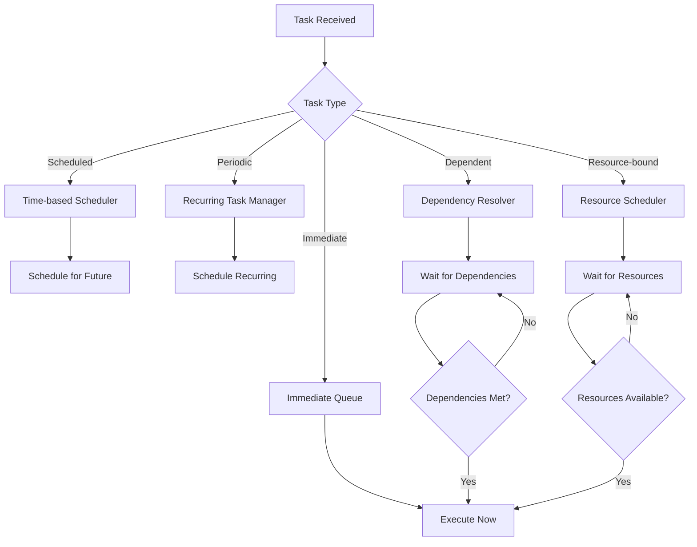

**Scheduling Features**:
- **Multi-queue prioritization**: Manages multiple priority queues
- **Real-time scheduling**: Handles immediate execution requirements
- **Time-based scheduling**: Plans tasks for specific future times
- **Periodic scheduling**: Manages recurring security tasks
- **Calendar awareness**: Accommodates business calendars and events
- **Maintenance windows**: Aligns with system maintenance periods

### 3.2 Resource Allocator

The Resource Allocator manages and distributes system resources for task execution.

**Responsibilities**:
- Agent resource pool management
- Computational resource allocation
- External tool access management
- Resource reservation and release
- Resource contention resolution
- Resource utilization optimization

**Allocation Strategies**:
- **Priority-based allocation**: Assigns resources based on task priority
- **Fair-share scheduling**: Ensures equitable resource distribution
- **Preemptive allocation**: Reallocates resources for critical tasks
- **Reservation system**: Supports advance resource reservation
- **Dynamic scaling**: Adapts to changing resource requirements

### 3.3 Shift Manager

The Shift Manager enables continuous 24/7 operations across operational periods.

**Responsibilities**:
- Operational period definition and management
- Shift transition coordination
- Operational tempo adjustment by shift
- Time-based policy enforcement
- Global time synchronization
- Follow-the-sun operations support

**Shift Transition Process**:

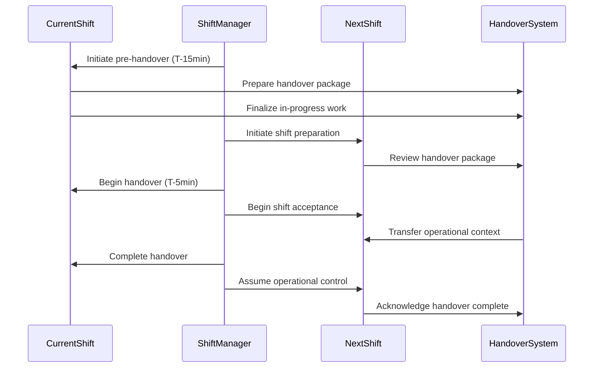

**Key Features**:
- **Shift templates**: Defines operational parameters for different shifts
- **Gradual transition**: Implements smooth handovers between shifts
- **Time zone awareness**: Manages operations across global time zones
- **Activity scheduling**: Aligns security activities to appropriate shifts
- **Shift optimization**: Adjusts shift patterns based on threat activity

### 3.4 Priority Engine

The Priority Engine manages task prioritization across the entire system.

**Prioritization Framework**:

| Priority Level | Description | Response Time | Preemption | Example Tasks |
|----------------|-------------|---------------|------------|--------------|
| P0 - Critical | Severe security incidents | Immediate | Can preempt all | Active breach, Critical vulnerability |
| P1 - High | Significant security issues | < 5 minutes | Can preempt P2-P4 | Malware detection, Suspicious admin activity |
| P2 - Medium | Important security tasks | < 30 minutes | Can preempt P3-P4 | Suspicious activity, Policy violations |
| P3 - Low | Routine security tasks | < 4 hours | Can preempt P4 | Scheduled scans, Non-critical alerts |
| P4 - Background | Non-time-sensitive tasks | Best effort | Non-preemptive | Report generation, Maintenance tasks |

**Priority Determination Factors**:
- Threat severity and impact
- Asset criticality
- Exploitation likelihood
- Business impact
- Time sensitivity
- Regulatory requirements
- Dependency relationships
- Resource availability

## 4. Continuity Systems

### 4.1 Handover System

The Handover System ensures seamless transition of operational context between shifts.

**Responsibilities**:
- Operational summary generation
- In-progress task transfer
- Active incident handover
- Critical information highlighting
- Explicit acknowledgement tracking
- Context continuity verification

**Handover Package Contents**:

```
{
  "handover_id": "HO-20251202-A",
  "timestamp": "2025-12-02T18:00:00Z",
  "from_shift": "APAC",
  "to_shift": "EMEA",
  "operational_summary": {
    "security_posture": "ELEVATED",
    "active_incidents": 3,
    "pending_tasks": 17,
    "completed_tasks": 142,
    "notable_events": [...]
  },
  "active_incidents": [
    {
      "incident_id": "INC-7291",
      "severity": "HIGH",
      "status": "CONTAINMENT",
      "assigned_agents": [...],
      "timeline": [...],
      "next_steps": [...]
    },
    ...
  ],
  "ongoing_tasks": [
    {
      "task_id": "T-18742",
      "type": "INVESTIGATION",
      "priority": "P1",
      "status": "IN_PROGRESS",
      "context": {...},
      "handover_notes": "..."
    },
    ...
  ],
  "watch_list": [
    {
      "item_id": "WL-291",
      "type": "SUSPICIOUS_IP",
      "value": "203.0.113.42",
      "reason": "Exhibited scanning behavior",
      "monitoring_since": "2025-12-02T14:23:17Z"
    },
    ...
  ],
  "resource_status": {...},
  "acknowledgement": {
    "required_by": "2025-12-02T18:15:00Z",
    "acknowledged_by": null,
    "acknowledgement_time": null
  }
}
```

**Key Features**:
- **Structured handover format**: Standardized template for shift transitions
- **Critical task highlighting**: Emphasizes high-priority in-progress work
- **Knowledge transfer**: Ensures context and insights are preserved
- **Explicit acknowledgement**: Requires formal acceptance of handover
- **Historical record**: Maintains history of all shift handovers

### 4.2 Context Persistence

The Context Persistence system maintains operational context across system states.

**Responsibilities**:
- Security operational state persistence
- Working context preservation
- In-progress task state management
- System recovery state preparation
- Contextual memory management
- Long-running operation state tracking

**Persistence Levels**:

| Level | Scope | Update Frequency | Retention | Purpose |
|-------|-------|------------------|-----------|---------|
| L1 - Immediate | Current activities | Real-time | Hours | Active operation support |
| L2 - Operational | Current shift | 5-minute snapshots | Days | Shift continuity |
| L3 - Tactical | Recent activity | Hourly snapshots | Weeks | Trend analysis |
| L4 - Strategic | Historical data | Daily snapshots | Years | Long-term analysis |

**Key Features**:
- **Transaction-based persistence**: Ensures data consistency
- **Point-in-time recovery**: Enables restoration to specific states
- **Contextual linking**: Maintains relationships between related items
- **Degradation management**: Handles graceful context degradation over time
- **Schema evolution**: Supports context schema changes over time

### 4.3 Incident Continuity

The Incident Continuity system ensures consistent handling of security incidents across shifts and system states.

**Responsibilities**:
- Incident state persistence
- Investigation continuity
- Evidence preservation
- Response action tracking
- Incident timeline maintenance
- Cross-shift incident coordination

**Incident State Model**:

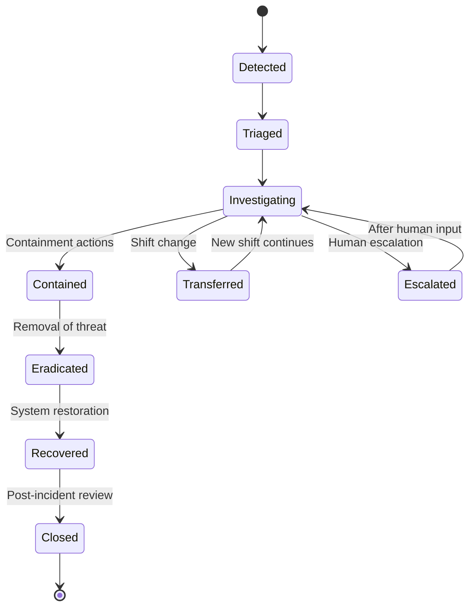

**Key Features**:
- **Immutable incident log**: Maintains complete incident history
- **Investigation continuity**: Preserves investigation context
- **Action tracking**: Records all response actions
- **Stakeholder communications**: Tracks all communications
- **Evidence management**: Links to preserved evidence
- **Timeline reconstruction**: Enables accurate incident timeline views

### 4.4 Task Tracking

The Task Tracking system maintains comprehensive records of all security tasks.

**Responsibilities**:
- Task state management
- Task execution history
- Task outcome recording
- Task timing metrics
- Task relationships mapping
- Task audit trail maintenance

**Task State Model**:

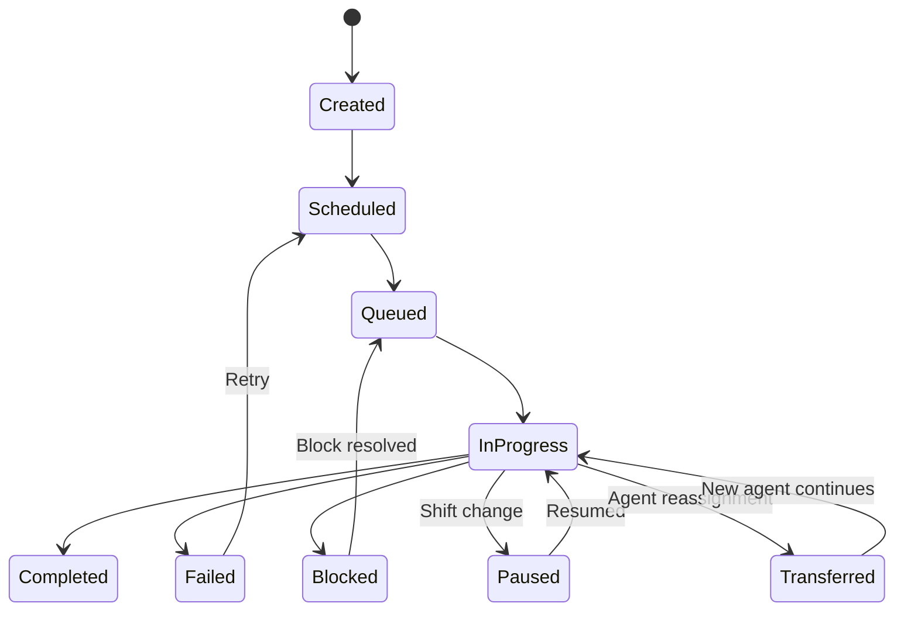

**Key Features**:
- **Real-time status**: Provides current state of all tasks
- **Status transitions**: Records all state changes
- **Execution metrics**: Captures performance data
- **Dependency tracking**: Manages task relationships
- **Global view**: Enables system-wide task status visibility
- **Historical analysis**: Supports performance trend analysis

## 5. Execution Framework

### 5.1 Playbook Executor

The Playbook Executor runs standardized security response procedures.

**Responsibilities**:
- Playbook template management
- Playbook instantiation and execution
- Playbook parameter binding
- Playbook execution monitoring
- Playbook results recording
- Playbook effectiveness evaluation

**Playbook Structure**:

```yaml
playbook:
  id: "PB-PHISHING-RESPONSE-V3"
  name: "Phishing Email Response"
  description: "Standard response to suspected phishing emails"
  version: "3.2.1"
  author: "L3 Phishing Response Agent"
  last_updated: "2025-10-15T14:22:17Z"
  
  inputs:
    - name: "email_id"
      type: "string"
      required: true
    - name: "reporter"
      type: "string"
      required: false
    - name: "urgency"
      type: "enum"
      values: ["low", "medium", "high", "critical"]
      default: "medium"
  
  steps:
    - id: "analyze_email"
      name: "Analyze Email Content"
      description: "Perform initial analysis of the email"
      agent: "PhishingAnalyst"
      action: "analyze_email_content"
      parameters:
        email_id: "{{inputs.email_id}}"
      outputs:
        analysis_result: "result"
      next:
        condition: "{{outputs.analysis_result.is_suspicious}}"
        if_true: "extract_iocs"
        if_false: "close_as_benign"
    
    - id: "extract_iocs"
      name: "Extract Indicators of Compromise"
      description: "Extract URLs, attachments, sender info"
      agent: "IOCManager"
      action: "extract_email_iocs"
      parameters:
        email_id: "{{inputs.email_id}}"
        analysis_result: "{{steps.analyze_email.outputs.analysis_result}}"
      next: "analyze_urls"
    
    # Additional steps...
    
  conditions:
    - id: "is_targeted_attack"
      description: "Determine if this is a targeted attack"
      expression: "{{steps.analyze_email.outputs.analysis_result.targeting_score > 0.7}}"
  
  outputs:
    - name: "resolution"
      value: "{{steps.determine_response.outputs.resolution}}"
    - name: "iocs_found"
      value: "{{steps.extract_iocs.outputs.iocs}}"
    - name: "risk_score"
      value: "{{steps.risk_assessment.outputs.risk_score}}"
```

**Key Features**:
- **Adaptive execution**: Adjusts playbook steps based on findings
- **Parallel execution**: Runs compatible steps concurrently
- **Version control**: Manages playbook versions and updates
- **Parameter validation**: Ensures required inputs are provided
- **Result validation**: Verifies step outputs against expected formats
- **Performance tracking**: Measures execution time and effectiveness

### 5.2 Task Dispatcher

The Task Dispatcher assigns security tasks to appropriate agents.

**Responsibilities**:
- Agent capability matching
- Agent availability management
- Task distribution optimization
- Cross-tier task assignment
- Agent load balancing
- Task batching and sequencing

**Dispatch Algorithm**:

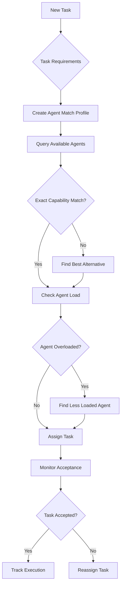

**Key Features**:
- **Skill-based routing**: Matches tasks to agent capabilities
- **Load-aware assignment**: Prevents agent overload
- **Affinity routing**: Routes related tasks to same agent
- **Fallback assignment**: Handles cases when optimal agent unavailable
- **Assignment learning**: Improves assignments based on outcomes
- **Task bundling**: Groups related tasks for efficiency

### 5.3 Workflow Engine

The Workflow Engine orchestrates complex, multi-step security processes.

**Responsibilities**:
- Workflow definition management
- Workflow instantiation and execution
- Workflow state tracking
- Error handling and recovery
- Workflow optimization
- Cross-workflow coordination

**Workflow Types**:

| Workflow Type | Characteristics | Examples |
|---------------|-----------------|----------|
| Linear | Sequential steps | Basic vulnerability scan |
| Branching | Decision-based paths | Incident investigation |
| Parallel | Concurrent activities | Threat hunting |
| State Machine | Explicit states | Incident response |
| Event-driven | Triggered by events | Alert management |
| Human-in-the-loop | Requires approvals | Critical system isolation |

**Key Features**:
- **Visual workflow designer**: Graphical workflow creation
- **Workflow templates**: Reusable workflow patterns
- **Execution monitoring**: Real-time workflow status
- **Failure recovery**: Handles step failures gracefully
- **Dynamic modification**: Adapts workflows during execution
- **Workflow analytics**: Measures workflow effectiveness

### 5.4 Agent Coordinator

The Agent Coordinator manages collaboration between agents for complex tasks.

**Responsibilities**:
- Multi-agent task coordination
- Agent team formation
- Inter-agent communication
- Collaborative decision making
- Agent conflict resolution
- Collective intelligence optimization

**Coordination Patterns**:

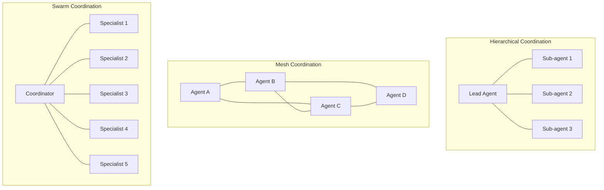

**Key Features**:
- **Team composition**: Forms optimal agent teams
- **Role assignment**: Assigns specific roles to team members
- **Communication facilitation**: Enables agent information sharing
- **Consensus mechanisms**: Resolves conflicting assessments
- **Skill complementarity**: Combines diverse agent capabilities
- **Dynamic reorganization**: Adjusts teams based on task evolution

## 6. Monitoring and Control

### 6.1 Performance Monitor

The Performance Monitor tracks and analyzes system operational metrics.

**Responsibilities**:
- System performance tracking
- Agent performance measurement
- Task execution metrics
- Response time monitoring
- Throughput analysis
- Quality metrics tracking

**Key Metrics**:

| Metric Type | Examples | Target |
|-------------|----------|--------|
| Speed | Mean Time to Detect (MTTD) | < 10 seconds |
| | Mean Time to Respond (MTTR) | < 5 minutes |
| | Mean Time to Resolve (MTTR) | < 60 minutes |
| Quality | False Positive Rate | < 5% |
| | Detection Accuracy | > 95% |
| | Incident Resolution Rate | > 98% |
| Efficiency | Agent Utilization | 60-80% |
| | Task Completion Rate | > 95% |
| | Resource Efficiency | > 85% |
| Timeliness | SLA Compliance | > 99.5% |
| | Queue Dwell Time | < 30 seconds |
| | Escalation Rate | < 10% |

**Key Features**:
- **Real-time dashboards**: Visualizes current performance
- **Trend analysis**: Identifies performance patterns
- **Anomaly detection**: Spots deviations from normal
- **Predictive analytics**: Forecasts performance issues
- **Comparative analysis**: Benchmarks against baselines
- **Drill-down capability**: Enables root cause analysis

### 6.2 Capacity Manager

The Capacity Manager ensures sufficient resources for security operations.

**Responsibilities**:
- Resource capacity planning
- Resource utilization tracking
- Capacity threshold monitoring
- Scaling recommendation generation
- Capacity bottleneck identification
- Capacity optimization

**Capacity Planning Process**:

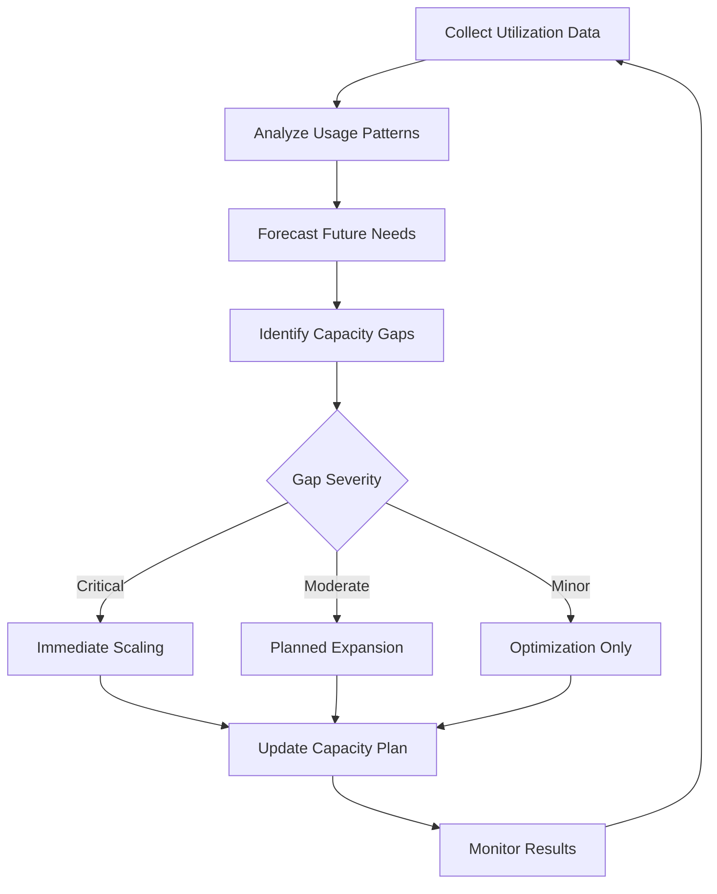

**Key Features**:
- **Utilization tracking**: Monitors resource usage patterns
- **Predictive modeling**: Forecasts capacity requirements
- **Auto-scaling support**: Enables dynamic resource scaling
- **Threshold alerting**: Warns of approaching capacity limits
- **Optimization recommendations**: Suggests efficiency improvements
- **Capacity simulation**: Tests "what-if" capacity scenarios

### 6.3 Load Balancer

The Load Balancer distributes workload to maintain system responsiveness.

**Responsibilities**:
- Task distribution optimization
- Workload leveling
- Agent load management
- Resource utilization balancing
- Hot-spot prevention
- Queue depth management

**Balancing Strategies**:

| Strategy | Description | Best For |
|----------|-------------|----------|
| Round Robin | Simple rotation among agents | Simple, similar tasks |
| Least Connection | Route to least busy agent | Variable complexity tasks |
| Weighted | Based on agent capacity | Heterogeneous agents |
| Response Time | Based on agent speed | Time-sensitive tasks |
| Skill-based | Based on specialized skills | Complex, specialized tasks |
| Adaptive | Self-adjusting based on performance | Dynamic environments |

**Key Features**:
- **Health checking**: Monitors agent availability
- **Overload protection**: Prevents agent saturation
- **Adaptive routing**: Adjusts based on current conditions
- **Session affinity**: Routes related tasks together
- **Graceful degradation**: Handles partial system failure
- **Burst handling**: Manages sudden workload spikes

### 6.4 Health Monitor

The Health Monitor ensures system and component health.

**Responsibilities**:
- System health tracking
- Component status monitoring
- Dependency health checking
- Error rate monitoring
- Performance anomaly detection
- Self-healing coordination

**Health Dashboard**:

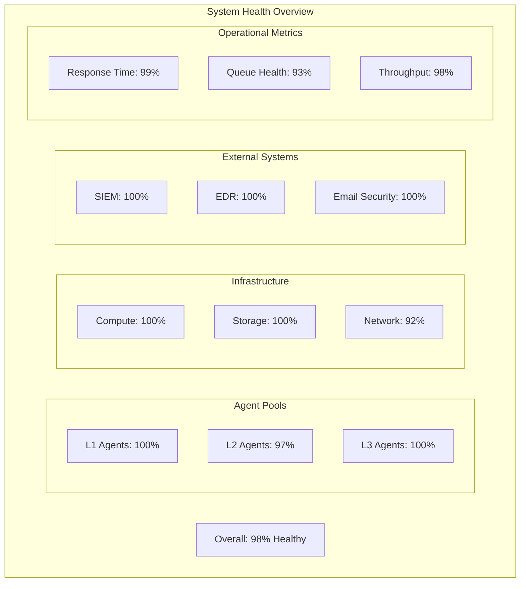

**Key Features**:
- **Comprehensive monitoring**: Tracks all system components
- **Dependency mapping**: Understands component relationships
- **Automated testing**: Proactively checks component health
- **Degradation detection**: Identifies gradual performance decline
- **Root cause analysis**: Determines source of health issues
- **Recovery orchestration**: Initiates self-healing procedures

## 7. Adaptive Systems

### 7.1 Learning Engine

The Learning Engine enables continuous improvement based on operational experience.

**Responsibilities**:
- Operational pattern recognition
- Performance improvement identification
- Best practice extraction
- Agent skill improvement
- Workflow optimization
- Security response refinement

**Learning Cycle**:

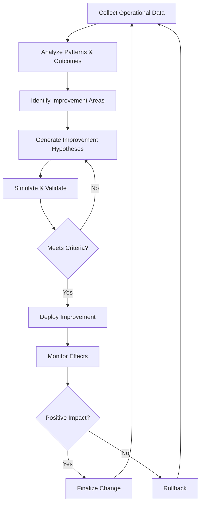

**Key Features**:
- **Performance analysis**: Identifies efficiency opportunities
- **Outcome-based learning**: Learns from success and failure
- **Pattern extraction**: Recognizes effective approaches
- **Cross-instance learning**: Applies learnings across similar tasks
- **A/B testing**: Tests alternative approaches
- **Continuous refinement**: Gradually improves over time

### 7.2 Workload Predictor

The Workload Predictor anticipates future operational demands.

**Responsibilities**:
- Security event forecasting
- Cyclical pattern recognition
- Anomalous activity prediction
- Resource requirement forecasting
- Capacity planning support
- Schedule optimization

**Prediction Dimensions**:

| Dimension | Timeframe | Examples |
|-----------|-----------|----------|
| Short-term | Minutes/Hours | Alert spikes, Active incident evolution |
| Mid-term | Days/Weeks | Patch Tuesday impact, Campaign activity |
| Long-term | Months/Quarters | Seasonal trends, Threat landscape shifts |

**Key Features**:
- **Time-series analysis**: Identifies temporal patterns
- **Seasonal adjustment**: Accounts for cyclical variations
- **Anomaly anticipation**: Predicts unusual activity
- **Multi-factor modeling**: Considers diverse influence factors
- **Confidence intervals**: Provides prediction certainty levels
- **Adaptive forecasting**: Improves with additional data

### 7.3 Optimization Engine

The Optimization Engine continuously improves operational efficiency.

**Responsibilities**:
- Resource utilization optimization
- Process efficiency improvement
- Workflow streamlining
- Task sequence optimization
- Response timing refinement
- Cost-effectiveness enhancement

**Optimization Areas**:

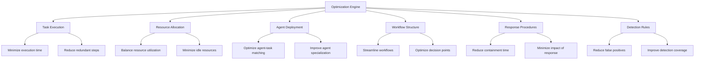

**Key Features**:
- **Continuous improvement**: Automatically identifies efficiencies
- **Multi-objective optimization**: Balances competing priorities
- **Constraint-aware**: Respects operational constraints
- **Incremental refinement**: Makes gradual improvements
- **Evidence-based**: Relies on operational data
- **Impact analysis**: Evaluates optimization effects

### 7.4 Simulation Engine

The Simulation Engine tests operational changes before implementation.

**Responsibilities**:
- Process change simulation
- Capacity planning validation
- Response procedure testing
- New agent capability validation
- Failure scenario testing
- Performance impact prediction

**Simulation Types**:

| Simulation Type | Purpose | Examples |
|-----------------|---------|----------|
| Process | Test workflow changes | New incident response process |
| Load | Validate capacity | Peak traffic handling |
| Failure | Test resilience | Component outage response |
| Security | Test security measures | New attack scenario |
| Configuration | Test configuration changes | New tool integration |
| Agent | Test new agent capabilities | L2 to L1 task shifting |

**Key Features**:
- **Digital twin**: Maintains virtual replica of operational environment
- **Scenario testing**: Tests multiple operational scenarios
- **What-if analysis**: Explores potential changes
- **Risk assessment**: Identifies potential issues
- **Performance prediction**: Forecasts impact of changes
- **Confidence scoring**: Rates prediction reliability

## 8. Operational Modes

### 8.1 Standard Operations

The default mode for day-to-day security operations.

**Characteristics**:
- Balanced resource allocation
- Standard response procedures
- Normal monitoring cadence
- Routine task scheduling
- Regular reporting cycles
- Standard approval thresholds

**Task Distribution**:
- 70% routine monitoring and maintenance
- 20% alert investigation and triage
- 5% proactive hunting and testing
- 5% improvement and optimization

### 8.2 Heightened Alert Mode

Activated during periods of increased threat activity.

**Characteristics**:
- Increased monitoring frequency
- Enhanced detection sensitivity
- Accelerated response procedures
- Proactive hunting activation
- Temporary control strengthening
- Lower escalation thresholds

**Activation Triggers**:
- Multiple related security incidents
- Credible threat intelligence
- Industry-wide attack campaigns
- Critical vulnerability disclosure
- Significant external events

### 8.3 Incident Response Mode

Activated during active security incidents.

**Characteristics**:
- Priority resource allocation to incident
- Incident-specific workflow activation
- Accelerated decision-making
- Stakeholder communication protocols
- Evidence preservation focus
- Regular status updates

**Operational Adjustments**:
- Non-critical task deferral
- Incident response team formation
- Enhanced logging and monitoring
- Specialized playbook activation
- Rapid containment authorization
- Recovery preparation

### 8.4 Maintenance Mode

Scheduled mode for system updates and maintenance.

**Characteristics**:
- Reduced operational tempo
- Graceful task completion
- System component cycling
- Data maintenance activities
- Deferred non-critical alerting
- Systematic resource release

**Activities**:
- Agent update deployment
- Knowledge base refresh
- Model retraining
- Configuration updates
- Performance optimization
- Data archiving and cleanup

### 8.5 Recovery Mode

Activated following system disruption or failure.

**Characteristics**:
- Systematic component restoration
- Prioritized service resumption
- State reconstruction
- Data consistency verification
- Backlog management
- Gradual capacity restoration

**Recovery Sequence**:
1. Core system components
2. Critical security monitoring
3. Alert processing capabilities
4. Automated response functions
5. Routine security operations
6. Optimization and enhancement functions

## 9. Resilience and Reliability

### 9.1 Fault Tolerance Architecture

The AWE implements comprehensive fault tolerance to ensure continuous operations.

**Resilience Principles**:
- No single point of failure
- Graceful degradation under load
- Stateful recovery after disruption
- Predictable failure modes
- Comprehensive error handling
- Self-healing capabilities

**Component Redundancy**:

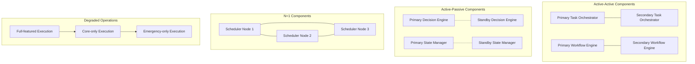

**Key Features**:
- **Component isolation**: Prevents cascading failures
- **State replication**: Maintains operational state across components
- **Automated failover**: Redirects work from failed components
- **Request retry logic**: Handles transient failures
- **Circuit breakers**: Prevents overwhelming failed components
- **Fault detection**: Rapidly identifies component failures

### 9.2 High Availability Design

The AWE is designed for 99.99% availability (less than 1 hour of downtime per year).

**Availability Strategy**:

| Component | Redundancy Approach | Recovery Time |
|-----------|---------------------|---------------|
| Core Orchestration | Active-Active | Instant |
| Workflow Engine | Active-Active | < 10 seconds |
| Task Execution | Distributed Pool | < 30 seconds |
| State Management | Active-Passive | < 1 minute |
| Knowledge Base | Multi-region Sync | < 5 minutes |

**Key Features**:
- **Geographic distribution**: Spans multiple physical locations
- **Infrastructure redundancy**: Duplicates critical infrastructure
- **Cross-zone operations**: Operates across availability zones
- **Asynchronous processing**: Minimizes synchronous dependencies
- **Degraded mode capability**: Maintains core functions during issues
- **Recovery automation**: Self-heals from common failures

### 9.3 Disaster Recovery

Comprehensive recovery capabilities for major disruptions.

**Recovery Objectives**:
- Recovery Time Objective (RTO): < 15 minutes
- Recovery Point Objective (RPO): < 30 seconds
- Functional Recovery: Phased approach (critical → non-critical)

**Recovery Process**:

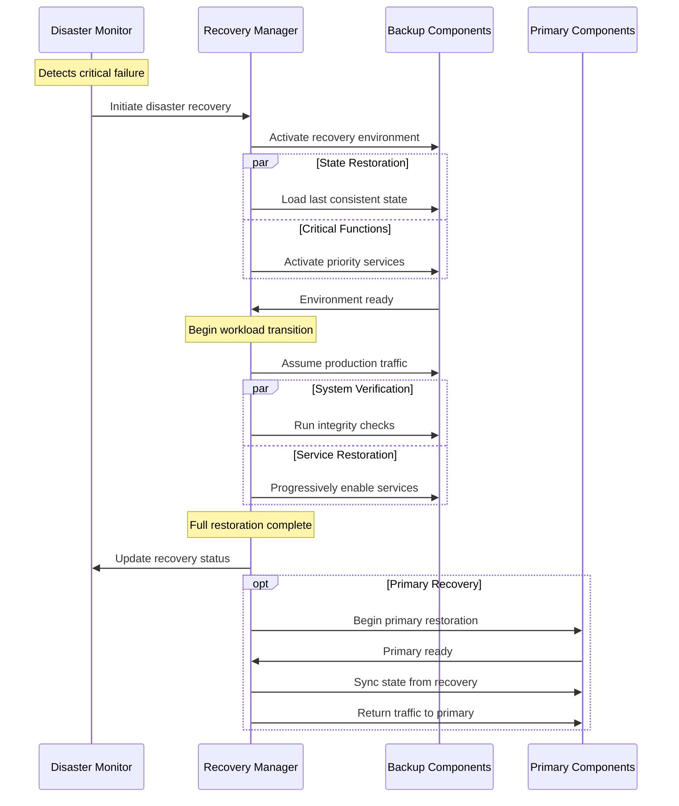

**Key Features**:
- **Automated detection**: Identifies disaster conditions
- **State consistent recovery**: Maintains operational integrity
- **Prioritized restoration**: Restores critical functions first
- **Testing program**: Regularly validates recovery capabilities
- **Documentation**: Maintains comprehensive recovery procedures
- **Cross-training**: Ensures operational knowledge redundancy

## 10. Implementation Considerations

### 10.1 Component Architecture

**Core Services Implementation**:

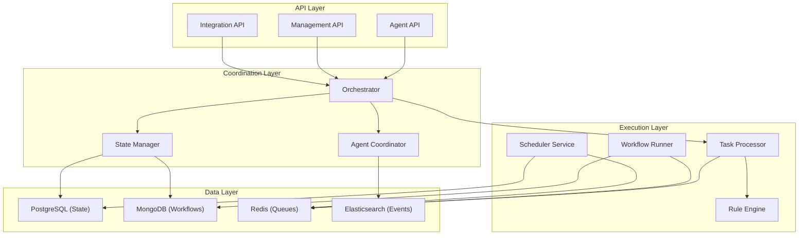

### 10.2 Deployment Architecture

**Implementation Tiers**:

| Tier | Function | Components | Scaling Approach |
|------|----------|------------|------------------|
| Control Plane | Orchestration & management | Orchestrator, State Manager, APIs | Horizontal with leader election |
| Execution Plane | Task execution | Task Processor, Workflow Runner, Agent Coordinator | Horizontal with work distribution |
| Data Plane | State storage | Databases, Queues, Event Store | Clustered with replication |
| Integration Plane | External connectivity | Integration API, Connectors, Gateways | Horizontal with load balancing |

### 10.3 Performance Considerations

**System Sizing**:

- **Core Processing**: Handle 10,000+ security events per second
- **Task Execution**: Support 1,000+ concurrent tasks
- **Agent Coordination**: Manage 500+ specialized agents
- **State Management**: Maintain state for millions of entities
- **API Throughput**: Process 5,000+ API requests per second

**Optimization Areas**:
- In-memory processing for time-critical operations
- Efficient state management to minimize I/O
- Query optimization for state retrieval
- Message batching for high-volume events
- Partial state updates for efficiency
- Aggressive caching of reference data

### 10.4 Migration Path

**Phased Implementation Approach**:

1. **Foundation Phase**
   - Core orchestration engine
   - Basic task scheduling
   - Single-agent coordination
   - Manual workflow execution

2. **Enhancement Phase**
   - Multi-agent coordination
   - Automated workflow execution
   - 24/7 operational capabilities
   - Basic self-healing

3. **Optimization Phase**
   - Advanced workflow automation
   - Learning-based improvements
   - Predictive workload management
   - Full self-healing capabilities

4. **Excellence Phase**
   - Autonomous security operations
   - Advanced simulation capabilities
   - Cross-organization integration
   - Continuous self-evolution