# Component Diagrams for Major Subsystems

## 1. Overview

This document contains detailed component diagrams for the major subsystems of the Agentic SOC architecture. These diagrams provide a deeper view of the internal architecture, component relationships, and interfaces for each key subsystem.

## 2. Agent Hierarchy Manager

The Agent Hierarchy Manager subsystem coordinates the tiered agent framework, managing escalation paths and agent specialization.

### 2.1 Component Diagram

```mermaid
graph TD
    classDef core fill:#f9d5e5,stroke:#d64161,stroke-width:2px
    classDef agent fill:#d5e8f9,stroke:#417cd6,stroke-width:2px
    classDef routing fill:#e8f9d5,stroke:#7cd641,stroke-width:2px
    classDef oversight fill:#f9e8d5,stroke:#d6a041,stroke-width:2px

    %% Core Components
    AHM[Agent Hierarchy Manager]
    AHM --> AgentRegistry[Agent Registry]
    AHM --> EscalationEngine[Escalation Engine]
    AHM --> AgentOrchestrator[Agent Orchestrator]
    AHM --> OversightBridge[Oversight Bridge]
    
    %% Agent Registry Components
    AgentRegistry --> AgentCatalog[Agent Catalog]
    AgentRegistry --> AgentFactory[Agent Factory]
    AgentRegistry --> AgentProfiler[Agent Profiler]
    AgentRegistry --> CapabilityIndex[Capability Index]
    
    %% Escalation Engine Components
    EscalationEngine --> EscalationPolicies[Escalation Policies]
    EscalationEngine --> DecisionThresholds[Decision Thresholds]
    EscalationEngine --> EscalationRouter[Escalation Router]
    EscalationEngine --> HumanEscalator[Human Escalator]
    
    %% Agent Orchestrator Components
    AgentOrchestrator --> AgentSelector[Agent Selector]
    AgentOrchestrator --> AgentScheduler[Agent Scheduler]
    AgentOrchestrator --> TaskDistributor[Task Distributor] 
    AgentOrchestrator --> PerformanceMonitor[Performance Monitor]
    
    %% Oversight Bridge Components
    OversightBridge --> HumanInterface[Human Interface]
    OversightBridge --> DecisionAuditor[Decision Auditor]
    OversightBridge --> ApprovalManager[Approval Manager]
    OversightBridge --> OversightNotifier[Oversight Notifier]
    
    %% Agent Tiers
    AgentCatalog --> L1Agents[L1 Agents]
    AgentCatalog --> L2Agents[L2 Agents]
    AgentCatalog --> L3Agents[L3 Agents]
    
    %% Connections to other systems
    AgentOrchestrator -.-> ModelIntegration[AI Model Integration]
    EscalationEngine -.-> WorkflowEngine[Workflow Engine]
    OversightBridge -.-> NLInterface[Natural Language Interface]
    AgentProfiler -.-> AnalyticsPlatform[Analytics Platform]

    %% Classes
    class AgentRegistry,AgentCatalog,AgentFactory,AgentProfiler,CapabilityIndex agent
    class EscalationEngine,EscalationPolicies,DecisionThresholds,EscalationRouter,HumanEscalator routing
    class OversightBridge,HumanInterface,DecisionAuditor,ApprovalManager,OversightNotifier oversight
    class AHM,AgentOrchestrator,AgentSelector,AgentScheduler,TaskDistributor,PerformanceMonitor core
```

### 2.2 Component Descriptions

#### Agent Registry

| Component | Description |
|-----------|-------------|
| Agent Catalog | Maintains the inventory of all available agents, their capabilities, and tier classification |
| Agent Factory | Creates and initializes agent instances based on templates and configurations |
| Agent Profiler | Tracks agent performance, specialization, and effectiveness metrics |
| Capability Index | Maps security capabilities to specific agents and provides capability-based lookup |

#### Escalation Engine

| Component | Description |
|-----------|-------------|
| Escalation Policies | Defines rules and conditions that trigger escalation between agent tiers |
| Decision Thresholds | Configurable parameters that determine when decisions require escalation |
| Escalation Router | Routes escalations to appropriate higher-tier agents or human oversight |
| Human Escalator | Manages escalations specifically directed to Dad/human oversight |

#### Agent Orchestrator

| Component | Description |
|-----------|-------------|
| Agent Selector | Selects the most appropriate agent for a given task based on context and requirements |
| Agent Scheduler | Manages agent workloads and ensures optimal resource allocation |
| Task Distributor | Assigns tasks to agents and tracks task states throughout execution |
| Performance Monitor | Tracks agent performance metrics and identifies optimization opportunities |

#### Oversight Bridge

| Component | Description |
|-----------|-------------|
| Human Interface | Provides interfaces for human supervisors to interact with the agent hierarchy |
| Decision Auditor | Records and audits agent decisions, particularly those requiring oversight |
| Approval Manager | Manages requests for supervisor approval and tracks approval workflows |
| Oversight Notifier | Sends alerts and notifications to human supervisors based on defined triggers |

### 2.3 Interface Specifications

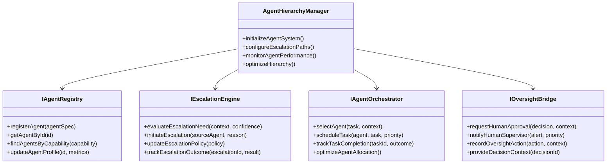

## 3. AI Model Integration Framework

The AI Model Integration Framework manages the deployment, usage, and coordination of the DeepSeek-Coder-V2 and Llama-3.1-70B models.

### 3.1 Component Diagram

```mermaid
graph TD
    classDef core fill:#f9d5e5,stroke:#d64161,stroke-width:2px
    classDef router fill:#d5e8f9,stroke:#417cd6,stroke-width:2px
    classDef models fill:#e8f9d5,stroke:#7cd641,stroke-width:2px
    classDef context fill:#f9e8d5,stroke:#d6a041,stroke-width:2px
    classDef optimization fill:#e5d5f9,stroke:#8141d6,stroke-width:2px

    %% Core Components
    AIMIF[AI Model Integration Framework]
    AIMIF --> ModelRouter[Model Router]
    AIMIF --> ModelRegistry[Model Registry]
    AIMIF --> ContextManager[Context Manager]
    AIMIF --> InferenceOptimizer[Inference Optimizer]
    
    %% Model Router Components
    ModelRouter --> TaskAnalyzer[Task Analyzer]
    ModelRouter --> CapabilityMatcher[Capability Matcher]
    ModelRouter --> LoadBalancer[Load Balancer]
    ModelRouter --> FallbackHandler[Fallback Handler]
    
    %% Model Registry Components
    ModelRegistry --> DeepSeekRegistry[DeepSeek-Coder-V2]
    ModelRegistry --> LlamaRegistry[Llama-3.1-70B]
    ModelRegistry --> ModelHealthMonitor[Model Health Monitor]
    ModelRegistry --> VersionManager[Version Manager]
    
    %% Context Manager Components
    ContextManager --> ContextStore[Context Store]
    ContextManager --> ContextPrioritizer[Context Prioritizer]
    ContextManager --> WindowManager[Window Manager]
    ContextManager --> MemoizationEngine[Memoization Engine]
    
    %% Inference Optimizer Components
    InferenceOptimizer --> BatchProcessor[Batch Processor]
    InferenceOptimizer --> CacheManager[Cache Manager]
    InferenceOptimizer --> ResourceAllocator[Resource Allocator]
    InferenceOptimizer --> PriorityScheduler[Priority Scheduler]
    
    %% Model Implementations
    DeepSeekRegistry --> DSInferenceService[DS Inference Service]
    DeepSeekRegistry --> DSModelProvider[DS Model Provider]
    
    LlamaRegistry --> LlamaInferenceService[Llama Inference Service]
    LlamaRegistry --> LlamaModelProvider[Llama Model Provider]
    
    %% Connections to other systems
    ModelRouter -.-> AgentHierarchy[Agent Hierarchy Manager]
    ContextManager -.-> DataPlatform[Security Data Platform]
    InferenceOptimizer -.-> PerformanceMonitoring[Performance Monitoring]

    %% Classes
    class AIMIF,ModelRegistry,DeepSeekRegistry,LlamaRegistry,ModelHealthMonitor,VersionManager core
    class ModelRouter,TaskAnalyzer,CapabilityMatcher,LoadBalancer,FallbackHandler router
    class DSInferenceService,DSModelProvider,LlamaInferenceService,LlamaModelProvider models
    class ContextManager,ContextStore,ContextPrioritizer,WindowManager,MemoizationEngine context
    class InferenceOptimizer,BatchProcessor,CacheManager,ResourceAllocator,PriorityScheduler optimization
```

### 3.2 Component Descriptions

#### Model Router

| Component | Description |
|-----------|-------------|
| Task Analyzer | Analyzes incoming tasks to determine the required AI capabilities |
| Capability Matcher | Maps task requirements to specific model capabilities |
| Load Balancer | Distributes inference requests based on model availability and load |
| Fallback Handler | Manages fallback options when primary model selection is unavailable |

#### Model Registry

| Component | Description |
|-----------|-------------|
| DeepSeek-Coder-V2 | Registry for DeepSeek-Coder-V2 model configurations and instances |
| Llama-3.1-70B | Registry for Llama-3.1-70B model configurations and instances |
| Model Health Monitor | Tracks model health, performance, and availability metrics |
| Version Manager | Manages model versions, updates, and compatibility |

#### Context Manager

| Component | Description |
|-----------|-------------|
| Context Store | Maintains conversation and operational context for AI models |
| Context Prioritizer | Prioritizes context elements based on relevance and importance |
| Window Manager | Manages context window utilization for optimal token usage |
| Memoization Engine | Caches previous contexts and responses for efficiency |

#### Inference Optimizer

| Component | Description |
|-----------|-------------|
| Batch Processor | Batches similar inference requests for improved throughput |
| Cache Manager | Manages response caching for frequently requested inferences |
| Resource Allocator | Dynamically allocates compute resources based on priority |
| Priority Scheduler | Schedules inference requests based on operational priority |

### 3.3 Interface Specifications

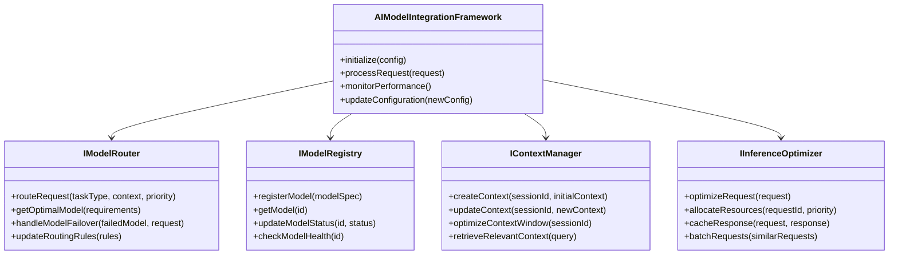

## 4. Autonomous Workflow Engine

The Autonomous Workflow Engine manages the 24/7 operational workflows, task scheduling, and process automation for the Agentic SOC.

### 4.1 Component Diagram

```mermaid
graph TD
    classDef core fill:#f9d5e5,stroke:#d64161,stroke-width:2px
    classDef workflow fill:#d5e8f9,stroke:#417cd6,stroke-width:2px
    classDef task fill:#e8f9d5,stroke:#7cd641,stroke-width:2px
    classDef time fill:#f9e8d5,stroke:#d6a041,stroke-width:2px
    classDef monitoring fill:#e5d5f9,stroke:#8141d6,stroke-width:2px

    %% Core Components
    AWE[Autonomous Workflow Engine]
    AWE --> WorkflowManager[Workflow Manager]
    AWE --> TaskOrchestrator[Task Orchestrator]
    AWE --> TemporalManager[Temporal Manager]
    AWE --> OperationalMonitor[Operational Monitor]
    
    %% Workflow Manager Components
    WorkflowManager --> WorkflowRegistry[Workflow Registry]
    WorkflowManager --> WorkflowDesigner[Workflow Designer]
    WorkflowManager --> WorkflowExecutor[Workflow Executor]
    WorkflowManager --> StateManager[State Manager]
    
    %% Task Orchestrator Components
    TaskOrchestrator --> TaskRegistry[Task Registry]
    TaskOrchestrator --> TaskScheduler[Task Scheduler]
    TaskOrchestrator --> DependencyResolver[Dependency Resolver]
    TaskOrchestrator --> TaskDispatcher[Task Dispatcher]
    
    %% Temporal Manager Components
    TemporalManager --> ShiftManager[Shift Manager]
    TemporalManager --> HandoverCoordinator[Handover Coordinator]
    TemporalManager --> SchedulingEngine[Scheduling Engine]
    TemporalManager --> TemporalAwareness[Temporal Awareness]
    
    %% Operational Monitor Components
    OperationalMonitor --> ActivityTracker[Activity Tracker]
    OperationalMonitor --> PerformanceAnalyzer[Performance Analyzer]
    OperationalMonitor --> ComplianceVerifier[Compliance Verifier]
    OperationalMonitor --> AnomalyDetector[Anomaly Detector]
    
    %% Workflow Types
    WorkflowRegistry --> SecurityWorkflows[Security Workflows]
    WorkflowRegistry --> MaintenanceWorkflows[Maintenance Workflows]
    WorkflowRegistry --> IncidentWorkflows[Incident Workflows]
    WorkflowRegistry --> ComplianceWorkflows[Compliance Workflows]
    
    %% Connections to other systems
    TaskDispatcher -.-> AgentHierarchy[Agent Hierarchy Manager]
    WorkflowExecutor -.-> IntegrationHub[Integration Hub]
    HandoverCoordinator -.-> OversightBridge[Oversight Bridge]
    OperationalMonitor -.-> ReportingSystem[Reporting System]

    %% Classes
    class AWE,WorkflowManager,WorkflowRegistry,WorkflowDesigner,WorkflowExecutor,StateManager core
    class SecurityWorkflows,MaintenanceWorkflows,IncidentWorkflows,ComplianceWorkflows workflow
    class TaskOrchestrator,TaskRegistry,TaskScheduler,DependencyResolver,TaskDispatcher task
    class TemporalManager,ShiftManager,HandoverCoordinator,SchedulingEngine,TemporalAwareness time
    class OperationalMonitor,ActivityTracker,PerformanceAnalyzer,ComplianceVerifier,AnomalyDetector monitoring
```

### 4.2 Component Descriptions

#### Workflow Manager

| Component | Description |
|-----------|-------------|
| Workflow Registry | Stores and manages workflow definitions, templates, and instances |
| Workflow Designer | Provides tools for creating, editing, and versioning workflows |
| Workflow Executor | Executes workflow instances and manages workflow state transitions |
| State Manager | Tracks and persists workflow state information |

#### Task Orchestrator

| Component | Description |
|-----------|-------------|
| Task Registry | Maintains the catalog of available tasks and their specifications |
| Task Scheduler | Schedules tasks based on priority, dependencies, and resource availability |
| Dependency Resolver | Resolves task dependencies and ensures proper execution order |
| Task Dispatcher | Dispatches tasks to appropriate execution engines and agents |

#### Temporal Manager

| Component | Description |
|-----------|-------------|
| Shift Manager | Manages the 24/7 operational shifts and agent assignments |
| Handover Coordinator | Coordinates workflow and context handover between shifts |
| Scheduling Engine | Handles time-based scheduling for recurring and future tasks |
| Temporal Awareness | Provides time context awareness for workflows and tasks |

#### Operational Monitor

| Component | Description |
|-----------|-------------|
| Activity Tracker | Tracks all workflow and task activities for auditing and analysis |
| Performance Analyzer | Analyzes workflow performance metrics and identifies bottlenecks |
| Compliance Verifier | Ensures workflows maintain compliance with defined policies |
| Anomaly Detector | Identifies abnormal workflow patterns and operational anomalies |

### 4.3 Interface Specifications

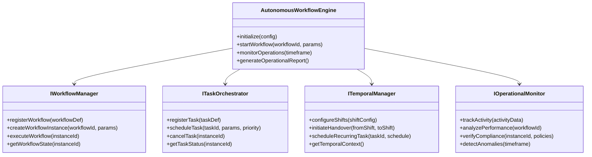

## 5. Natural Language Interface

The Natural Language Interface provides conversational interaction capabilities for security operations management and agent control.

### 5.1 Component Diagram

```mermaid
graph TD
    classDef core fill:#f9d5e5,stroke:#d64161,stroke-width:2px
    classDef understanding fill:#d5e8f9,stroke:#417cd6,stroke-width:2px
    classDef conversation fill:#e8f9d5,stroke:#7cd641,stroke-width:2px
    classDef generation fill:#f9e8d5,stroke:#d6a041,stroke-width:2px
    classDef security fill:#e5d5f9,stroke:#8141d6,stroke-width:2px

    %% Core Components
    NLI[Natural Language Interface]
    NLI --> UnderstandingEngine[Understanding Engine]
    NLI --> ConversationManager[Conversation Manager]
    NLI --> ResponseGenerator[Response Generator]
    NLI --> SecurityGuard[Security Guard]
    
    %% Understanding Engine Components
    UnderstandingEngine --> IntentRecognizer[Intent Recognizer]
    UnderstandingEngine --> EntityExtractor[Entity Extractor]
    UnderstandingEngine --> ContextAnalyzer[Context Analyzer]
    UnderstandingEngine --> QueryAnalyzer[Query Analyzer]
    
    %% Conversation Manager Components
    ConversationManager --> SessionManager[Session Manager]
    ConversationManager --> DialogStateTracker[Dialog State Tracker]
    ConversationManager --> HistoryManager[History Manager]
    ConversationManager --> MemoryManager[Memory Manager]
    
    %% Response Generator Components
    ResponseGenerator --> TemplateEngine[Template Engine]
    ResponseGenerator --> NLGenerator[NL Generator]
    ResponseGenerator --> FormattingEngine[Formatting Engine]
    ResponseGenerator --> PersonalizationEngine[Personalization Engine]
    
    %% Security Guard Components
    SecurityGuard --> CommandValidator[Command Validator]
    SecurityGuard --> PrivilegeVerifier[Privilege Verifier]
    SecurityGuard --> SensitivityFilter[Sensitivity Filter]
    SecurityGuard --> AuditLogger[Audit Logger]
    
    %% Command Processing
    IntentRecognizer --> SecurityCommands[Security Commands]
    IntentRecognizer --> AgentCommands[Agent Commands]
    IntentRecognizer --> QueryCommands[Query Commands]
    IntentRecognizer --> ConfigCommands[Config Commands]
    
    %% Connections to other systems
    IntentRecognizer -.-> AgentHierarchy[Agent Hierarchy Manager]
    QueryAnalyzer -.-> DataPlatform[Security Data Platform]
    CommandValidator -.-> AuthorizationSystem[Authorization System]
    ResponseGenerator -.-> AIModelIntegration[AI Model Integration]

    %% Classes
    class NLI,UnderstandingEngine,IntentRecognizer,EntityExtractor,ContextAnalyzer,QueryAnalyzer core
    class SecurityCommands,AgentCommands,QueryCommands,ConfigCommands understanding
    class ConversationManager,SessionManager,DialogStateTracker,HistoryManager,MemoryManager conversation
    class ResponseGenerator,TemplateEngine,NLGenerator,FormattingEngine,PersonalizationEngine generation
    class SecurityGuard,CommandValidator,PrivilegeVerifier,SensitivityFilter,AuditLogger security
```

### 5.2 Component Descriptions

#### Understanding Engine

| Component | Description |
|-----------|-------------|
| Intent Recognizer | Identifies the user's intention and command type from natural language input |
| Entity Extractor | Extracts named entities, parameters, and values from user queries |
| Context Analyzer | Analyzes the conversational and operational context of the interaction |
| Query Analyzer | Translates natural language queries into structured data requests |

#### Conversation Manager

| Component | Description |
|-----------|-------------|
| Session Manager | Manages user conversation sessions and state |
| Dialog State Tracker | Tracks the state and flow of multi-turn conversations |
| History Manager | Maintains conversation history for context and reference |
| Memory Manager | Provides short and long-term memory capabilities for conversations |

#### Response Generator

| Component | Description |
|-----------|-------------|
| Template Engine | Manages response templates for consistent output |
| NL Generator | Generates natural language responses from structured data |
| Formatting Engine | Formats responses with appropriate structure and styling |
| Personalization Engine | Adapts responses based on user preferences and roles |

#### Security Guard

| Component | Description |
|-----------|-------------|
| Command Validator | Validates commands against security policies and permissions |
| Privilege Verifier | Verifies user privileges for requested operations |
| Sensitivity Filter | Filters sensitive information from responses |
| Audit Logger | Logs all NLI interactions for security auditing |

### 5.3 Interface Specifications

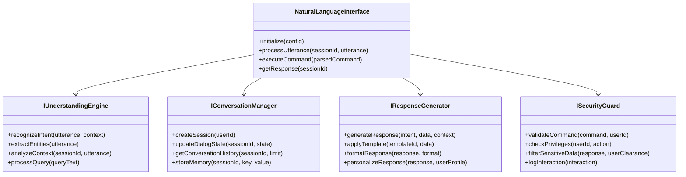

## 6. Anticipatory Defense System

The Anticipatory Defense System enables proactive security capabilities, threat prediction, and automated purple team operations.

### 6.1 Component Diagram

```mermaid
graph TD
    classDef core fill:#f9d5e5,stroke:#d64161,stroke-width:2px
    classDef prediction fill:#d5e8f9,stroke:#417cd6,stroke-width:2px
    classDef purple fill:#e8f9d5,stroke:#7cd641,stroke-width:2px
    classDef validation fill:#f9e8d5,stroke:#d6a041,stroke-width:2px
    classDef mitigation fill:#e5d5f9,stroke:#8141d6,stroke-width:2px

    %% Core Components
    ADS[Anticipatory Defense System]
    ADS --> ThreatPredictionEngine[Threat Prediction Engine]
    ADS --> PurpleTeamAutomation[Purple Team Automation]
    ADS --> DefenseValidation[Defense Validation]
    ADS --> ProactiveMitigation[Proactive Mitigation]
    
    %% Threat Prediction Engine Components
    ThreatPredictionEngine --> ThreatModeling[Threat Modeling]
    ThreatPredictionEngine --> PatternRecognition[Pattern Recognition]
    ThreatPredictionEngine --> BehaviorAnalytics[Behavior Analytics]
    ThreatPredictionEngine --> EmergingThreatAnalysis[Emerging Threat Analysis]
    
    %% Purple Team Automation Components
    PurpleTeamAutomation --> AttackSimulator[Attack Simulator]
    PurpleTeamAutomation --> ExploitLibrary[Exploit Library]
    PurpleTeamAutomation --> CampaignManager[Campaign Manager]
    PurpleTeamAutomation --> SafetyController[Safety Controller]
    
    %% Defense Validation Components
    DefenseValidation --> ControlsTester[Controls Tester]
    DefenseValidation --> DefenseAnalyzer[Defense Analyzer]
    DefenseValidation --> ResponseMeasurement[Response Measurement]
    DefenseValidation --> GapAnalyzer[Gap Analyzer]
    
    %% Proactive Mitigation Components
    ProactiveMitigation --> MitigationPlanner[Mitigation Planner]
    ProactiveMitigation --> RemediationOrchestrator[Remediation Orchestrator]
    ProactiveMitigation --> PreemptiveResponse[Preemptive Response]
    ProactiveMitigation --> AdaptiveDefense[Adaptive Defense]
    
    %% Threat Categories
    ThreatModeling --> KnownThreatModels[Known Threat Models]
    ThreatModeling --> CustomThreatModels[Custom Threat Models]
    ThreatModeling --> AdversaryEmulation[Adversary Emulation]
    
    %% Connections to other systems
    ThreatPredictionEngine -.-> AIModelIntegration[AI Model Integration]
    PurpleTeamAutomation -.-> ExternalSystemsIntegration[External Systems Integration]
    DefenseValidation -.-> SecurityDataPlatform[Security Data Platform]
    ProactiveMitigation -.-> AgentHierarchy[Agent Hierarchy Manager]

    %% Classes
    class ADS,ThreatPredictionEngine,ThreatModeling,PatternRecognition,BehaviorAnalytics,EmergingThreatAnalysis core
    class KnownThreatModels,CustomThreatModels,AdversaryEmulation prediction
    class PurpleTeamAutomation,AttackSimulator,ExploitLibrary,CampaignManager,SafetyController purple
    class DefenseValidation,ControlsTester,DefenseAnalyzer,ResponseMeasurement,GapAnalyzer validation
    class ProactiveMitigation,MitigationPlanner,RemediationOrchestrator,PreemptiveResponse,AdaptiveDefense mitigation
```

### 6.2 Component Descriptions

#### Threat Prediction Engine

| Component | Description |
|-----------|-------------|
| Threat Modeling | Creates and maintains threat models for anticipatory analysis |
| Pattern Recognition | Identifies patterns in security data that may indicate emerging threats |
| Behavior Analytics | Analyzes system and user behavior to detect anomalous patterns |
| Emerging Threat Analysis | Evaluates external threat intelligence for emerging threat vectors |

#### Purple Team Automation

| Component | Description |
|-----------|-------------|
| Attack Simulator | Simulates attack techniques in a controlled environment |
| Exploit Library | Maintains a library of exploits for controlled testing |
| Campaign Manager | Plans and coordinates automated attack campaigns |
| Safety Controller | Ensures all automated attack activities remain safe and controlled |

#### Defense Validation

| Component | Description |
|-----------|-------------|
| Controls Tester | Tests security controls against simulated threats |
| Defense Analyzer | Analyzes defense effectiveness against various attack vectors |
| Response Measurement | Measures detection and response capabilities |
| Gap Analyzer | Identifies gaps in defensive coverage |

#### Proactive Mitigation

| Component | Description |
|-----------|-------------|
| Mitigation Planner | Plans proactive mitigation strategies based on predictions |
| Remediation Orchestrator | Coordinates automated remediation activities |
| Preemptive Response | Implements preemptive security measures |
| Adaptive Defense | Dynamically adjusts defensive posture based on threat landscape |

### 6.3 Interface Specifications

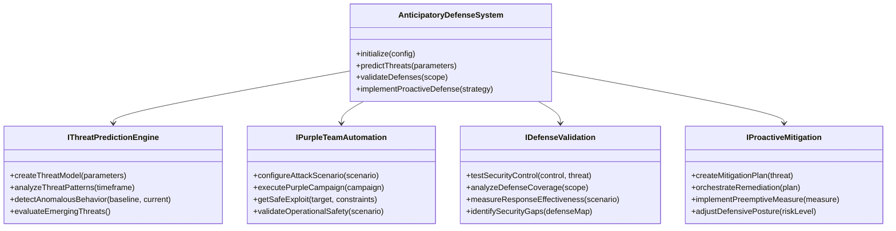

## 7. Security Data Platform

The Security Data Platform provides the data infrastructure, storage, analytics, and intelligence capabilities for the Agentic SOC.

### 7.1 Component Diagram

```mermaid
graph TD
    classDef core fill:#f9d5e5,stroke:#d64161,stroke-width:2px
    classDef ingest fill:#d5e8f9,stroke:#417cd6,stroke-width:2px
    classDef storage fill:#e8f9d5,stroke:#7cd641,stroke-width:2px
    classDef analytics fill:#f9e8d5,stroke:#d6a041,stroke-width:2px
    classDef intelligence fill:#e5d5f9,stroke:#8141d6,stroke-width:2px

    %% Core Components
    SDP[Security Data Platform]
    SDP --> DataIngestion[Data Ingestion]
    SDP --> DataStorage[Data Storage]
    SDP --> AnalyticsEngine[Analytics Engine]
    SDP --> IntelligencePlatform[Intelligence Platform]
    
    %% Data Ingestion Components
    DataIngestion --> DataCollectors[Data Collectors]
    DataIngestion --> NormalizationEngine[Normalization Engine]
    DataIngestion --> EnrichmentService[Enrichment Service]
    DataIngestion --> IngestMonitor[Ingest Monitor]
    
    %% Data Storage Components
    DataStorage --> SecurityDataLake[Security Data Lake]
    DataStorage --> TimeSeriesDB[Time Series DB]
    DataStorage --> GraphDB[Graph DB]
    DataStorage --> KnowledgeBase[Knowledge Base]
    
    %% Analytics Engine Components
    AnalyticsEngine --> QueryEngine[Query Engine]
    AnalyticsEngine --> VisualizationService[Visualization Service]
    AnalyticsEngine --> MLPipeline[ML Pipeline]
    AnalyticsEngine --> AnalyticsWorkbench[Analytics Workbench]
    
    %% Intelligence Platform Components
    IntelligencePlatform --> ThreatIntelService[Threat Intel Service]
    IntelligencePlatform --> VulnIntelService[Vuln Intel Service]
    IntelligencePlatform --> AssetIntelService[Asset Intel Service]
    IntelligencePlatform --> IdentityIntelService[Identity Intel Service]
    
    %% Data Categories
    SecurityDataLake --> SecurityEvents[Security Events]
    SecurityDataLake --> NetworkTraffic[Network Traffic]
    SecurityDataLake --> SystemLogs[System Logs]
    SecurityDataLake --> UserActivity[User Activity]
    
    %% Connections to other systems
    AnalyticsEngine -.-> AIModelIntegration[AI Model Integration]
    IntelligencePlatform -.-> AnticipatoryDefense[Anticipatory Defense]
    DataStorage -.-> ReportingSystem[Reporting System]
    DataIngestion -.-> ExternalSystemsIntegration[External Systems Integration]

    %% Classes
    class SDP,DataStorage,SecurityDataLake,TimeSeriesDB,GraphDB,KnowledgeBase core
    class DataIngestion,DataCollectors,NormalizationEngine,EnrichmentService,IngestMonitor ingest
    class SecurityEvents,NetworkTraffic,SystemLogs,UserActivity storage
    class AnalyticsEngine,QueryEngine,VisualizationService,MLPipeline,AnalyticsWorkbench analytics
    class IntelligencePlatform,ThreatIntelService,VulnIntelService,AssetIntelService,IdentityIntelService intelligence
```

### 7.2 Component Descriptions

#### Data Ingestion

| Component | Description |
|-----------|-------------|
| Data Collectors | Collects security data from various sources and systems |
| Normalization Engine | Normalizes data into consistent formats and schemas |
| Enrichment Service | Enriches raw data with context and additional information |
| Ingest Monitor | Monitors data ingestion for completeness and quality |

#### Data Storage

| Component | Description |
|-----------|-------------|
| Security Data Lake | Central repository for all security-related data |
| Time Series DB | Specialized storage for time-series security events |
| Graph DB | Graph database for relationship-based security data |
| Knowledge Base | Structured storage for security knowledge and reference data |

#### Analytics Engine

| Component | Description |
|-----------|-------------|
| Query Engine | Processes and executes queries across security data stores |
| Visualization Service | Creates visual representations of security data and analytics |
| ML Pipeline | Manages machine learning workflows for security analytics |
| Analytics Workbench | Interactive environment for security data analysis |

#### Intelligence Platform

| Component | Description |
|-----------|-------------|
| Threat Intel Service | Manages threat intelligence information |
| Vuln Intel Service | Manages vulnerability intelligence |
| Asset Intel Service | Maintains intelligence about protected assets |
| Identity Intel Service | Manages intelligence related to identities and users |

### 7.3 Interface Specifications

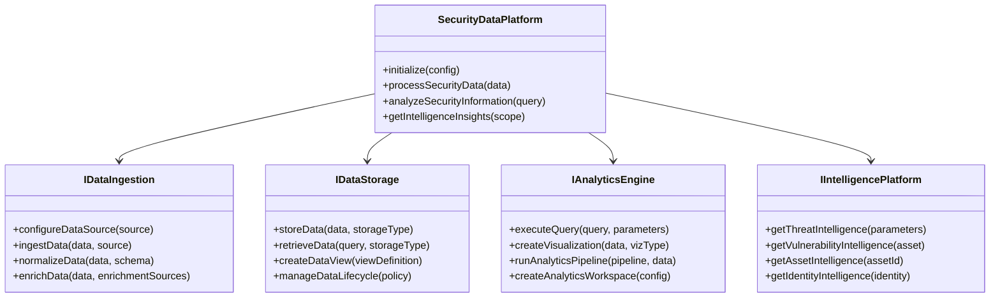

## 8. Integration Hub

The Integration Hub manages the connections, data flow, and operations between the Agentic SOC and external systems.

### 8.1 Component Diagram

```mermaid
graph TD
    classDef core fill:#f9d5e5,stroke:#d64161,stroke-width:2px
    classDef connectors fill:#d5e8f9,stroke:#417cd6,stroke-width:2px
    classDef data fill:#e8f9d5,stroke:#7cd641,stroke-width:2px
    classDef security fill:#f9e8d5,stroke:#d6a041,stroke-width:2px
    classDef management fill:#e5d5f9,stroke:#8141d6,stroke-width:2px

    %% Core Components
    IH[Integration Hub]
    IH --> ConnectorFramework[Connector Framework]
    IH --> DataExchange[Data Exchange]
    IH --> SecurityControls[Security Controls]
    IH --> IntegrationManagement[Integration Management]
    
    %% Connector Framework Components
    ConnectorFramework --> ConnectorRegistry[Connector Registry]
    ConnectorFramework --> ConnectorFactory[Connector Factory]
    ConnectorFramework --> ConnectorMonitoring[Connector Monitoring]
    ConnectorFramework --> ConnectorConfig[Connector Configuration]
    
    %% Data Exchange Components
    DataExchange --> MessageBroker[Message Broker]
    DataExchange --> TransformationService[Transformation Service]
    DataExchange --> DataValidator[Data Validator]
    DataExchange --> SchemaManager[Schema Manager]
    
    %% Security Controls Components
    SecurityControls --> AuthenticationService[Authentication Service]
    SecurityControls --> AuthorizationService[Authorization Service]
    SecurityControls --> EncryptionService[Encryption Service]
    SecurityControls --> AuditService[Audit Service]
    
    %% Integration Management Components
    IntegrationManagement --> IntegrationMonitor[Integration Monitor]
    IntegrationManagement --> ConfigManager[Configuration Manager]
    IntegrationManagement --> HealthCheck[Health Check]
    IntegrationManagement --> ErrorHandling[Error Handling]
    
    %% External System Connectors
    ConnectorRegistry --> ProofpointConnector[Proofpoint Connector]
    ConnectorRegistry --> CrowdStrikeConnector[CrowdStrike Connector]
    ConnectorRegistry --> Rapid7Connector[Rapid7 Connector]
    ConnectorRegistry --> JIRAConnector[JIRA Connector]
    ConnectorRegistry --> TeamsConnector[Teams Connector]
    ConnectorRegistry --> ObsidianConnector[Obsidian Connector]
    
    %% Connections to other systems
    DataExchange -.-> SecurityDataPlatform[Security Data Platform]
    ConnectorFramework -.-> WorkflowEngine[Workflow Engine]
    SecurityControls -.-> AuthenticationSystem[Authentication System]
    IntegrationManagement -.-> MonitoringSystem[Monitoring System]

    %% Classes
    class IH,ConnectorFramework,ConnectorRegistry,ConnectorFactory,ConnectorMonitoring,ConnectorConfig core
    class ProofpointConnector,CrowdStrikeConnector,Rapid7Connector,JIRAConnector,TeamsConnector,ObsidianConnector connectors
    class DataExchange,MessageBroker,TransformationService,DataValidator,SchemaManager data
    class SecurityControls,AuthenticationService,AuthorizationService,EncryptionService,AuditService security
    class IntegrationManagement,IntegrationMonitor,ConfigManager,HealthCheck,ErrorHandling management
```

### 8.2 Component Descriptions

#### Connector Framework

| Component | Description |
|-----------|-------------|
| Connector Registry | Maintains inventory of all integration connectors |
| Connector Factory | Creates and initializes connector instances |
| Connector Monitoring | Monitors connector health and performance |
| Connector Configuration | Manages connector configuration settings |

#### Data Exchange

| Component | Description |
|-----------|-------------|
| Message Broker | Routes messages between systems and components |
| Transformation Service | Transforms data between different formats and schemas |
| Data Validator | Validates data integrity and structure |
| Schema Manager | Manages data schemas for integrations |

#### Security Controls

| Component | Description |
|-----------|-------------|
| Authentication Service | Handles authentication for integrated systems |
| Authorization Service | Manages authorization for integration operations |
| Encryption Service | Provides encryption for data in transit and at rest |
| Audit Service | Logs and audits integration activities |

#### Integration Management

| Component | Description |
|-----------|-------------|
| Integration Monitor | Monitors overall integration health and performance |
| Configuration Manager | Manages integration configurations |
| Health Check | Performs system health checks on integrated components |
| Error Handling | Manages error detection, handling, and recovery |

### 8.3 Interface Specifications

```mermaid
classDiagram
    class IConnectorFramework {
        +registerConnector(connector)
        +getConnector(id)
        +monitorConnectorHealth(id)
        +updateConnectorConfig(id, config)
    }
    
    class IDataExchange {
        +sendMessage(destination, message)
        +transformData(data, targetSchema)
        +validateData(data, schema)
        +registerSchema(schema)
    }
    
    class ISecurityControls {
        +authenticateRequest(credentials)
        +authorizeOperation(principal, operation)
        +encryptData(data, context)
        +auditActivity(activity)
    }
    
    class IIntegrationManagement {
        +monitorIntegration(integrationId)
        +updateConfiguration(config)
        +performHealthCheck(component)
        +handleError(error, context)
    }
    
    class IntegrationHub {
        +initialize(config)
        +establishConnection(systemId)
        +exchangeData(source, destination, data)
        +monitorIntegrationHealth()
    }
    
    IntegrationHub --> IConnectorFramework
    IntegrationHub --> IDataExchange
    IntegrationHub --> ISecurityControls
    IntegrationHub --> IIntegrationManagement