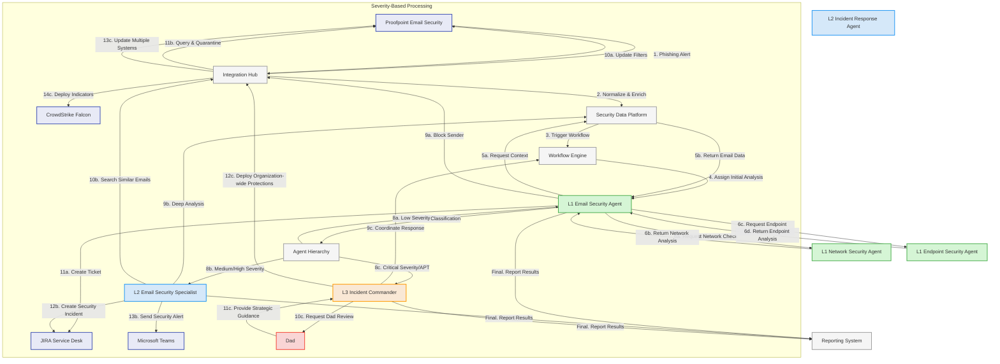
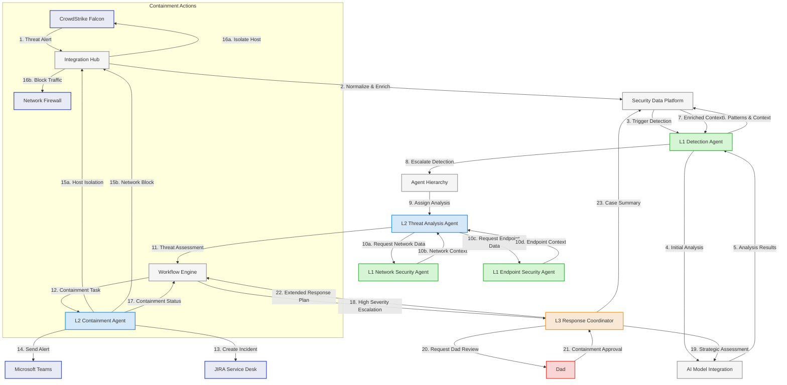
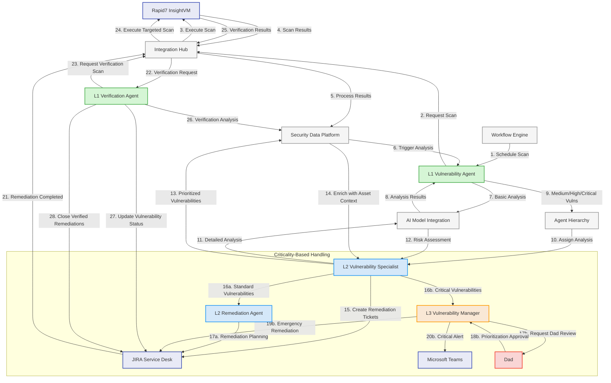
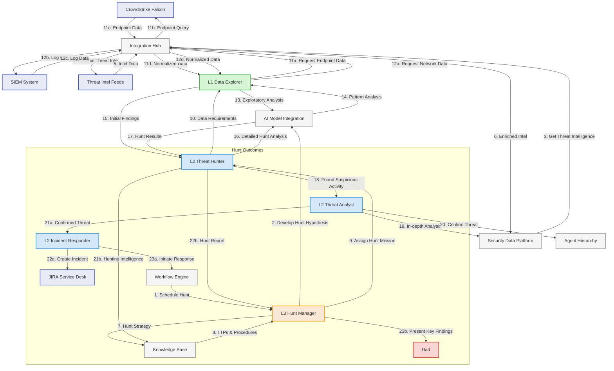
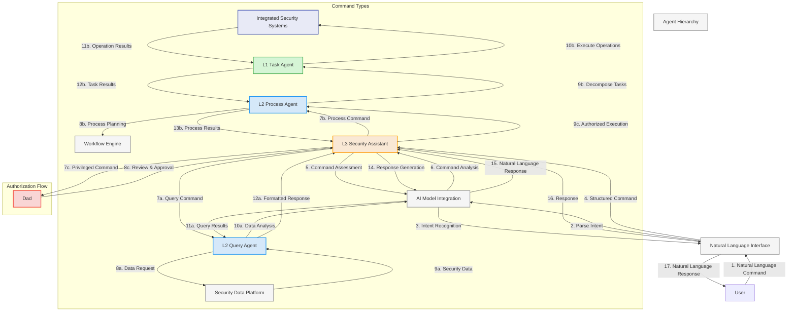
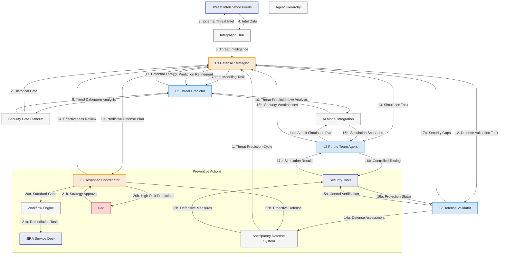

# Core Use Case Implementation

This document details how the Agentic SOC architecture implements the core security operations use cases, demonstrating how the architectural components work together to provide autonomous security operations with appropriate human oversight.

## 1. Automated Phishing Email Response Workflow

This use case demonstrates the handling of potential phishing emails from detection through response, with escalation where necessary.

### 1.1 Implementation Architecture

### 1.2 Workflow Implementation

The phishing email response process follows these steps:

1. **Detection & Ingestion**
   - Proofpoint identifies potential phishing email and sends alert via Integration Hub
   - Alert is normalized, enriched, and stored in Security Data Platform
   - Email Security workflow template is selected and instantiated

2. **L1 Initial Analysis**
   - L1 Email Security Agent is assigned initial analysis task
   - Agent retrieves email details from Proofpoint via API
   - Agent analyzes email content, headers, attachments, and URLs
   - Agent determines preliminary severity and confidence score

3. **Contextual Investigation**
   - L1 Email Security Agent requests network context from L1 Network Agent
   - L1 Email Security Agent requests endpoint context from L1 Endpoint Agent
   - Agents collaborate to correlate signals and enhance analysis

4. **Severity-Based Handling**:

   **Low Severity (Spam, Bulk, Known Patterns)**
   - L1 Email Security Agent handles independently
   - Agent blocks sender and updates spam filters
   - Agent creates low-priority ticket for record-keeping
   - Agent adds findings to knowledge base

   **Medium/High Severity (Targeted Phishing, Malware)**
   - Task escalates to L2 Email Security Specialist
   - L2 agent performs detailed analysis on email components
   - L2 agent searches for similar emails across organization
   - L2 agent quarantines similar emails and creates incident
   - L2 agent sends security alert to relevant teams

   **Critical Severity (Advanced Threat, APT)**
   - Task escalates to L3 Incident Commander
   - L3 agent organizes comprehensive incident response
   - L3 agent notifies Dad for strategic oversight
   - L3 agent coordinates organization-wide email protections
   - L3 agent deploys indicators to endpoint security tools
   - L3 agent manages JIRA incident and team communications

5. **Response Coordination**
   - Workflow Engine coordinates task assignments and status tracking
   - Integration Hub orchestrates actions across Proofpoint, JIRA, Teams
   - Security Data Platform maintains complete case record

6. **Analytics & Reporting**
   - All findings and actions are recorded for analysis
   - Reporting System generates metrics on phishing incidents
   - Knowledge gained is used to improve future detections

### 1.3 Decision Points and Escalation

| Decision Point | Criteria | Action |
|----------------|----------|--------|
| Initial Severity | Content analysis, sender reputation, blast radius | Route to appropriate tier |
| L1→L2 Escalation | Confidence < 85%, Targeted mail, Unknown techniques | Escalate to L2 Specialist |
| L2→L3 Escalation | Confidence < 70%, Campaign detected, Advanced techniques | Escalate to L3 Commander |
| Dad Oversight | Critical business impact, Novel attack vector, Blanket quarantine needed | Request Dad oversight |

### 1.4 Agent Specialization

| Agent | Tier | Specialized Skills |
|-------|------|-------------------|
| Email Security Agent | L1 | Email header analysis, spam pattern detection, URL analysis |
| Email Security Specialist | L2 | Advanced phishing analysis, campaign correlation, email forensics |
| Network Security Agent | L1 | Network IOC validation, traffic pattern analysis |
| Endpoint Security Agent | L1 | Endpoint IOC validation, process analysis |
| Incident Response Agent | L2 | Response coordination, containment actions |
| Incident Commander | L3 | Multi-faceted response, strategic planning |

### 1.5 AI Model Utilization

| Operation | Primary Model | Usage Pattern |
|-----------|--------------|--------------|
| Email Content Analysis | Llama-3.1-70B | NLP analysis of email text for phishing indicators |
| Header Analysis | DeepSeek-Coder-V2 | Technical analysis of email headers and routing |
| URL/Link Analysis | DeepSeek-Coder-V2 | Parsing and analysis of embedded URLs |
| Decision Making | Llama-3.1-70B | Reasoning about severity and required actions |
| Report Generation | Llama-3.1-70B | Natural language report generation |

### 1.6 Human Touchpoints

| Stage | Condition | Human Role |
|-------|-----------|------------|
| Level 3 Analysis | Critical severity | Dad reviews analysis and confirms response strategy |
| Org-wide Action | Mass quarantine | Dad approves organization-wide actions |
| Novel Attacks | Unknown phishing technique | Dad reviews findings to enhance knowledge base |

## 2. Autonomous Threat Detection and Containment

This use case demonstrates how the system autonomously detects, analyzes, and contains active security threats.

### 2.1 Implementation Architecture

### 2.2 Workflow Implementation

The threat detection and containment process follows these steps:

1. **Detection & Alerting**
   - CrowdStrike Falcon detects suspicious activity and alerts via Integration Hub
   - Alert is normalized, enriched, and stored in Security Data Platform
   - Detection workflow is triggered with appropriate template

2. **Initial Assessment**
   - L1 Detection Agent performs preliminary analysis of the alert
   - Agent enriches alert with context from Security Data Platform
   - Agent evaluates severity, confidence, and necessary response tier

3. **Threat Analysis**
   - L2 Threat Analysis Agent performs detailed investigation
   - Agent requests additional context from network and endpoint agents
   - Agent uses AI models to correlate activity with threat patterns
   - Agent identifies threat type, severity, and containment requirements

4. **Autonomous Containment**
   - L2 Containment Agent initiates immediate protective actions:
     * Host isolation via CrowdStrike Falcon
     * Network traffic blocking via firewalls
     * Account suspension via IAM systems if required
   - Agent creates incident ticket in JIRA
   - Agent sends alert notification to security team via Teams

5. **Escalation Management**
   - For high-severity threats, L3 Response Coordinator is activated
   - L3 agent evaluates business impact and extended response needs
   - For critical systems or extensive containment, Dad review is requested
   - After approval, L3 agent coordinates broader containment strategy

6. **Response Coordination**
   - Workflow Engine manages task assignments and status tracking
   - L2/L3 agents monitor containment effectiveness
   - Additional response actions are initiated as needed

7. **Investigation Workflow**
   - Parallel forensic investigation workflow is initiated
   - Findings feed back into containment and remediation activities

### 2.3 Decision Points and Escalation

| Decision Point | Criteria | Action |
|----------------|----------|--------|
| Initial Severity | Alert details, affected systems, confidence | Assign to appropriate tier |
| Containment Scope | System criticality, threat characteristics, spread potential | Determine containment approach |
| Containment Method | Threat type, attack vector, infrastructure type | Select appropriate containment actions |
| Dad Oversight | Business-critical systems, widespread impact, novel threat type | Request Dad approval for containment |

### 2.4 Agent Specialization

| Agent | Tier | Specialized Skills |
|-------|------|-------------------|
| Detection Agent | L1 | Alert triage, pattern recognition, preliminary threat assessment |
| Threat Analysis Agent | L2 | Advanced threat analysis, threat behavior modeling, IOC extraction |
| Containment Agent | L2 | Tactical containment operations, isolation procedures |
| Network Security Agent | L1 | Network visibility, traffic analysis, network containment |
| Endpoint Security Agent | L1 | Endpoint visibility, process analysis, endpoint containment |
| Response Coordinator | L3 | Multi-system containment, business impact assessment |

### 2.5 AI Model Utilization

| Operation | Primary Model | Usage Pattern |
|-----------|--------------|--------------|
| Alert Correlation | DeepSeek-Coder-V2 | Technical pattern matching and correlation |
| Threat Assessment | Llama-3.1-70B | Reasoned analysis of threat characteristics |
| Containment Planning | Llama-3.1-70B | Strategic decision-making for containment actions |
| Technical API Operations | DeepSeek-Coder-V2 | Crafting precise API calls for containment |
| Impact Assessment | Llama-3.1-70B | Business impact evaluation and risk assessment |

### 2.6 Human Touchpoints

| Stage | Condition | Human Role |
|-------|-----------|------------|
| Containment Approval | High business impact systems | Dad reviews and approves critical containment |
| Extended Response | Complex attack scenario | Dad provides input on extended response plan |
| Containment Verification | Novel containment challenges | Dad verifies containment effectiveness |

## 3. Vulnerability Management

This use case demonstrates how the system autonomously manages the vulnerability lifecycle from scanning to verification of remediation.

### 3.1 Implementation Architecture

### 3.2 Workflow Implementation

The vulnerability management process follows these steps:

1. **Vulnerability Scanning**
   - Workflow Engine schedules regular vulnerability scans
   - L1 Vulnerability Agent initiates scan via Rapid7 InsightVM
   - Scan results are imported into Security Data Platform
   - Initial scan results are processed and normalized

2. **Initial Vulnerability Analysis**
   - L1 Vulnerability Agent performs initial triage of findings
   - Agent filters out false positives and low-priority items
   - Agent categorizes vulnerabilities by type, severity, impact
   - Medium to critical vulnerabilities are escalated to L2

3. **Detailed Analysis and Prioritization**
   - L2 Vulnerability Specialist performs detailed analysis
   - Agent correlates vulnerabilities with asset criticality data
   - Agent assesses exploitability, exposure, and business impact
   - Agent generates risk-based prioritization of vulnerabilities

4. **Remediation Management**
   - L2 Vulnerability Specialist creates remediation tickets in JIRA
   - Tickets include vulnerability details and remediation guidance
   - Agent sets appropriate due dates based on severity and SLAs
   - For critical vulnerabilities requiring emergency patching:
     * Escalation to L3 Vulnerability Manager
     * L3 agent requests Dad review of critical system patches
     * After approval, emergency remediation process is initiated
     * Security alerts are sent to relevant teams

5. **Remediation Verification**
   - When remediation is marked complete in JIRA
   - L1 Verification Agent requests targeted verification scan
   - Agent analyzes verification results for each remediated vulnerability
   - Successfully remediated items are closed in JIRA
   - Failed remediations are reopened with additional context

6. **Reporting and Analytics**
   - Vulnerability metrics are tracked over time
   - Remediation effectiveness is measured and reported
   - Trends and patterns inform security improvement initiatives

### 3.3 Decision Points and Escalation

| Decision Point | Criteria | Action |
|----------------|----------|--------|
| Vulnerability Severity | CVSS score, exploitability, asset value | Determine handling tier |
| Remediation Priority | Business impact, exploitation risk, fix complexity | Set SLA and urgency |
| Dad Oversight | Critical systems patching, emergency changes, compliance deadlines | Request Dad approval |
| Verification Method | Vulnerability type, system accessibility, patch mechanism | Select verification approach |

### 3.4 Agent Specialization

| Agent | Tier | Specialized Skills |
|-------|------|-------------------|
| Vulnerability Agent | L1 | Scan operation, basic vulnerability assessment, false positive detection |
| Vulnerability Specialist | L2 | Advanced vulnerability analysis, exploitation potential assessment |
| Verification Agent | L1 | Remediation verification, technical validation, regression testing |
| Remediation Agent | L2 | Remediation planning, guidance creation, SLA management |
| Vulnerability Manager | L3 | Critical vulnerability coordination, business impact assessment |

### 3.5 AI Model Utilization

| Operation | Primary Model | Usage Pattern |
|-----------|--------------|--------------|
| Vulnerability Analysis | DeepSeek-Coder-V2 | Technical vulnerability assessment and exploitation potential |
| Risk Prioritization | Llama-3.1-70B | Context-aware risk assessment and business impact evaluation |
| Remediation Guidance | DeepSeek-Coder-V2 | Technical remediation steps and code-level guidance |
| Verification Analysis | DeepSeek-Coder-V2 | Technical verification assessment |
| Executive Summary | Llama-3.1-70B | Business-focused vulnerability summary for management |

### 3.6 Human Touchpoints

| Stage | Condition | Human Role |
|-------|-----------|------------|
| Critical Vulnerability Review | High-impact systems, emergency patches | Dad reviews and approves emergency remediation |
| Remediation Exceptions | Technical blockers, business constraints | Dad reviews and approves exceptions |
| Compliance Reporting | Regulatory deadlines, audit requirements | Dad reviews compliance status |

## 4. Scheduled Threat Hunting

This use case demonstrates how the system performs proactive threat hunting operations to find security threats before they manifest as incidents.

### 4.1 Implementation Architecture

### 4.2 Workflow Implementation

The scheduled threat hunting process follows these steps:

1. **Hunt Planning and Preparation**
   - Workflow Engine schedules threat hunting operations
   - L3 Hunt Manager develops hunting hypothesis based on:
     * Current threat landscape
     * External threat intelligence
     * Internal security incidents and patterns
     * Industry-specific threats
   - L3 agent designs hunting strategy and approach
   - Hunt mission is assigned to L2 Threat Hunter

2. **Data Collection and Exploration**
   - L2 Threat Hunter identifies required data sources and time periods
   - L1 Data Explorer collects and normalizes data from multiple sources:
     * Endpoint data from CrowdStrike Falcon
     * Network logs from SIEM
     * Authentication logs and system events
   - L1 agent performs exploratory data analysis to identify patterns
   - AI models assist with pattern recognition and anomaly detection

3. **Active Hunting Operations**
   - L2 Threat Hunter performs in-depth hunting based on hypothesis
   - Agent applies threat intelligence and TTP patterns
   - Agent identifies suspicious activities and potential threats
   - AI models assist with behavior analysis and correlation

4. **Findings Analysis**
   - For suspicious activities requiring deeper analysis:
     * L2 Threat Analyst performs detailed investigation
     * Agent correlates findings with historical data
     * Agent determines if activity represents an actual threat

5. **Hunt Outcomes**
   - For confirmed threats:
     * L2 Incident Responder creates incident
     * Response workflow is initiated
     * Containment and remediation activities begin
   - For all hunts (regardless of findings):
     * Hunting intelligence is captured in Knowledge Base
     * Hunt findings are documented with recommendations
     * L3 Hunt Manager reviews findings and effectiveness

6. **Knowledge Enhancement**
   - New TTPs and IOCs are added to Knowledge Base
   - Hunt methodologies are refined based on effectiveness
   - Future hunt hypotheses are informed by past findings

### 4.3 Decision Points and Escalation

| Decision Point | Criteria | Action |
|----------------|----------|--------|
| Hunt Prioritization | Threat intelligence, attack trends, industry alerts | Select hunt hypotheses |
| Suspicious Activity | Confidence level, correlation strength, anomaly score | Determine investigation depth |
| Threat Confirmation | Evidence quality, pattern match, business impact | Escalate to incident response |
| Dad Oversight | Critical findings, novel attack techniques, strategic implications | Present key findings to Dad |

### 4.4 Agent Specialization

| Agent | Tier | Specialized Skills |
|-------|------|-------------------|
| Hunt Manager | L3 | Hunt strategy, threat intelligence application, hypothesis development |
| Threat Hunter | L2 | Hunting techniques, pattern recognition, threat analysis |
| Data Explorer | L1 | Data collection, log parsing, preliminary pattern detection |
| Threat Analyst | L2 | Deep analysis, threat validation, technical investigation |
| Incident Responder | L2 | Incident creation, initial response coordination |

### 4.5 AI Model Utilization

| Operation | Primary Model | Usage Pattern |
|-----------|--------------|--------------|
| Hunt Hypothesis | Llama-3.1-70B | Strategic threat hypothesis development |
| Data Exploration | DeepSeek-Coder-V2 | Technical data analysis and pattern recognition |
| Behavior Analysis | Llama-3.1-70B | Advanced behavior and intent analysis |
| Technical Correlation | DeepSeek-Coder-V2 | Technical IOC and TTP correlation |
| Finding Assessment | Llama-3.1-70B | Contextual evaluation of hunting findings |

### 4.6 Human Touchpoints

| Stage | Condition | Human Role |
|-------|-----------|------------|
| Hunt Strategy Review | Monthly planning | Dad reviews and provides input on hunt strategy |
| Critical Findings | High-impact discoveries | Dad reviews significant hunt findings |
| Knowledge Integration | New attack techniques | Dad provides context for knowledge enhancement |

## 5. Automated Reporting

This use case demonstrates how the system autonomously generates comprehensive security reports for various stakeholders.

### 5.1 Implementation Architecture

```mermaid
graph TD
    classDef l1agent fill:#d5f5d5,stroke:#4caf50,stroke-width:2px;
    classDef l2agent fill:#d5e8f9,stroke:#2196f3,stroke-width:2px;
    classDef l3agent fill:#f9e8d5,stroke:#ff9800,stroke-width:2px;
    classDef dad fill:#f9d5d5,stroke:#f44336,stroke-width:2px;
    classDef system fill:#f5f5f5,stroke:#9e9e9e,stroke-width:2px;
    classDef external fill:#e8eaf6,stroke:#3f51b5,stroke-width:2px;

    %% External Systems
    Obsidian[Obsidian]:::external
    Teams[Microsoft Teams]:::external
    
    %% Agentic SOC Components
    ReportingSystem[Reporting & Notification Systems]:::system
    SecurityDataPlatform[Security Data Platform]:::system
    WorkflowEngine[Workflow Engine]:::system
    AgentHierarchy[Agent Hierarchy]:::system
    AIModels[AI Model Integration]:::system
    
    %% Agents
    L3Reporting[L3 Reporting Manager]:::l3agent
    L2Analyst[L2 Reporting Analyst]:::l2agent
    L1Generator[L1 Report Generator]:::l1agent
    L2Reviewer[L2 Quality Reviewer]:::l2agent
    Dad[Dad]:::dad
    
    %% Flow
    WorkflowEngine -->|1. Schedule Report Generation| L3Reporting
    
    L3Reporting -->|2. Define Report Requirements| ReportingSystem
    ReportingSystem -->|3. Select Report Template| L3Reporting
    L3Reporting -->|4. Assign Analysis Tasks| L2Analyst
    
    L2Analyst -->|5. Request Security Data| SecurityDataPlatform
    SecurityDataPlatform -->|6. Reports Data| L2Analyst
    
    L2Analyst -->|7. Data Analysis| AIModels
    AIModels -->|8. Analysis Results| L2Analyst
    
    L2Analyst -->|9. Generate Key Findings| L3Reporting
    L3Reporting -->|10. Approve Analytics| L2Analyst
    
    L2Analyst -->|11. Report Generation Task| L1Generator
    L1Generator -->|12. Data Formatting| ReportingSystem
    
    L1Generator -->|13. Draft Report| AIModels
    AIModels -->|14. Generated Content| L1Generator
    
    L1Generator -->|15. Visualizations| ReportingSystem
    ReportingSystem -->|16. Rendered Visualizations| L1Generator
    
    L1Generator -->|17. Draft Report| L2Reviewer
    L2Reviewer -->|18. Quality Review| AIModels
    AIModels -->|19. Review Assessment| L2Reviewer
    
    subgraph "Report Types"
        L2Reviewer -->|20a. Standard Reports| ReportingSystem
        ReportingSystem -->|21a. Publish Report| Teams

        L2Reviewer -->|20b. Executive Reports| L3Reporting
        L3Reporting -->|21b. Executive Review| Dad
        Dad -->|22b. Feedback/Approval| L3Reporting
        L3Reporting -->|23b. Final Executive Report| ReportingSystem
    end
    
    ReportingSystem -->|24. Archive Report| Obsidian
    L3Reporting -->|25. Report Metrics| SecurityDataPlatform
```

### 5.2 Workflow Implementation

The automated reporting process follows these steps:

1. **Report Planning**
   - Workflow Engine schedules regular reporting cycles
   - L3 Reporting Manager defines report scope and requirements
   - Appropriate report templates are selected
   - Reporting tasks are assigned to L2 Reporting Analyst

2. **Data Collection and Analysis**
   - L2 Reporting Analyst identifies required data sources
   - Security Data Platform provides structured datasets
   - L2 agent performs analytical processing on security data
   - AI models assist with trend analysis and pattern recognition
   - L2 agent identifies key findings and insights

3. **Report Generation**
   - L1 Report Generator receives analysis and data
   - Report structure is created using appropriate templates
   - AI models assist with content generation
   - Data visualizations are created for key metrics
   - Draft report is assembled with all components

4. **Quality Review**
   - L2 Quality Reviewer examines draft report
   - Accuracy, completeness, and clarity are verified
   - AI models assist with language quality and fact-checking
   - Revisions are made if necessary

5. **Report Delivery**
   - For standard operational reports:
     * Reports are published to appropriate channels
     * Team notifications are sent
     * Reports are archived in Obsidian

   - For executive and strategic reports:
     * L3 Reporting Manager reviews high-level content
     * Dad reviews for strategic context and feedback
     * After approval, reports are finalized and distributed
     * Strategic elements are archived for future reference

6. **Reporting Metrics**
   - Report usage and effectiveness metrics are collected
   - Feedback is incorporated into future reporting cycles

### 5.3 Report Types and Recipients

| Report Type | Frequency | Primary Recipients | Dad Review |
|-------------|-----------|---------------------|------------|
| Daily Security Operations | Daily | Security Team | No |
| Weekly Security Summary | Weekly | Security Leadership | No |
| Monthly Security Posture | Monthly | IT Leadership | Yes |
| Quarterly Executive Summary | Quarterly | Executive Team | Yes |
| Threat Landscape Analysis | Monthly | Security Leadership | Yes |
| Compliance Status Report | Monthly | Compliance Team | No |
| Incident Response Summary | Weekly/On-demand | Security Team | No |
| Custom Investigation Report | On-demand | Varies | Case-by-case |

### 5.4 Agent Specialization

| Agent | Tier | Specialized Skills |
|-------|------|-------------------|
| Reporting Manager | L3 | Report strategy, executive communication, strategic analysis |
| Reporting Analyst | L2 | Security data analysis, trend identification, insight generation |
| Report Generator | L1 | Data visualization, report formatting, content structuring |
| Quality Reviewer | L2 | Content verification, quality assurance, clarity enhancement |

### 5.5 AI Model Utilization

| Operation | Primary Model | Usage Pattern |
|-----------|--------------|--------------|
| Data Analysis | DeepSeek-Coder-V2 | Technical metric analysis and correlation |
| Insight Generation | Llama-3.1-70B | Pattern recognition and insight derivation |
| Content Creation | Llama-3.1-70B | Natural language report generation |
| Visualization Selection | DeepSeek-Coder-V2 | Technical data visualization mapping |
| Quality Assessment | Llama-3.1-70B | Language quality and factual verification |

### 5.6 Human Touchpoints

| Stage | Condition | Human Role |
|-------|-----------|------------|
| Executive Report Review | Quarterly and strategic reports | Dad reviews for strategic context and message |
| Unusual Findings | Unexpected trends or critical issues | Dad provides context and guidance |
| Report Refinement | Strategic communication needs | Dad helps refine messaging and recommendations |

## 6. Natural Language Command Interface

This use case demonstrates how the system provides a natural language interface for security operations control and information retrieval.

### 6.1 Implementation Architecture

### 6.2 Workflow Implementation

The natural language command interface process follows these steps:

1. **Command Input and Parsing**
   - User enters natural language command or question
   - Natural Language Interface processes input
   - AI models perform intent recognition and entity extraction
   - Command is classified and structured

2. **Command Routing**
   - L3 Security Assistant evaluates command type and requirements
   - Command is routed to appropriate specialized agent:
     * Informational queries → L2 Query Agent
     * Operational commands → L2 Process Agent
     * Complex multi-step tasks → Workflow Engine

3. **Command Execution**

   **For Informational Queries:**
   - L2 Query Agent formulates data request
   - Security Data Platform retrieves relevant information
   - Agent processes and analyzes returned data
   - Results are formatted for appropriate presentation

   **For Operational Commands:**
   - L2 Process Agent develops execution plan
   - Agent breaks complex operations into subtasks
   - L1 Task Agent executes specific operations
   - Operations interact with integrated security systems
   - Results are aggregated and processed

   **For Privileged Commands:**
   - L3 Security Assistant recognizes privileged operation
   - Command is presented to Dad for review
   - After approval, command execution proceeds
   - Results include approval context

4. **Response Generation**
   - L3 Security Assistant prepares response framework
   - AI models generate natural language response content
   - Response includes results, context, and relevant follow-ups
   - Natural Language Interface presents response to user

5. **Conversation Management**
   - Context is maintained for conversation continuity
   - Previous questions inform interpretation of follow-ups
   - Command history is logged for security and improvement

### 6.3 Command Categories

| Command Type | Examples | Processing Path |
|--------------|----------|-----------------|
| Informational Query | "Show recent phishing incidents", "What's our current alert volume?" | L2 Query Agent → Data Platform |
| Status Request | "What's the status of incident #123?", "Are there any critical alerts?" | L2 Query Agent → Data Platform |
| Simple Operation | "Block this IP address", "Send an alert to the team" | L2 Process Agent → L1 Task Agent |
| Complex Workflow | "Start a threat hunt for ransomware activity", "Run our phishing assessment" | L3 Assistant → Workflow Engine |
| Configuration | "Update the alerting threshold for network sensors", "Modify scanning schedule" | L2 Process Agent (with potential approval) |
| Privileged Action | "Isolate host ABC-123 from the network", "Deploy emergency patch" | Dad Approval → L2 Process Agent |

### 6.4 Agent Specialization

| Agent | Tier | Specialized Skills |
|-------|------|-------------------|
| Security Assistant | L3 | Command understanding, route planning, workflow coordination |
| Query Agent | L2 | Information retrieval, data analysis, result formatting |
| Process Agent | L2 | Operation planning, task coordination, result validation |
| Task Agent | L1 | Specific security operations, system interactions |

### 6.5 AI Model Utilization

| Operation | Primary Model | Usage Pattern |
|-----------|--------------|--------------|
| Intent Recognition | Llama-3.1-70B | Natural language understanding and intent classification |
| Entity Extraction | Llama-3.1-70B | Identifying and normalizing named entities in commands |
| Query Processing | Llama-3.1-70B | Transforming natural language queries to structured queries |
| Command Translation | DeepSeek-Coder-V2 | Converting natural language commands to technical operations |
| Response Generation | Llama-3.1-70B | Generating natural language responses from operational results |

### 6.6 Human Touchpoints

| Stage | Condition | Human Role |
|-------|-----------|------------|
| Privileged Command | High-impact operations, sensitive actions | Dad reviews and approves privileged commands |
| Ambiguous Intent | Unclear or conflicting command interpretation | Dad clarifies command intent |
| Critical Results | High-impact query results or operation outcomes | Dad reviews and provides context |

## 7. Anticipatory Defense

This use case demonstrates how the system proactively predicts and prepares for potential threats before they materialize.

### 7.1 Implementation Architecture

### 7.2 Workflow Implementation

The anticipatory defense process follows these steps:

1. **Threat Landscape Analysis**
   - L3 Defense Strategist initiates threat prediction cycle
   - Agent gathers threat intelligence from external sources
   - Historical security data is analyzed for patterns
   - Current security posture is assessed

2. **Threat Prediction**
   - L2 Threat Predictor analyzes trends and patterns
   - Agent applies threat intelligence to internal context
   - AI models assist with predictive analysis
   - Potential future threats are identified and prioritized
   - Risk scenarios are developed with impact assessments

3. **Defense Validation**
   - L2 Defense Validator assesses current protection effectiveness
   - Agent verifies security controls against predicted threats
   - Agent identifies security gaps and vulnerabilities
   - Findings are prioritized based on risk and likelihood

4. **Adversarial Simulation**
   - L2 Purple Team Agent develops attack simulations
   - Agent designs safe testing scenarios based on predictions
   - Controlled security testing is performed
   - Security weaknesses are identified and documented

5. **Preventive Planning**
   - L3 Response Coordinator develops defense enhancement plan
   - Plans include:
     * Security control improvements
     * Detection rule updates
     * Response procedure refinements
     * Configuration changes

6. **Proactive Implementation**
   - For standard security improvements:
     * Remediation tasks are created in JIRA
     * Changes are implemented through normal processes

   - For high-risk predictions:
     * Dad reviews and approves strategic defense changes
     * Emergency preventive measures are implemented
     * Heightened monitoring is established

7. **Continuous Improvement**
   - Prediction accuracy is tracked and measured
   - Defensive effectiveness is evaluated
   - Prediction models are refined based on outcomes

### 7.3 Anticipatory Defense Components

| Component | Function | Implementation |
|-----------|----------|----------------|
| Threat Prediction | Identify potential future threats | Trend analysis, threat intelligence integration |
| Defense Validation | Verify protection effectiveness | Control testing, gap analysis |
| Purple Team Automation | Simulate attack scenarios | Controlled adversarial testing |
| Preventive Response | Implement proactive defenses | Control enhancements, configuration changes |
| Effectiveness Measurement | Track prediction accuracy | Model performance analytics |

### 7.4 Agent Specialization

| Agent | Tier | Specialized Skills |
|-------|------|-------------------|
| Defense Strategist | L3 | Strategic defense planning, threat landscape analysis |
| Threat Predictor | L2 | Pattern analysis, threat modeling, predictive analytics |
| Purple Team Agent | L2 | Attack simulation, adversarial testing, offensive security |
| Defense Validator | L2 | Security control assessment, gap analysis, validation testing |
| Response Coordinator | L3 | Defense coordination, remediation planning, implementation management |

### 7.5 AI Model Utilization

| Operation | Primary Model | Usage Pattern |
|-----------|--------------|--------------|
| Threat Prediction | Llama-3.1-70B | Pattern recognition and predictive analysis |
| Attack Simulation | DeepSeek-Coder-V2 | Technical attack scenario development |
| Defense Validation | DeepSeek-Coder-V2 | Security control analysis and testing |
| Risk Assessment | Llama-3.1-70B | Impact evaluation and prioritization |
| Strategy Development | Llama-3.1-70B | Defense planning and strategic reasoning |

### 7.6 Human Touchpoints

| Stage | Condition | Human Role |
|-------|-----------|------------|
| Prediction Review | High-impact predictions | Dad reviews critical threat predictions |
| Defense Strategy | Significant changes required | Dad approves strategic defense changes |
| Unusual Patterns | Novel threat patterns | Dad provides context and guidance |