# Human-in-the-Loop Oversight Components for Dad's Supervision

## 1. Overview

The Dad Oversight Components provide comprehensive human-in-the-loop capabilities for supervision, intervention, and strategic guidance of the Agentic SOC. While the system operates autonomously for 90% of daily operations, these components ensure appropriate human oversight for critical decisions, unusual situations, and strategic direction.

```mermaid
graph TB
    classDef visibility fill:#f9d5e5,stroke:#d64161,stroke-width:2px
    classDef approval fill:#d5e8f9,stroke:#417cd6,stroke-width:2px
    classDef intervention fill:#e8f9d5,stroke:#7cd641,stroke-width:2px
    classDef guidance fill:#f9e8d5,stroke:#d6a041,stroke-width:2px
    classDef assessment fill:#d5f9e8,stroke:#41d6a0,stroke-width:2px
    classDef communication fill:#e5d5f9,stroke:#8141d6,stroke-width:2px
    
    %% Main Components
    DOC["Dad Oversight Components"]
    
    subgraph "Situational Awareness"
        SOCDashboard["SOC Command Dashboard"]
        OperationalAwareness["Operational Awareness System"]
        SecurityPulse["Security Pulse Monitor"]
        AgentActivityTracker["Agent Activity Tracker"]
    end
    
    subgraph "Decision Oversight"
        ApprovalWorkflows["Approval Workflows"]
        DecisionReview["Decision Review System"]
        RiskAssessor["Risk Assessment Engine"]
        ComplianceValidator["Compliance Validator"]
    end
    
    subgraph "Intervention Mechanisms"
        CommandInterface["Command Interface"]
        AgentOverride["Agent Override System"]
        EmergencyControls["Emergency Control System"]
        PriorityDirectives["Priority Directive System"]
    end
    
    subgraph "Strategic Guidance"
        StrategicDirection["Strategic Direction Interface"]
        PolicyManager["Policy Management System"]
        ResourceAllocation["Resource Allocation Controller"]
        PriorityFramework["Priority Framework System"]
    end
    
    subgraph "Performance Assessment"
        EffectivenessAnalyzer["Effectiveness Analyzer"]
        AgentEvaluator["Agent Evaluation System"]
        AutomationMetrics["Automation Metrics Dashboard"]
        ContinuousImprovement["Continuous Improvement System"]
    end
    
    subgraph "Communication Channels"
        NotificationManager["Notification Manager"]
        EscalationSystem["Escalation System"]
        QueryInterface["Query Interface"]
        FeedbackLoop["Feedback Loop System"]
    end
    
    %% Connections
    DOC --> SOCDashboard
    DOC --> OperationalAwareness
    DOC --> SecurityPulse
    DOC --> AgentActivityTracker
    
    DOC --> ApprovalWorkflows
    DOC --> DecisionReview
    DOC --> RiskAssessor
    DOC --> ComplianceValidator
    
    DOC --> CommandInterface
    DOC --> AgentOverride
    DOC --> EmergencyControls
    DOC --> PriorityDirectives
    
    DOC --> StrategicDirection
    DOC --> PolicyManager
    DOC --> ResourceAllocation
    DOC --> PriorityFramework
    
    DOC --> EffectivenessAnalyzer
    DOC --> AgentEvaluator
    DOC --> AutomationMetrics
    DOC --> ContinuousImprovement
    
    DOC --> NotificationManager
    DOC --> EscalationSystem
    DOC --> QueryInterface
    DOC --> FeedbackLoop
    
    %% Classes
    class SOCDashboard,OperationalAwareness,SecurityPulse,AgentActivityTracker visibility
    class ApprovalWorkflows,DecisionReview,RiskAssessor,ComplianceValidator approval
    class CommandInterface,AgentOverride,EmergencyControls,PriorityDirectives intervention
    class StrategicDirection,PolicyManager,ResourceAllocation,PriorityFramework guidance
    class EffectivenessAnalyzer,AgentEvaluator,AutomationMetrics,ContinuousImprovement assessment
    class NotificationManager,EscalationSystem,QueryInterface,FeedbackLoop communication
```

## 2. Situational Awareness

The Situational Awareness system provides comprehensive visibility into security operations, enabling effective oversight without information overload.

### 2.1 SOC Command Dashboard

**Responsibilities**:
- Provide holistic view of security operations
- Visualize current security posture
- Support drill-down into specific areas
- Highlight critical situations requiring attention
- Enable quick navigation to oversight functions
- Support customizable views and layouts

**Dashboard Modules**:

```mermaid
graph TD
    A[SOC Command Dashboard] --> B[Threat Overview]
    A --> C[Agent Operations]
    A --> D[Incident Status]
    A --> E[Resource Utilization]
    A --> F[Critical Approvals]
    A --> G[System Health]
    
    B --> B1[Current Threat Level]
    B --> B2[Active Threats]
    B --> B3[Threat Forecast]
    
    C --> C1[Agent Activity]
    C --> C2[Agent Performance]
    C --> C3[Current Tasks]
    
    D --> D1[Active Incidents]
    D --> D2[Incident Timeline]
    D --> D3[Response Status]
    
    E --> E1[System Resource Status]
    E --> E2[Agent Allocation]
    E --> E3[Capacity Planning]
    
    F --> F1[Pending Approvals]
    F --> F2[Recent Decisions]
    F --> F3[Escalations]
    
    G --> G1[System Status]
    G --> G2[Integration Health]
    G --> G3[Performance Metrics]
```

**Key Features**:
- **Real-time Updates**: Continually refreshed information
- **Priority-based Visualization**: Emphasizes critical information
- **Multi-dimensional Filtering**: Customizable information views
- **Interactive Elements**: Direct interaction with dashboard components
- **Trend Analysis**: Historical and predictive visualizations
- **Contextual Information**: Relevant operational context

### 2.2 Operational Awareness System

**Responsibilities**:
- Track ongoing security operations
- Monitor execution of automated workflows
- Track incident response activities
- Provide visibility into agent actions
- Map security operations to business context
- Enable operational situation awareness

**Operational Views**:

| View Type | Information Displayed | Purpose |
|-----------|------------------------|---------|
| Timeline | Chronological security events | Understand sequence of activities |
| Hierarchy | Agent activities by tier | View tier-specific operations |
| Geographic | Security events by location | Location-based awareness |
| Business | Impact on business functions | Business context awareness |
| Resource | Resource allocation and usage | Resource utilization tracking |
| Workload | Task distribution and queues | Operational tempo tracking |

**Key Features**:
- **Multi-dimensional View**: Multiple operational perspectives
- **Temporal Awareness**: Time-based activity tracking
- **Contextual Mapping**: Maps security to business context
- **Activity Correlation**: Links related activities
- **Operational Replay**: Historical operation review
- **Predictive View**: Projected operational state

### 2.3 Security Pulse Monitor

**Responsibilities**:
- Track key security metrics in real-time
- Identify anomalous security patterns
- Monitor threat level changes
- Track detection and response KPIs
- Alert on significant security events
- Provide early warning of emerging issues

**Pulse Monitoring Framework**:

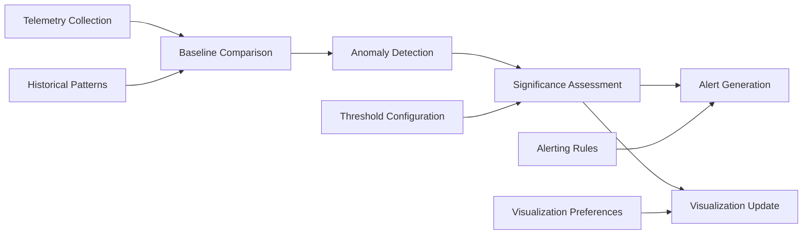

**Key Features**:
- **Real-time Monitoring**: Continuous key metric tracking
- **Anomaly Highlighting**: Emphasizes deviations from normal
- **Variable Time Scales**: Multiple temporal perspectives
- **Baseline Awareness**: Compares against established normals
- **Trend Indication**: Shows directional metric changes
- **Priority Filtering**: Focuses on most important signals

### 2.4 Agent Activity Tracker

**Responsibilities**:
- Track individual agent activities
- Monitor agent decision making
- Track work allocation across the agent hierarchy
- Record agent collaborations
- Monitor agent learning and adaptation
- Highlight exceptional agent actions

**Activity Tracking Dimensions**:

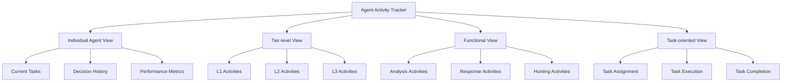

**Key Features**:
- **Agent-specific Tracking**: Individual agent monitoring
- **Decision Visibility**: Insight into agent reasoning
- **Performance Metrics**: Agent effectiveness measures
- **Collaboration Mapping**: Agent interaction visualization
- **Learning Tracking**: Agent improvement visualization
- **Anomalous Behavior Detection**: Unusual activity highlighting

## 3. Decision Oversight

The Decision Oversight system enables review, approval, and supervision of critical agent decisions.

### 3.1 Approval Workflows

**Responsibilities**:
- Manage approval requests from agents
- Route approval requests appropriately
- Track approval status and SLAs
- Provide decision context for approvals
- Implement risk-based approval routing
- Maintain approval audit trails

**Approval Workflow Process**:

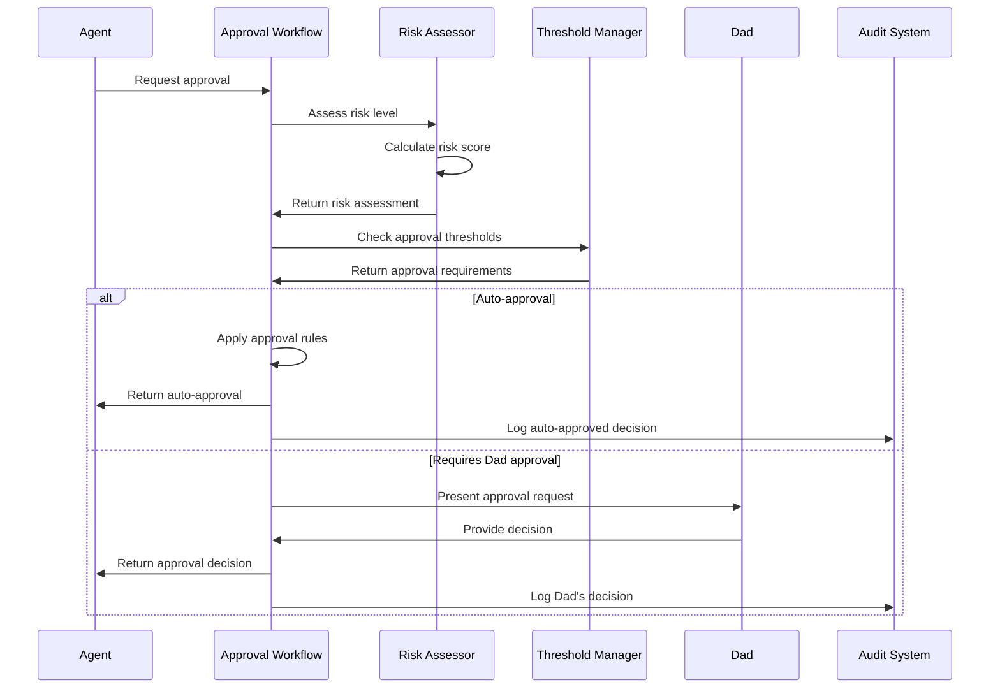

**Approval Criteria Matrix**:

| Decision Type | Risk Level | Approval Requirement | Time Sensitivity |
|---------------|------------|----------------------|------------------|
| System Containment | Low | Auto-approval | Normal |
| System Containment | Medium | Auto-approval with notification | Normal |
| System Containment | High | Dad approval | Urgent |
| Network Isolation | Low | Auto-approval | Normal |
| Network Isolation | Medium | Dad approval | Urgent |
| Network Isolation | High | Dad approval | Critical |
| Executive Impact | Any | Dad approval | Critical |
| Data Destruction | Any | Dad approval | Critical |
| Business Disruption | Medium/High | Dad approval | Critical |

**Key Features**:
- **Risk-based Routing**: Routes based on risk assessment
- **Context Packaging**: Provides decision-making context
- **SLA Tracking**: Monitors approval timeliness
- **Delegation Support**: Allows approval delegation
- **Approval Chains**: Supports multi-level approvals
- **Emergency Protocols**: Expedited processes for critical situations

### 3.2 Decision Review System

**Responsibilities**:
- Enable review of agent decisions
- Provide decision justification and reasoning
- Support decision analysis and validation
- Enable decision overrides when necessary
- Track decision outcomes and quality
- Facilitate learning from decision reviews

**Decision Review Framework**:

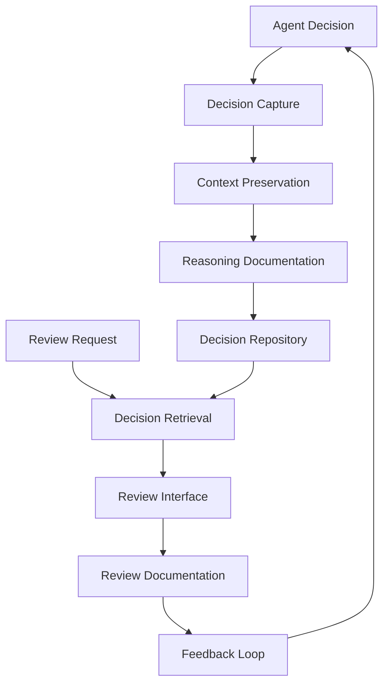

**Review Categories**:

| Review Type | Purpose | Trigger |
|-------------|---------|---------|
| Real-time | Immediate validation | Critical decisions |
| Periodic | Regular quality check | Schedule-based |
| Random | Quality assurance | Random selection |
| Outcome-based | Learn from results | After completion |
| Exception | Unusual situations | Anomaly detection |
| Requested | Specific investigation | Dad request |

**Key Features**:
- **Comprehensive Context**: Complete decision context
- **Reasoning Transparency**: Clear decision rationale
- **Outcome Tracking**: Links decisions to outcomes
- **Alternative Analysis**: Explores decision alternatives
- **Pattern Recognition**: Identifies decision trends
- **Learning Integration**: Feeds reviews into improvements

### 3.3 Risk Assessment Engine

**Responsibilities**:
- Assess risk levels for security decisions
- Evaluate potential action impacts
- Quantify risk across multiple dimensions
- Apply risk thresholds to decision routing
- Identify risk factors in decisions
- Support risk-based prioritization

**Risk Assessment Methodology**:

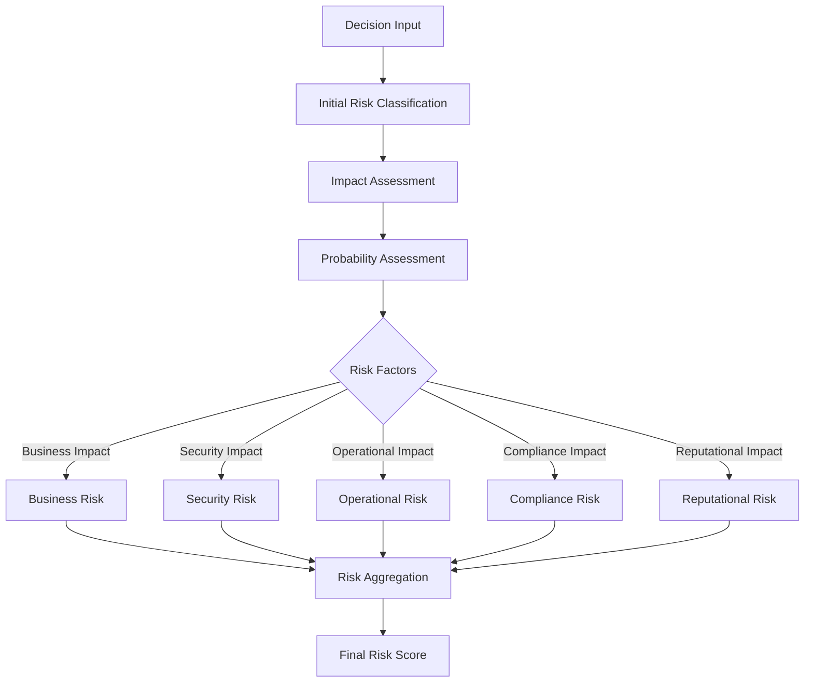

**Risk Dimensions**:

| Dimension | Factors | Weight |
|-----------|---------|--------|
| Business Impact | Revenue, operations, customers | 30% |
| Security Impact | Data exposure, system compromise | 25% |
| Operational Impact | Service disruption, productivity | 20% |
| Compliance Impact | Regulatory violations, reporting | 15% |
| Reputational Impact | Public perception, trust | 10% |

**Key Features**:
- **Multi-factor Analysis**: Comprehensive risk assessment
- **Contextual Risk Scoring**: Environment-specific evaluation
- **Dynamic Thresholds**: Adaptive risk thresholds
- **Impact Simulation**: Projected outcome modeling
- **Risk Aggregation**: Combined risk evaluation
- **Historical Comparison**: Benchmarks against past cases

### 3.4 Compliance Validator

**Responsibilities**:
- Validate decision compliance with policies
- Ensure regulatory requirement adherence
- Verify procedural compliance
- Identify compliance exceptions
- Document compliance verification
- Support compliant decision-making

**Compliance Validation Process**:

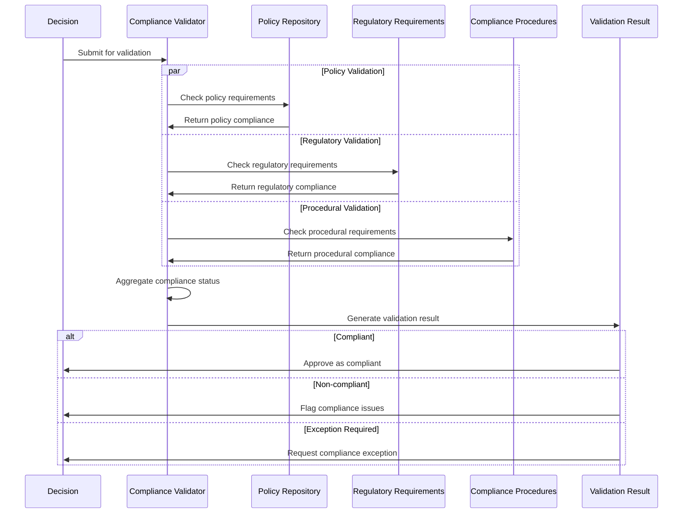

**Key Features**:
- **Policy Mapping**: Maps decisions to applicable policies
- **Regulatory Framework**: Integrates regulatory requirements
- **Exception Handling**: Manages policy exceptions
- **Compliance Evidence**: Documents compliance verification
- **Control Validation**: Confirms control effectiveness
- **Compliance Reporting**: Generates compliance documentation

## 4. Intervention Mechanisms

The Intervention Mechanisms enable direct human control and intervention when necessary.

### 4.1 Command Interface

**Responsibilities**:
- Provide direct command capabilities
- Enable explicit instruction issuance
- Support command verification
- Implement command authorization
- Track command execution
- Provide command feedback

**Command Interface Structure**:

```mermaid
graph TD
    A[Command Interface] --> B[Command Input]
    A --> C[Command Verification]
    A --> D[Command Authorization]
    A --> E[Command Routing]
    A --> F[Command Execution]
    A --> G[Command Feedback]
    
    B --> B1[Natural Language]
    B --> B2[Structured Commands]
    B --> B3[GUI Actions]
    
    C --> C1[Syntax Validation]
    C --> C2[Semantic Validation]
    C --> C3[Impact Assessment]
    
    D --> D1[Authority Verification]
    D --> D2[Risk Assessment]
    D --> D3[Approval Workflow]
    
    E --> E1[Agent Routing]
    E --> E2[System Routing]
    E --> E3[Component Routing]
    
    F --> F1[Execution Monitoring]
    F --> F2[Status Tracking]
    F --> F3[Result Capture]
    
    G --> G1[Success Confirmation]
    G --> G2[Error Reporting]
    G --> G3[Result Visualization]
```

**Command Categories**:

| Category | Purpose | Examples |
|----------|---------|----------|
| System Control | System-level actions | "Elevate security posture", "Initiate defense mode" |
| Agent Direction | Direct agent actions | "Assign incident #1234 to L3", "Prioritize ransomware response" |
| Operation Control | Workflow management | "Pause automated response", "Resume normal operations" |
| Information Retrieval | Get specific information | "Show current incidents", "Report on active threats" |
| Configuration | Change system settings | "Adjust detection threshold", "Update response playbooks" |
| Authorization | Approve/deny requests | "Approve isolation request", "Reject system modification" |

**Key Features**:
- **Multi-modal Input**: Multiple command input methods
- **Command Verification**: Validates command correctness
- **Impact Preview**: Shows projected command impact
- **Authorization Framework**: Ensures proper authority
- **Execution Tracking**: Monitors command implementation
- **Feedback Loop**: Provides command result visibility

### 4.2 Agent Override System

**Responsibilities**:
- Override agent decisions when necessary
- Modify agent actions in progress
- Intervene in agent operations
- Correct agent misinterpretations
- Realign agent activities
- Provide corrective guidance

**Override Process**:

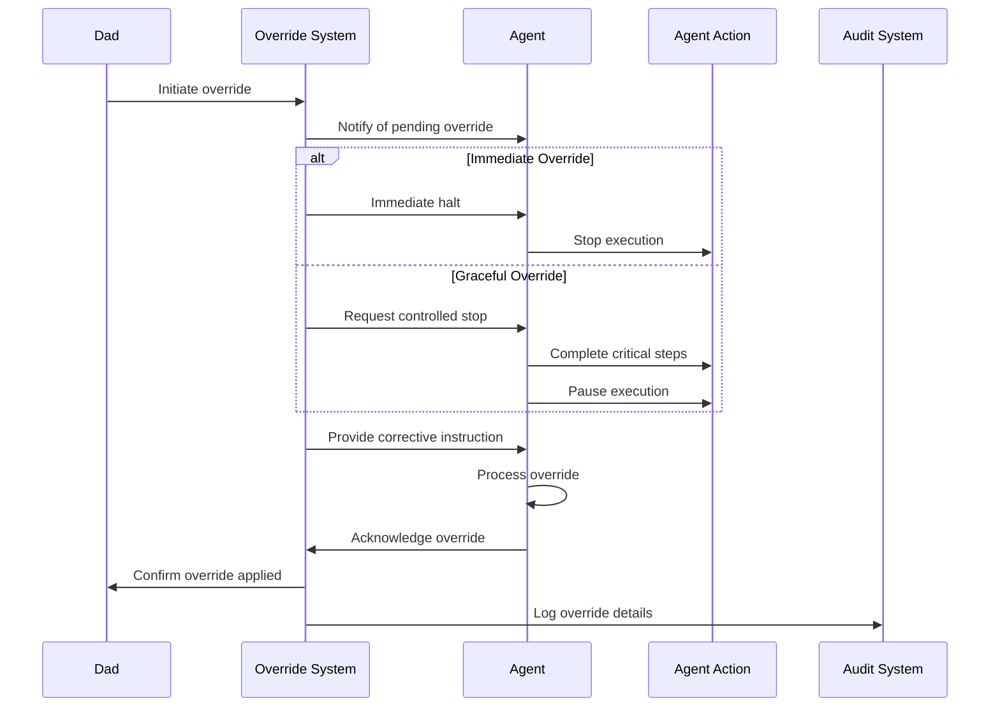

**Override Types**:

| Override Type | Purpose | Impact |
|---------------|---------|--------|
| Decision Override | Change an agent decision | Alters outcome |
| Action Halt | Stop an in-progress action | Prevents completion |
| Redirection | Change agent focus | Shifts priorities |
| Parameter Adjustment | Modify action parameters | Refines execution |
| Constraint Addition | Add operational constraints | Limits scope |
| Priority Override | Change task priorities | Reorders execution |

**Key Features**:
- **Granular Control**: Precise override capabilities
- **Controlled Intervention**: Minimizes operational disruption
- **Impact Assessment**: Projects override consequences
- **Justification Capture**: Records override rationale
- **Agent Adaptation**: Helps agents learn from overrides
- **Audit Trail**: Documents all override activities

### 4.3 Emergency Control System

**Responsibilities**:
- Provide fast-path controls for emergencies
- Implement emergency response protocols
- Enable rapid intervention in critical situations
- Provide predefined emergency actions
- Ensure operational continuity during emergencies
- Support emergency communication

**Emergency Control Panel**:

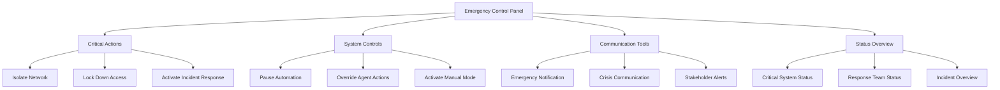

**Emergency Protocols**:

| Protocol | Trigger | Actions |
|----------|---------|---------|
| Active Breach | Confirmed intrusion | Network segmentation, credential reset, EDR isolation |
| Ransomware Response | Encryption detection | System isolation, backup activation, IOC blocking |
| Data Exfiltration | Data movement detection | Connection termination, account lockdown, DLP activation |
| Critical Vulnerability | Zero-day discovery | System patching, compensating controls, monitoring escalation |
| Automated Attack | Large-scale attack | Traffic filtering, adaptive defense, counter-response |

**Key Features**:
- **Rapid Response**: One-click emergency actions
- **Pre-authorized Controls**: Authority pre-clearance
- **Status Visibility**: Critical information display
- **Communication Integration**: Built-in alert capabilities
- **Recovery Initiation**: Triggers recovery processes
- **Containment Focus**: Emphasizes threat containment

### 4.4 Priority Directive System

**Responsibilities**:
- Issue high-priority directives to agents
- Establish operational priorities
- Override default prioritization
- Implement strategic direction
- Ensure critical task focus
- Manage priority conflicts

**Directive Framework**:

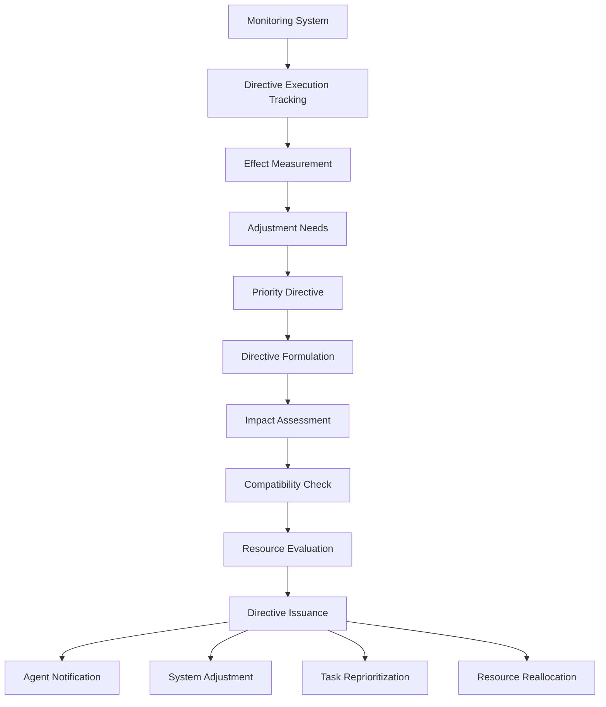

**Directive Types**:

| Directive Type | Purpose | Implementation |
|----------------|---------|----------------|
| Focus Directive | Direct attention to specific areas | Task reprioritization |
| Resource Directive | Reallocate system resources | Resource reassignment |
| Response Directive | Guide incident handling approach | Response strategy adaptation |
| Operational Directive | Change operational parameters | Parameter adjustments |
| Strategic Directive | Implement strategic priorities | Long-term behavior change |

**Key Features**:
- **Clear Communication**: Unambiguous directive issuance
- **Impact Awareness**: Understands operational effects
- **System-wide Reach**: Affects all system components
- **Priority Management**: Handles conflicting priorities
- **Execution Tracking**: Monitors directive implementation
- **Feedback Loop**: Measures directive effectiveness

## 5. Strategic Guidance

The Strategic Guidance system enables long-term direction and strategic control of the Agentic SOC.

### 5.1 Strategic Direction Interface

**Responsibilities**:
- Set strategic security priorities
- Establish operational focus areas
- Define security objectives
- Implement strategic vision
- Guide long-term evolution
- Align security with business needs

**Strategic Framework**:

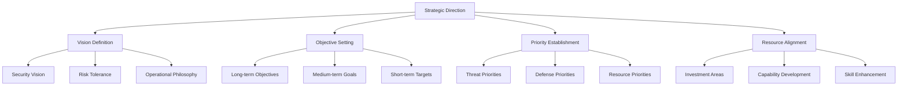

**Strategic Timeframes**:

| Timeframe | Focus | Implementation |
|-----------|-------|----------------|
| Long-term (1-3 years) | Strategic vision, capability development | Roadmap development, architecture evolution |
| Medium-term (3-12 months) | Program development, capability enhancement | Project planning, resource allocation |
| Short-term (1-90 days) | Operational focus, immediate priorities | Tactical adjustments, priority setting |

**Key Features**:
- **Vision Articulation**: Defines security direction
- **Goal Management**: Sets and tracks objectives
- **Strategic Flexibility**: Adapts to changing landscape
- **Business Alignment**: Links security to business goals
- **Resource Direction**: Guides investment priorities
- **Capability Planning**: Directs capability development

### 5.2 Policy Management System

**Responsibilities**:
- Define security policies
- Manage policy lifecycle
- Ensure policy implementation
- Handle policy exceptions
- Track policy compliance
- Adapt policies to emerging needs

**Policy Management Process**:

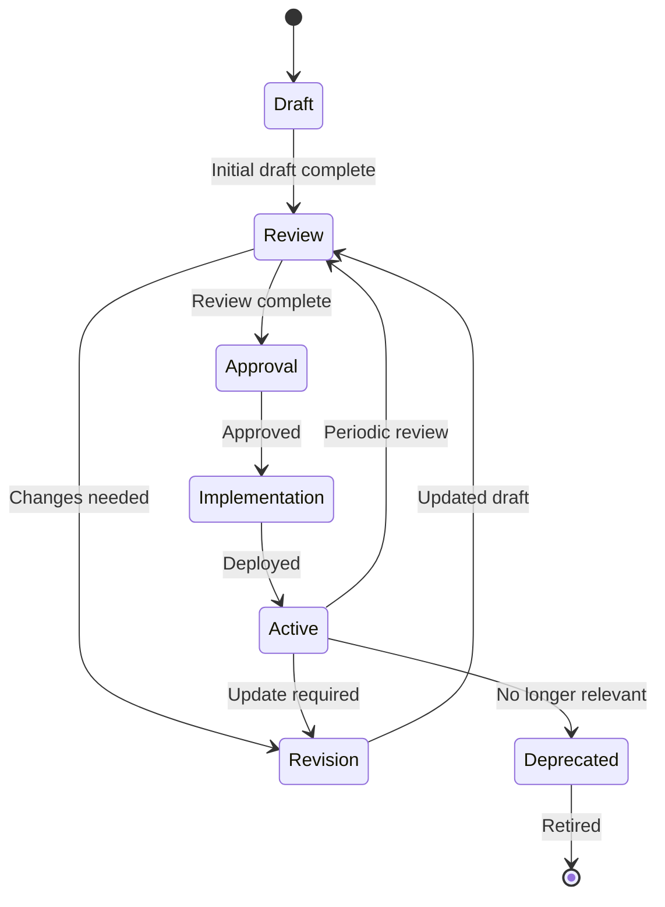

**Policy Hierarchy**:

| Level | Purpose | Update Frequency | Example |
|-------|---------|------------------|---------|
| Governance | Establish principles | Annual | Information Security Policy |
| Management | Define requirements | Semi-annual | Access Control Standard |
| Operational | Provide procedures | Quarterly | Incident Response Procedure |
| Technical | Technical implementation | As needed | Password Configuration Standard |

**Key Features**:
- **Policy Development**: Creates new policies
- **Version Control**: Manages policy versions
- **Exception Management**: Handles policy exceptions
- **Compliance Tracking**: Monitors policy adherence
- **Policy Communication**: Disseminates policy changes
- **Automation Integration**: Connects policies to automation

### 5.3 Resource Allocation Controller

**Responsibilities**:
- Manage security resource allocation
- Balance resource utilization
- Prioritize resource assignment
- Handle resource constraints
- Optimize resource efficiency
- Plan for resource needs

**Resource Management Framework**:

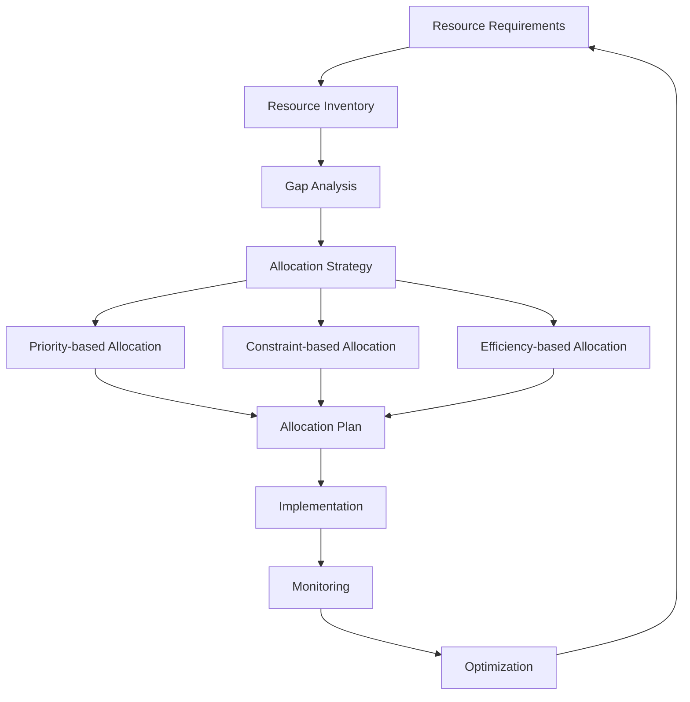

**Resource Categories**:

| Resource Type | Allocation Method | Optimization Approach |
|---------------|-------------------|------------------------|
| Agent Capacity | Priority-based | Workload balancing |
| Computational Resources | Dynamic allocation | Performance optimization |
| Storage Resources | Tiered allocation | Cost/performance balance |
| External Tool Access | Usage-based | API efficiency |
| Human Attention | Criticality-based | Focus management |
| Training Resources | Gap-based | Skill development |

**Key Features**:
- **Strategic Allocation**: Aligns with strategic priorities
- **Dynamic Adjustment**: Adapts to changing needs
- **Constraint Management**: Works within limitations
- **Efficiency Optimization**: Maximizes resource utility
- **Bottleneck Identification**: Finds resource constraints
- **Capacity Planning**: Projects future resource needs

### 5.4 Priority Framework System

**Responsibilities**:
- Establish operational priorities
- Define priority determination criteria
- Manage priority conflicts
- Implement priority changes
- Track priority effectiveness
- Maintain priority clarity

**Priority Framework Structure**:

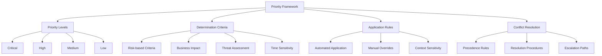

**Priority Determination Factors**:

| Factor | Weight | Measurement |
|--------|--------|-------------|
| Business Impact | 30% | Critical function effect |
| Risk Level | 25% | Threat severity and likelihood |
| Time Sensitivity | 20% | Required response time |
| Resource Requirements | 15% | Resource intensity |
| Complexity | 10% | Response complexity |

**Key Features**:
- **Clear Hierarchy**: Defined priority levels
- **Consistent Application**: Standard prioritization
- **Dynamic Adjustment**: Adapts to situation changes
- **Context Sensitivity**: Considers operational context
- **Conflict Resolution**: Handles priority conflicts
- **Override Capabilities**: Allows priority adjustments

## 6. Performance Assessment

The Performance Assessment system evaluates and improves the effectiveness of the Agentic SOC.

### 6.1 Effectiveness Analyzer

**Responsibilities**:
- Measure security effectiveness
- Evaluate operational performance
- Assess defensive capabilities
- Analyze detection and response
- Measure automation effectiveness
- Track effectiveness trends

**Effectiveness Framework**:

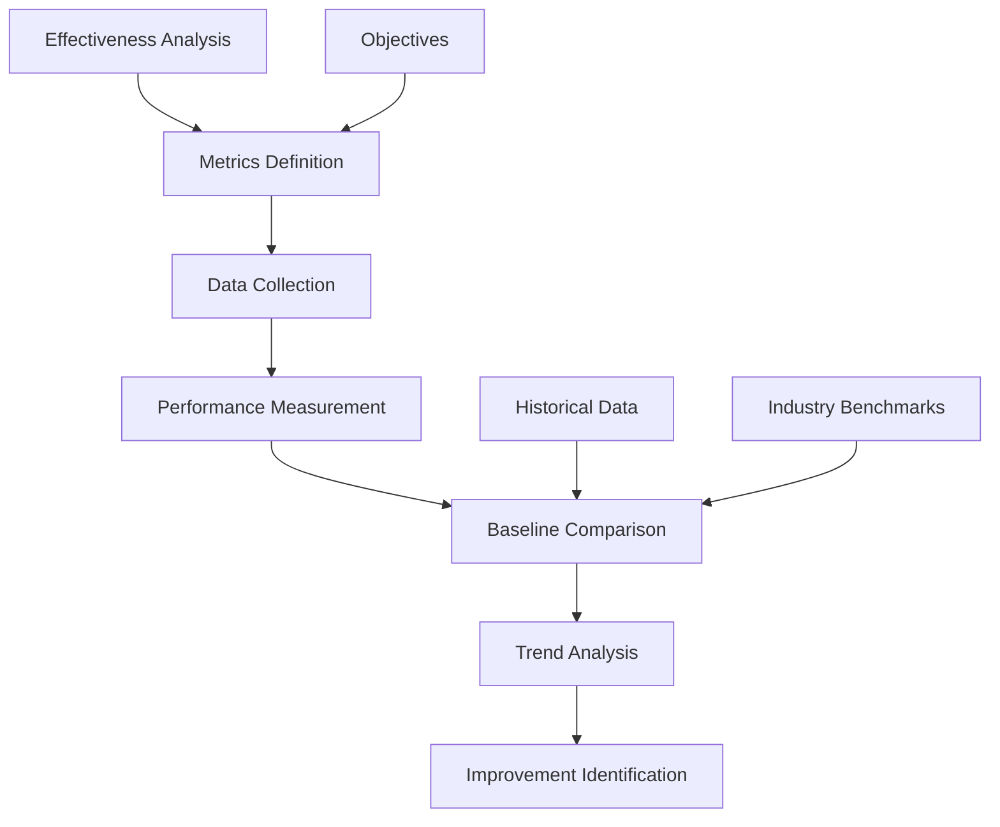

**Key Performance Indicators**:

| Category | Metric | Target |
|----------|--------|--------|
| Detection | Mean Time to Detect (MTTD) | < 15 minutes |
| | Detection accuracy | > 98% |
| | Coverage (MITRE ATT&CK) | > 90% |
| Response | Mean Time to Respond (MTTR) | < 30 minutes |
| | Containment effectiveness | > 95% |
| | Automated response rate | > 90% |
| Recovery | Mean Time to Recover (MTTR) | < 4 hours |
| | Recovery completeness | > 99% |
| | Business continuity | 100% |
| Operational | Task completion rate | > 95% |
| | Human intervention rate | < 10% |
| | Resource efficiency | > 85% |

**Key Features**:
- **Comprehensive Measurement**: Holistic performance view
- **Objective Metrics**: Quantifiable performance measures
- **Trend Analysis**: Performance changes over time
- **Benchmark Comparison**: Internal and external benchmarks
- **Contextual Analysis**: Performance in operational context
- **Improvement Focus**: Identifies enhancement opportunities

### 6.2 Agent Evaluation System

**Responsibilities**:
- Evaluate individual agent performance
- Assess agent tier effectiveness
- Measure agent learning progress
- Identify agent skill gaps
- Track agent improvement
- Provide agent feedback

**Agent Evaluation Framework**:

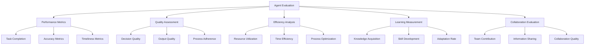

**Evaluation Dimensions**:

| Dimension | Metrics | Performance Indicators |
|-----------|---------|------------------------|
| Task Performance | Completion rate, quality | Task success, accuracy |
| Decision Making | Decision quality, speed | Correct decisions, timeliness |
| Efficiency | Resource usage, optimization | Resource consumption, process improvements |
| Learning | Knowledge application, adaptation | Knowledge growth, adaptability |
| Specialization | Domain expertise, skill depth | Expertise level, specialization quality |
| Collaboration | Team contribution, coordination | Effective collaboration, knowledge sharing |

**Key Features**:
- **Multi-factorial Assessment**: Comprehensive evaluation
- **Objective Measurement**: Quantifiable performance metrics
- **Comparative Analysis**: Agent and tier comparisons
- **Development Tracking**: Improvement measurement
- **Skill Gap Identification**: Training need recognition
- **Feedback Generation**: Constructive improvement guidance

### 6.3 Automation Metrics Dashboard

**Responsibilities**:
- Track automation effectiveness
- Measure automation coverage
- Identify automation opportunities
- Monitor automation quality
- Track automation efficiency
- Provide automation insights

**Automation Metrics Framework**:

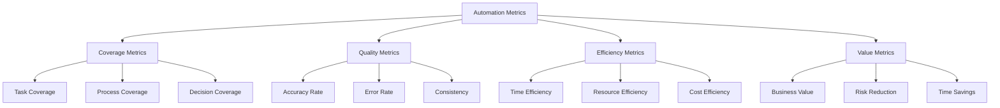

**Key Automation Metrics**:

| Category | Metric | Target |
|----------|--------|--------|
| Coverage | Task automation rate | > 90% |
| | Decision automation rate | > 85% |
| | Process automation coverage | > 95% |
| Quality | Automated decision accuracy | > 98% |
| | Error rate | < 2% |
| | Consistency | > 99% |
| Efficiency | Time reduction | > 80% |
| | Cost savings | > 70% |
| | Resource optimization | > 75% |
| Value | Human time saved | > 90% |
| | Risk reduction | > 85% |
| | Scalability | > 800% |

**Key Features**:
- **Comprehensive Measurement**: End-to-end automation metrics
- **Coverage Analysis**: Automation scope assessment
- **Quality Tracking**: Automation accuracy measures
- **Efficiency Evaluation**: Automation performance metrics
- **Value Demonstration**: Business value measurement
- **Gap Identification**: Automation opportunity spotting

### 6.4 Continuous Improvement System

**Responsibilities**:
- Drive ongoing system enhancement
- Implement improvement processes
- Track improvement progress
- Prioritize improvement opportunities
- Measure improvement impact
- Maintain improvement momentum

**Improvement Process**:

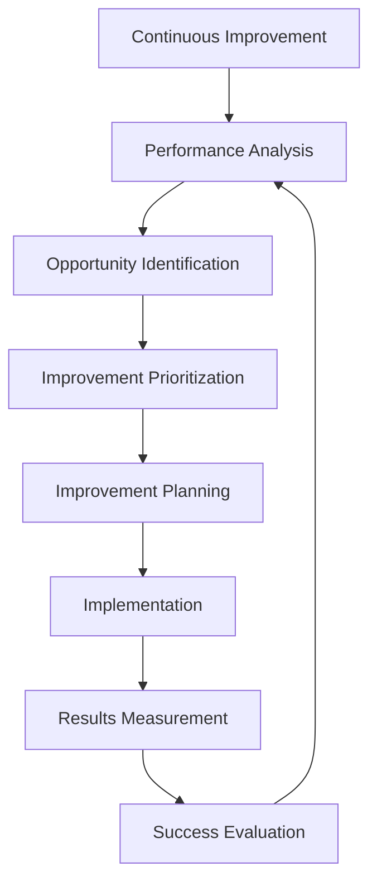

**Improvement Categories**:

| Category | Focus | Examples |
|----------|-------|----------|
| Efficiency | Process optimization | Streamlined workflows, reduced steps |
| Quality | Error reduction | Improved accuracy, better decisions |
| Capability | New abilities | Additional features, expanded scope |
| Performance | Speed and throughput | Faster processing, higher volume |
| Integration | Better connections | Enhanced information flow, reduced friction |
| Experience | Usability enhancements | Improved interfaces, better visualization |

**Key Features**:
- **Systematic Approach**: Structured improvement process
- **Data-driven Prioritization**: Evidence-based improvements
- **Measurable Impact**: Quantifiable improvement results
- **Continuous Cycle**: Ongoing enhancement process
- **Holistic Scope**: System-wide improvement focus
- **Learning Integration**: Incorporates operational lessons

## 7. Communication Channels

The Communication Channels system enables effective information flow between the Agentic SOC and Dad.

### 7.1 Notification Manager

**Responsibilities**:
- Deliver timely notifications
- Manage notification priorities
- Control notification volume
- Ensure notification relevance
- Provide contextual information
- Track notification acknowledgment

**Notification Framework**:

```mermaid
graph TD
    A[Notification Source] --> B[Notification Generator]
    B --> C[Priority Assessment]
    C --> D[Channel Selection]
    D --> E[Format Adaptation]
    E --> F[Delivery Mechanism]
    F --> G[Receipt Tracking]
    G --> H[Acknowledgment Management]
    
    I[User Preferences] --> C
    I --> D
    I --> E
    
    J[Context Data] --> B
    K[Historical Interaction] --> C
```

**Notification Prioritization**:

| Priority | Characteristics | Delivery Method | Examples |
|----------|----------------|-----------------|----------|
| Critical | Immediate attention required | Push, SMS, call | Active breach, ransomware detection |
| High | Urgent but not immediate | Push, email | Suspicious activity, system vulnerability |
| Medium | Important information | Email, dashboard | Security updates, status changes |
| Low | Routine information | Dashboard, digest | Daily summaries, trend reports |
| Informational | Background information | Digest, repository | Weekly reports, non-critical updates |

**Key Features**:
- **Intelligent Prioritization**: Context-aware importance assessment
- **Multi-channel Delivery**: Multiple notification paths
- **Adaptive Formatting**: Channel-appropriate formatting
- **Context Inclusion**: Relevant contextual information
- **Action Enablement**: Direct response capabilities
- **Volume Management**: Prevents notification overload

### 7.2 Escalation System

**Responsibilities**:
- Manage agent-to-Dad escalations
- Route issues to appropriate attention
- Track escalation status and resolution
- Provide escalation context
- Ensure timely escalation handling
- Document escalation outcomes

**Escalation Process**:

```mermaid
sequenceDiagram
    participant Agent
    participant ES as Escalation System
    participant Priority as Priority Engine
    participant Context as Context Assembler
    participant Dad
    participant Resolution as Resolution Tracker
    
    Agent->>ES: Initiate escalation
    ES->>Priority: Determine priority
    Priority->>ES: Return priority level
    ES->>Context: Request context package
    Context->>Context: Gather relevant info
    Context->>ES: Return context package
    
    alt Immediate Escalation
        ES->>Dad: Deliver high-priority escalation
    else Scheduled Escalation
        ES->>ES: Queue for attention
        ES->>Dad: Deliver at appropriate time
    end
    
    Dad->>ES: Provide response
    ES->>Agent: Deliver response
    ES->>Resolution: Track resolution
    Resolution->>Resolution: Document outcome
    Resolution->>ES: Update escalation status
```

**Escalation Categories**:

| Category | Purpose | Trigger |
|----------|---------|---------|
| Decision | Obtain decision guidance | Complex or high-impact decisions |
| Authority | Request approval | Exceeds agent authority |
| Expertise | Seek specialized knowledge | Beyond agent knowledge |
| Unusual | Handle anomalous situations | Unexpected circumstances |
| Strategic | Address strategic questions | Strategic implications |
| Critical | Manage critical situations | High business impact |

**Key Features**:
- **Contextual Packaging**: Comprehensive situation context
- **Priority-based Routing**: Urgency-appropriate handling
- **Status Tracking**: End-to-end escalation visibility
- **Resolution Recording**: Documents outcome and rationale
- **Knowledge Capture**: Preserves escalation insights
- **Pattern Analysis**: Identifies escalation trends

### 7.3 Query Interface

**Responsibilities**:
- Enable Dad to query the Agentic SOC
- Provide intuitive information access
- Support complex query formulation
- Deliver relevant, accurate responses
- Enable ad-hoc information requests
- Support exploratory analysis

**Query Process**:

```mermaid
flowchart TD
    A[Query Input] --> B[Query Understanding]
    B --> C[Query Classification]
    C --> D[Information Gathering]
    
    D --> E{Query Type}
    
    E -->|Factual| F[Direct Retrieval]
    E -->|Analytical| G[Analysis Process]
    E -->|Exploratory| H[Discovery Process]
    E -->|Hypothetical| I[Simulation Process]
    
    F & G & H & I --> J[Response Formulation]
    J --> K[Response Delivery]
    K --> L[Followup Management]
```

**Query Types**:

| Query Type | Purpose | Example |
|------------|---------|---------|
| Status | Current state information | "What's our current security posture?" |
| Factual | Specific information | "How many incidents are currently active?" |
| Analytical | Analysis and insight | "Why has our phishing detection rate dropped?" |
| Historical | Past information | "Show me similar incidents from the last quarter." |
| Exploratory | Open-ended investigation | "What unusual network patterns have we seen recently?" |
| Hypothetical | What-if scenarios | "What would happen if we isolated this system?" |
| Procedural | Process information | "What's our response procedure for ransomware?" |

**Key Features**:
- **Natural Language Understanding**: Intuitive query processing
- **Context Awareness**: Considers operational context
- **Knowledge Integration**: Combines multiple information sources
- **Visualization Support**: Visual information presentation
- **Drill-down Capability**: Progressive information exploration
- **Query Refinement**: Iterative query improvement

### 7.4 Feedback Loop System

**Responsibilities**:
- Capture Dad's feedback
- Route feedback appropriately
- Integrate feedback into improvements
- Track feedback implementation
- Measure feedback impact
- Close the feedback loop

**Feedback Process**:

```mermaid
flowchart TD
    A[Feedback Source] --> B[Feedback Capture]
    B --> C[Categorization]
    C --> D[Priority Assessment]
    D --> E[Assignment]
    
    E -->|Performance Feedback| F[Performance System]
    E -->|Decision Feedback| G[Decision System]
    E -->|Process Feedback| H[Process System]
    E -->|Agent Feedback| I[Agent System]
    
    F & G & H & I --> J[Improvement Planning]
    J --> K[Implementation]
    K --> L[Verification]
    L --> M[Feedback to Dad]
```

**Feedback Categories**:

| Category | Focus | Application |
|----------|-------|-------------|
| Decision Quality | Improve decision-making | Refine decision algorithms |
| Process Efficiency | Enhance workflows | Streamline processes |
| Information Quality | Improve data and reporting | Enhance information systems |
| User Experience | Improve interfaces | Enhance user interaction |
| Agent Performance | Improve agent capabilities | Agent enhancement |
| Strategic Alignment | Align with vision | Strategic adjustment |

**Key Features**:
- **Multi-channel Capture**: Multiple feedback methods
- **Contextual Association**: Links feedback to context
- **Actionable Insights**: Practical improvement guidance
- **Implementation Tracking**: Monitors improvement progress
- **Closed Loop**: Confirms improvement effectiveness
- **Pattern Analysis**: Identifies recurring feedback themes

## 8. Implementation Considerations

### 8.1 Integration Requirements

**Integration with Agent Hierarchy**:

```mermaid
flowchart TD
    DOC[Dad Oversight Components] --> L3[L3 Security Agents]
    DOC -.-> L2[L2 Security Agents]
    DOC -.-> L1[L1 Security Agents]
    
    L3 --> L2
    L2 --> L1
    
    DOC <--> AO[Agent Orchestrator]
    AO --> L3
    AO --> L2
    AO --> L1
    
    DOC <--> WE[Workflow Engine]
    DOC <--> AI[AI Core]
    DOC <--> KB[Knowledge Base]
```

**System Integration Points**:
- Agent Orchestrator for agent management
- Workflow Engine for process control
- AI Core for reasoning capabilities
- Knowledge Base for information access
- Security Tools for operational control
- Reporting Systems for information flow
- External Systems for broader integration

### 8.2 User Experience Design

**Design Principles**:
1. **Clarity**: Clear, unambiguous information presentation
2. **Context**: Appropriate contextual information
3. **Control**: Intuitive control mechanisms
4. **Consistency**: Consistent interaction patterns
5. **Customization**: Adaptable to user preferences
6. **Conciseness**: Efficient information density

**Interface Components**:
- Strategic Dashboard: High-level overview
- Operational Console: Tactical control
- Analysis Workbench: Detailed investigation
- Command Center: Direct system control
- Administration Panel: System management
- Reporting Hub: Information access

### 8.3 Performance Requirements

**Response Time Targets**:

| Function | Target Response Time | Criticality |
|----------|----------------------|-------------|
| Dashboard Refresh | < 2 seconds | Medium |
| Command Execution | < 1 second | High |
| Query Response | < 3 seconds | Medium |
| Alert Notification | < 5 seconds | Critical |
| Report Generation | < 30 seconds | Low |
| System Search | < 5 seconds | Medium |

**Scalability Requirements**:
- Support for 10,000+ monitored assets
- Handle 1,000+ security events per minute
- Support 100+ concurrent automated workflows
- Manage 50+ specialized security agents
- Process 10+ million daily log entries
- Generate 100+ automated reports daily

### 8.4 Security Requirements

**Security Controls**:
1. **Authentication**: Multi-factor authentication
2. **Authorization**: Role-based access control
3. **Encryption**: End-to-end encryption for sensitive data
4. **Auditing**: Comprehensive action logging
5. **Integrity**: Data and command integrity verification
6. **Availability**: High-availability architecture

**Compliance Requirements**:
- Regulatory compliance (GDPR, HIPAA, etc.)
- Industry standards (ISO 27001, NIST, etc.)
- Corporate security policies
- Security operations best practices
- Audit requirements and controls

## 9. Human Factors Considerations

### 9.1 Cognitive Load Management

**Cognitive Load Strategies**:
1. **Information Filtering**: Prioritize and filter information
2. **Progressive Disclosure**: Reveal details progressively
3. **Context Preservation**: Maintain operational context
4. **Visualization**: Use visual representations effectively
5. **Attention Management**: Direct attention appropriately
6. **Decision Support**: Provide decision-making assistance

**Implementation Approaches**:
- Adaptive dashboards based on situation
- Context-aware information presentation
- Visual alerts and notifications
- Customizable information density
- Attention-guiding interface elements
- Decision support frameworks

### 9.2 Trust and Transparency

**Trust-building Elements**:
1. **Decision Transparency**: Clear decision rationale
2. **Predictable Behavior**: Consistent system actions
3. **Control Mechanisms**: Appropriate human control
4. **Accurate Information**: Reliable data presentation
5. **System Limitations**: Clear capability boundaries
6. **Failure Handling**: Graceful failure management

**Transparency Implementation**:
- Explainable AI for agent decisions
- Confidence indicators for information
- Verification mechanisms for critical actions
- System state visibility at appropriate level
- Historical action tracking and review
- Limitation and uncertainty communication

### 9.3 Operational Flexibility

**Flexibility Dimensions**:
1. **Interaction Modes**: Multiple interaction patterns
2. **Control Granularity**: Variable control precision
3. **Automation Levels**: Adjustable automation
4. **Information Depth**: Scalable information detail
5. **Workflow Adaptation**: Adaptable operational workflows
6. **Interface Customization**: Personalized interfaces

**Implementation Approaches**:
- Mode-based operation (strategic, tactical, operational)
- Progressive control capabilities
- Automation level adjustment
- Information depth control
- Customizable workflows
- Personalized interface configurations

## 10. Use Cases

### 10.1 Strategic Direction and Oversight

**Scenario**: Dad needs to set strategic security priorities and monitor their implementation.

**Process Flow**:

```mermaid
sequenceDiagram
    participant Dad
    participant SDIF as Strategic Direction Interface
    participant Agents as Agent Hierarchy
    participant Analytics as Analytics System
    
    Dad->>SDIF: Define strategic priorities
    SDIF->>SDIF: Formalize directives
    SDIF->>Agents: Communicate priorities
    
    Note over Agents: Implement priorities
    
    loop Strategic Monitoring
        SDIF->>Analytics: Request implementation status
        Analytics->>SDIF: Return progress metrics
        SDIF->>Dad: Present status dashboard
    end
    
    Dad->>SDIF: Adjust strategies as needed
```

**Components Used**:
- Strategic Direction Interface
- Priority Framework System
- SOC Command Dashboard
- Effectiveness Analyzer
- Feedback Loop System

### 10.2 Critical Incident Oversight

**Scenario**: A critical security incident requires Dad's awareness and potential intervention.

**Process Flow**:

```mermaid
sequenceDiagram
    participant Agents as Agent Hierarchy
    participant IMS as Incident Management System
    participant NS as Notification System
    participant ECS as Emergency Control System
    participant Dad
    
    Agents->>IMS: Detect critical incident
    IMS->>NS: Generate high-priority notification
    NS->>Dad: Deliver critical alert
    
    Dad->>IMS: Review incident details
    
    alt Direct Intervention
        Dad->>ECS: Issue direct commands
        ECS->>Agents: Execute emergency actions
    else Guided Response
        Dad->>IMS: Provide response guidance
        IMS->>Agents: Implement guided response
    else Monitor Only
        Dad->>IMS: Monitor response progress
        IMS->>Dad: Provide status updates
    end
```

**Components Used**:
- Emergency Control System
- Operational Awareness System
- Notification Manager
- Command Interface
- Agent Override System

### 10.3 Decision Approval

**Scenario**: An automated security action requires Dad's approval before execution.

**Process Flow**:

```mermaid
sequenceDiagram
    participant Agents as Agent Hierarchy
    participant AW as Approval Workflow
    participant NS as Notification System
    participant Dad
    participant AOS as Agent Orchestration System
    
    Agents->>AW: Request high-impact action approval
    AW->>NS: Generate approval request
    NS->>Dad: Deliver approval notification
    
    Dad->>AW: Review action details and context
    
    alt Approve
        Dad->>AW: Grant approval
        AW->>Agents: Confirm approval
        Agents->>AOS: Execute approved action
    else Deny
        Dad->>AW: Deny approval
        AW->>Agents: Communicate denial
        Agents->>AOS: Implement alternative approach
    else Modify
        Dad->>AW: Approve with modifications
        AW->>Agents: Communicate modified approval
        Agents->>AOS: Execute modified action
    end
```

**Components Used**:
- Approval Workflows
- Decision Review System
- Notification Manager
- Command Interface
- Risk Assessment Engine

### 10.4 Performance Review and Improvement

**Scenario**: Dad conducts a review of system performance and provides improvement direction.

**Process Flow**:

```mermaid
sequenceDiagram
    participant Dad
    participant PA as Performance Assessment
    participant AMD as Automation Metrics Dashboard
    participant AE as Agent Evaluator
    participant FLS as Feedback Loop System
    participant CI as Continuous Improvement System
    
    Dad->>PA: Request performance review
    PA->>AMD: Gather automation metrics
    PA->>AE: Collect agent performance data
    
    AMD->>PA: Return automation metrics
    AE->>PA: Return agent performance data
    PA->>Dad: Present performance analysis
    
    Dad->>FLS: Provide improvement feedback
    FLS->>CI: Route feedback to improvement system
    CI->>CI: Create improvement plan
    CI->>Dad: Present improvement proposal
    
    Dad->>CI: Approve improvement plan
    CI->>CI: Implement improvements
```

**Components Used**:
- Effectiveness Analyzer
- Automation Metrics Dashboard
- Agent Evaluation System
- Feedback Loop System
- Continuous Improvement System

### 10.5 Security Posture Investigation

**Scenario**: Dad wants to understand the current security posture and explore potential concerns.

**Process Flow**:

```mermaid
sequenceDiagram
    participant Dad
    participant QI as Query Interface
    participant KB as Knowledge Base
    participant AS as Analytics System
    participant VA as Visualization Adapter
    
    Dad->>QI: Submit posture query
    QI->>KB: Retrieve posture information
    QI->>AS: Request analytical insights
    
    KB->>QI: Return posture data
    AS->>QI: Return analytical findings
    QI->>VA: Request visualization
    VA->>Dad: Present visual results
    
    loop Exploratory Analysis
        Dad->>QI: Ask follow-up questions
        QI->>KB: Retrieve additional information
        QI->>AS: Request additional analysis
        KB->>QI: Return requested data
        AS->>QI: Return additional insights
        QI->>VA: Update visualization
        VA->>Dad: Present updated results
    end
```

**Components Used**:
- Query Interface
- Security Pulse Monitor
- Operational Awareness System
- SOC Command Dashboard
- Decision Review System