# Data Models for Agentic SOC

## 1. Overview

This document defines the core data models for the Agentic SOC. These models represent the fundamental data structures, entities, relationships, and schemas that support the entire system's operations.

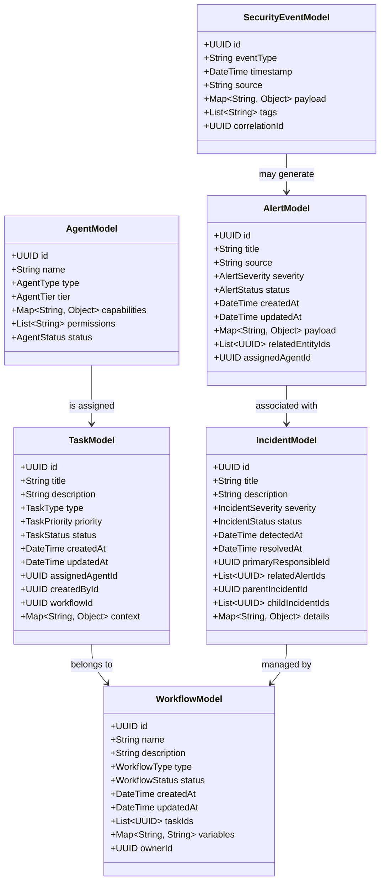

## 2. Core Entity Models

### 2.1 Agent Model

The Agent Model represents all agent entities within the system, including their capabilities, permissions, and operational status.

```json
{
  "id": "uuid",
  "name": "string",
  "description": "string",
  "type": "enum(SECURITY_AGENT, ANALYSIS_AGENT, RESPONSE_AGENT, ...)",
  "tier": "enum(L1, L2, L3)",
  "domain": "enum(EMAIL_SECURITY, ENDPOINT_SECURITY, NETWORK_SECURITY, ...)",
  "capabilities": [
    {
      "id": "string",
      "name": "string", 
      "description": "string",
      "parameters": [
        {
          "name": "string",
          "type": "string",
          "required": "boolean",
          "default": "any"
        }
      ]
    }
  ],
  "permissions": [
    "string"
  ],
  "status": "enum(ACTIVE, INACTIVE, TRAINING, MAINTENANCE)",
  "learningMode": "enum(ACTIVE_LEARNING, SUPERVISED, REINFORCEMENT, INACTIVE)",
  "metrics": {
    "accuracy": "float",
    "responseTime": "float",
    "decisionsPerHour": "float",
    "escalationRate": "float"
  },
  "aiModel": {
    "primaryModel": "string",
    "fallbackModel": "string",
    "contextWindowSize": "int",
    "specializations": ["string"]
  },
  "lastActive": "timestamp",
  "createdAt": "timestamp",
  "updatedAt": "timestamp",
  "version": "string",
  "tags": ["string"]
}
```

#### Agent Type Hierarchy

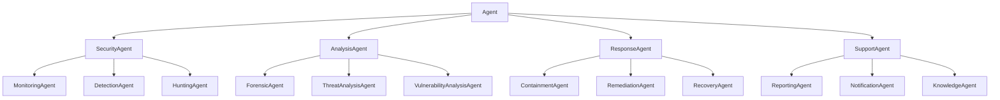

### 2.2 Task Model

The Task Model represents discrete units of work within the system that are assigned to agents.

```json
{
  "id": "uuid",
  "title": "string",
  "description": "string",
  "type": "enum(ANALYSIS, INVESTIGATION, RESPONSE, REPORTING, ...)",
  "priority": "enum(CRITICAL, HIGH, MEDIUM, LOW)",
  "status": "enum(PENDING, ASSIGNED, IN_PROGRESS, PAUSED, COMPLETED, FAILED)",
  "createdAt": "timestamp",
  "updatedAt": "timestamp",
  "deadlineAt": "timestamp",
  "startedAt": "timestamp",
  "completedAt": "timestamp",
  "assignedAgentId": "uuid|null",
  "createdById": "uuid",
  "workflowId": "uuid|null",
  "parentTaskId": "uuid|null",
  "subtasks": [
    "uuid"
  ],
  "dependencies": [
    "uuid"
  ],
  "context": {
    "incidentId": "uuid",
    "alertIds": ["uuid"],
    "assetIds": ["uuid"],
    "parameters": {},
    "artifacts": [
      {
        "id": "uuid",
        "type": "string",
        "content": "any"
      }
    ]
  },
  "result": {
    "status": "enum(SUCCESS, PARTIAL_SUCCESS, FAILURE)",
    "message": "string",
    "data": {},
    "artifacts": [
      {
        "id": "uuid",
        "type": "string", 
        "content": "any"
      }
    ]
  },
  "metrics": {
    "processingTime": "duration",
    "resourceUtilization": "float"
  },
  "permissions": ["string"],
  "tags": ["string"]
}
```

### 2.3 Incident Model

The Incident Model represents security incidents being managed by the SOC.

```json
{
  "id": "uuid",
  "title": "string",
  "description": "string",
  "severity": "enum(CRITICAL, HIGH, MEDIUM, LOW, INFORMATIONAL)",
  "status": "enum(NEW, INVESTIGATING, CONTAINED, REMEDIATED, RESOLVED, CLOSED)",
  "type": "enum(MALWARE, PHISHING, INTRUSION, DATA_BREACH, UNAUTHORIZED_ACCESS, ...)",
  "source": "string",
  "detectedAt": "timestamp",
  "reportedAt": "timestamp",
  "assignedAt": "timestamp",
  "containedAt": "timestamp",
  "remediatedAt": "timestamp",
  "resolvedAt": "timestamp",
  "closedAt": "timestamp",
  "primaryResponsibleId": "uuid",
  "assignees": ["uuid"],
  "reporter": "uuid|null",
  "relatedAlertIds": ["uuid"],
  "relatedEventIds": ["uuid"],
  "parentIncidentId": "uuid|null",
  "childIncidentIds": ["uuid"],
  "affectedAssets": [
    {
      "id": "uuid",
      "type": "string",
      "name": "string"
    }
  ],
  "timeline": [
    {
      "timestamp": "timestamp",
      "event": "string",
      "agentId": "uuid|null",
      "data": {}
    }
  ],
  "indicators": [
    {
      "type": "enum(IP, URL, HASH, DOMAIN, FILE, ...)",
      "value": "string",
      "confidence": "float",
      "context": "string"
    }
  ],
  "attackVectors": ["string"],
  "attackStages": ["string"],
  "ttps": ["string"],
  "impact": {
    "scope": "enum(NONE, LIMITED, MODERATE, EXTENSIVE, UNKNOWN)",
    "confidentiality": "enum(NONE, LIMITED, MODERATE, EXTENSIVE, UNKNOWN)",
    "integrity": "enum(NONE, LIMITED, MODERATE, EXTENSIVE, UNKNOWN)",
    "availability": "enum(NONE, LIMITED, MODERATE, EXTENSIVE, UNKNOWN)",
    "businessImpact": "string"
  },
  "workflowId": "uuid|null",
  "ticketId": "string|null",
  "classification": "string",
  "notes": [
    {
      "timestamp": "timestamp",
      "agentId": "uuid",
      "content": "string"
    }
  ],
  "tags": ["string"],
  "metrics": {
    "timeToDetect": "duration",
    "timeToAssign": "duration",
    "timeToContain": "duration",
    "timeToRemediate": "duration",
    "timeToResolve": "duration"
  },
  "evidences": [
    {
      "id": "uuid",
      "type": "string",
      "description": "string",
      "source": "string",
      "timestamp": "timestamp",
      "content": "any",
      "hash": "string"
    }
  ]
}
```

### 2.4 Alert Model

The Alert Model represents security alerts generated by detection systems or agents.

```json
{
  "id": "uuid",
  "title": "string",
  "description": "string",
  "source": "string",
  "sourceType": "enum(INTERNAL, EXTERNAL)",
  "detectionEngine": "string",
  "severity": "enum(CRITICAL, HIGH, MEDIUM, LOW, INFORMATIONAL)",
  "confidence": "float",
  "status": "enum(NEW, INVESTIGATING, ACKNOWLEDGED, FALSE_POSITIVE, TRUE_POSITIVE, IGNORED)",
  "createdAt": "timestamp",
  "updatedAt": "timestamp",
  "eventTime": "timestamp",
  "assignedAgentId": "uuid|null",
  "relatedEntityIds": {
    "assets": ["uuid"],
    "users": ["uuid"],
    "alerts": ["uuid"]
  },
  "incidentId": "uuid|null",
  "payload": {},
  "rawData": "string",
  "indicators": [
    {
      "type": "enum(IP, URL, HASH, DOMAIN, FILE, ...)",
      "value": "string",
      "confidence": "float"
    }
  ],
  "category": "string",
  "ruleId": "string|null",
  "ruleName": "string|null",
  "mitreTactics": ["string"],
  "mitreTechniques": ["string"],
  "analyticsData": {},
  "enrichments": [
    {
      "source": "string",
      "type": "string",
      "data": {}
    }
  ],
  "tags": ["string"],
  "notes": [
    {
      "timestamp": "timestamp",
      "agentId": "uuid",
      "content": "string"
    }
  ],
  "actions": [
    {
      "timestamp": "timestamp",
      "agentId": "uuid",
      "action": "string",
      "result": "string"
    }
  ]
}
```

### 2.5 Security Event Model

The Security Event Model represents raw security events that flow into the system.

```json
{
  "id": "uuid",
  "eventType": "string",
  "eventCategory": "enum(NETWORK, ENDPOINT, EMAIL, IDENTITY, APPLICATION, CLOUD, ...)",
  "timestamp": "timestamp",
  "source": "string",
  "sourceIp": "string",
  "destinationIp": "string",
  "protocol": "string",
  "action": "string",
  "status": "string",
  "severity": "enum(CRITICAL, HIGH, MEDIUM, LOW, INFORMATIONAL)",
  "assetsInvolved": [
    {
      "id": "uuid",
      "type": "string",
      "name": "string"
    }
  ],
  "usersInvolved": [
    {
      "id": "uuid",
      "username": "string",
      "role": "string"
    }
  ],
  "payload": {},
  "rawData": "string",
  "details": {},
  "correlationId": "uuid|null",
  "relatedEventIds": ["uuid"],
  "processedBy": ["uuid"],
  "generatedAlerts": ["uuid"],
  "normalized": {},
  "enriched": {}
}
```

### 2.6 Workflow Model

The Workflow Model represents orchestrated sequences of tasks that agents perform.

```json
{
  "id": "uuid",
  "name": "string",
  "description": "string",
  "type": "enum(INCIDENT_RESPONSE, THREAT_HUNTING, VULNERABILITY_MANAGEMENT, ...)",
  "template": "string|null",
  "status": "enum(DRAFT, ACTIVE, PAUSED, COMPLETED, FAILED, TERMINATED)",
  "priority": "enum(CRITICAL, HIGH, MEDIUM, LOW)",
  "createdAt": "timestamp",
  "updatedAt": "timestamp",
  "startedAt": "timestamp",
  "completedAt": "timestamp",
  "createdById": "uuid",
  "ownerId": "uuid",
  "parentWorkflowId": "uuid|null",
  "tasks": [
    {
      "id": "uuid",
      "status": "enum(PENDING, ACTIVE, COMPLETED, FAILED, SKIPPED)"
    }
  ],
  "dependencies": [
    {
      "taskId": "uuid",
      "dependsOn": ["uuid"],
      "condition": "string"
    }
  ],
  "variables": {},
  "context": {},
  "triggerType": "enum(MANUAL, SCHEDULED, EVENT_DRIVEN, CONDITIONAL)",
  "triggerDetails": {},
  "timeout": "duration",
  "retryPolicy": {
    "maxRetries": "int",
    "retryInterval": "duration",
    "exponentialBackoff": "boolean"
  },
  "permissions": ["string"],
  "tags": ["string"],
  "metrics": {
    "executionTime": "duration",
    "completionRate": "float"
  },
  "history": [
    {
      "timestamp": "timestamp",
      "action": "string",
      "agentId": "uuid|null",
      "details": {}
    }
  ]
}
```

## 3. Relationship Models

### 3.1 Agent Relationships

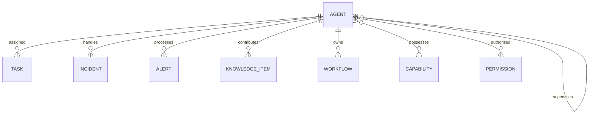

### 3.2 Incident Management Relationships

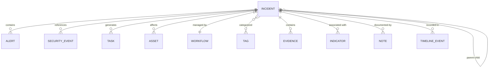

### 3.3 Task Relationships

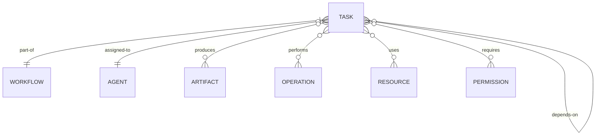

### 3.4 Alert Flow Relationships

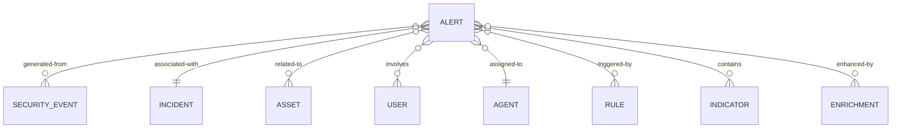

## 4. Specialized Data Models

### 4.1 Asset Model

```json
{
  "id": "uuid",
  "name": "string",
  "type": "enum(SERVER, WORKSTATION, NETWORK_DEVICE, IOT_DEVICE, SERVICE, ...)",
  "status": "enum(ACTIVE, INACTIVE, MAINTENANCE)",
  "owner": "uuid",
  "createdAt": "timestamp",
  "updatedAt": "timestamp",
  "operatingSystem": "string",
  "ipAddresses": ["string"],
  "macAddresses": ["string"],
  "hostname": "string",
  "networkLocation": "string",
  "criticality": "enum(CRITICAL, HIGH, MEDIUM, LOW)",
  "tags": ["string"],
  "services": [
    {
      "name": "string",
      "port": "int",
      "protocol": "string",
      "version": "string",
      "status": "string"
    }
  ],
  "vulnerabilities": [
    {
      "id": "uuid",
      "cveId": "string",
      "severity": "enum(CRITICAL, HIGH, MEDIUM, LOW)",
      "status": "enum(OPEN, MITIGATED, REMEDIATED, ACCEPTED)",
      "discoveredAt": "timestamp"
    }
  ],
  "metadata": {},
  "lastSeenAt": "timestamp",
  "configuration": {},
  "riskScore": "float",
  "complianceStatus": "enum(COMPLIANT, NON_COMPLIANT, UNKNOWN)",
  "patchStatus": "string"
}
```

### 4.2 Knowledge Item Model

```json
{
  "id": "uuid",
  "title": "string",
  "type": "enum(DETECTION_RULE, PLAYBOOK, PROCEDURE, REFERENCE, FINDING, ...)",
  "content": "string",
  "format": "enum(TEXT, HTML, MARKDOWN, JSON, YAML, ...)",
  "createdAt": "timestamp",
  "updatedAt": "timestamp",
  "createdById": "uuid",
  "approvedById": "uuid|null",
  "status": "enum(DRAFT, APPROVED, DEPRECATED)",
  "version": "string",
  "tags": ["string"],
  "category": "string",
  "relations": [
    {
      "type": "enum(RELATED_TO, PART_OF, REFERENCES, ...)",
      "itemId": "uuid"
    }
  ],
  "metadata": {},
  "applicability": ["string"],
  "effectiveFrom": "timestamp|null",
  "effectiveTo": "timestamp|null",
  "confidence": "float",
  "usage": {
    "views": "int",
    "applications": "int",
    "lastUsed": "timestamp"
  },
  "feedback": [
    {
      "agentId": "uuid",
      "rating": "float",
      "comment": "string",
      "timestamp": "timestamp"
    }
  ]
}
```

### 4.3 Security Indicator Model

```json
{
  "id": "uuid",
  "type": "enum(IP, DOMAIN, URL, FILE_HASH, EMAIL, USER_AGENT, ...)",
  "value": "string",
  "createdAt": "timestamp",
  "updatedAt": "timestamp",
  "firstSeenAt": "timestamp",
  "lastSeenAt": "timestamp",
  "expiresAt": "timestamp|null",
  "confidence": "float",
  "severity": "enum(CRITICAL, HIGH, MEDIUM, LOW, INFORMATIONAL)",
  "status": "enum(ACTIVE, EXPIRED, REVOKED)",
  "source": "string",
  "sourceType": "enum(INTERNAL, EXTERNAL, ANALYSIS, HUNTING, ...)",
  "createdById": "uuid",
  "context": "string",
  "description": "string",
  "tlp": "enum(WHITE, GREEN, AMBER, RED)",
  "tags": ["string"],
  "relatedIndicators": ["uuid"],
  "sightings": [
    {
      "timestamp": "timestamp",
      "source": "string", 
      "context": "string"
    }
  ],
  "enrichments": [
    {
      "source": "string",
      "type": "string",
      "data": {},
      "timestamp": "timestamp"
    }
  ],
  "metadata": {},
  "falsePositives": "int"
}
```

### 4.4 Permission Model

```json
{
  "id": "uuid",
  "name": "string",
  "description": "string",
  "category": "enum(SYSTEM, DATA, OPERATION, SECURITY, ...)",
  "actions": ["string"],
  "resources": ["string"],
  "conditions": [
    {
      "attribute": "string",
      "operator": "enum(EQUALS, NOT_EQUALS, CONTAINS, GREATER_THAN, ...)",
      "value": "any"
    }
  ],
  "tier": "enum(L1, L2, L3, HUMAN)",
  "riskLevel": "enum(LOW, MEDIUM, HIGH, CRITICAL)",
  "approvalRequired": "boolean",
  "auditLevel": "enum(NONE, BASIC, DETAILED)",
  "createdAt": "timestamp",
  "updatedAt": "timestamp",
  "version": "string",
  "dependencies": ["uuid"],
  "tags": ["string"]
}
```

### 4.5 Security Operation Model

```json
{
  "id": "uuid",
  "name": "string", 
  "description": "string",
  "type": "enum(READ, WRITE, QUERY, MODIFY, CONTAIN, BLOCK, ...)",
  "category": "enum(INVESTIGATION, RESPONSE, ANALYSIS, REPORTING, ...)",
  "target": {
    "type": "enum(SYSTEM, NETWORK, ENDPOINT, USER, DATA, ...)",
    "identifiers": ["string"]
  },
  "parameters": [
    {
      "name": "string",
      "type": "string",
      "required": "boolean",
      "default": "any",
      "description": "string"
    }
  ],
  "result": {
    "type": "string",
    "schema": {}
  },
  "permissions": ["string"],
  "riskLevel": "enum(LOW, MEDIUM, HIGH, CRITICAL)",
  "approvalRequired": "boolean",
  "executionConstraints": {
    "timeRestricted": "boolean",
    "allowedTimeWindows": ["string"],
    "rateLimited": "boolean",
    "rateLimit": "int",
    "rateLimitPeriod": "duration"
  },
  "implementation": {
    "type": "enum(INTERNAL, EXTERNAL_API, SCRIPT, PROCEDURE, ...)",
    "details": {}
  },
  "metrics": {
    "averageExecutionTime": "duration", 
    "successRate": "float",
    "usageCount": "int"
  }
}
```

### 4.6 Agent Capability Model

```json
{
  "id": "uuid",
  "name": "string",
  "description": "string",
  "category": "enum(DETECTION, ANALYSIS, RESPONSE, INVESTIGATION, REPORTING, ...)",
  "domain": "enum(EMAIL, ENDPOINT, NETWORK, CLOUD, IAM, ...)",
  "functions": [
    {
      "name": "string",
      "description": "string",
      "parameters": [
        {
          "name": "string",
          "type": "string",
          "required": "boolean",
          "default": "any",
          "description": "string"
        }
      ],
      "returns": {
        "type": "string",
        "description": "string"
      },
      "permissions": ["string"],
      "examples": [
        {
          "description": "string",
          "parameters": {},
          "result": {}
        }
      ]
    }
  ],
  "dependencies": ["uuid"],
  "requiredAIModels": ["string"],
  "minTier": "enum(L1, L2, L3)",
  "metrics": {
    "reliability": "float",
    "accuracy": "float", 
    "performance": "float"
  },
  "restrictions": {
    "maxConsecutiveUses": "int",
    "cooldownPeriod": "duration"
  },
  "createdAt": "timestamp",
  "updatedAt": "timestamp",
  "version": "string",
  "tags": ["string"]
}
```

## 5. Cross-Domain Models

### 5.1 Metrics Model

```json
{
  "id": "uuid",
  "timestamp": "timestamp",
  "category": "enum(PERFORMANCE, SECURITY, OPERATIONAL, SYSTEM, AGENT, ...)",
  "type": "string",
  "name": "string",
  "value": "any",
  "unit": "string",
  "dimensions": {
    "dimension1": "value1",
    "dimension2": "value2"
  },
  "source": "string",
  "period": {
    "start": "timestamp",
    "end": "timestamp",
    "duration": "duration"
  },
  "comparisonValue": "any",
  "comparisonPeriod": {
    "start": "timestamp",
    "end": "timestamp"
  },
  "threshold": {
    "warning": "any",
    "critical": "any"
  },
  "trend": "enum(INCREASING, DECREASING, STABLE, FLUCTUATING)",
  "metadata": {}
}
```

### 5.2 Audit Log Model

```json
{
  "id": "uuid",
  "timestamp": "timestamp",
  "eventType": "string",
  "category": "enum(AUTHENTICATION, AUTHORIZATION, DATA_ACCESS, CONFIGURATION, OPERATION, SYSTEM, ...)",
  "actor": {
    "id": "uuid",
    "type": "enum(AGENT, HUMAN, SYSTEM)",
    "name": "string"
  },
  "action": "string",
  "outcome": "enum(SUCCESS, FAILURE, PARTIAL_SUCCESS, DEFERRED)",
  "resources": [
    {
      "type": "string",
      "id": "string|uuid",
      "name": "string"
    }
  ],
  "details": {},
  "before": {},
  "after": {},
  "reason": "string",
  "sourceIP": "string",
  "sessionId": "string",
  "correlationId": "uuid",
  "severity": "enum(CRITICAL, HIGH, MEDIUM, LOW, INFORMATIONAL)",
  "metadata": {},
  "permissions": ["string"]
}
```

### 5.3 Communication Model

```json
{
  "id": "uuid",
  "timestamp": "timestamp",
  "type": "enum(COMMAND, QUERY, NOTIFICATION, RESPONSE, STATUS_UPDATE, ESCALATION)",
  "sender": {
    "id": "uuid",
    "type": "enum(AGENT, HUMAN, SYSTEM)",
    "name": "string",
    "tier": "enum(L1, L2, L3, HUMAN)"
  },
  "recipients": [
    {
      "id": "uuid",
      "type": "enum(AGENT, HUMAN, SYSTEM)",
      "name": "string",
      "tier": "enum(L1, L2, L3, HUMAN)"
    }
  ],
  "subject": "string",
  "content": "any",
  "format": "enum(TEXT, JSON, HTML, MARKDOWN, ...)",
  "priority": "enum(CRITICAL, HIGH, MEDIUM, LOW)",
  "conversationId": "uuid",
  "replyToId": "uuid|null",
  "status": "enum(SENT, DELIVERED, READ, PROCESSED, FAILED)",
  "expiresAt": "timestamp|null",
  "tags": ["string"],
  "attachments": [
    {
      "id": "uuid",
      "type": "string",
      "name": "string",
      "content": "any|null",
      "contentReference": "string|null"
    }
  ],
  "context": {
    "taskId": "uuid|null",
    "incidentId": "uuid|null",
    "workflowId": "uuid|null",
    "alertId": "uuid|null"
  },
  "metadata": {},
  "metrics": {
    "processingTime": "duration",
    "deliveryTime": "duration"
  }
}
```

### 5.4 Decision Model

```json
{
  "id": "uuid",
  "timestamp": "timestamp",
  "type": "enum(SECURITY, OPERATIONAL, ESCALATION, RESPONSE, ...)",
  "description": "string",
  "agent": {
    "id": "uuid",
    "name": "string",
    "tier": "enum(L1, L2, L3)"
  },
  "context": {
    "taskId": "uuid|null",
    "incidentId": "uuid|null",
    "alertId": "uuid|null",
    "workflowId": "uuid|null",
    "situation": {}
  },
  "options": [
    {
      "id": "string",
      "description": "string",
      "impact": {
        "security": "enum(POSITIVE, NEUTRAL, NEGATIVE)",
        "operational": "enum(POSITIVE, NEUTRAL, NEGATIVE)",
        "business": "enum(POSITIVE, NEUTRAL, NEGATIVE)"
      },
      "risk": "float",
      "confidence": "float",
      "reasoning": "string"
    }
  ],
  "decision": {
    "optionId": "string",
    "confidence": "float",
    "reasoning": "string",
    "factors": [
      {
        "name": "string",
        "weight": "float", 
        "impact": "float"
      }
    ]
  },
  "approvals": [
    {
      "agentId": "uuid",
      "timestamp": "timestamp",
      "status": "enum(APPROVED, REJECTED, PENDING)",
      "comments": "string"
    }
  ],
  "execution": {
    "status": "enum(PENDING, IN_PROGRESS, COMPLETED, FAILED)",
    "timestamp": "timestamp|null",
    "result": {},
    "error": "string|null"
  },
  "outcome": {
    "status": "enum(SUCCESSFUL, PARTIALLY_SUCCESSFUL, FAILED, UNKNOWN)",
    "assessment": "string",
    "timestamp": "timestamp|null"
  },
  "learnings": "string|null",
  "metadata": {}
}
```

## 6. Data Flow Models

### 6.1 Alert Processing Flow

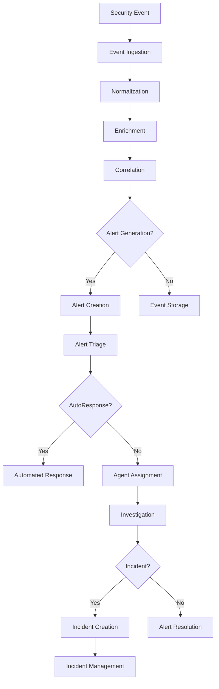

### 6.2 Task Execution Flow

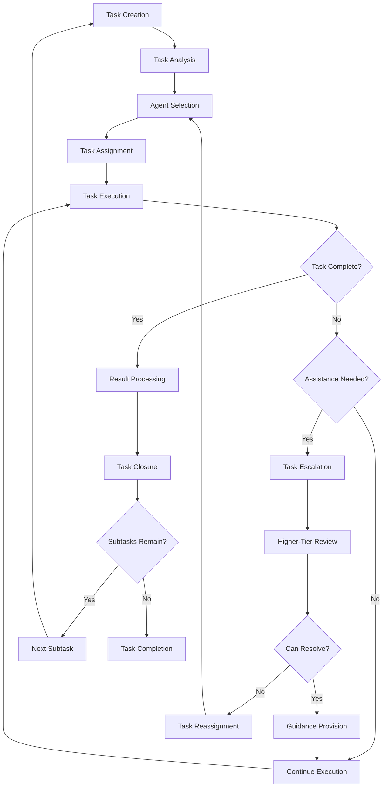

### 6.3 Knowledge Management Flow

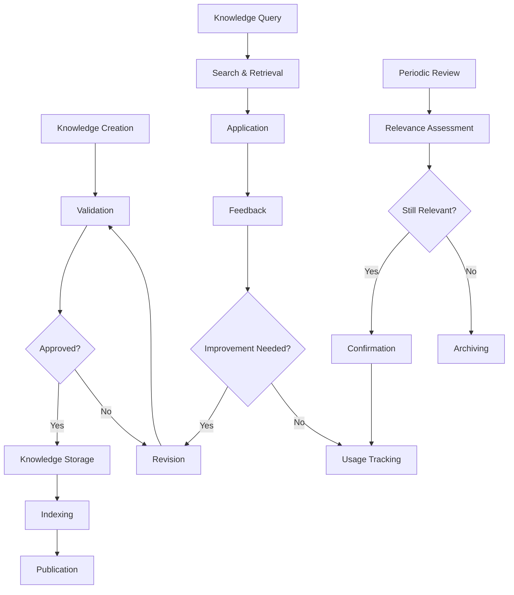

## 7. Storage and Access Patterns

### 7.1 Data Storage Tiers

| Tier | Description | Data Types | Access Pattern | Retention |
|------|-------------|------------|---------------|-----------|
| Hot Storage | High-performance, immediate access | Active incidents, Recent alerts, Current tasks | High read/write, Low latency | Short (days to weeks) |
| Warm Storage | Balanced performance and cost | Recent historical data, Solved incidents, Completed tasks | Medium read, Low write | Medium (weeks to months) |
| Cold Storage | Cost-effective long-term storage | Historical data, Closed cases, Audit logs | Low read, Very low write | Long (months to years) |
| Archive | Compliance and reference storage | Historical records, Compliance evidence | Very low read, No write | Very long (years) |

### 7.2 Common Access Patterns

| Pattern | Description | Example Use Cases |
|---------|-------------|-------------------|
| Real-time Detection | Continuous streaming and analysis | Threat detection, Anomaly identification |
| Investigative Query | Deep, complex queries across datasets | Incident investigation, Threat hunting |
| Operational Status | Current state monitoring | Dashboard displays, Status reporting |
| Historical Analysis | Long-term trend analysis | Security posture assessment, Performance evaluation |
| Knowledge Retrieval | Context-based information lookup | Response guidance, Procedure lookup |
| Reporting | Aggregated views of security data | Executive reporting, Compliance reporting |

### 7.3 Data Access Control Model

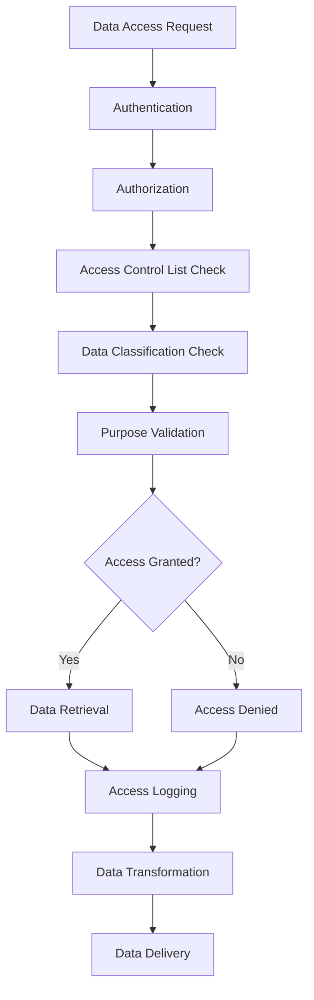

## 8. Implementation Considerations

### 8.1 Data Consistency Requirements

| Data Type | Consistency Model | Rationale |
|-----------|-------------------|-----------|
| Security Events | Eventually Consistent | High volume requires scale over immediate consistency |
| Alerts | Strong Consistency | Critical for accurate security response |
| Incidents | Strong Consistency | Requires accurate, up-to-date information |
| Agent State | Eventually Consistent | Frequent updates, tolerance for slight staleness |
| Knowledge Base | Eventually Consistent | Infrequent updates, read-heavy workload |
| Audit Logs | Strong Consistency | Compliance and security requirements |

### 8.2 Data Lifecycle Management

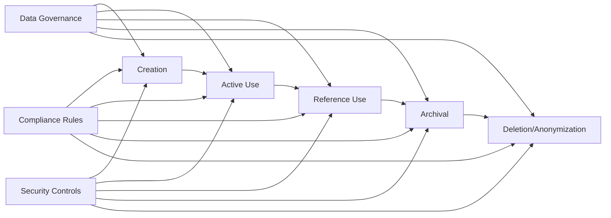

### 8.3 Scalability Considerations

| Aspect | Strategy | Implementation |
|--------|----------|----------------|
| Write Scaling | Partitioning | Data partitioned by time, entity type, and other dimensions |
| Read Scaling | Replication, Caching | Read replicas and multi-level caching |
| Query Performance | Indexing, Materialized Views | Strategic indexes and pre-computed views |
| Storage Growth | Tiered Storage, Compression | Automatic data tiering and compression |
| Concurrent Access | Connection Pooling, Sharding | Dynamic resource allocation based on load |