# External Systems Integration

## 1. Overview

The External Systems Integration framework enables the Agentic SOC to seamlessly connect with security tools, business systems, and communication platforms. These integrations allow for bidirectional data flow, operational coordination, and workflow automation across the security ecosystem.

```mermaid
graph TB
    classDef integration fill:#f9ebeb,stroke:#d13438,stroke-width:2px
    classDef connector fill:#ebf9eb,stroke:#34d138,stroke-width:2px
    classDef data fill:#ebf2f9,stroke:#3485d1,stroke-width:2px
    classDef security fill:#f9f7eb,stroke:#d1b834,stroke-width:2px
    classDef monitor fill:#f2ebf9,stroke:#8434d1,stroke-width:2px
    classDef adapt fill:#ebf9f7,stroke:#34d1b8,stroke-width:2px
    
    %% Main Components
    ESI[External Systems Integration]
    ESI --> IESS[Integration Engine & Service Suite]
    
    subgraph Integration Engine
        IntegrationHub[Integration Hub]
        APIGateway[API Gateway]
        DataTransformation[Data Transformation]
        CredentialVault[Credential Vault]
    end
    
    subgraph Connector Framework
        ConnectorCatalog[Connector Catalog]
        CustomConnectors[Custom Connectors]
        ConnectorManagement[Connector Management]
        ConnectorHealthMonitor[Connector Health Monitor]
    end
    
    subgraph Data Exchange
        StreamingEngine[Streaming Engine]
        BatchProcessor[Batch Processor]
        TransactionManager[Transaction Manager]
        SchemaRegistry[Schema Registry]
    end
    
    subgraph Security Controls
        AuthService[Authentication Service]
        AuthZService[Authorization Service]
        CryptoServices[Cryptographic Services]
        SecAudit[Security Auditing]
    end
    
    subgraph Monitoring & Management
        HealthMonitor[Health Monitor]
        PerformanceMetrics[Performance Metrics]
        AlertManager[Alert Manager]
        ConfigManager[Configuration Manager]
    end
    
    subgraph Adaptation Layer
        BehaviorAdaptors[Behavior Adaptors]
        ProtocolAdaptors[Protocol Adaptors]
        DataAdaptors[Data Adaptors]
        AuthAdaptors[Authentication Adaptors]
    end
    
    %% Connections from ESI
    IESS --> IntegrationHub
    IESS --> ConnectorCatalog
    IESS --> StreamingEngine
    IESS --> AuthService
    IESS --> HealthMonitor
    IESS --> BehaviorAdaptors
    
    %% Integration Engine
    IntegrationHub --> APIGateway
    IntegrationHub --> DataTransformation
    IntegrationHub --> CredentialVault
    
    %% Connector Framework
    ConnectorCatalog --> CustomConnectors
    ConnectorCatalog --> ConnectorManagement
    ConnectorCatalog --> ConnectorHealthMonitor
    
    %% Data Exchange
    StreamingEngine --> BatchProcessor
    StreamingEngine --> TransactionManager
    StreamingEngine --> SchemaRegistry
    
    %% Security Controls
    AuthService --> AuthZService
    AuthService --> CryptoServices
    AuthService --> SecAudit
    
    %% Monitoring & Management
    HealthMonitor --> PerformanceMetrics
    HealthMonitor --> AlertManager
    HealthMonitor --> ConfigManager
    
    %% Adaptation Layer
    BehaviorAdaptors --> ProtocolAdaptors
    BehaviorAdaptors --> DataAdaptors
    BehaviorAdaptors --> AuthAdaptors
    
    %% Apply classes
    class IntegrationHub,APIGateway,DataTransformation,CredentialVault integration
    class ConnectorCatalog,CustomConnectors,ConnectorManagement,ConnectorHealthMonitor connector
    class StreamingEngine,BatchProcessor,TransactionManager,SchemaRegistry data
    class AuthService,AuthZService,CryptoServices,SecAudit security
    class HealthMonitor,PerformanceMetrics,AlertManager,ConfigManager monitor
    class BehaviorAdaptors,ProtocolAdaptors,DataAdaptors,AuthAdaptors adapt
```

## 2. Integration Architecture Principles

### 2.1 Design Principles

| Principle | Description |
|-----------|-------------|
| Decoupled Architecture | Loose coupling between systems for flexibility and independent evolution |
| Standard Interfaces | Consistent integration patterns across different systems |
| Resilient Design | Fault tolerance and graceful degradation when systems are unavailable |
| Secure by Default | Security controls built into all integration points |
| Observability | Comprehensive monitoring and tracing across integration paths |
| Adaptable Design | Easily accommodating changes in external systems |
| Self-healing | Automatic recovery from temporary integration failures |
| Versioned Interfaces | Support for multiple API versions to manage change |

### 2.2 Integration Patterns

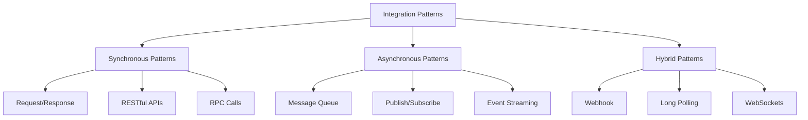

| Pattern | Use Cases | Example |
|---------|-----------|---------|
| Request/Response | Direct queries, immediate actions | JIRA ticket retrieval |
| Message Queue | Task processing, buffering | Email security scan requests |
| Publish/Subscribe | Event distribution, notifications | Threat intelligence updates |
| Webhook | Callbacks, event triggers | Alert notifications from security tools |
| Event Streaming | Real-time data flows, monitoring | Endpoint telemetry from CrowdStrike |
| WebSockets | Bidirectional real-time communication | Live agent collaboration |

### 2.3 Integration Lifecycle Management

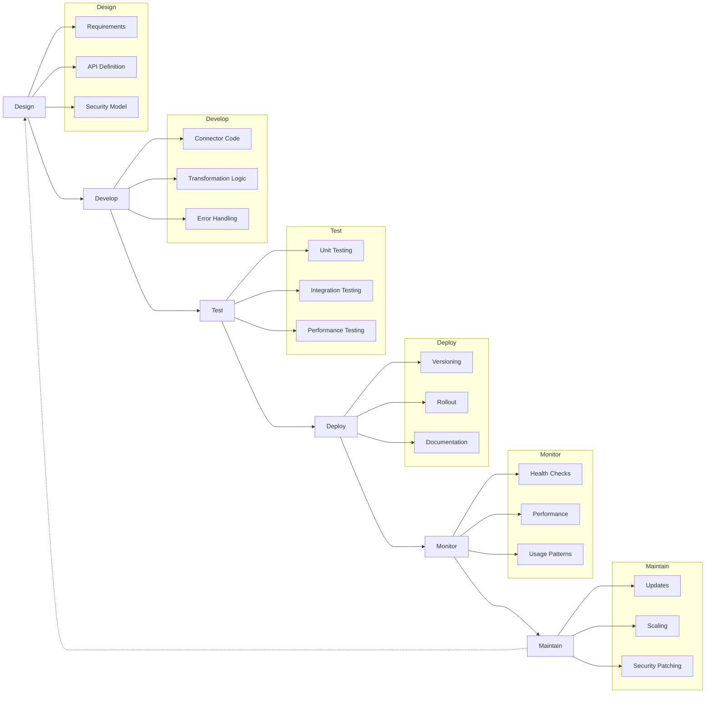

## 3. Core Integration Components

### 3.1 Integration Hub

**Responsibilities**:
- Serve as the central integration point for all external systems
- Manage message routing and transformation
- Orchestrate complex integration workflows
- Provide integration governance
- Enforce integration policies
- Track integration transactions

**Key Features**:
- **Centralized Control**: Single integration control point
- **Traffic Management**: Message flow regulation
- **Transaction Logging**: Complete transaction history
- **Error Management**: Standardized error handling
- **Policy Enforcement**: Integration policy application
- **Route Configuration**: Dynamic message routing

### 3.2 API Gateway

**Responsibilities**:
- Provide edge security for API traffic
- Handle API request routing
- Implement API rate limiting
- Manage API versioning
- Enable API analytics
- Support API documentation

**Key Features**:
- **Traffic Control**: API request management
- **Security Enforcement**: API security controls
- **Protocol Translation**: Cross-protocol support
- **Version Management**: API version coordination
- **Usage Analytics**: API usage tracking
- **Developer Portal**: API documentation and resources

### 3.3 Data Transformation

**Responsibilities**:
- Transform data between different formats
- Apply data mapping rules
- Validate data integrity
- Enhance data with contextual information
- Filter unnecessary data
- Handle data type conversion

**Data Transformation Flow**:

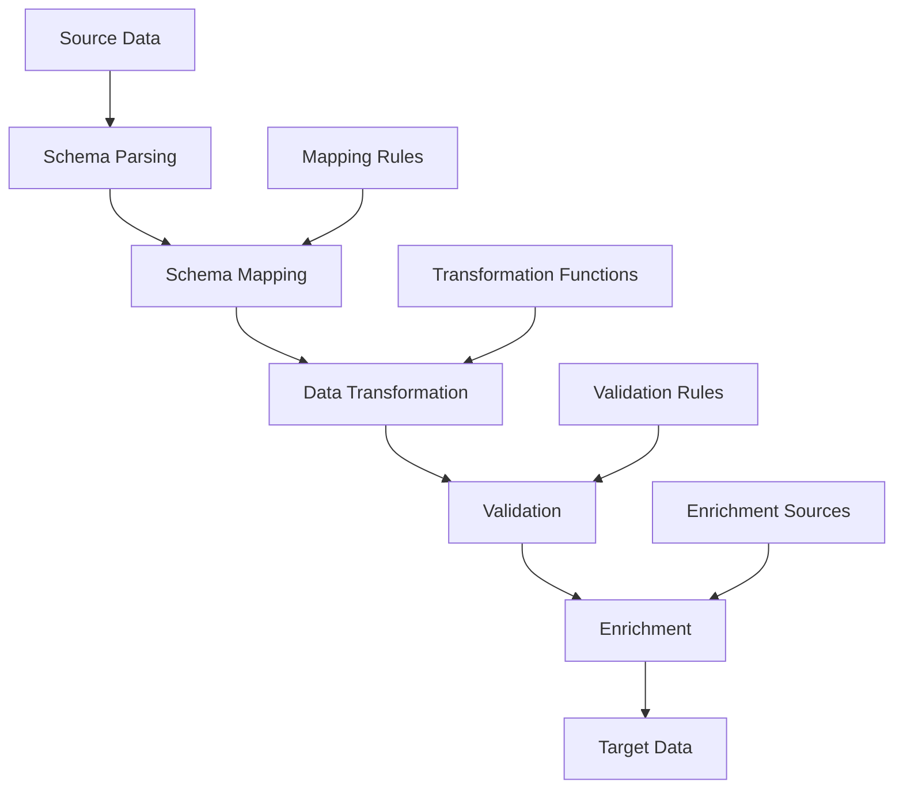

**Key Features**:
- **Format Conversion**: Cross-format transformation
- **Schema Mapping**: Field-to-field mapping
- **Data Validation**: Integrity verification
- **Data Enrichment**: Context addition
- **Complex Transformations**: Advanced data manipulation
- **Bulk Processing**: High-volume transformation

### 3.4 Credential Vault

**Responsibilities**:
- Securely store integration credentials
- Manage API keys and tokens
- Rotate credentials automatically
- Provide credential access control
- Audit credential usage
- Support multiple authentication methods

**Credential Management**:

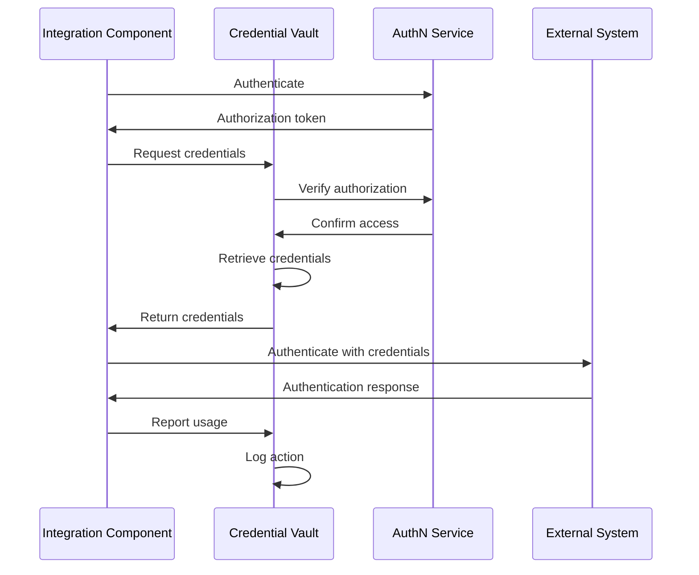

**Key Features**:
- **Secure Storage**: Encrypted credential storage
- **Automatic Rotation**: Scheduled credential updates
- **Just-in-Time Access**: On-demand credential delivery
- **Usage Audit**: Complete credential usage tracking
- **Access Control**: Role-based credential access
- **Multi-type Support**: Various credential formats

## 4. Connector Framework

### 4.1 Connector Catalog

**Responsibilities**:
- Maintain inventory of available connectors
- Provide connector discovery
- Support connector selection
- Track connector versions
- Enable connector documentation
- Facilitate connector reuse

**Connector Categories**:

| Category | Purpose | Examples |
|----------|---------|----------|
| Security Tools | Security system integrations | CrowdStrike, Proofpoint, Rapid7 |
| Communication | Messaging and notification | Teams, Email, SMS |
| Workflow | Process and task management | JIRA, ServiceNow |
| Knowledge | Information and documentation | Obsidian, SharePoint |
| Infrastructure | System and platform integration | AWS, Azure, Google Cloud |
| Custom | Organization-specific systems | Internal applications |

**Key Features**:
- **Comprehensive Directory**: Complete connector listing
- **Searchable Catalog**: Connector discovery tools
- **Version Tracking**: Connector version management
- **Metadata Management**: Connector information tracking
- **Documentation Access**: Connector usage guides
- **Capability Mapping**: Connector functionality index

### 4.2 Custom Connectors

**Responsibilities**:
- Enable custom connector development
- Provide connector templates
- Support connector testing
- Implement connector versioning
- Enable connector deployment
- Ensure connector maintenance

**Connector Development Process**:

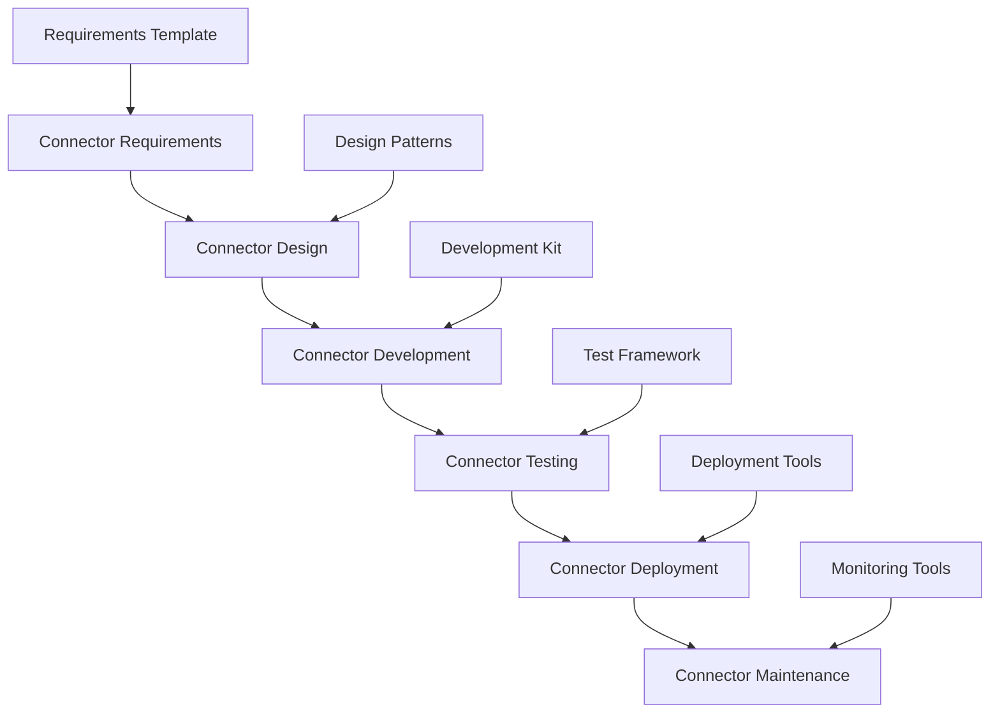

**Key Features**:
- **SDK Support**: Connector development toolkit
- **Pattern Templates**: Reusable connector patterns
- **Testing Framework**: Connector validation tools
- **Deployment Pipeline**: Streamlined implementation
- **Version Control**: Connector version management
- **Maintenance Tools**: Connector upkeep utilities

### 4.3 Connector Management

**Responsibilities**:
- Control connector lifecycle
- Configure connector instances
- Monitor connector performance
- Manage connector versions
- Handle connector updates
- Enable connector diagnostics

**Management Capabilities**:

```mermaid
graph TD
    A[Connector Management] --> B[Lifecycle Control]
    A --> C[Configuration]
    A --> D[Performance]
    A --> E[Version Control]
    A --> F[Update Management]
    A --> G[Diagnostics]
    
    B --> B1[Provisioning]
    B --> B2[Activation/Deactivation]
    B --> B3[Retirement]
    
    C --> C1[Parameter Configuration]
    C --> C2[Connection Settings]
    C --> C3[Behavior Settings]
    
    D --> D1[Performance Metrics]
    D --> D2[Throughput Monitoring]
    D --> D3[Resource Utilization]
    
    E --> E1[Version Tracking]
    E --> E2[Version Migration]
    E --> E3[Version Compatibility]
    
    F --> F1[Update Detection]
    F --> F2[Update Testing]
    F --> F3[Update Deployment]
    
    G --> G1[Health Checks]
    G --> G2[Log Analysis]
    G --> G3[Troubleshooting Tools]
```

**Key Features**:
- **Lifecycle Control**: End-to-end connector management
- **Configuration Interface**: Connector parameter setup
- **Performance Dashboard**: Connector health visibility
- **Version Management**: Connector version control
- **Update Automation**: Streamlined connector updates
- **Diagnostic Tools**: Connector troubleshooting utilities

### 4.4 Connector Health Monitor

**Responsibilities**:
- Monitor connector health status
- Detect connector failures
- Manage connector recovery
- Track connector performance
- Generate connector health metrics
- Alert on connector issues

**Health Monitoring Process**:

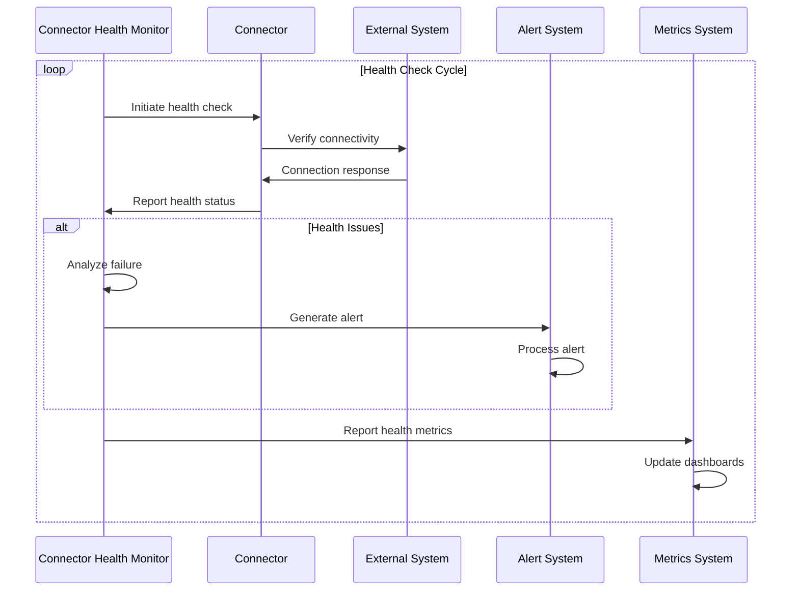

**Key Features**:
- **Automated Monitoring**: Continuous health checking
- **Proactive Detection**: Early issue identification
- **Recovery Management**: Automated recovery processes
- **Performance Tracking**: Connector performance metrics
- **Historical Analysis**: Health trend analysis
- **Alert Integration**: Issue notification system

## 5. Data Exchange Framework

### 5.1 Streaming Engine

**Responsibilities**:
- Handle real-time data streams
- Manage stream processing
- Enable stream transformation
- Support stream filtering
- Provide stream routing
- Enable stream persistence

**Streaming Architecture**:

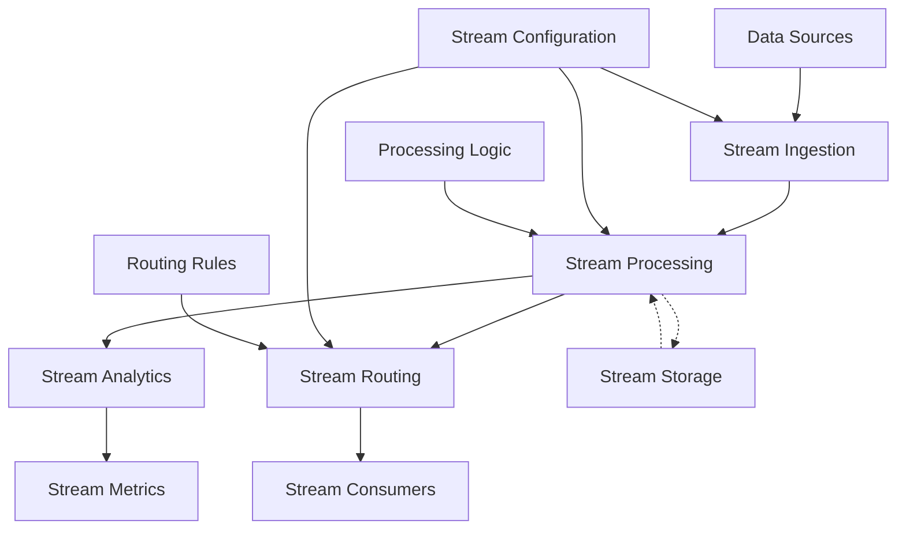

**Key Features**:
- **High-Throughput Design**: Efficient stream handling
- **Real-time Processing**: Immediate data transformation
- **Scalable Architecture**: Elastic capacity scaling
- **Stream Monitoring**: Comprehensive flow visibility
- **Processing Patterns**: Reusable stream processing
- **Recovery Capabilities**: Stream processing resilience

### 5.2 Batch Processor

**Responsibilities**:
- Process data in batches
- Schedule batch operations
- Manage batch dependencies
- Track batch progress
- Handle batch failures
- Optimize batch performance

**Batch Processing Framework**:

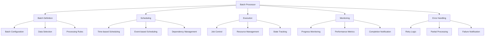

**Key Features**:
- **Configurable Batching**: Flexible batch definition
- **Intelligent Scheduling**: Optimized batch timing
- **Dependency Management**: Coordinated batch execution
- **Resource Optimization**: Efficient resource utilization
- **Fault Tolerance**: Resilient batch processing
- **Performance Monitoring**: Comprehensive metrics

### 5.3 Transaction Manager

**Responsibilities**:
- Ensure data transaction integrity
- Manage distributed transactions
- Support transaction isolation
- Handle transaction compensation
- Track transaction state
- Provide transaction recovery

**Transaction Processing**:

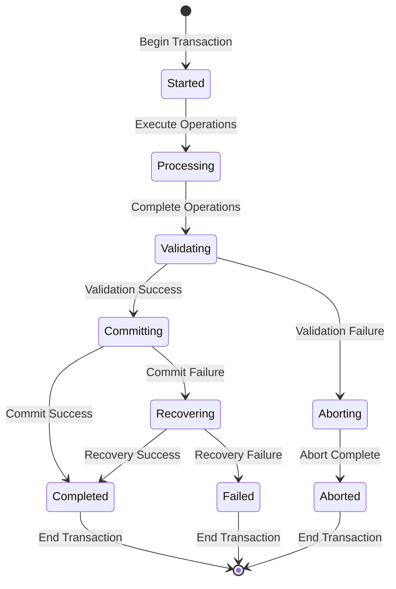

**Key Features**:
- **ACID Properties**: Complete transaction integrity
- **Distributed Coordination**: Cross-system transactions
- **Isolation Control**: Transaction boundary enforcement
- **Compensation Handling**: Error recovery mechanisms
- **State Management**: Transaction state tracking
- **Failure Recovery**: Robust recovery processes

### 5.4 Schema Registry

**Responsibilities**:
- Maintain data schemas
- Manage schema versions
- Validate schema compatibility
- Support schema evolution
- Provide schema discovery
- Enable schema governance

**Schema Management Process**:

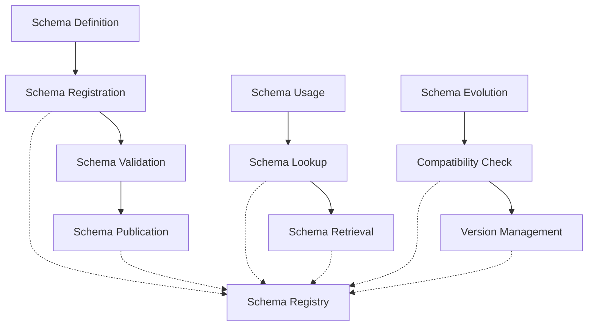

**Key Features**:
- **Comprehensive Registry**: Complete schema catalog
- **Version Control**: Schema version management
- **Compatibility Validation**: Schema change verification
- **Evolution Support**: Controlled schema changes
- **Discovery Interface**: Schema search capabilities
- **Governance Framework**: Schema approval processes

## 6. Security Controls

### 6.1 Authentication Service

**Responsibilities**:
- Verify identity for integration access 
- Support multiple authentication methods
- Manage authentication credentials
- Implement authentication policies
- Track authentication activities
- Handle authentication failures

**Authentication Methods**:

| Method | Use Case | Security Level |
|--------|----------|----------------|
| API Keys | Simple system integrations | Basic |
| OAuth | Third-party authentication | Standard |
| JWT | Stateless authentication | Standard |
| Mutual TLS | Highly secure connections | High |
| SAML | Enterprise SSO integration | High |
| Client Certificates | System-to-system | High |

**Key Features**:
- **Multi-factor Support**: Various authentication levels
- **Protocol Adaptation**: Multiple authentication types
- **Credential Management**: Authentication information security
- **Traffic Filtering**: Authentication-based access
- **Activity Logging**: Authentication event tracking
- **Failure Protection**: Brute force prevention

### 6.2 Authorization Service

**Responsibilities**:
- Control access to integration capabilities
- Implement authorization policies
- Manage permission grants
- Enforce least privilege
- Support role-based access
- Provide authorization auditing

**Authorization Model**:

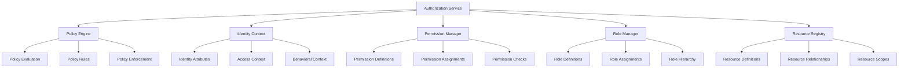

**Key Features**:
- **Fine-grained Control**: Detailed access management
- **Policy-based Authorization**: Rule-driven access decisions
- **Role Hierarchies**: Structured permission levels
- **Contextual Decisions**: Situation-aware authorization
- **Least Privilege**: Minimal access enforcement
- **Dynamic Authorization**: Adaptable access control

### 6.3 Cryptographic Services

**Responsibilities**:
- Provide encryption capabilities
- Enable secure key management
- Support digital signatures
- Implement secure data exchange
- Ensure cryptographic compliance
- Enable secure integration channels

**Security Services**:

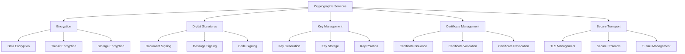

**Key Features**:
- **Comprehensive Protection**: End-to-end security
- **Standards Compliance**: Industry standard adherence
- **Key Lifecycle**: Complete key management
- **Certificate Operations**: PKI integration
- **Secure Transport**: Protected data channels
- **Crypto Agility**: Adaptable cryptographic methods

### 6.4 Security Auditing

**Responsibilities**:
- Track security-relevant events
- Record access activities
- Log security decisions
- Provide audit evidence
- Support security investigations
- Enable compliance reporting

**Audit Framework**:

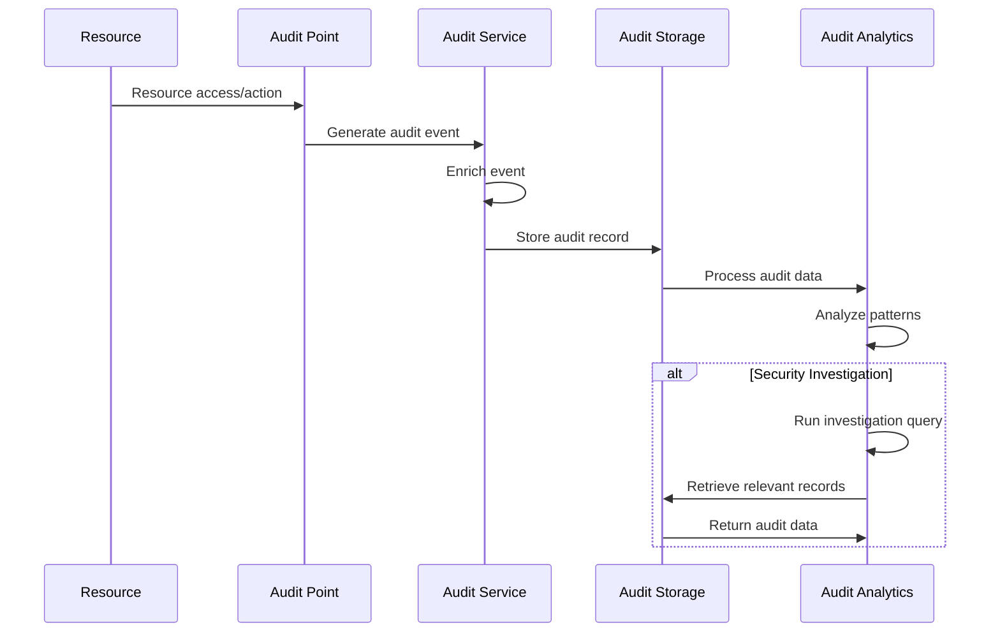

**Key Features**:
- **Comprehensive Logging**: Complete security event capture
- **Tamper Protection**: Immutable audit records
- **Search Capabilities**: Efficient audit data retrieval
- **Retention Management**: Policy-based record keeping
- **Intelligence Extraction**: Pattern recognition
- **Compliance Mapping**: Regulatory alignment

## 7. Monitoring & Management

### 7.1 Health Monitor

**Responsibilities**:
- Track system health status
- Monitor integration availability
- Detect integration failures
- Facilitate health diagnostics
- Enable health recovery
- Report health metrics

**Health Monitoring Approach**:

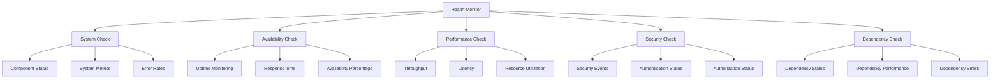

**Key Features**:
- **Comprehensive Monitoring**: Multi-dimensional health tracking
- **Real-time Status**: Current health visibility
- **Historical Analysis**: Health trend evaluation
- **Automatic Detection**: Issue identification
- **Diagnostic Tools**: Problem investigation support
- **Recovery Automation**: Self-healing capabilities

### 7.2 Performance Metrics

**Responsibilities**:
- Collect integration performance data
- Track throughput metrics
- Measure response times
- Monitor resource utilization
- Identify performance bottlenecks
- Report performance trends

**Key Metrics Categories**:

| Category | Metrics | Purpose |
|----------|---------|---------|
| Throughput | Messages/sec, Transactions/sec | Volume capacity |
| Latency | Response time, Processing time | Speed assessment |
| Reliability | Error rate, Success rate | Quality measurement |
| Resource | CPU, Memory, Network, Disk | Resource utilization |
| Concurrency | Active connections, Queue depth | Parallel capacity |
| Batching | Batch size, Batch duration | Processing efficiency |

**Key Features**:
- **Comprehensive Metrics**: Multi-dimensional measurements
- **Real-time Monitoring**: Current performance visibility
- **Trend Analysis**: Performance pattern identification
- **Threshold Alerting**: Performance boundary notification
- **Capacity Planning**: Resource requirement forecasting
- **Optimization Guidance**: Performance improvement insights

### 7.3 Alert Manager

**Responsibilities**:
- Generate integration alerts
- Route alerts to appropriate handlers
- Track alert status
- Manage alert escalations
- Control alert notifications
- Facilitate alert response

**Alert Management Process**:

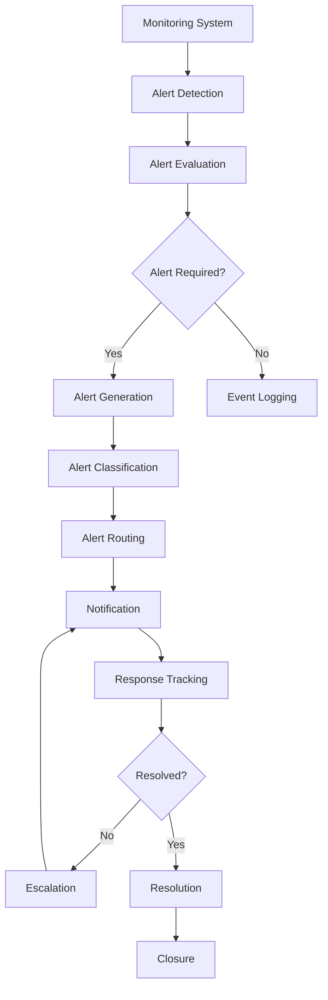

**Key Features**:
- **Intelligent Alerting**: Context-aware alert generation
- **Priority Classification**: Alert importance assignment
- **Targeted Routing**: Appropriate recipient selection
- **Status Tracking**: Complete alert lifecycle
- **Escalation Management**: Unresolved alert handling
- **Resolution Verification**: Alert closure confirmation

### 7.4 Configuration Manager

**Responsibilities**:
- Manage integration configurations
- Control configuration versions
- Enable configuration deployment
- Validate configuration changes
- Track configuration history
- Support configuration rollback

**Configuration Management**:

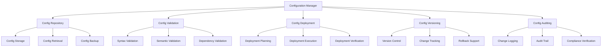

**Key Features**:
- **Centralized Management**: Complete configuration control
- **Version Control**: Configuration history tracking
- **Change Validation**: Configuration verification
- **Deployment Automation**: Streamlined configuration updates
- **Rollback Capability**: Configuration restoration
- **Audit Trail**: Configuration change history

## 8. Adaptation Layer

### 8.1 Behavior Adaptors

**Responsibilities**:
- Adapt to external system behaviors
- Handle system idiosyncrasies
- Implement retry strategies
- Manage interaction patterns
- Support behavioral variations
- Enable graceful degradation

**Adaptation Strategies**:

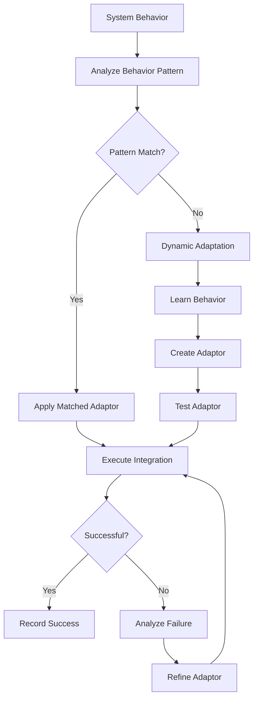

**Key Features**:
- **Pattern Recognition**: Behavioral pattern identification
- **Adaptive Strategies**: Dynamic behavior adjustment
- **Resilient Interaction**: Fault-tolerant operation
- **Learning Capability**: Evolving adaptation
- **Graceful Degradation**: Controlled service reduction
- **Optimization Learning**: Performance improvement

### 8.2 Protocol Adaptors

**Responsibilities**:
- Translate between communication protocols
- Support protocol-specific features
- Handle protocol versioning
- Manage protocol extensions
- Ensure protocol compliance
- Enable protocol negotiation

**Supported Protocols**:

| Protocol Category | Protocols | Application |
|------------------|-----------|-------------|
| HTTP-based | REST, GraphQL, SOAP | Web APIs |
| Messaging | AMQP, MQTT, JMS | Message-oriented |
| Security | SAML, OAuth, OpenID Connect | Authentication/Authorization |
| Streaming | Kafka, Kinesis, NATS | Data streaming |
| Legacy | EDI, SFTP, SMTP | Traditional systems |
| Specialized | HL7, DICOM, STIX/TAXII | Domain-specific |

**Key Features**:
- **Protocol Translation**: Cross-protocol communication
- **Standard Compliance**: Protocol specification adherence
- **Version Support**: Multiple protocol versions
- **Extension Handling**: Protocol extensions and customizations
- **Protocol Negotiation**: Dynamic protocol selection
- **Optimized Implementation**: Efficient protocol handling

### 8.3 Data Adaptors

**Responsibilities**:
- Transform between data formats
- Handle data schema variations
- Support data encoding/decoding
- Manage data type conversions
- Enable format extensions
- Support custom data formats

**Data Transformation**:

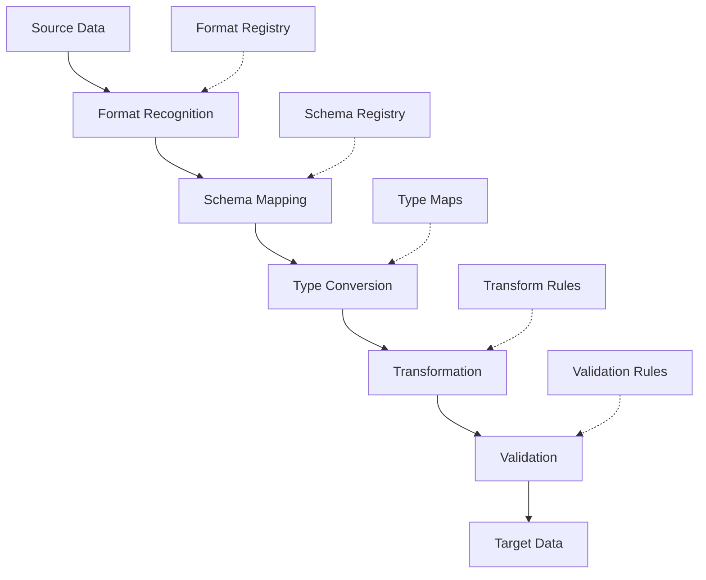

**Key Features**:
- **Comprehensive Format Support**: Multiple data formats
- **Schema Flexibility**: Variable schema handling
- **Type Mapping**: Cross-format type conversion
- **Encoding Support**: Various encoding methods
- **Custom Format Handling**: Special format processing
- **Extension Management**: Format extension support

### 8.4 Authentication Adaptors

**Responsibilities**:
- Support various authentication methods
- Translate between authentication protocols
- Manage credential transformations
- Handle authentication sequences
- Support identity federation
- Enable authentication chaining

**Authentication Support**:

```mermaid
graph TD
    A[Authentication Request] --> B[Method Recognition]
    B --> C[Protocol Selection]
    C --> D[Credential Preparation]
    D --> E[Authentication Execution]
    E --> F[Response Processing]
    F --> G[Token/Session Management]
    
    H[Auth Method Registry] -.-> B
    I[Protocol Registry] -.-> C
    J[Credential Vault] -.-> D
    K[Protocol Handlers] -.-> E
    L[Response Parsers] -.-> F
```

**Key Features**:
- **Multi-method Support**: Various authentication types
- **Protocol Translation**: Cross-protocol authentication
- **Credential Mapping**: Authentication information conversion
- **Federation Integration**: Identity federation support
- **Session Management**: Authentication state handling
- **Transparent Authentication**: Invisible authentication bridging

## 9. External System Integrations

### 9.1 Proofpoint Integration

**Purpose**: Integrate with Proofpoint for comprehensive email security, including threat detection, phishing protection, and data loss prevention.

**Integration Architecture**:

```mermaid
graph TD
    A[Agentic SOC] --> B[Proofpoint Connector]
    B --> C[Authentication]
    B --> D[API Integration]
    B --> E[Data Transformation]
    B --> F[Event Processing]
    
    C --> G[API Authentication]
    D --> H[TRAP API]
    D --> I[TAP API]
    D --> J[POD API]
    
    E --> K[Email Threat Data]
    E --> L[URL Analysis Data]
    E --> M[Attachment Analysis Data]
    
    F --> N[Alert Processing]
    F --> O[Threat Intelligence]
    F --> P[Quarantine Management]
```

**Integration Capabilities**:

| Capability | Description | API/Interface |
|------------|-------------|---------------|
| Email Threat Analysis | Retrieve email threat detection data | TAP API |
| URL Defense | Access URL analysis and protection data | TAP API |
| Attachment Defense | Retrieve attachment scanning results | TAP API |
| Quarantine Management | Manage quarantined messages | POD API |
| Threat Intelligence | Access Proofpoint threat intelligence | TRAP API |
| DLP Alerts | Retrieve data loss prevention alerts | POD API |
| Email Authentication | Access email authentication data | POD API |
| Policy Management | Control email security policies | POD API |

**Data Flow**:

1. **Inbound Data**:
   - Threat detection alerts
   - Phishing attempt notifications
   - Malicious URL/attachment reports
   - DLP violation alerts
   - Quarantine notifications

2. **Outbound Operations**:
   - Quarantine management commands
   - Email release/block requests
   - Policy adjustments
   - Threat hunting queries
   - User risk assessment

**Authentication Method**:
- OAuth 2.0 token-based authentication
- API key authentication for specific endpoints
- Service account credentials

**Event Handling**:
- Webhook notifications for real-time alerts
- Polling for status updates
- Batch processing for historical data

### 9.2 CrowdStrike/Falcon Integration

**Purpose**: Integrate with CrowdStrike Falcon for endpoint detection and response (EDR), threat hunting, and incident response.

**Integration Architecture**:

```mermaid
graph TD
    A[Agentic SOC] --> B[CrowdStrike Connector]
    B --> C[Authentication]
    B --> D[API Integration]
    B --> E[Real-time Events]
    B --> F[Response Actions]
    
    C --> G[OAuth Authentication]
    D --> H[Detections API]
    D --> I[Hosts API]
    D --> J[Incidents API]
    D --> K[Intel API]
    D --> L[Response API]
    
    E --> M[Event Stream Consumer]
    E --> N[Alert Processor]
    
    F --> O[Containment Actions]
    F --> P[Investigation Actions]
    F --> Q[Remediation Actions]
```

**Integration Capabilities**:

| Capability | Description | API/Interface |
|------------|-------------|---------------|
| Detection Retrieval | Access detection data | Detections API |
| Host Management | Monitor and manage hosts | Hosts API |
| Incident Tracking | Track security incidents | Incidents API |
| Threat Intelligence | Access threat intelligence | Intel API |
| Real-time Events | Stream real-time security events | Event Streams |
| Response Actions | Initiate response actions | Response API |
| Threat Hunting | Perform threat hunting | RTR API |
| Containment | Contain compromised hosts | Response API |

**Data Flow**:

1. **Inbound Data**:
   - Detection alerts
   - Host status updates
   - Incident notifications
   - Threat intelligence updates
   - Real-time endpoint events

2. **Outbound Operations**:
   - Host containment commands
   - Remediation actions
   - Investigation requests
   - Threat hunting queries
   - Custom IOC deployment

**Authentication Method**:
- OAuth 2.0 client credentials
- API key authentication
- Service principal authentication

**Event Handling**:
- Real-time event streaming
- Webhook notifications
- Polling for status updates
- Batch processing for historical data

### 9.3 Rapid7 Integration

**Purpose**: Integrate with Rapid7 for vulnerability management, penetration testing, and security assessment.

**Integration Architecture**:

```mermaid
graph TD
    A[Agentic SOC] --> B[Rapid7 Connector]
    B --> C[Authentication]
    B --> D[InsightVM API]
    B --> E[InsightIDR API]
    B --> F[InsightConnect API]
    
    C --> G[API Key Authentication]
    D --> H[Vulnerability Data]
    D --> I[Asset Data]
    D --> J[Scan Management]
    
    E --> K[SIEM Data]
    E --> L[User Behavior]
    E --> M[Alert Management]
    
    F --> N[Automation Workflows]
    F --> O[Orchestration]
```

**Integration Capabilities**:

| Capability | Description | API/Interface |
|------------|-------------|---------------|
| Vulnerability Data | Access vulnerability findings | InsightVM API |
| Asset Management | Track IT assets | InsightVM API |
| Scan Management | Control vulnerability scans | InsightVM API |
| SIEM Integration | Access security event data | InsightIDR API |
| User Behavior | Monitor user activity | InsightIDR API |
| Automated Response | Trigger security automations | InsightConnect API |
| Reporting | Generate security reports | Platform APIs |
| Remediation Tracking | Track vulnerability remediation | InsightVM API |

**Data Flow**:

1. **Inbound Data**:
   - Vulnerability scan results
   - Asset discovery data
   - Risk scoring information
   - Remediation validation
   - Threat detection alerts

2. **Outbound Operations**:
   - Scan initiation commands
   - Remediation actions
   - Report generation requests
   - Asset query operations
   - Automation workflow triggers

**Authentication Method**:
- API key authentication
- Platform credentials
- OAuth token authentication

**Event Handling**:
- Webhook notifications
- Polling for updates
- Scheduled data retrieval
- Event-driven integrations

### 9.4 JIRA Integration

**Purpose**: Integrate with JIRA for ticket management, workflow automation, and security incident tracking.

**Integration Architecture**:

```mermaid
graph TD
    A[Agentic SOC] --> B[JIRA Connector]
    B --> C[Authentication]
    B --> D[REST API]
    B --> E[Webhook Handling]
    B --> F[Workflow Integration]
    
    C --> G[OAuth Authentication]
    C --> H[API Token]
    
    D --> I[Issue Management]
    D --> J[Project Management]
    D --> K[Comment Management]
    D --> L[Attachment Management]
    
    E --> M[Issue Events]
    E --> N[Status Changes]
    
    F --> O[Workflow Transitions]
    F --> P[Automation Rules]
```

**Integration Capabilities**:

| Capability | Description | API/Interface |
|------------|-------------|---------------|
| Issue Management | Create and manage issues | REST API |
| Project Integration | Work with JIRA projects | REST API |
| Comment Management | Add and retrieve comments | REST API |
| Attachment Handling | Manage issue attachments | REST API |
| Workflow Control | Control issue workflows | REST API |
| Event Handling | Respond to JIRA events | Webhooks |
| Search | Search for issues | REST API |
| Reporting | Generate JIRA reports | REST API |

**Data Flow**:

1. **Inbound Data**:
   - Issue status updates
   - Comment notifications
   - Assignment changes
   - Workflow transitions
   - Issue resolution updates

2. **Outbound Operations**:
   - Issue creation
   - Issue updates
   - Comment addition
   - Attachment upload
   - Workflow transitions
   - Query operations

**Authentication Method**:
- OAuth 2.0
- API tokens
- Basic authentication

**Event Handling**:
- Webhook notifications
- Polling for updates
- Event-driven operations
- Scheduled synchronization

### 9.5 Microsoft Teams Integration

**Purpose**: Integrate with Microsoft Teams for collaboration, notification delivery, and interactive security operations.

**Integration Architecture**:

```mermaid
graph TD
    A[Agentic SOC] --> B[Teams Connector]
    B --> C[Authentication]
    B --> D[Graph API]
    B --> E[Webhook Integration]
    B --> F[Bot Framework]
    
    C --> G[OAuth Authentication]
    C --> H[Application Permissions]
    
    D --> I[Channel Management]
    D --> J[Message Management]
    D --> K[Meeting Management]
    
    E --> L[Incoming Webhooks]
    E --> M[Outgoing Webhooks]
    
    F --> N[Conversational Bot]
    F --> O[Command Bot]
    F --> P[Notification Bot]
```

**Integration Capabilities**:

| Capability | Description | API/Interface |
|------------|-------------|---------------|
| Messaging | Send and receive messages | Graph API, Webhooks |
| Channel Management | Work with Teams channels | Graph API |
| Interactive Cards | Create interactive content | Adaptive Cards |
| Bot Integration | Deploy conversational bots | Bot Framework |
| Notification Delivery | Send security notifications | Webhooks |
| File Sharing | Share security reports | Graph API |
| Meeting Integration | Manage security meetings | Graph API |
| Tab Integration | Create security dashboards | Tab SDK |

**Data Flow**:

1. **Inbound Data**:
   - Message responses
   - Command requests
   - Interactive card actions
   - Bot conversations
   - User queries

2. **Outbound Operations**:
   - Alert notifications
   - Status updates
   - Report sharing
   - Interactive requests
   - Command responses
   - Meeting scheduling

**Authentication Method**:
- OAuth 2.0
- Application permissions
- Delegated permissions

**Event Handling**:
- Real-time webhook notifications
- Bot conversation events
- Card action events
- Message reaction events

### 9.6 Obsidian Integration

**Purpose**: Integrate with Obsidian for knowledge management, documentation, and security playbook storage.

**Integration Architecture**:

```mermaid
graph TD
    A[Agentic SOC] --> B[Obsidian Connector]
    B --> C[Authentication]
    B --> D[File Management]
    B --> E[Content Management]
    B --> F[Search Capability]
    
    D --> G[Vault Access]
    D --> H[File Operations]
    
    E --> I[Markdown Processing]
    E --> J[Content Creation]
    E --> K[Content Updating]
    
    F --> L[Content Search]
    F --> M[Tag-based Queries]
```

**Integration Capabilities**:

| Capability | Description | Implementation |
|------------|-------------|----------------|
| Vault Access | Access Obsidian vaults | File system or plugin API |
| Document Management | Manage knowledge documents | File operations |
| Content Creation | Create new documentation | Markdown generation |
| Content Updates | Update existing documentation | File operations |
| Search | Find relevant information | Content indexing |
| Playbook Access | Access security playbooks | Structured content parser |
| Knowledge Linking | Connect related information | Link management |
| Template Usage | Use document templates | Template processing |

**Data Flow**:

1. **Inbound Data**:
   - Knowledge document contents
   - Playbook procedures
   - Reference information
   - Search results

2. **Outbound Operations**:
   - Document creation
   - Content updates
   - Knowledge retrieval
   - Search queries
   - Template application

**Authentication Method**:
- File system access control
- Plugin authentication (if available)
- Local file permissions

**Event Handling**:
- File system watchers
- Content change monitoring
- Search indexing
- Version tracking

## 10. Implementation Strategy

### 10.1 Integration Priority

**Prioritization Framework**:

| Priority | System | Justification | Timeline |
|----------|--------|--------------|----------|
| 1 | CrowdStrike/Falcon | Critical for threat detection and response | Month 1 |
| 1 | JIRA | Core workflow and ticket management | Month 1 |
| 2 | Proofpoint | Email security automation | Month 2 |
| 2 | Microsoft Teams | Collaboration and notification | Month 2 |
| 3 | Rapid7 | Vulnerability management | Month 3 |
| 3 | Obsidian | Knowledge management | Month 3 |

**Priority Criteria**:
- Operational impact
- Security value
- Implementation complexity
- Dependency relationships
- User adoption requirements

### 10.2 Phased Rollout

**Rollout Phases**:

```mermaid
gantt
    title Integration Rollout Timeline
    dateFormat  YYYY-MM-DD
    
    section Foundation
    Integration Framework           :a1, 2026-01-01, 30d
    Core Architecture              :a2, after a1, 30d
    Security Controls              :a3, after a1, 45d
    
    section Priority 1
    CrowdStrike Integration        :b1, after a2, 30d
    JIRA Integration               :b2, after a2, 30d
    
    section Priority 2
    Proofpoint Integration         :c1, after b1, 30d
    Microsoft Teams Integration    :c2, after b2, 30d
    
    section Priority 3
    Rapid7 Integration             :d1, after c1, 30d
    Obsidian Integration           :d2, after c2, 30d
    
    section Optimization
    Performance Tuning             :e1, after d1, 20d
    Resilience Enhancement         :e2, after d2, 25d
```

**Phase Requirements**:

1. **Foundation Phase**:
   - Core integration framework
   - Security controls
   - Monitoring foundation
   - Connector framework

2. **Priority System Integration**:
   - Phased system integration
   - Sequential deployment
   - Incremental capability addition
   - Focused testing and validation

3. **Optimization Phase**:
   - Performance tuning
   - Resilience enhancement
   - Scaling adjustments
   - User experience refinement

### 10.3 Success Metrics

**Integration Metrics**:

| Category | Metric | Target |
|----------|--------|--------|
| Availability | Integration uptime | >99.9% |
| Performance | Average response time | <500ms |
| Reliability | Failed transaction rate | <0.1% |
| Throughput | Transactions per second | >100 TPS |
| Data Quality | Data accuracy | >99.5% |
| Security | Security incidents | Zero |
| Adoption | Feature utilization | >85% |

**Measurement Approach**:
- Automated monitoring
- Performance testing
- User feedback collection
- Security scanning
- Usage analytics

### 10.4 Governance Model

**Integration Governance**:

```mermaid
graph TD
    A[Integration Governance] --> B[Standards & Policies]
    A --> C[Change Management]
    A --> D[Risk Management]
    A --> E[Performance Management]
    
    B --> B1[Integration Standards]
    B --> B2[Security Policies]
    B --> B3[Documentation Requirements]
    
    C --> C1[Change Process]
    C --> C2[Version Control]
    C --> C3[Impact Assessment]
    
    D --> D1[Risk Assessment]
    D --> D2[Mitigation Planning]
    D --> D3[Compliance Management]
    
    E --> E1[Performance Monitoring]
    E --> E2[Capacity Planning]
    E --> E3[Optimization Process]
```

**Governance Components**:
- **Standards & Policies**: Integration guidelines and requirements
- **Change Management**: Controlled evolution process
- **Risk Management**: Integration risk handling
- **Performance Management**: Integration optimization
- **Documentation**: Complete integration documentation

## 11. Integration Use Cases

### 11.1 Automated Phishing Email Response

**Process Flow**:

```mermaid
sequenceDiagram
    participant User
    participant Proofpoint
    participant SOC as Agentic SOC
    participant JIRA
    participant Teams
    participant CrowdStrike
    
    User->>Proofpoint: Report phishing email
    Proofpoint->>SOC: Send phishing alert (TAP API)
    
    SOC->>SOC: L1 Agent: Analyze email
    SOC->>Proofpoint: Extract email details (POD API)
    Proofpoint->>SOC: Return email data
    
    SOC->>SOC: L1 Agent: Classify threat
    
    alt Medium or Higher Severity
        SOC->>JIRA: Create security incident
        SOC->>Teams: Send security alert
        
        SOC->>Proofpoint: Search similar emails (TAP API)
        Proofpoint->>SOC: Return similar emails
        
        SOC->>Proofpoint: Quarantine similar emails (POD API)
        SOC->>CrowdStrike: Check endpoint indicators (Falcon API)
        CrowdStrike->>SOC: Return endpoint status
        
        alt Endpoint Compromise Detected
            SOC->>CrowdStrike: Initiate containment (Response API)
            SOC->>Teams: Send escalated alert
            SOC->>SOC: Escalate to L2 Agent
        end
        
        SOC->>JIRA: Update incident with findings
    else Low Severity
        SOC->>Proofpoint: Block sender (POD API)
        SOC->>JIRA: Create low priority ticket
    end
    
    SOC->>User: Send response notification
```

**Integration Points**:
- Proofpoint for email security data and quarantine actions
- JIRA for ticket and incident management
- Teams for notifications and collaboration
- CrowdStrike for endpoint verification and response

### 11.2 Vulnerability Management Workflow

**Process Flow**:

```mermaid
sequenceDiagram
    participant Rapid7
    participant SOC as Agentic SOC
    participant JIRA
    participant Teams
    participant Obsidian
    
    Rapid7->>SOC: Send vulnerability scan results
    
    SOC->>SOC: L1 Agent: Process vulnerability data
    SOC->>SOC: Prioritize vulnerabilities
    
    loop For Critical/High Vulnerabilities
        SOC->>JIRA: Create vulnerability tickets
        SOC->>Teams: Notify security team
        
        SOC->>Obsidian: Retrieve remediation playbooks
        Obsidian->>SOC: Return remediation guidance
        
        SOC->>JIRA: Update ticket with remediation steps
    end
    
    SOC->>SOC: L2 Agent: Analyze vulnerability patterns
    
    SOC->>Rapid7: Schedule verification scan
    SOC->>SOC: Generate vulnerability report
    
    SOC->>Teams: Share vulnerability report
```

**Integration Points**:
- Rapid7 for vulnerability data and scan management
- JIRA for vulnerability tracking and remediation
- Teams for team coordination and reporting
- Obsidian for remediation guidance and playbooks

### 11.3 Threat Hunting and Containment

**Process Flow**:

```mermaid
sequenceDiagram
    participant SOC as Agentic SOC
    participant CrowdStrike
    participant JIRA
    participant Teams
    participant Obsidian
    
    SOC->>SOC: L3 Agent: Initiate threat hunting
    SOC->>CrowdStrike: Execute hunting query (RTR API)
    CrowdStrike->>SOC: Return hunting results
    
    alt Threat Detected
        SOC->>JIRA: Create high priority incident
        SOC->>Teams: Send threat alert
        
        SOC->>Obsidian: Retrieve incident playbook
        Obsidian->>SOC: Return incident procedures
        
        SOC->>CrowdStrike: Collect forensic data (RTR API)
        CrowdStrike->>SOC: Return forensic data
        
        SOC->>SOC: Evaluate containment options
        SOC->>CrowdStrike: Initiate containment (Response API)
        
        SOC->>JIRA: Update incident with containment status
        SOC->>Teams: Send containment notification
    else No Immediate Threat
        SOC->>JIRA: Create investigation record
        SOC->>SOC: Log hunting results
    end
```

**Integration Points**:
- CrowdStrike for threat hunting and response
- JIRA for incident tracking
- Teams for team coordination
- Obsidian for incident response playbooks

## 12. Integration Architecture Summary

### 12.1 Key Integration Capabilities

| Capability | Description | Business Value |
|------------|-------------|---------------|
| Unified Security Data | Consolidated security information | Complete security visibility |
| Automated Workflows | Cross-tool process automation | Operational efficiency |
| Coordinated Response | Synchronized security actions | Faster threat mitigation |
| Centralized Management | Single integration control point | Reduced management overhead |
| Resilient Operations | Fault-tolerant integration | Operational continuity |
| Secure Communication | Protected data exchange | Data protection |
| Extensible Framework | Easily added integrations | Future compatibility |

### 12.2 Architecture Benefits

**Security Benefits**:
- Reduced response time
- Improved detection capability
- Enhanced security visibility  
- Coordinated security actions
- Consistent security processes

**Operational Benefits**:
- Increased automation
- Reduced manual effort
- Streamlined workflows
- Improved collaboration
- Enhanced decision support

**Business Benefits**:
- Lower operational costs
- Improved risk management
- Enhanced compliance capability
- Better security outcomes
- Strategic security advantage

### 12.3 Future Expansion

**Expansion Areas**:

```mermaid
mindmap
  root((Integration<br/>Expansion))
    Additional Tools
      SIEM Platforms
      SOAR Platforms
      Threat Intelligence
      IAM Systems
      Cloud Security
    Enhanced Capabilities
      Predictive Analytics
      Automated Remediation
      Risk Quantification
      Threat Hunting
      Compliance Automation
    Business Integration
      Risk Management
      Executive Reporting
      Compliance Systems
      Business Continuity
      Vendor Management
    Emerging Technology
      Zero Trust
      XDR
      Cloud-Native Security
      IoT Security
      Blockchain Security
```

**Expansion Strategy**:
- Modular architecture for easy extension
- Standard interfaces for new integrations
- Capability-based integration planning
- Business-driven integration priorities
- Technology trend alignment