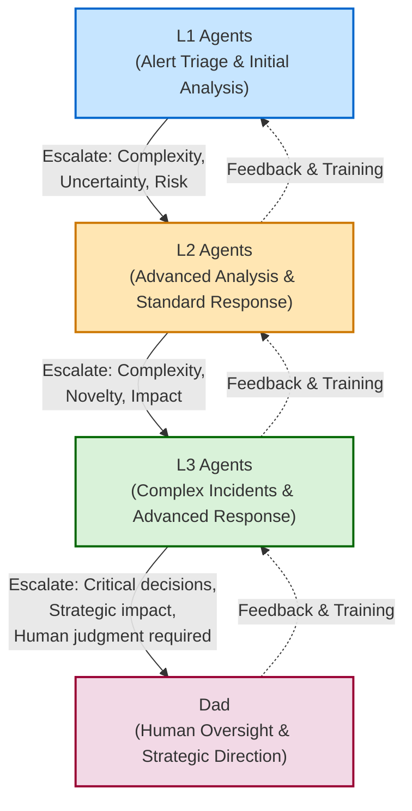
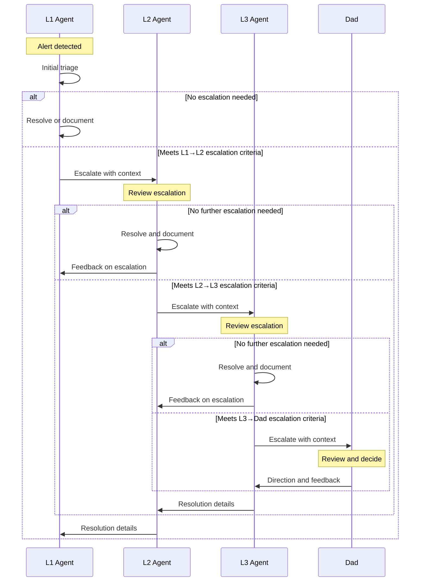
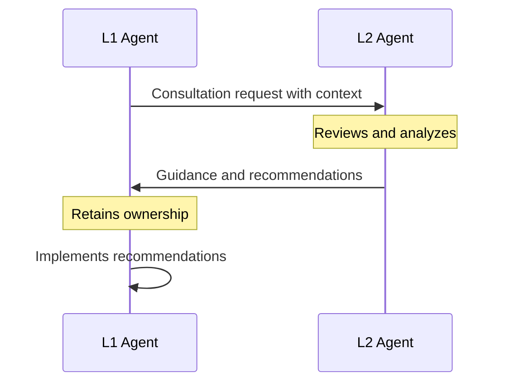
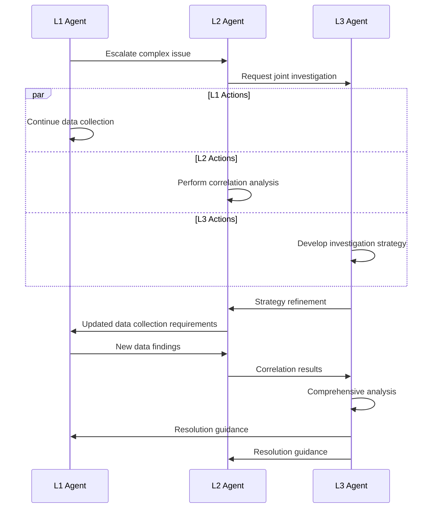
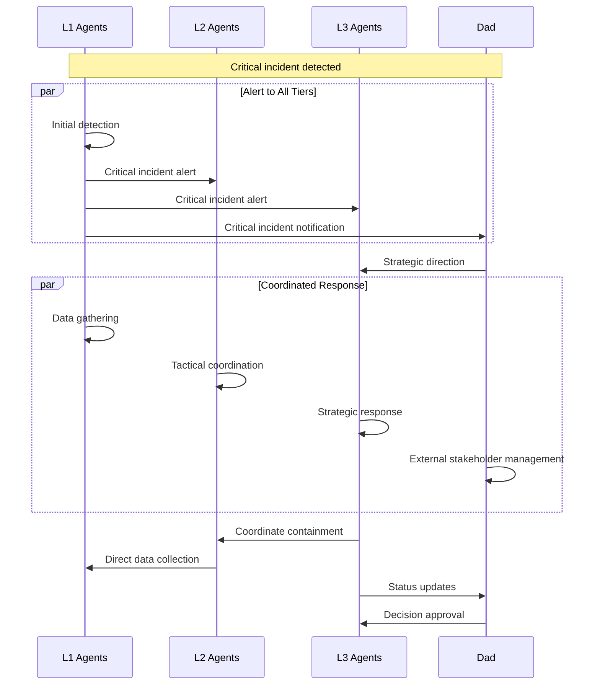
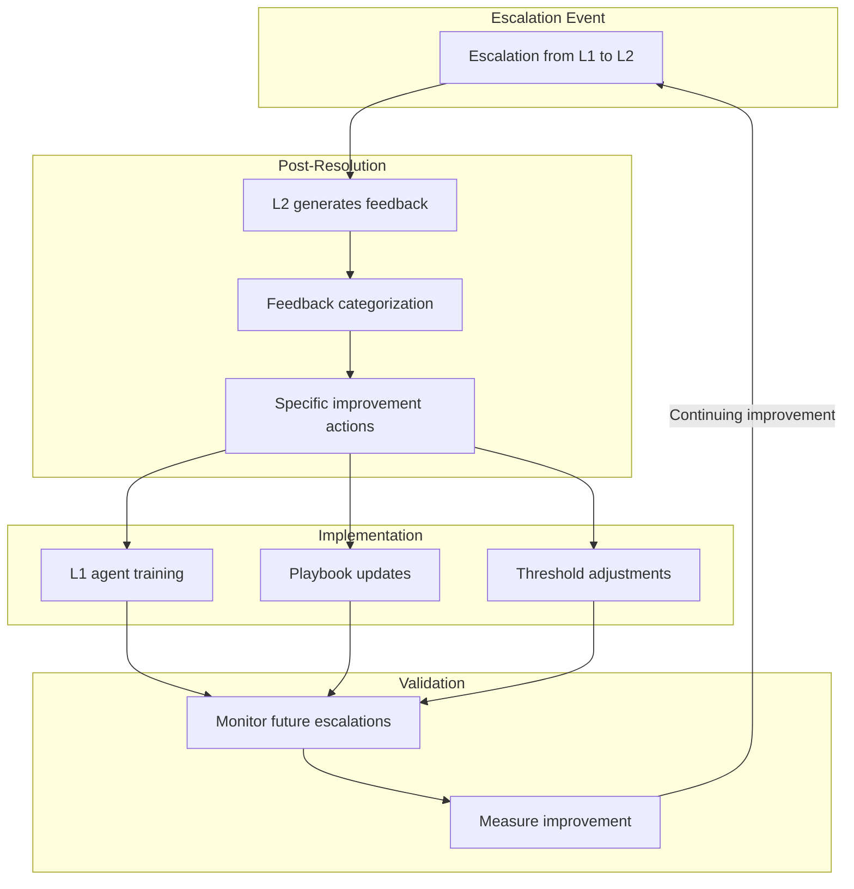
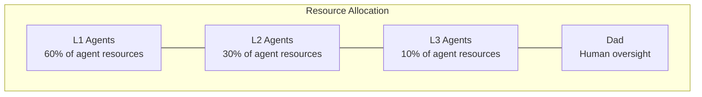

# Hierarchical Agent Structure: L1 → L2 → L3 → Dad Escalation

## 1. Overview

The Cipher Guard Agentic SOC implements a hierarchical, tier-based agent structure modeled after traditional SOC analyst levels. This structure provides a clear escalation path with increasing levels of authority, capability, and specialization while optimizing resource usage by handling routine tasks at lower tiers.

## 2. Tier Definitions and Responsibilities

### 2.1 L1 Agents (Alert Triage & Initial Analysis)

L1 agents form the frontline of the Agentic SOC, handling high-volume, routine security operations.

#### Responsibilities:

- **Alert Triage**: Initial assessment and categorization of security alerts
- **False Positive Filtering**: Identification and filtering of false positives
- **Basic Event Correlation**: Simple correlation of related security events
- **Initial Data Collection**: Gathering basic data about potential incidents
- **Standard Operating Procedure Execution**: Following predefined playbooks for common scenarios
- **Basic Security Monitoring**: Routine monitoring of security telemetry
- **Simple Threat Containment**: Implementation of basic containment measures for known threats
- **Routine Reporting**: Creation of standard security reports and metrics

#### Decision Authority:

- Authorized to close false positives
- Authorized to execute standard playbooks for common alerts
- Authorized to implement tier-1 containment actions (non-disruptive)
- Cannot modify security policies
- Cannot implement custom response actions
- Cannot make risk acceptance decisions

#### Escalation Criteria:

1. **Complexity**: Issues requiring complex analysis beyond standard procedures
2. **Uncertainty**: Situations where alert classification is ambiguous
3. **Novelty**: Previously unseen attack patterns or techniques
4. **Risk**: Potential for significant business impact
5. **Volume**: Alert correlation indicating a larger incident
6. **Policy**: Situations requiring actions outside L1 authority

### 2.2 L2 Agents (Advanced Analysis & Standard Response)

L2 agents handle more complex security events requiring deeper investigation and specialized knowledge.

#### Responsibilities:

- **Advanced Alert Analysis**: In-depth investigation of complex alerts
- **Incident Determination**: Establishing whether events constitute an incident
- **Cross-Data Correlation**: Correlation across multiple data sources
- **Detailed Investigation**: Thorough examination of security events
- **Vulnerability Assessment**: Evaluation of system vulnerabilities
- **Standard Incident Response**: Execution of incident response procedures
- **Threat Hunting**: Proactive search for threats using established methodologies
- **Detection Engineering**: Development and tuning of detection rules
- **Containment Actions**: Implementation of moderate containment measures

#### Decision Authority:

- Authorized to declare incidents
- Authorized to execute standard incident response playbooks
- Authorized to implement tier-2 containment actions (moderate business impact)
- Authorized to modify detection rules
- Cannot make significant architectural changes
- Cannot implement custom response strategies
- Cannot make risk acceptance decisions for high-impact scenarios

#### Escalation Criteria:

1. **Impact**: Incidents affecting critical business systems
2. **Sophistication**: Advanced persistent threats or sophisticated attacks
3. **Novel Techniques**: Previously unseen attack methodologies requiring adaptation
4. **Industry Impact**: Attacks potentially affecting the broader industry
5. **Coordination**: Incidents requiring cross-functional coordination
6. **Policy**: Situations requiring actions outside L2 authority

### 2.3 L3 Agents (Complex Incidents & Advanced Response)

L3 agents handle sophisticated threats, complex incidents, and develop advanced security strategies.

#### Responsibilities:

- **Complex Incident Management**: Handling sophisticated and high-impact security incidents
- **Advanced Threat Analysis**: Deep analysis of sophisticated threats
- **Custom Response Strategy**: Development of tailored response plans
- **Technical Leadership**: Providing guidance to L1 and L2 agents
- **Advanced Forensic Analysis**: Specialized forensic investigation
- **Threat Intelligence Integration**: Applying intel to security operations
- **Purple Team Operations**: Conducting offensive testing of defensive capabilities
- **Security Architecture Recommendations**: Suggesting security architecture improvements
- **Cross-Functional Coordination**: Working with non-security teams on incident response

#### Decision Authority:

- Authorized to manage complex incident response
- Authorized to implement tier-3 containment actions (significant business impact)
- Authorized to develop custom response strategies
- Authorized to recommend architectural changes
- Authorized to make risk acceptance decisions for medium-impact scenarios
- Cannot make critical business-impacting decisions
- Cannot authorize isolation of business-critical systems without approval
- Cannot make strategic security policy changes

#### Escalation Criteria:

1. **Business Criticality**: Incidents affecting business-critical functions
2. **Strategic Impact**: Issues requiring changes to security strategy
3. **Catastrophic Risk**: Potential for catastrophic business impact
4. **Human Judgment**: Situations requiring uniquely human ethical judgment
5. **External Communication**: Incidents requiring external reporting or disclosure
6. **Policy**: Situations requiring actions outside L3 authority

### 2.4 Dad (Human Oversight & Strategic Direction)

Dad represents the human oversight layer, handling critical decisions and providing strategic guidance.

#### Responsibilities:

- **Critical Decision Making**: Making decisions with significant business impact
- **Strategic Security Direction**: Setting security strategy and priorities
- **Crisis Management**: Leading response to critical security incidents
- **External Stakeholder Management**: Managing communication with executives and external parties
- **Risk Acceptance**: Making high-impact risk acceptance decisions
- **Agent Development Guidance**: Providing feedback to improve agent capabilities
- **Ethical Oversight**: Ensuring ethical considerations in security operations
- **Strategic Resource Allocation**: Allocating resources for major security initiatives

#### Decision Authority:

- Full authority over security operations
- Final approval for critical business-impacting actions
- Authority to override automated decisions
- Authority to set security policies and standards
- Authority to make strategic security investments
- Authority to communicate with external stakeholders about security matters

## 3. Escalation Pathways

### 3.1 Escalation Workflow

### 3.2 Escalation Data Package

When escalating between tiers, agents package relevant information to provide complete context:

1. **Incident Summary**: Brief description of the issue
2. **Escalation Reason**: Specific reason for escalation, mapped to criteria
3. **Alert/Event Details**: Raw and enriched data about the security events
4. **Actions Taken**: Steps already performed by the escalating agent
5. **Investigation Artifacts**: Evidence collected during investigation
6. **Risk Assessment**: Estimated impact and likelihood
7. **Suggested Actions**: Recommended next steps (non-binding)
8. **Related Incidents**: Links to similar past incidents
9. **Temporal Data**: Timelines, deadlines, and SLAs
10. **Business Context**: Affected business systems and processes

### 3.3 Quantitative Escalation Thresholds

To ensure consistent escalation decisions, the system implements quantitative thresholds:

| Metric | L1 → L2 Threshold | L2 → L3 Threshold | L3 → Dad Threshold |
|--------|-------------------|-------------------|---------------------|
| CVSS Score | ≥ 7.0 | ≥ 8.5 | ≥ 9.5 |
| Affected Systems | ≥ 5 | ≥ 20 | ≥ 50 or critical systems |
| Business Impact | Medium | High | Critical |
| Confidence Score | ≤ 70% | ≤ 60% | ≤ 50% |
| Novel Technique | Partial match to known TTPs | Limited precedent | No precedent |
| Response Time | > 15 minutes | > 30 minutes | > 60 minutes |
| Decision Impact | Departmental | Multiple departments | Organization-wide |

## 4. Decision Matrices

### 4.1 Containment Action Authority Matrix

| Containment Action | L1 Authority | L2 Authority | L3 Authority | Dad Authority |
|-------------------|--------------|--------------|--------------|--------------|
| Block IP/Domain | Yes | Yes | Yes | Yes |
| Isolate Endpoint (Non-Critical) | No | Yes | Yes | Yes |
| Isolate Endpoint (Critical) | No | No | Yes* | Yes |
| Disable User Account (Standard) | No | Yes | Yes | Yes |
| Disable User Account (Privileged) | No | No | Yes | Yes |
| Disable User Account (Executive) | No | No | No | Yes |
| Block Internet Access | No | Yes* | Yes | Yes |
| Shutdown Service (Non-Critical) | No | Yes | Yes | Yes |
| Shutdown Service (Critical) | No | No | No | Yes |
| Reset Credentials | No | Yes | Yes | Yes |
| Block Email Traffic | No | No | Yes* | Yes |
| Invoke DR Procedures | No | No | No | Yes |

*Requires additional verification or approval by multiple L3 agents

### 4.2 Incident Response Action Table

| Response Action | L1 Authority | L2 Authority | L3 Authority | Dad Authority |
|-------------------|--------------|--------------|--------------|--------------|
| Initial Alert Investigation | Yes | Yes | Yes | Yes |
| Malware Analysis (Standard) | No | Yes | Yes | Yes |
| Malware Analysis (Advanced) | No | No | Yes | Yes |
| Forensic Investigation | No | Yes* | Yes | Yes |
| Change Firewall Rules | No | Yes* | Yes | Yes |
| Invoke Incident Response Plan | No | Yes | Yes | Yes |
| Contact External Parties | No | No | Yes* | Yes |
| Disclosure Decisions | No | No | No | Yes |
| Engage Law Enforcement | No | No | No | Yes |
| Resource Allocation | No | No | Yes* | Yes |

*Requires documentation and post-action review

## 5. Cross-Tier Collaboration Models

### 5.1 Consultation Model

Agents can request consultation from higher tiers without formal escalation:

### 5.2 Joint Investigation Model

Complex investigations may involve multiple tiers working simultaneously:

### 5.3 Swarming Model

For critical incidents requiring rapid response, multiple tiers "swarm" the incident:

## 6. Learning and Improvement Mechanisms

### 6.1 Feedback Loops

Each tier provides structured feedback to optimize escalation quality:

### 6.2 Knowledge Transfer

Systematic processes ensure knowledge flows between tiers:

1. **Case Studies**: L3 agents create educational case studies from complex incidents
2. **Pattern Recognition**: Higher tiers identify patterns to improve lower tier detection
3. **Playbook Evolution**: Successful L3/Dad interventions become L2/L1 playbooks over time
4. **Detection Refinement**: L3 insights translate to refined detection rules for L1 
5. **Automated Learning**: ML systems analyze escalation patterns to optimize thresholds
6. **Simulation Training**: Higher tiers create training scenarios for lower tiers

### 6.3 Tier Transition

As the system matures, capabilities can shift between tiers:

1. **Capability Elevation**: As L1 agents improve, they inherit capabilities from L2
2. **Threshold Adjustment**: Escalation thresholds adapt based on performance data
3. **Automation Expansion**: Manual L2/L3 processes become automated over time
4. **Specialization Evolution**: Agent specializations adapt to emerging threat landscape
5. **Authority Delegation**: Decision authority may shift downward as agents prove reliability

## 7. Performance Metrics and Quality Control

### 7.1 Tier-Specific KPIs

Each tier's performance is measured by specific key performance indicators:

| Tier | Key Performance Indicators |
|------|----------------------------|
| L1 | - False positive rate - Mean time to triage (MTTT) - Correct escalation rate - First-touch resolution rate - Alert backlog size |
| L2 | - Mean time to investigate (MTTI) - Incident determination accuracy - L1-to-L2 rejection rate - Correct L2-to-L3 escalation rate - Detection rule quality |
| L3 | - Mean time to resolve (MTTR) - Complex incident resolution rate - Knowledge artifact creation rate - Custom response effectiveness - L2-to-L3 rejection rate |
| Dad | - Strategic initiative effectiveness - Critical decision timeliness - Agent capability improvement rate - Crisis containment effectiveness - External stakeholder satisfaction |

### 7.2 Escalation Quality Metrics

The quality of escalations between tiers is measured by:

1. **Appropriateness**: Was the escalation justified according to criteria?
2. **Completeness**: Was all relevant information included?
3. **Timeliness**: Was the escalation performed at the right time?
4. **Context Quality**: Was sufficient context provided for the receiving tier?
5. **Preliminary Action Quality**: Were appropriate actions taken before escalation?
6. **Recommendation Quality**: How useful were the suggested next actions?

### 7.3 Quality Control Mechanisms

To ensure consistent quality across the hierarchy:

1. **Escalation Reviews**: Regular reviews of escalation decisions
2. **Random Case Audits**: Random sampling of resolved cases for quality
3. **Simulation Testing**: Regular scenario-based testing of tiers
4. **Peer Review**: Agent peer review of tier-specific actions
5. **Calibration Exercises**: Cross-tier calibration to ensure consistent decision-making
6. **Metrics-Driven Adjustments**: Continuous refinement based on performance data

## 8. Implementation Considerations

### 8.1 Tier Sizing and Resource Allocation

The hierarchy is designed with a pyramid structure:

### 8.2 Technical Implementation

1. **Agent Classification**: Each agent is classified into a specific tier
2. **Decision Authority**: Authority limits enforced by the orchestration engine
3. **Dynamic Allocation**: Agents can be reallocated between tiers based on load
4. **Tier State Management**: Each tier maintains operational state
5. **Cross-Tier Communications**: Standardized APIs for inter-tier communication
6. **Escalation Workflow**: Defined workflow implementation for escalation paths
7. **Measurement & Monitoring**: Continuous monitoring of tier performance

### 8.3 Resiliency Considerations

1. **Tier Redundancy**: Multiple agents capable of fulfilling each tier role
2. **Failover Mechanisms**: Automated failover if tier capacity is exceeded
3. **Queue Management**: Prioritized queuing for escalations
4. **Backpressure Handling**: Mechanisms to handle excessive escalation volume
5. **Circuit Breakers**: Protection against escalation storms
6. **Graceful Degradation**: Maintain essential functions under extreme load

## 9. Continuous Evolution

The hierarchical structure will evolve over time based on:

1. **Performance Data**: Metrics-driven adaptation of the hierarchy
2. **Threat Landscape**: Evolution based on changing threat landscape
3. **Technology Advances**: Integration of new AI capabilities
4. **Automation Maturity**: Increased automation reducing human dependencies
5. **Organizational Learning**: Adaptation based on institutional knowledge
6. **Industry Standards**: Alignment with evolving industry best practices