# Natural Language Interface for Agent Command and Control

## 1. Overview

The Natural Language Interface (NLI) provides an intuitive command and control interface for the Agentic SOC, allowing human operators to interact with the system using natural language. This interface serves as the primary communication channel between human users (especially Dad) and the agent hierarchy, enabling seamless queries, commands, and conversations about security operations.

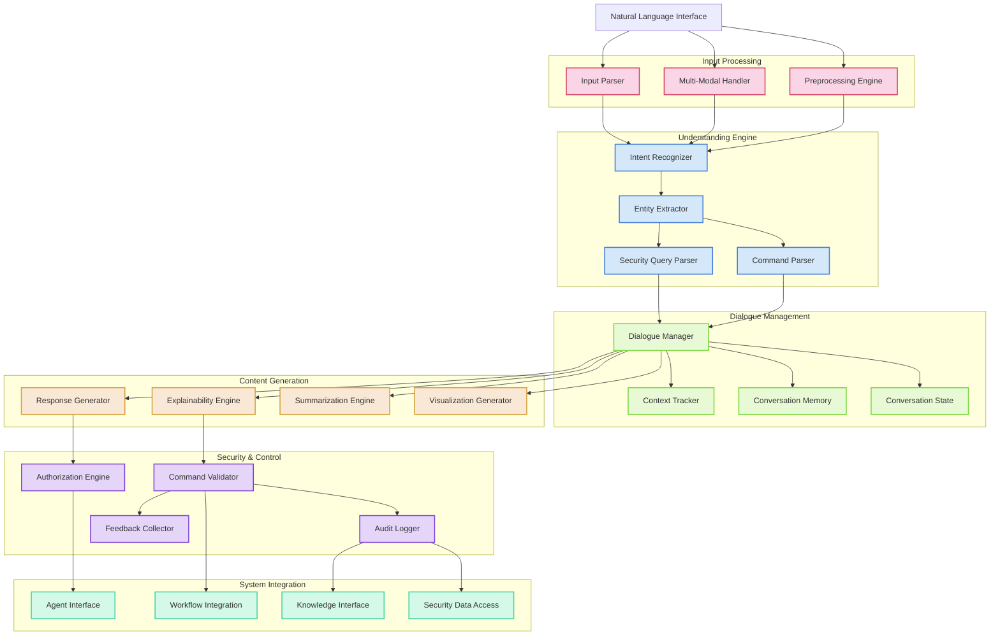

## 2. Core Components

### 2.1 Input Processing

The Input Processing subsystem handles incoming natural language inputs from various sources and prepares them for understanding.

#### 2.1.1 Input Parser

**Responsibilities**:
- Parse raw text and voice inputs
- Handle special command formats and syntax
- Normalize input format for processing
- Detect language and input characteristics
- Perform initial input validation

**Key Features**:
- **Multi-language support**: Handles inputs in multiple languages
- **Shorthand recognition**: Understands security-specific shorthand
- **Voice-to-text processing**: Converts voice commands to text
- **Command prefix detection**: Identifies explicit command indicators
- **Input normalization**: Standardizes formats for consistency

#### 2.1.2 Multi-Modal Handler

**Responsibilities**:
- Process inputs from various modalities (text, voice, GUI)
- Extract relevant context from each modality
- Align multi-modal inputs into unified representations
- Manage modality-specific processing requirements
- Support seamless switching between modalities

**Key Features**:
- **Text input processing**: Handles typed commands and queries
- **Voice command recognition**: Processes spoken instructions
- **GUI context integration**: Incorporates interface context
- **Cross-modal alignment**: Combines inputs from multiple sources
- **Modality preference management**: Adapts to user preferences

#### 2.1.3 Preprocessing Engine

**Responsibilities**:
- Clean and normalize input text
- Perform security-specific term standardization
- Expand abbreviations and acronyms
- Apply filtering for noise reduction
- Handle special character and formatting

**Key Features**:
- **Security terminology normalization**: Standardizes security terms
- **Acronym expansion**: Expands security-specific acronyms
- **Noise filtering**: Removes irrelevant content
- **Character normalization**: Handles special characters
- **Format standardization**: Creates consistent input format

### 2.2 Understanding Engine

The Understanding Engine interprets the meaning and intent behind natural language inputs.

#### 2.2.1 Intent Recognizer

**Responsibilities**:
- Identify primary user intent
- Classify inputs into intent categories
- Detect multi-intent queries
- Determine confidence scores for intents
- Handle ambiguous intent resolution

**Intent Categories**:

| Category | Description | Examples |
|----------|-------------|----------|
| Query | Information retrieval | "Show active incidents", "What's our current security posture?" |
| Command | Request for action | "Isolate endpoint ABC-123", "Block IP 203.0.113.42" |
| Analysis | Request for analysis | "Analyze this phishing email", "Assess the risk of this vulnerability" |
| Configuration | System configuration | "Adjust detection sensitivity", "Update alert thresholds" |
| Status | Status update request | "Give me a status update on incident #4291" |
| Explanation | Request for explanation | "Why was this alert triggered?", "Explain this detection rule" |
| Workflow | Workflow management | "Start the phishing response playbook", "Update incident #4291 status" |
| Reporting | Report generation | "Generate a security posture report", "Create an executive summary" |
| Help | Assistance request | "Help me analyze this alert", "How do I respond to this incident?" |

**Key Features**:
- **Security-domain fine-tuning**: Specialized for security terminology
- **Multi-intent detection**: Identifies multiple intents in single query
- **Intent disambiguation**: Resolves unclear intents through context
- **Confidence scoring**: Provides certainty levels for intent classification
- **Intent hierarchy**: Understands relationships between intents

#### 2.2.2 Entity Extractor

**Responsibilities**:
- Identify relevant entities in user input
- Extract entity properties and relationships
- Normalize extracted entities to canonical forms
- Enrich entities with contextual information
- Link entities to security knowledge base

**Security-specific Entity Types**:

| Entity Type | Examples |
|-------------|----------|
| Asset | Endpoints, servers, networks, applications |
| Indicator | IP addresses, domains, files, hashes, URLs |
| Threat | Malware, attack campaigns, threat actors |
| Vulnerability | CVE IDs, weakness descriptions |
| Time Period | Timeframes, dates, durations |
| Alert | Alert IDs, alert types |
| Incident | Incident IDs, incident types |
| User | Usernames, role references |
| Action | Security actions (block, isolate, scan) |
| Status | Incident/alert statuses |
| Severity | Risk/impact levels |

**Key Features**:
- **Domain-specific extraction**: Optimized for security entities
- **Entity normalization**: Standardizes variant forms
- **Entity resolution**: Links mentions to known entities
- **Relationship extraction**: Identifies entity relationships
- **Contextual enrichment**: Adds relevant context to entities

#### 2.2.3 Security Query Parser

**Responsibilities**:
- Parse security-specific queries
- Translate natural language questions to structured queries
- Identify query parameters and constraints
- Determine required data sources for queries
- Handle complex query decomposition

**Query Parsing Process**:

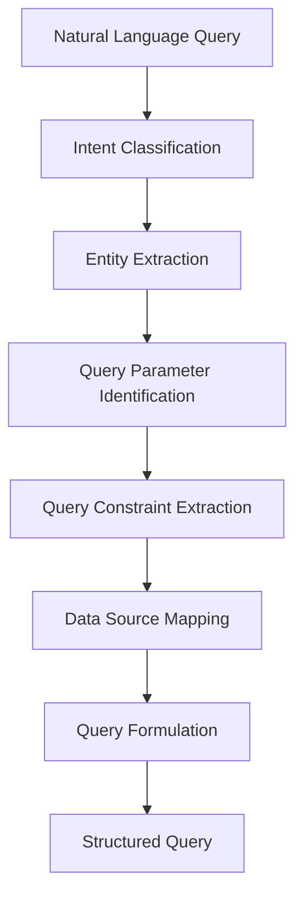

**Key Features**:
- **Security query patterns**: Recognizes common security query patterns
- **Parameter identification**: Extracts query parameters accurately
- **Temporal reasoning**: Understands time-based query aspects
- **Comparative queries**: Handles comparison-based questions
- **Complex query decomposition**: Breaks down complex queries

#### 2.2.4 Command Parser

**Responsibilities**:
- Parse action-oriented instructions
- Translate commands to executable actions
- Extract command parameters and options
- Validate command completeness
- Handle command chains and sequences

**Command Structure Analysis**:

```
Command: "Isolate endpoint WKST-123 for 4 hours due to suspicious behavior"

Parsed Structure:
{
  "action": "isolate",
  "target_type": "endpoint",
  "target_id": "WKST-123",
  "parameters": {
    "duration": "4 hours"
  },
  "justification": "suspicious behavior",
  "implicit_parameters": {
    "reachability": "management_only",
    "policy": "standard_isolation"
  }
}
```

**Key Features**:
- **Command mapping**: Maps natural language to system commands
- **Parameter extraction**: Identifies required and optional parameters
- **Default handling**: Applies appropriate defaults for omitted parameters
- **Command validation**: Checks for required parameters
- **Command expansion**: Expands abbreviated commands

### 2.3 Dialogue Management

The Dialogue Management system maintains conversational context and manages multi-turn interactions.

#### 2.3.1 Dialogue Manager

**Responsibilities**:
- Coordinate overall conversation flow
- Manage turn-taking in dialogues
- Handle follow-up questions and responses
- Implement dialogue policies
- Manage conversation transitions

**Dialogue Flow Management**:

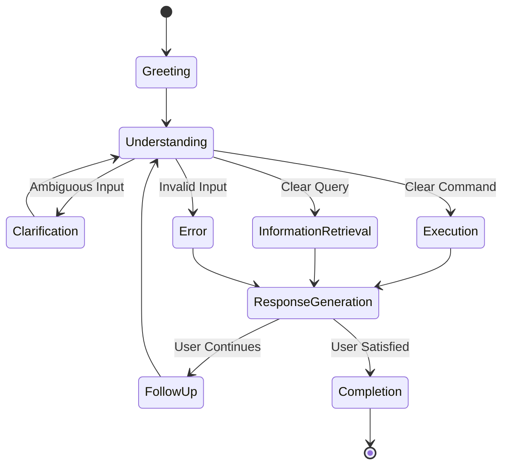

**Key Features**:
- **Dialogue policy implementation**: Enforces conversation protocols
- **Context-aware flow management**: Adapts flow based on context
- **Multi-turn conversation handling**: Manages extended interactions
- **Interruption handling**: Manages conversation interruptions
- **Topic switching**: Handles changes in conversation focus

#### 2.3.2 Context Tracker

**Responsibilities**:
- Maintain active conversation context
- Track entities mentioned in conversation
- Manage reference resolution
- Update context based on new information
- Prune expired or irrelevant context

**Context Management**:

```
// Example context tracking for pronoun resolution
User: "Show me all alerts from endpoint WKST-123"
[Context updated: {focus_object: "endpoint WKST-123", focus_type: "endpoint", focus_collection: "alerts"}]

User: "Isolate it"
[Reference resolution: "it" -> "endpoint WKST-123"]
[Command interpreted: isolate(endpoint="WKST-123")]
```

**Key Features**:
- **Reference resolution**: Resolves pronouns and references
- **Topic tracking**: Maintains current conversation topics
- **Context prioritization**: Weighs recency and relevance
- **Context enrichment**: Adds implicit information
- **Hierarchical context**: Manages multiple context levels

#### 2.3.3 Conversation Memory

**Responsibilities**:
- Store conversation history
- Provide access to previous interactions
- Manage memory retrieval and relevance
- Support long-term conversation continuity
- Implement forgetting mechanisms for irrelevant information

**Memory Management**:

| Memory Type | Scope | Retention | Purpose |
|-------------|-------|-----------|---------|
| Short-term | Current session | Duration of session | Immediate context |
| Medium-term | Recent conversations | Days to weeks | Session continuity |
| Long-term | Significant interactions | Months to permanent | Learning and patterns |

**Key Features**:
- **Progressive summarization**: Compresses older conversations
- **Memory retrieval**: Accesses relevant past interactions
- **Importance tagging**: Identifies critical information
- **Session continuity**: Maintains context across sessions
- **Semantic linking**: Connects related conversations

#### 2.3.4 Conversation State

**Responsibilities**:
- Track the current state of conversation
- Manage conversation parameters
- Handle state transitions
- Store temporary conversation variables
- Manage environmental awareness

**State Tracking Example**:

```
{
  "conversation_id": "CONV-20251202-7291",
  "start_time": "2025-12-02T14:23:17Z",
  "current_turn": 7,
  "active_intent": "incident_management",
  "active_entities": {
    "incident": "INC-4291",
    "endpoints": ["WKST-123", "WKST-456"],
    "users": ["johndoe"]
  },
  "pending_actions": [
    {"type": "confirmation", "action": "isolate", "target": "WKST-123"}
  ],
  "environmental_context": {
    "user_role": "admin",
    "security_posture": "elevated",
    "active_interfaces": ["dashboard"]
  },
  "dialog_state": "awaiting_confirmation"
}
```

**Key Features**:
- **State persistence**: Maintains consistent conversation state
- **Parameter tracking**: Manages conversation parameters
- **State transitions**: Handles changes in conversation state
- **Environmental awareness**: Incorporates operational context
- **Temporal context**: Maintains time-sensitive information

### 2.4 Content Generation

The Content Generation system creates natural language responses and visual outputs.

#### 2.4.1 Response Generator

**Responsibilities**:
- Generate natural language responses
- Adapt response style to user preferences
- Apply appropriate formatting
- Implement response templates
- Balance detail and conciseness

**Response Generation Process**:

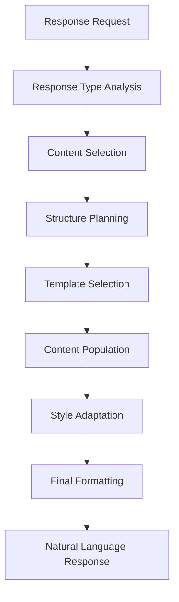

**Key Features**:
- **Template-based generation**: Uses templates for consistency
- **Dynamic content selection**: Chooses appropriate content
- **Adaptive detail level**: Adjusts detail based on context
- **Security terminology precision**: Uses correct security terms
- **Style personalization**: Adapts to user preferences

#### 2.4.2 Explainability Engine

**Responsibilities**:
- Generate explanations for system actions
- Provide reasoning for security decisions
- Explain alert and detection logic
- Create educational content
- Translate technical concepts for different audiences

**Explanation Levels**:

| Level | Audience | Characteristics | Example |
|-------|----------|-----------------|---------|
| Executive | Leadership | High-level, business impact focus | "This alert indicates a potential data exfiltration attempt that could compromise customer data" |
| Technical | Security staff | Detailed, technical reasoning | "The alert triggered because Process X was observed connecting to IP Y using an uncommon port Z, matching IOCs for APT group ABC" |
| Educational | Training | Instructional, contextual | "This is a command-and-control alert, which means a compromised system is attempting to communicate with an attacker's server" |
| Justification | Verification | Evidence-based | "The action was taken based on three correlation rules (Rule-1, Rule-2, Rule-3) with a combined confidence of 92%" |

**Key Features**:
- **Decision explanation**: Clarifies reasoning behind decisions
- **Evidence linking**: Connects conclusions to evidence
- **Concept simplification**: Makes complex concepts accessible
- **Contextual adjustment**: Tailors explanations to context
- **Multi-level detail**: Provides appropriate detail levels

#### 2.4.3 Summarization Engine

**Responsibilities**:
- Create concise summaries of complex security information
- Generate executive summaries
- Provide graduated levels of detail
- Highlight key information
- Produce multi-modal summaries

**Summary Types**:

| Summary Type | Purpose | Length | Focus |
|--------------|---------|--------|-------|
| Flash | Immediate awareness | 1-2 sentences | Critical information only |
| Executive | Decision support | Paragraph | Business impact and recommendations |
| Tactical | Operational guidance | Multiple paragraphs | Key technical details and next steps |
| Comprehensive | Complete understanding | Full document | All relevant details and context |

**Key Features**:
- **Progressive summarization**: Provides varying detail levels
- **Key point extraction**: Identifies critical information
- **Content prioritization**: Emphasizes important elements
- **Context preservation**: Maintains critical context
- **Adaptable format**: Adjusts to delivery requirements

#### 2.4.4 Visualization Generator

**Responsibilities**:
- Generate data visualizations from conversational context
- Recommend appropriate visualization types
- Create textual descriptions of visual data
- Manage visualization complexity
- Ensure visualization accessibility

**Visualization Selection Logic**:

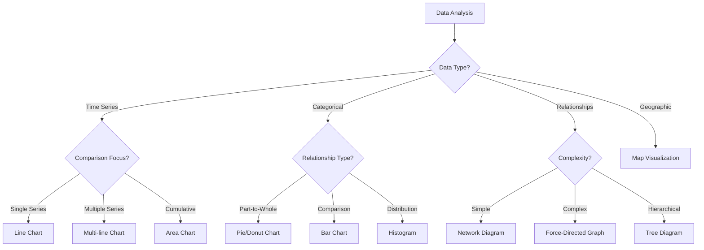

**Key Features**:
- **Data-driven visualization**: Creates visualizations from data
- **Context-aware selection**: Chooses appropriate visualization types
- **Interactive description**: Generates explanations for visuals
- **Accessibility design**: Ensures information is accessible
- **Complementary formatting**: Combines visuals with text explanations

### 2.5 Security & Control

The Security & Control system ensures secure operation of the natural language interface.

#### 2.5.1 Authorization Engine

**Responsibilities**:
- Validate user authority for commands
- Implement role-based access controls
- Enforce security policies
- Manage explicit approval requirements
- Monitor command risk levels

**Authorization Process**:

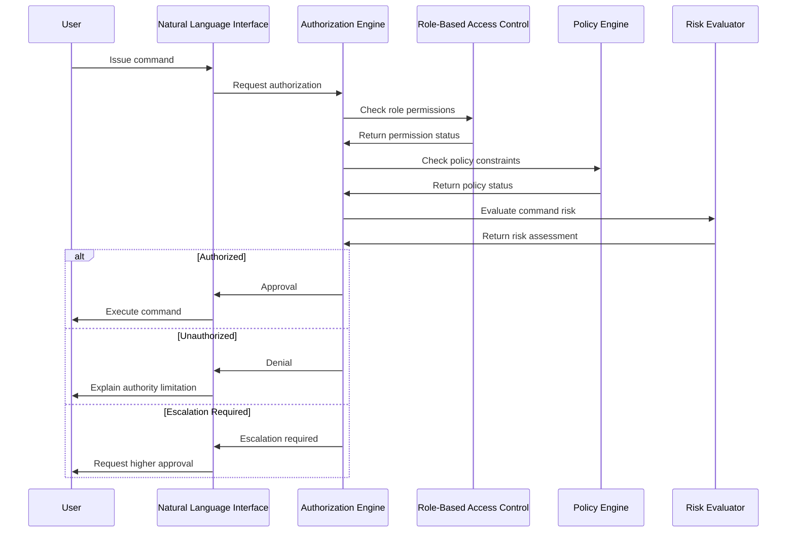

**Key Features**:
- **Role-based permissions**: Enforces role-appropriate access
- **Command risk assessment**: Evaluates command risk levels
- **Policy enforcement**: Applies security policies
- **Approval workflow**: Manages approval requirements
- **Authority verification**: Validates command authority

#### 2.5.2 Command Validator

**Responsibilities**:
- Validate command safety and correctness
- Check parameter validity
- Simulate command outcomes
- Enforce command guardrails
- Prevent harmful commands

**Command Validation Checks**:

| Check Type | Purpose | Example |
|------------|---------|---------|
| Syntax | Ensure command formatting | Validate parameter types and formats |
| Semantic | Verify command logic | Ensure logical parameter combinations |
| Safety | Prevent harmful actions | Block dangerous system modifications |
| Impact | Assess operational effect | Evaluate service disruption potential |
| Timing | Check execution timing | Verify appropriate maintenance windows |

**Key Features**:
- **Parameter validation**: Checks parameter correctness
- **Impact prediction**: Assesses potential command impacts
- **Constraint enforcement**: Applies command limitations
- **Safety verification**: Prevents harmful actions
- **Simulation testing**: Tests commands before execution

#### 2.5.3 Audit Logger

**Responsibilities**:
- Log all interface interactions
- Record command authorizations and executions
- Create non-repudiable audit trail
- Support compliance requirements
- Facilitate activity review

**Audit Record Structure**:

```json
{
  "interaction_id": "NLI-20251202-142317-7291",
  "timestamp": "2025-12-02T14:23:17Z",
  "user": {
    "id": "johndoe",
    "role": "security_analyst",
    "authentication_level": "mfa_verified"
  },
  "input": {
    "raw_text": "Isolate endpoint WKST-123",
    "channel": "chat",
    "interface_context": "incident_management"
  },
  "processing": {
    "parsed_intent": "command.endpoint.isolate",
    "entities": [
      {"type": "endpoint", "value": "WKST-123", "confidence": 0.98}
    ],
    "confidence_score": 0.97
  },
  "authorization": {
    "decision": "approved",
    "authority_level": "tier2",
    "policy_references": ["EP-ISO-001", "SEC-RESP-004"],
    "risk_score": 0.4
  },
  "execution": {
    "command_executed": "endpoint.isolate(id='WKST-123', duration='indefinite')",
    "status": "success",
    "result_summary": "Endpoint WKST-123 successfully isolated",
    "execution_time": 1.2
  }
}
```

**Key Features**:
- **Comprehensive logging**: Records all interactions
- **Non-repudiation**: Creates verifiable audit trail
- **Immutable records**: Prevents log tampering
- **Context preservation**: Maintains interaction context
- **Privacy controls**: Implements appropriate privacy measures

#### 2.5.4 Feedback Collector

**Responsibilities**:
- Collect user feedback on interactions
- Measure user satisfaction
- Identify improvement opportunities
- Handle correction inputs
- Support continuous learning

**Feedback Mechanisms**:

| Mechanism | Type | Purpose | Implementation |
|-----------|------|---------|----------------|
| Explicit | Rating | Quantitative satisfaction | Star/numerical rating |
| Explicit | Comment | Qualitative feedback | Free-text comments |
| Implicit | Correction | Identify misinterpretations | User corrections |
| Implicit | Repetition | Detect failed interactions | Repeated attempts |
| Implicit | Abandonment | Identify frustration points | Abandoned interactions |

**Key Features**:
- **Multi-channel feedback**: Collects feedback through various means
- **Satisfaction metrics**: Measures user satisfaction
- **Improvement identification**: Highlights enhancement opportunities
- **Learning integration**: Feeds back into system improvement
- **Correction handling**: Processes correction inputs

### 2.6 System Integration

The System Integration layer connects the Natural Language Interface to the broader Agentic SOC ecosystem.

#### 2.6.1 Agent Interface

**Responsibilities**:
- Connect NLI with the agent hierarchy
- Route requests to appropriate agents
- Handle agent responses
- Manage agent coordination for NLI tasks
- Translate between NLI and agent protocols

**Agent Routing Logic**:

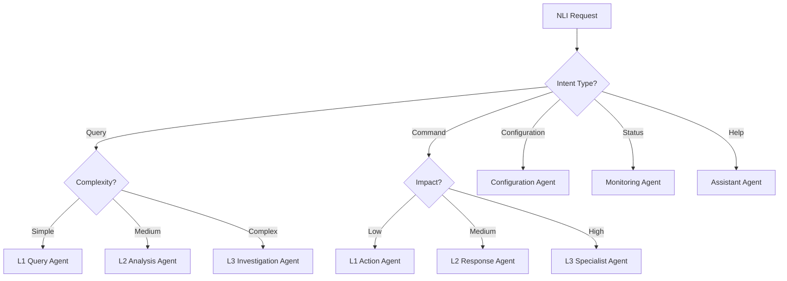

**Key Features**:
- **Intelligent routing**: Directs requests to appropriate agents
- **Protocol translation**: Converts between interface formats
- **Agent team coordination**: Manages multi-agent responses
- **Response processing**: Handles agent response integration
- **Status tracking**: Monitors agent request status

#### 2.6.2 Workflow Integration

**Responsibilities**:
- Integrate NLI with workflow engine
- Translate NL requests to workflow operations
- Support workflow status queries
- Enable workflow control via NL commands
- Provide workflow visibility through NLI

**Workflow Command Mapping**:

| Natural Language Command | Workflow Operation |
|--------------------------|---------------------|
| "Start phishing response for email X" | workflow.instantiate(template="phishing_response", params={email_id: "X"}) |
| "What's the status of incident #1234?" | workflow.getStatus(id="INC-1234") |
| "Move incident #1234 to containment phase" | workflow.updateState(id="INC-1234", state="containment") |
| "Assign alert #5678 to John" | workflow.assignTask(id="ALRT-5678", assignee="john") |
| "Show me all active workflows" | workflow.list(status="active") |

**Key Features**:
- **NL-to-workflow mapping**: Translates commands to workflow operations
- **Workflow visibility**: Enables workflow status visibility
- **Command translation**: Converts NL to workflow commands
- **Status reporting**: Provides workflow status through NL
- **Context-sensitive operation**: Adapts to workflow context

#### 2.6.3 Knowledge Interface

**Responsibilities**:
- Connect NLI to security knowledge bases
- Retrieve information for NL queries
- Support knowledge-based reasoning
- Provide context for NLI operations
- Enable knowledge updates through NLI

**Knowledge Sources Integration**:

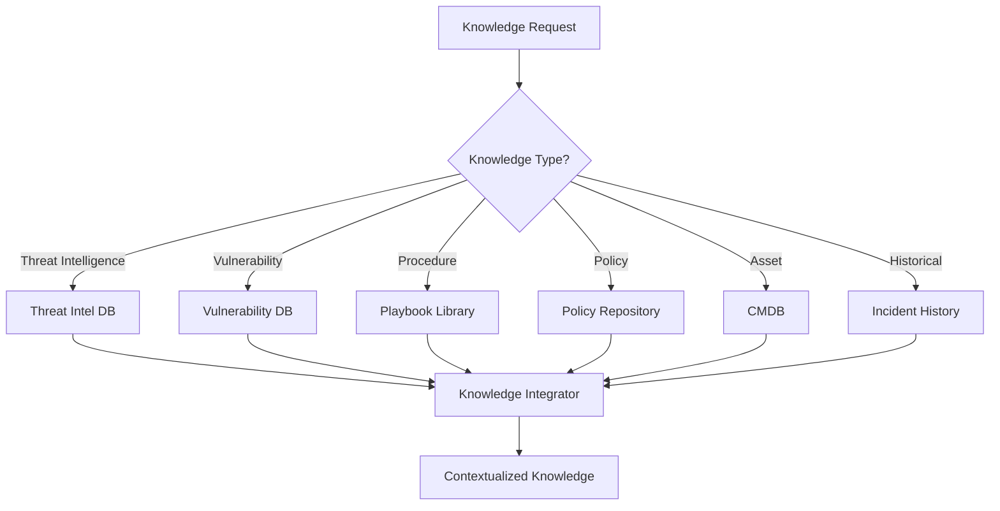

**Key Features**:
- **Knowledge retrieval**: Accesses relevant knowledge
- **Context-sensitive search**: Finds contextually appropriate information
- **Multi-source integration**: Combines knowledge from multiple sources
- **Knowledge ranking**: Prioritizes relevance and reliability
- **Update interface**: Enables knowledge base updates

#### 2.6.4 Security Data Access

**Responsibilities**:
- Provide access to security operational data
- Implement data access controls
- Support complex security queries
- Enable data visualization requests
- Maintain data privacy and security

**Data Access Layers**:

| Layer | Data Type | Examples | Access Pattern |
|-------|-----------|----------|----------------|
| Real-time | Current state | Active alerts, System status | Push/Subscribe |
| Recent | Operational data | Recent incidents, Daily metrics | Cached Query |
| Historical | Archive data | Past incidents, Trend data | Data warehouse |
| Reference | Lookup data | Asset inventory, User directory | Indexed lookup |

**Key Features**:
- **Structured query translation**: Converts NL to data queries
- **Access control enforcement**: Applies data access policies
- **Multi-format support**: Handles various data formats
- **Performance optimization**: Optimizes query performance
- **Result formatting**: Presents data in appropriate formats

## 3. Query Understanding and Processing

The Query Understanding and Processing system translates natural language questions into structured queries and provides informative responses.

### 3.1 Query Classification Framework

Security-specific query classification enables precise understanding of information needs.

**Primary Query Categories**:

| Category | Description | Examples | Typical Routing |
|----------|-------------|----------|----------------|
| Status | Current state information | "What's our security posture?", "Show active incidents" | L1 Monitoring Agent |
| Investigative | Information for analysis | "What activity has user X performed?", "Show login failures for system Y" | L2 Analysis Agent |
| Historical | Past data retrieval | "Show incidents from last month", "When was this IP last seen?" | L2/L3 Agent |
| Analytical | Pattern and trend analysis | "Are we seeing more phishing attempts?", "What's our vulnerability remediation trend?" | L3 Analysis Agent |
| Reference | Knowledge base queries | "What's the recommended response for ransomware?", "Explain CVE-2025-1234" | Knowledge Agent |
| Metrics | Performance and measurement | "What's our mean time to detect?", "Show alert volumes by severity" | Metrics Agent |
| Explanatory | Understanding "why" | "Why was this alert triggered?", "Explain the reason for this isolation" | Explainability Agent |

### 3.2 Query Processing Pipeline

The step-by-step process for handling security queries:

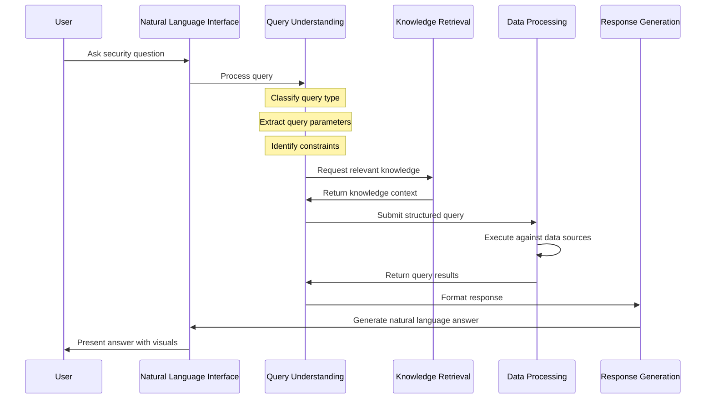

### 3.3 Complex Query Handling

Strategies for managing complex security queries:

1. **Query Decomposition**: Breaking complex queries into manageable sub-queries
2. **Iterative Refinement**: Progressively refining query understanding
3. **Multi-source Integration**: Combining data from multiple sources
4. **Contextual Enrichment**: Adding context from knowledge base
5. **Confidence-based Processing**: Handling parts with different confidence levels

### 3.4 Query Response Enhancement

Techniques to improve the quality of query responses:

1. **Evidence Linking**: Connecting answers to supporting evidence
2. **Confidence Indication**: Expressing certainty levels in responses
3. **Related Information**: Suggesting relevant additional information
4. **Alternative Perspectives**: Providing different analytical viewpoints
5. **Visualization Enhancement**: Adding visual elements to clarify data
6. **Follow-up Suggestions**: Recommending logical next questions

## 4. Command Interface

The Command Interface enables control over security operations through natural language instructions.

### 4.1 Command Framework

The Command Framework categorizes and processes action-oriented instructions.

**Primary Command Categories**:

| Category | Description | Examples | Authorization Level |
|----------|-------------|----------|---------------------|
| Investigation | Initiate security investigation | "Investigate alert #1234", "Analyze this phishing email" | L1/L2 |
| Containment | Contain security threats | "Isolate endpoint WKST-123", "Block IP 203.0.113.42" | L2/L3 |
| Remediation | Fix security issues | "Remove malware from endpoint X", "Reset credentials for user Y" | L2/L3 |
| Configuration | Change security settings | "Update detection rule X", "Adjust alert threshold for Z" | L2/L3 |
| Workflow | Manage security workflows | "Start incident response for alert #1234", "Create new investigation" | L1/L2 |
| Notification | Manage communications | "Alert the security team", "Send update to management" | L1/L2/L3 |
| Automation | Control automated systems | "Enable automated response", "Pause scanning on subnet X" | L2/L3 |
| Authorization | Change access controls | "Grant John access to incident #1234", "Revoke API key X" | L3/Dad |

### 4.2 Command Processing Pipeline

The step-by-step process for handling security commands:

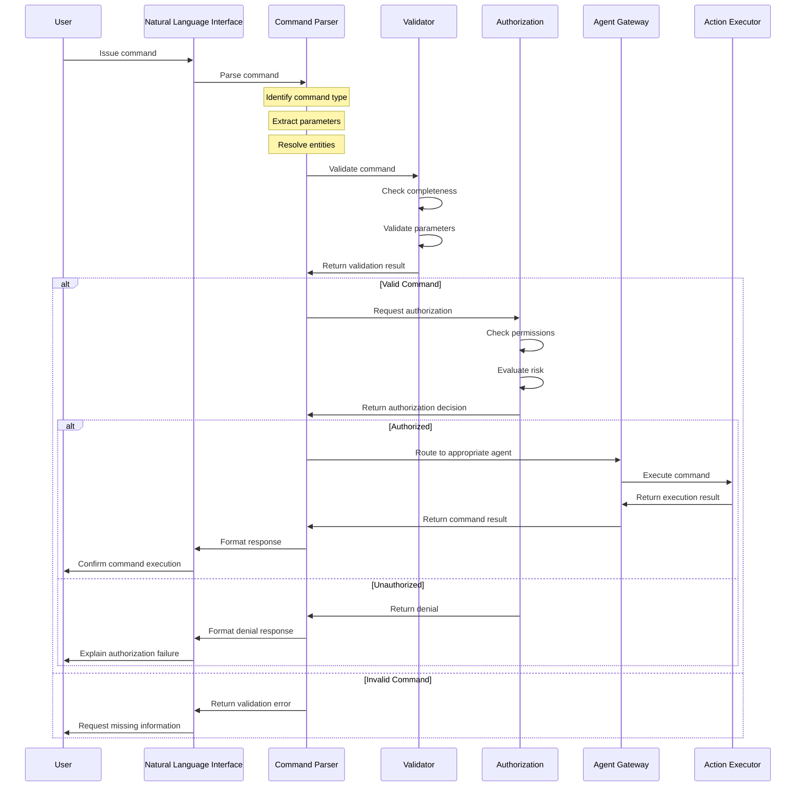

### 4.3 Command Parameter Handling

Strategies for managing command parameters:

1. **Required vs. Optional**: Distinguishing between necessary and optional parameters
2. **Default Values**: Applying appropriate defaults for omitted parameters
3. **Parameter Validation**: Ensuring parameter values meet requirements
4. **Contextual Inference**: Deriving parameters from context when not explicitly stated
5. **Progressive Refinement**: Iteratively collecting missing parameters
6. **Entity Resolution**: Resolving entity references to specific identifiers

### 4.4 Confirmations and Safeguards

Mechanisms to ensure safe command execution:

1. **Risk-based Confirmation**: Requiring confirmation based on action risk level
2. **Impact Preview**: Showing potential impacts before execution
3. **Explicit Approval**: Requiring explicit approval for high-risk actions
4. **Authority Escalation**: Escalating to higher authority for critical actions
5. **Execution Visibility**: Providing visibility into command execution
6. **Rollback Planning**: Preparing rollback options for reversible actions

## 5. Conversation Management

The Conversation Management system handles the flow and context of multi-turn interactions.

### 5.1 Conversation Flow Patterns

Common security conversation patterns and their handling:

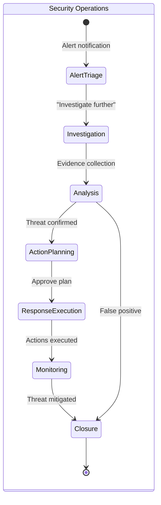

**Specialized Conversation Flows**:

| Flow Type | Structure | Examples |
|-----------|-----------|----------|
| Alert Triage | Initial assessment → Investigation decision | "What's this alert about?" → "Is it suspicious?" |
| Incident Response | Situation report → Action planning → Execution | "What's the incident status?" → "What actions should we take?" → "Implement containment" |
| Threat Hunting | Hypothesis → Data gathering → Analysis | "Let's look for signs of X" → "Show data from Y" → "Analyze these patterns" |
| Status Review | Overview → Deep dive → Actions | "What's our overall status?" → "Tell me more about X" → "Take action on Y" |

### 5.2 Context Management Strategies

Techniques for maintaining conversation context:

1. **Entity Tracking**: Maintaining list of mentioned entities
2. **Focus Management**: Tracking the current focus of conversation
3. **Intent Memory**: Remembering the overall conversation purpose
4. **Reference Resolution**: Resolving pronouns and references
5. **State Persistence**: Maintaining conversation state across turns
6. **Context Window Management**: Optimizing context for relevance

### 5.3 Multi-session Continuity

Approaches for maintaining continuity across sessions:

1. **Session Summarization**: Creating summaries of previous sessions
2. **Key Decision Recording**: Preserving important decisions and findings
3. **Task State Persistence**: Maintaining state of in-progress tasks
4. **Bookmark System**: Supporting conversation resumption points
5. **Cross-session References**: Enabling references to previous sessions
6. **Activity Timeline**: Providing historical activity view

### 5.4 Clarification and Repair Strategies

Methods for handling ambiguity and misunderstandings:

1. **Targeted Clarification**: Asking specific questions about ambiguities
2. **Confirmation**: Verifying understanding of critical instructions
3. **Repair Strategies**: Recovering from misunderstandings
4. **Alternative Suggestions**: Offering potential interpretations
5. **Implicit Confirmation**: Demonstrating understanding through responses
6. **Explicit Correction Handling**: Processing "I meant X" corrections

## 6. User Experience Design

The User Experience Design system ensures effective and intuitive interaction.

### 6.1 Interaction Models

Different ways users can interact with the system:

1. **Command Interface**: Explicit command-oriented interaction
2. **Question-Answer**: Information retrieval through questions
3. **Guided Dialogue**: System-led conversation for specific processes
4. **Mixed Initiative**: Flexible switching between user and system lead
5. **Task-Oriented**: Focused on completing specific security tasks
6. **Exploration**: Open-ended investigation of security data

### 6.2 Adaptive Response Styling

Tailoring response style to context and user:

1. **Role-based Adaptation**: Adjusting to user's security role
2. **Expertise Matching**: Aligning with user's technical expertise
3. **Situation-sensitive Brevity**: Adjusting detail based on urgency
4. **Format Variation**: Using appropriate formatting for content
5. **Tone Adjustment**: Modifying tone based on content severity
6. **Personalization**: Learning and applying user preferences

### 6.3 Multi-modal Integration

Combining text with other interaction modalities:

1. **Text + Visualization**: Enhancing responses with visual elements
2. **Voice + Text**: Supporting voice input with text display
3. **Interactive Elements**: Embedding actionable controls in responses
4. **GUI Integration**: Seamless transition between NL and GUI
5. **Dashboard Integration**: Integrating with security dashboards
6. **Alert Context**: Operating within alert inspection context

### 6.4 User Feedback Mechanisms

Systems for collecting and utilizing user feedback:

1. **Explicit Ratings**: Direct quality rating collection
2. **Correction Handling**: Processing user corrections
3. **Usage Pattern Analysis**: Inferring quality from behavior
4. **A/B Testing**: Comparing alternative interface approaches
5. **Satisfaction Surveys**: Periodic experience assessment
6. **Continuous Improvement**: Applying feedback to enhance system

## 7. Security and Compliance

The Security and Compliance system ensures secure and compliant operation.

### 7.1 Access Control Framework

Securing access to NLI capabilities:

1. **Role-based Access**: Controls based on security roles
2. **Command Authorization**: Permission checks for actions
3. **Data Access Control**: Limiting data visibility
4. **Context-sensitive Permissions**: Permissions based on context
5. **Explicit Approval Workflows**: Requiring approval for sensitive actions
6. **Principle of Least Privilege**: Minimizing default access

### 7.2 Audit and Compliance

Ensuring traceable and compliant operations:

1. **Comprehensive Audit Trail**: Recording all interactions
2. **Command Traceability**: Linking natural language to actions
3. **Reasoning Transparency**: Documenting decision logic
4. **Compliance Verification**: Checking against policy requirements
5. **Audit Reporting**: Generating compliance reports
6. **Evidence Preservation**: Maintaining interaction evidence

### 7.3 Operational Security

Protecting the NLI system itself:

1. **Input Validation**: Preventing injection attacks
2. **Command Sanitization**: Sanitizing commands before execution
3. **Rate Limiting**: Preventing abuse through rate control
4. **Authentication Integration**: Requiring proper authentication
5. **Session Security**: Securing conversation sessions
6. **System Isolation**: Maintaining appropriate security boundaries

### 7.4 Privacy Protection

Safeguarding sensitive information:

1. **PII Handling**: Proper management of personal information
2. **Data Minimization**: Collecting only necessary data
3. **Purpose Limitation**: Using data only for intended purpose
4. **Retention Control**: Appropriate conversation history retention
5. **Privacy by Design**: Privacy considerations in all functions
6. **Access Transparency**: Visibility into who accessed information

## 8. Integration Architecture

The Integration Architecture connects the NLI with the broader Agentic SOC ecosystem.

### 8.1 Agent Hierarchy Integration

Connecting with the tiered agent structure:

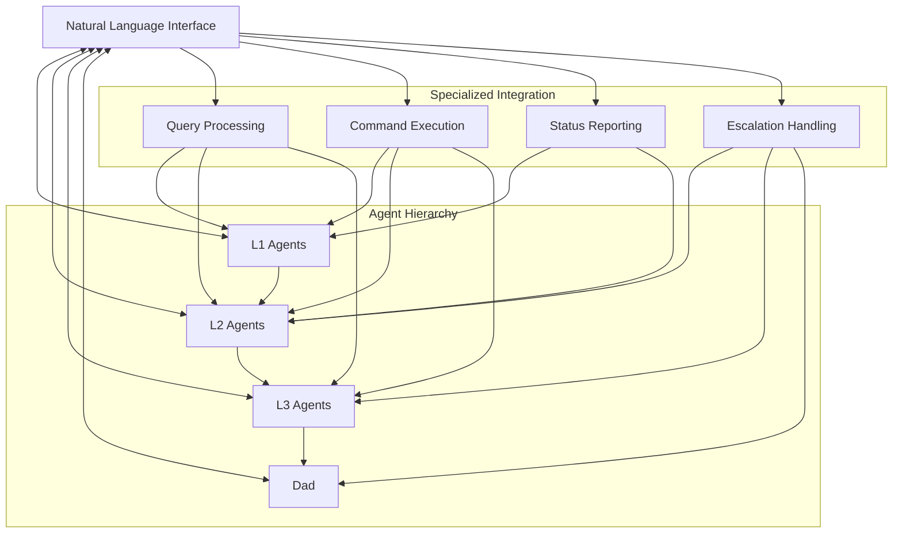

### 8.2 Workflow Engine Integration

Connecting with the autonomous workflow engine:

1. **Workflow Initiation**: Starting workflows via natural language
2. **Status Queries**: Checking workflow status through NLI
3. **Workflow Control**: Modifying workflow execution
4. **Event Subscription**: Receiving workflow event notifications
5. **Approval Integration**: Handling workflow approval requests
6. **Decision Points**: Providing input at workflow decision points

### 8.3 Knowledge Base Integration

Connecting with security knowledge resources:

1. **Knowledge Retrieval**: Accessing knowledge for responses
2. **Knowledge Update**: Contributing new information
3. **Context Enrichment**: Adding context to interactions
4. **Learning Integration**: Feeding interactions into learning system
5. **Reference Linking**: Connecting responses to authoritative sources
6. **Knowledge Gap Identification**: Identifying missing information

### 8.4 External System Integration

Connecting with external security tools:

1. **Tool Control**: Controlling security tools via NL
2. **Alert Integration**: Accessing alert information
3. **Data Source Connection**: Retrieving data from security systems
4. **Action Execution**: Implementing actions in external systems
5. **Status Monitoring**: Checking external system status
6. **Configuration Management**: Modifying external system configuration

## 9. Implementation Approach

The Implementation Approach outlines the strategy for building and deploying the NLI.

### 9.1 Architecture Implementation

The technical implementation strategy:

1. **Modular Construction**: Building independent, composable modules
2. **Service-oriented Design**: Implementing as microservices
3. **API-driven Integration**: Using well-defined APIs between components
4. **Containerized Deployment**: Packaging components as containers
5. **Scalable Infrastructure**: Supporting horizontal and vertical scaling
6. **State Management**: Implementing appropriate state persistence

### 9.2 Development Phases

The phased implementation approach:

| Phase | Focus | Capabilities | Timeline |
|-------|-------|--------------|----------|
| Foundation | Core understanding, basic Q&A | Simple queries, basic commands | Month 1-2 |
| Enhancement | Advanced dialogue, improved understanding | Multi-turn conversations, context awareness | Month 3-4 |
| Integration | System connections, workflow integration | Tool control, workflow interaction | Month 5-6 |
| Specialization | Security domain expertise, advanced features | Advanced security analysis, complex commands | Month 7-9 |
| Optimization | Performance, reliability, user experience | Speed improvements, reliability enhancements | Month 10-12 |

### 9.3 Evaluation Criteria

Metrics for assessing NLI effectiveness:

1. **Understanding Accuracy**: Correct interpretation of inputs
2. **Task Completion Rate**: Successful execution of requested tasks
3. **Response Relevance**: Appropriateness of responses to queries
4. **User Satisfaction**: User ratings and feedback metrics
5. **Operational Efficiency**: Time and resource savings
6. **Security Enhancement**: Impact on security operations

### 9.4 Continuous Improvement

Mechanisms for ongoing enhancement:

1. **Performance Monitoring**: Tracking system performance
2. **User Feedback Integration**: Incorporating user input
3. **Error Analysis**: Systematically analyzing failures
4. **A/B Testing**: Comparing alternative approaches
5. **Model Updates**: Incorporating improved models
6. **Knowledge Expansion**: Extending domain knowledge