# Reporting and Notification Systems

## 1. Overview

The Reporting and Notification Systems provide comprehensive visibility, communication, and intelligence distribution capabilities for the Agentic SOC. These systems ensure that security information is effectively captured, analyzed, presented, and communicated to appropriate stakeholders in the most actionable format.

```mermaid
graph TB
    classDef reporting fill:#f9d5e5,stroke:#d64161,stroke-width:2px
    classDef analytics fill:#d5e8f9,stroke:#417cd6,stroke-width:2px
    classDef notification fill:#e8f9d5,stroke:#7cd641,stroke-width:2px
    classDef delivery fill:#f9e8d5,stroke:#d6a041,stroke-width:2px
    classDef customization fill:#d5f9e8,stroke:#41d6a0,stroke-width:2px
    classDef management fill:#e5d5f9,stroke:#8141d6,stroke-width:2px
    
    %% Main Components
    RNS["Reporting & Notification Systems"]
    
    subgraph "Report Generation Engine"
        ReportFactory["Report Factory"]
        ReportTemplates["Report Template System"]
        ScheduledReporting["Scheduled Reporting Service"]
        AdHocReporting["Ad-Hoc Reporting Engine"]
    end
    
    subgraph "Security Analytics Platform"
        DataAggregation["Data Aggregation System"]
        AnalyticsEngine["Analytics Engine"]
        TrendAnalysis["Trend Analysis System"]
        ComplianceReporting["Compliance Reporting Module"]
    end
    
    subgraph "Notification System"
        AlertEngine["Alert Engine"]
        NotificationOrchestrator["Notification Orchestrator"]
        EscalationManager["Escalation Manager"]
        StatusUpdater["Status Update System"]
    end
    
    subgraph "Delivery Management"
        ChannelManager["Channel Manager"]
        DistributionService["Distribution Service"]
        ReceiptTracker["Receipt Tracking System"]
        DeliveryOptimizer["Delivery Optimizer"]
    end
    
    subgraph "Customization Framework"
        PersonalizationEngine["Personalization Engine"]
        VisualizationDesigner["Visualization Designer"]
        FilteringSystem["Filtering System"]
        PreferenceManager["Preference Manager"]
    end
    
    subgraph "Report Repository"
        DocumentStoreManager["Document Store Manager"]
        VersionControl["Version Control System"]
        ArchivalSystem["Archival System"]
        SearchIndexer["Search & Discovery"]
    end
    
    %% Connections
    RNS --> ReportFactory
    RNS --> ReportTemplates
    RNS --> ScheduledReporting
    RNS --> AdHocReporting
    
    RNS --> DataAggregation
    RNS --> AnalyticsEngine
    RNS --> TrendAnalysis
    RNS --> ComplianceReporting
    
    RNS --> AlertEngine
    RNS --> NotificationOrchestrator
    RNS --> EscalationManager
    RNS --> StatusUpdater
    
    RNS --> ChannelManager
    RNS --> DistributionService
    RNS --> ReceiptTracker
    RNS --> DeliveryOptimizer
    
    RNS --> PersonalizationEngine
    RNS --> VisualizationDesigner
    RNS --> FilteringSystem
    RNS --> PreferenceManager
    
    RNS --> DocumentStoreManager
    RNS --> VersionControl
    RNS --> ArchivalSystem
    RNS --> SearchIndexer
    
    %% Classes
    class ReportFactory,ReportTemplates,ScheduledReporting,AdHocReporting reporting
    class DataAggregation,AnalyticsEngine,TrendAnalysis,ComplianceReporting analytics
    class AlertEngine,NotificationOrchestrator,EscalationManager,StatusUpdater notification
    class ChannelManager,DistributionService,ReceiptTracker,DeliveryOptimizer delivery
    class PersonalizationEngine,VisualizationDesigner,FilteringSystem,PreferenceManager customization
    class DocumentStoreManager,VersionControl,ArchivalSystem,SearchIndexer management
```

## 2. Report Generation Engine

The Report Generation Engine is responsible for creating standardized and custom reports from security data.

### 2.1 Report Factory

**Responsibilities**:
- Create reports based on templates and parameters
- Combine data from multiple sources
- Apply consistent formatting and branding
- Generate reports in various formats
- Ensure report quality and accuracy
- Support interactive and static reports

**Report Creation Process**:

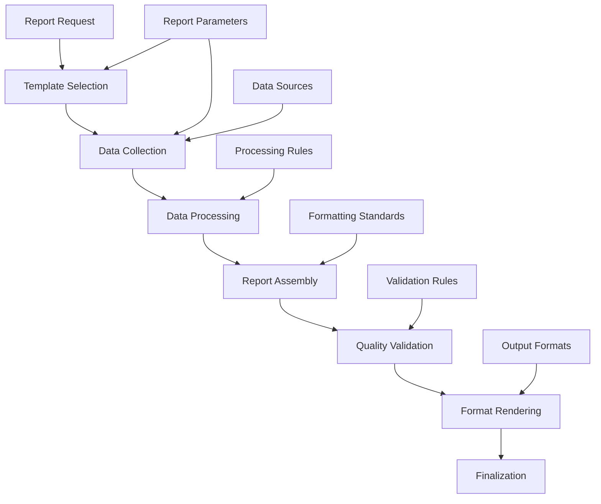

**Key Features**:
- **Multi-format Generation**: PDF, HTML, DOCX, XLSX, JSON, etc.
- **Consistent Styling**: Template-driven design
- **Dynamic Content**: Data-driven report sections
- **Quality Controls**: Automated validation checks
- **Performance Optimization**: Efficient generation
- **Component Reuse**: Modular report components

### 2.2 Report Template System

**Responsibilities**:
- Manage report templates
- Support template customization
- Handle template versioning
- Enable template creation and editing
- Implement template governance
- Support template sharing

**Template Types**:

| Template Type | Purpose | Examples |
|---------------|---------|----------|
| Executive | Leadership overview | Security Posture Summary, Risk Overview |
| Operational | Day-to-day operations | Daily Security Activity, Threat Summary |
| Tactical | Security operations | Incident Response Report, Investigation Summary |
| Analytical | In-depth analysis | Threat Trend Analysis, Vulnerability Assessment |
| Compliance | Regulatory reporting | Compliance Status Report, Audit Report |
| Custom | Specialized needs | Customer-specific Security Report |

**Key Features**:
- **Template Library**: Extensive template collection
- **Version Control**: Template history and versioning
- **Component System**: Modular template components
- **Visual Editor**: WYSIWYG template design
- **Template Testing**: Preview and validation
- **Template Scheduling**: Time-based template selection

### 2.3 Scheduled Reporting Service

**Responsibilities**:
- Manage report schedules
- Execute scheduled report generation
- Handle distribution of scheduled reports
- Manage schedule dependencies
- Track scheduled report history
- Handle schedule exceptions

**Scheduling Framework**:

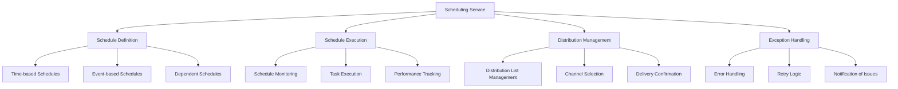

**Scheduling Capabilities**:

| Schedule Type | Trigger | Examples |
|---------------|---------|----------|
| Time-based | Specific time | Daily 6AM security summary |
| Interval-based | Regular intervals | Hourly status updates |
| Event-based | System events | Post-incident report |
| Threshold-based | Metric thresholds | High-alert status report |
| On-demand | Manual trigger | Executive request |
| Composite | Multiple conditions | Weekly report with daily data |

**Key Features**:
- **Flexible Scheduling**: Multiple scheduling options
- **Dependency Management**: Handles report dependencies
- **Execution Monitoring**: Tracks schedule execution
- **Error Recovery**: Graceful error handling
- **Schedule Management**: User-friendly schedule control
- **Distribution Integration**: Integrated delivery options

### 2.4 Ad-Hoc Reporting Engine

**Responsibilities**:
- Support on-demand report creation
- Enable interactive report building
- Provide report parameter selection
- Support exploratory analysis
- Enable custom data views
- Facilitate rapid report development

**Ad-Hoc Reporting Process**:

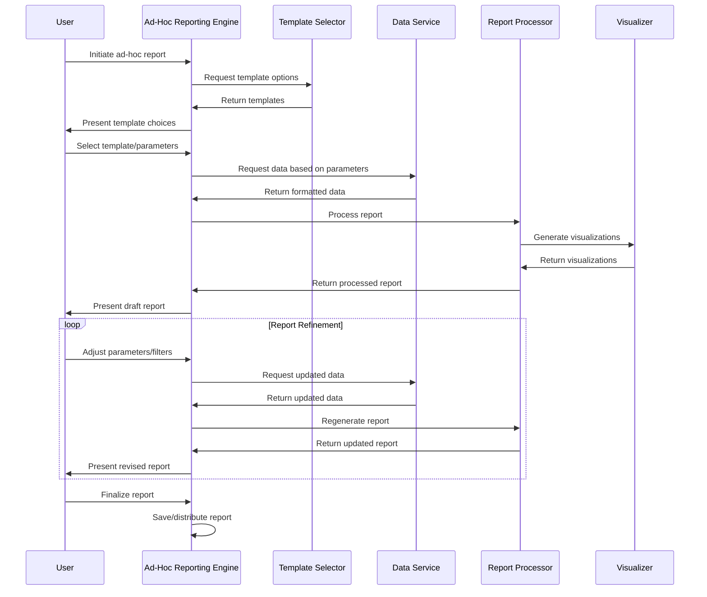

**Key Features**:
- **Interactive Design**: Real-time report customization
- **Parameter Controls**: User-selectable parameters
- **Data Exploration**: Drill-down capabilities
- **Visual Creation**: Drag-and-drop interface
- **Instant Preview**: Real-time report preview
- **Save & Share**: Report saving and distribution

## 3. Security Analytics Platform

The Security Analytics Platform enables advanced analysis, correlation, and interpretation of security data.

### 3.1 Data Aggregation System

**Responsibilities**:
- Collect data from multiple sources
- Normalize and standardize data
- Correlate related information
- Ensure data completeness
- Filter irrelevant information
- Prepare data for analysis

**Data Source Integration**:

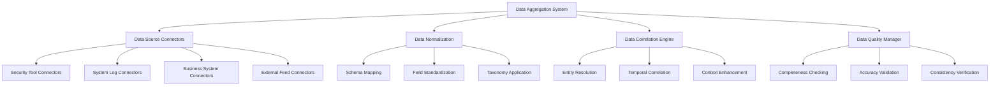

**Key Features**:
- **Comprehensive Collection**: Multi-source data gathering
- **Standardized Format**: Consistent data representation
- **Correlation Capabilities**: Related data linking
- **Deduplication**: Redundancy elimination
- **Quality Controls**: Data integrity verification
- **Automated Enrichment**: Context addition

### 3.2 Analytics Engine

**Responsibilities**:
- Perform security data analysis
- Apply analytical models
- Generate insights and findings
- Identify patterns and anomalies
- Support data exploration
- Enable advanced querying

**Analytics Capabilities**:

| Analytics Type | Purpose | Techniques |
|----------------|---------|------------|
| Descriptive | Summarize what happened | Aggregation, summarization, distribution analysis |
| Diagnostic | Understand why it happened | Root cause analysis, correlation analysis, factor analysis |
| Predictive | Forecast what might happen | Trend analysis, machine learning, pattern recognition |
| Prescriptive | Recommend actions | Decision models, optimization, simulation |

**Key Features**:
- **Multi-dimensional Analysis**: Complex data exploration
- **Statistical Processing**: Advanced statistical methods
- **Pattern Recognition**: Automated pattern identification
- **Anomaly Detection**: Outlier identification
- **Trend Analysis**: Temporal pattern analysis
- **Comparative Analysis**: Historical and benchmark comparison

### 3.3 Trend Analysis System

**Responsibilities**:
- Identify security trends over time
- Track KPI and metric trends
- Detect pattern changes
- Project future trends
- Compare trends across dimensions
- Provide trending alerts

**Trend Analysis Framework**:

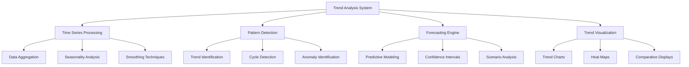

**Key Features**:
- **Temporal Analysis**: Time-based pattern recognition
- **Multi-variate Trending**: Cross-variable trends
- **Seasonality Detection**: Cyclical pattern identification
- **Anomalous Trend Alerting**: Abnormal trend notification
- **Predictive Trending**: Future trend projection
- **Comparative Trending**: Trend comparison across dimensions

### 3.4 Compliance Reporting Module

**Responsibilities**:
- Generate compliance-specific reports
- Map security data to compliance frameworks
- Track compliance status
- Document compliance evidence
- Support audit preparation
- Identify compliance gaps

**Compliance Framework Support**:

| Framework | Report Types | Evidence Collection |
|-----------|--------------|---------------------|
| NIST CSF | Framework coverage, control effectiveness | Control mapping, implementation evidence |
| ISO 27001 | ISMS status, control implementation | Statement of Applicability, control evidence |
| HIPAA | Security Rule compliance, PHI safeguards | Technical safeguards, access controls |
| PCI DSS | Cardholder data security, SAQ readiness | Control implementation, vulnerability status |
| GDPR | Data protection measures, breach readiness | Processing records, protection evidence |
| SOC 2 | Trust criteria coverage, control evidence | Control effectiveness, testing results |

**Key Features**:
- **Framework Mapping**: Security controls to framework mapping
- **Evidence Collection**: Automated compliance evidence
- **Gap Identification**: Compliance gap highlighting
- **Status Tracking**: Compliance status monitoring
- **Audit Support**: Direct audit evidence generation
- **Remediation Tracking**: Compliance issue tracking

## 4. Notification System

The Notification System manages the delivery of alerts, updates, and communication to stakeholders.

### 4.1 Alert Engine

**Responsibilities**:
- Generate security alerts and notifications
- Apply alert prioritization
- Manage alert throttling and aggregation
- Track alert acknowledgment and resolution
- Implement alert escalation rules
- Provide alert analytics

**Alert Processing Flow**:

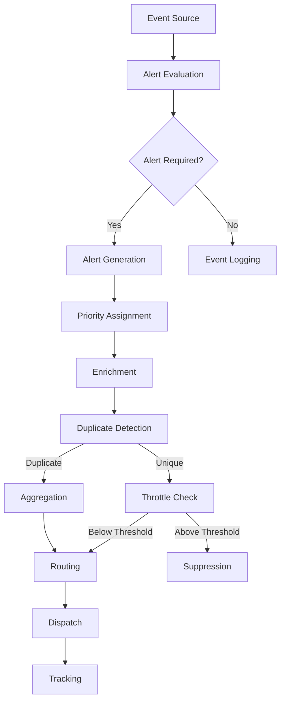

**Alert Priority Levels**:

| Priority | Characteristics | Response Time | Notification Method |
|----------|----------------|---------------|---------------------|
| Critical | Severe business impact, active threat | Immediate | Multiple channels, confirmation required |
| High | Significant impact, security breach | < 15 minutes | Multiple channels |
| Medium | Moderate impact, potential security issue | < 1 hour | Primary channel |
| Low | Minor impact, informational | < 24 hours | Dashboard, email |
| Informational | Awareness only | None | Dashboard |

**Key Features**:
- **Intelligent Prioritization**: Context-based importance
- **Alert Correlation**: Related alert linking
- **Deduplication**: Redundant alert elimination
- **Throttling**: Volume control mechanisms
- **Smart Routing**: Appropriate recipient targeting
- **Escalation Rules**: Automatic escalation logic

### 4.2 Notification Orchestrator

**Responsibilities**:
- Coordinate notification delivery
- Manage notification timing and sequencing
- Handle notification dependencies
- Implement notification policies
- Track notification status
- Optimize notification processes

**Orchestration Process**:

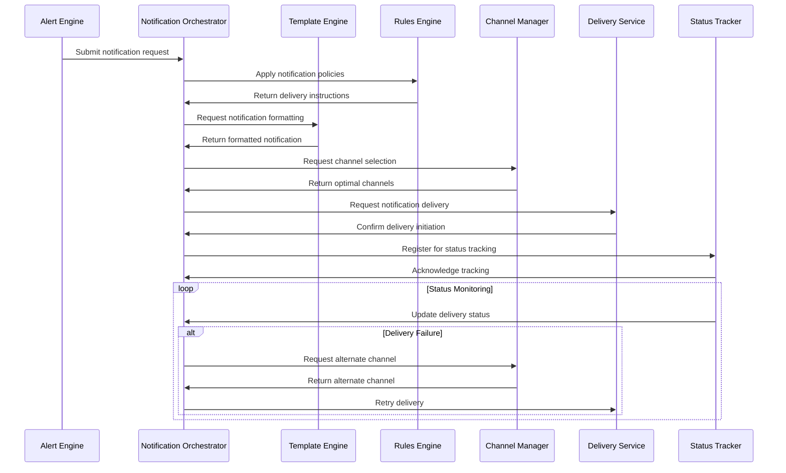

**Key Features**:
- **Notification Lifecycle**: End-to-end notification management
- **Policy Enforcement**: Notification rule application
- **Channel Coordination**: Multi-channel orchestration
- **Delivery Reliability**: Assured notification delivery
- **Status Monitoring**: Notification tracking
- **Performance Optimization**: Delivery optimization

### 4.3 Escalation Manager

**Responsibilities**:
- Implement escalation policies
- Manage escalation timelines
- Track response SLAs
- Execute multi-level escalations
- Integrate with on-call systems
- Document escalation history

**Escalation Process**:

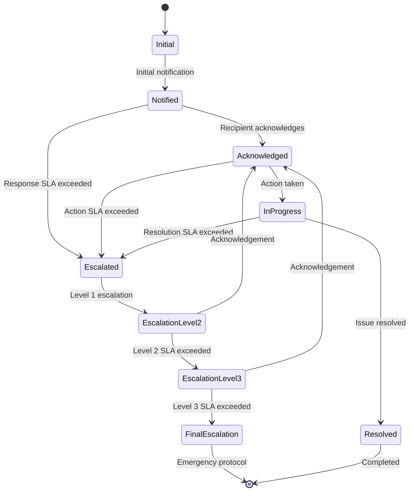

**Escalation Levels**:

| Level | Target | SLA | Actions |
|-------|--------|-----|---------|
| Initial | Primary responder | Response: 15 min | Notification via preferred channel |
| Level 1 | Backup responder | Response: 15 min | Multiple notification channels |
| Level 2 | Team lead | Response: 30 min | Call, SMS, email notification |
| Level 3 | Manager | Response: 30 min | Call, SMS, email + management notification |
| Final | Executive | Response: 1 hour | Executive notification, emergency protocol |

**Key Features**:
- **Policy-driven Escalation**: Automated escalation rules
- **SLA Tracking**: Response time monitoring
- **Escalation Paths**: Clear escalation pathways
- **On-call Integration**: Integration with on-call systems
- **Notification Diversification**: Multiple notification methods
- **Acknowledgment Tracking**: Response verification

### 4.4 Status Update System

**Responsibilities**:
- Provide progress updates on security activities
- Send milestone notifications
- Deliver status changes
- Track security posture changes
- Provide operational readiness updates
- Communicate system status

**Status Update Types**:

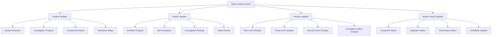

**Key Features**:
- **Progressive Updates**: Stage-based status messaging
- **Contextual Status**: Environment-aware updates
- **Milestone Notifications**: Key progress points
- **Change Broadcasting**: Important state changes
- **Dashboard Updates**: Visual status updates
- **User-specific Status**: Personalized status information

## 5. Delivery Management

The Delivery Management system ensures notifications and reports reach their intended recipients effectively.

### 5.1 Channel Manager

**Responsibilities**:
- Manage delivery channels
- Select optimal channels for communications
- Maintain channel status and health
- Track channel performance
- Handle channel-specific formatting
- Implement channel failover

**Channel Types**:

| Channel | Characteristics | Best For | Limitations |
|---------|----------------|----------|-------------|
| Email | Detailed content, attachments | Reports, detailed notifications | Delayed viewing |
| SMS | Short text, high visibility | Urgent alerts, brief updates | Limited content |
| Mobile Push | Direct device notification | Time-sensitive alerts | Requires app installation |
| Dashboard | Visual, interactive | Operational visibility, context | Requires active viewing |
| Collaboration Apps | Team visibility, threading | Team coordination | Platform-specific |
| Voice | Direct communication | Critical alerts | Limited content delivery |
| Webhook | System integration | Automated workflows | Technical implementation |

**Key Features**:
- **Channel Registry**: Comprehensive channel catalog
- **Health Monitoring**: Channel availability tracking
- **Format Adaptation**: Channel-appropriate formatting
- **Optimal Selection**: Intelligent channel selection
- **Fallback Configuration**: Alternative channel failover
- **Performance Analytics**: Channel effectiveness metrics

### 5.2 Distribution Service

**Responsibilities**:
- Execute multi-channel delivery
- Manage distribution lists
- Handle batch deliveries
- Implement delivery scheduling
- Track delivery status
- Optimize delivery performance

**Distribution Process**:

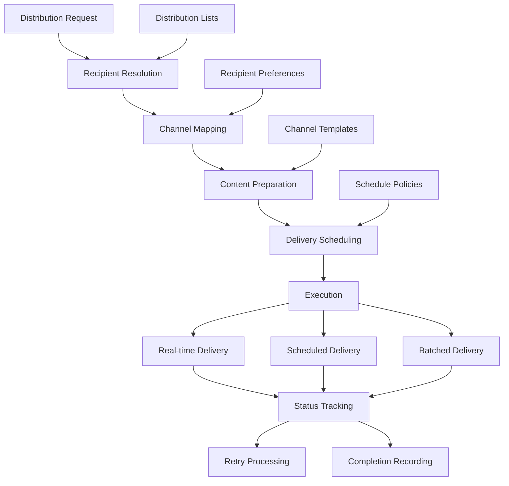

**Key Features**:
- **Multi-modal Delivery**: Multiple channel support
- **List Management**: Distribution list maintenance
- **Smart Batching**: Intelligent delivery grouping
- **Schedule Optimization**: Timing optimization
- **Delivery Verification**: Complete delivery confirmation
- **Performance Tuning**: Delivery efficiency optimization

### 5.3 Receipt Tracking System

**Responsibilities**:
- Track delivery receipt status
- Monitor notification acknowledgment
- Document report access
- Verify content consumption
- Track response activities
- Generate delivery analytics

**Tracking Workflow**:

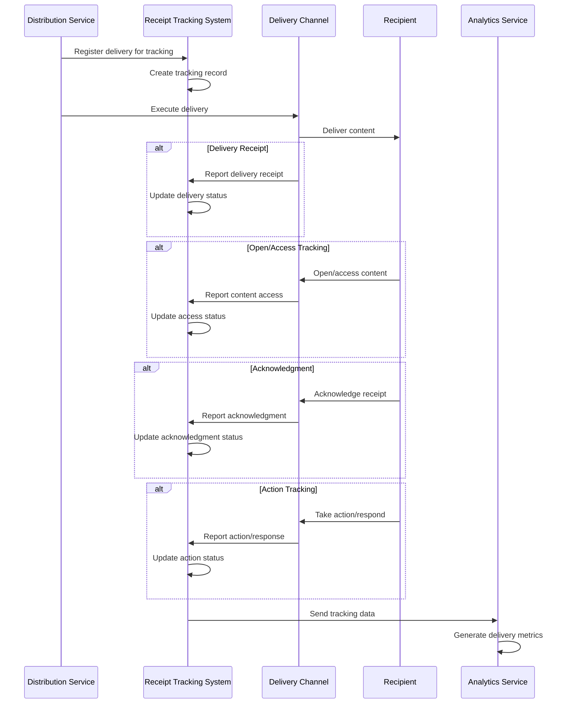

**Key Features**:
- **Multi-stage Tracking**: Complete delivery lifecycle
- **Delivery Verification**: Confirmed delivery status
- **Access Tracking**: Content access monitoring
- **Acknowledgment Monitoring**: Receipt verification
- **Action Tracking**: Response activity tracking
- **Analytics Integration**: Delivery performance analysis

### 5.4 Delivery Optimizer

**Responsibilities**:
- Optimize delivery effectiveness
- Analyze recipient behavior
- Determine optimal delivery timing
- Improve channel selection
- Enhance content formatting
- Measure and improve engagement

**Optimization Dimensions**:

```mermaid
graph TD
    A[Delivery Optimizer] --> B[Channel Optimization]
    A --> C[Timing Optimization]
    A --> D[Content Optimization]
    A --> E[Frequency Optimization]
    A --> F[Format Optimization]
    
    B --> B1[Channel Performance Analysis]
    B --> B2[Recipient Preference Analysis]
    B --> B3[Channel Effectiveness Comparison]
    
    C --> C1[Time-of-Day Analysis]
    C --> C2[Day-of-Week Analysis]
    C --> C3[Response Time Analysis]
    
    D --> D1[Subject Line Analysis]
    D --> D2[Content Structure Analysis]
    D --> D3[Information Density Analysis]
    
    E --> E1[Notification Volume Analysis]
    E --> E2[Recipient Tolerance Analysis]
    E --> E3[Information Grouping Analysis]
    
    F --> F1[Format Effectiveness Analysis]
    F --> F2[Device Compatibility Analysis]
    F --> F3[Accessibility Optimization]
```

**Key Features**:
- **Behavioral Analysis**: Recipient engagement patterns
- **A/B Testing**: Comparative delivery testing
- **Adaptive Optimization**: Self-optimizing delivery
- **Personalized Delivery**: Recipient-specific optimization
- **Channel Performance**: Channel effectiveness comparison
- **Timing Analysis**: Optimal delivery timing

## 6. Customization Framework

The Customization Framework enables personalization of reports and notifications for specific needs and preferences.

### 6.1 Personalization Engine

**Responsibilities**:
- Customize content for recipients
- Adapt to user preferences
- Implement role-based customization
- Support context-based adaptation
- Enable user-driven personalization
- Track personalization effectiveness

**Personalization Factors**:

| Factor | Application | Examples |
|--------|-------------|----------|
| Role | Role-specific content | Executive view vs. technical view |
| Preferences | User preferences | Preferred format, detail level, visualization style |
| History | Interaction history | Previously viewed content, interaction patterns |
| Context | Usage context | Device, location, time constraints |
| Importance | Content relevance | Highlighting high-importance information |
| Expertise | Knowledge level | Technical depth based on expertise |

**Key Features**:
- **Role-based Personalization**: Role-appropriate content
- **Preference Management**: User preference tracking
- **Adaptive Content**: Context-sensitive adaptation
- **Learning System**: Behavior-based customization
- **Interest Tracking**: Topic interest modeling
- **Effectiveness Metrics**: Personalization impact measurement

### 6.2 Visualization Designer

**Responsibilities**:
- Create effective data visualizations
- Implement visualization templates
- Support custom chart creation
- Enable interactive visualizations
- Ensure visualization accuracy
- Optimize visualization performance

**Visualization Types**:

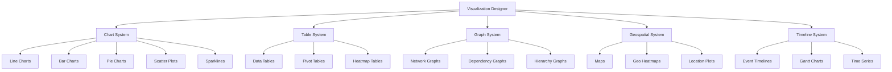

**Key Features**:
- **Comprehensive Library**: Extensive visualization types
- **Customization Options**: Flexible visualization styling
- **Responsive Design**: Device-adapted visualizations
- **Interactive Elements**: User-interactive features
- **Data-driven Rendering**: Dynamic data visualization
- **Export Capabilities**: Multi-format visualization export

### 6.3 Filtering System

**Responsibilities**:
- Provide content filtering capabilities
- Implement filter management
- Support complex filtering logic
- Enable filter persistence
- Implement filter suggestions
- Support collaborative filtering

**Filtering Framework**:

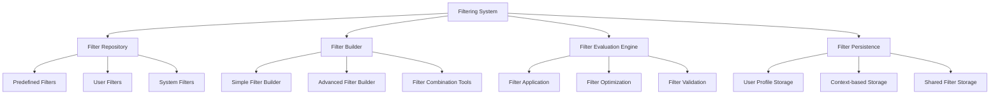

**Key Features**:
- **Comprehensive Filtering**: Multi-dimensional filters
- **Intuitive Builder**: User-friendly filter creation
- **Filter Persistence**: Saved filter management
- **Filter Sharing**: Collaborative filter usage
- **Smart Suggestions**: Intelligent filter recommendations
- **Performance Optimization**: Efficient filter execution

### 6.4 Preference Manager

**Responsibilities**:
- Manage user preferences
- Store customization settings
- Handle preference defaults
- Implement preference inheritance
- Support preference export/import
- Ensure preference consistency

**Preference Categories**:

| Category | Settings | Application |
|----------|----------|-------------|
| Display | Theme, layout, density | Visual appearance |
| Content | Detail level, focus areas | Information selection |
| Notification | Channels, frequency, urgency levels | Communication preferences |
| Format | Preferred formats, style, branding | Content formatting |
| Scheduling | Preferred timing, frequency | Delivery scheduling |
| Visualization | Chart types, color schemes, interactivity | Data visualization |

**Key Features**:
- **Comprehensive Settings**: Extensive preference options
- **Hierarchical Inheritance**: Default-to-specific settings
- **Profile Management**: Complete preference profiles
- **Synchronization**: Cross-device preference sync
- **Import/Export**: Preference portability
- **Version Compatibility**: Backward compatible preferences

## 7. Report Repository

The Report Repository provides storage, management, and retrieval of generated reports and information.

### 7.1 Document Store Manager

**Responsibilities**:
- Store reports and documents
- Manage document metadata
- Implement document categorization
- Support document relationships
- Handle document lifecycle
- Optimize storage utilization

**Document Storage Architecture**:

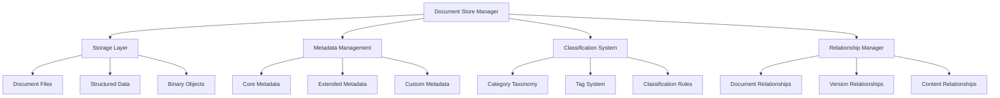

**Key Features**:
- **Multi-format Storage**: Various document formats
- **Rich Metadata**: Comprehensive document information
- **Intelligent Classification**: Automated categorization
- **Relationship Mapping**: Document relationship tracking
- **Lifecycle Management**: Complete document lifecycle
- **Storage Optimization**: Efficient storage utilization

### 7.2 Version Control System

**Responsibilities**:
- Manage document versions
- Track revision history
- Support version comparison
- Implement version labeling
- Enable version rollback
- Provide version analytics

**Version Management Process**:

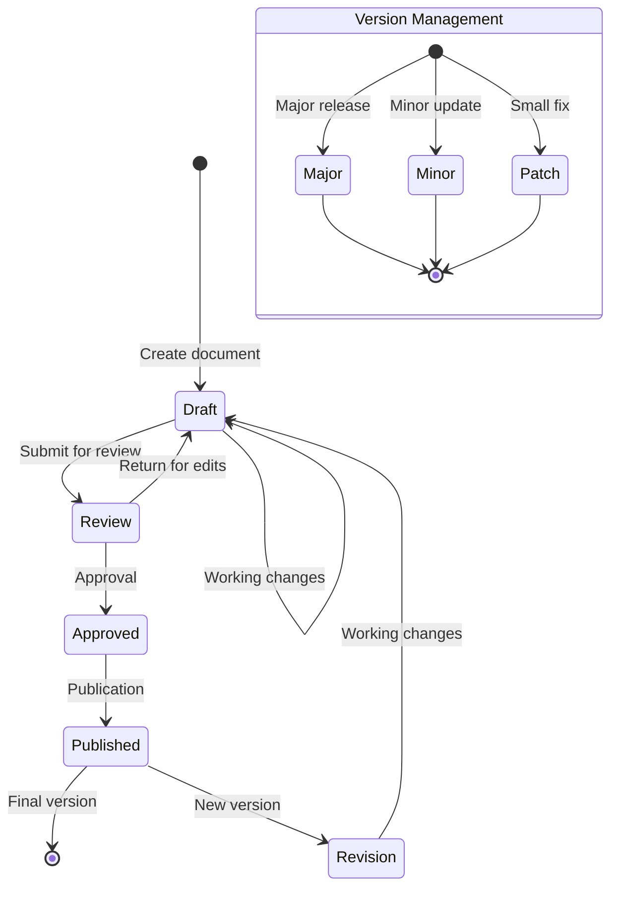

**Key Features**:
- **Complete Version History**: Comprehensive revision tracking
- **Change Tracking**: Detailed modification history
- **Version Comparison**: Side-by-side version comparison
- **Rollback Capabilities**: Previous version restoration
- **Version Branching**: Alternative version support
- **Audit Trail**: Complete modification records

### 7.3 Archival System

**Responsibilities**:
- Manage long-term document storage
- Implement retention policies
- Support archival cataloging
- Ensure archival security
- Enable compliant archiving
- Support archive retrieval

**Archival Framework**:

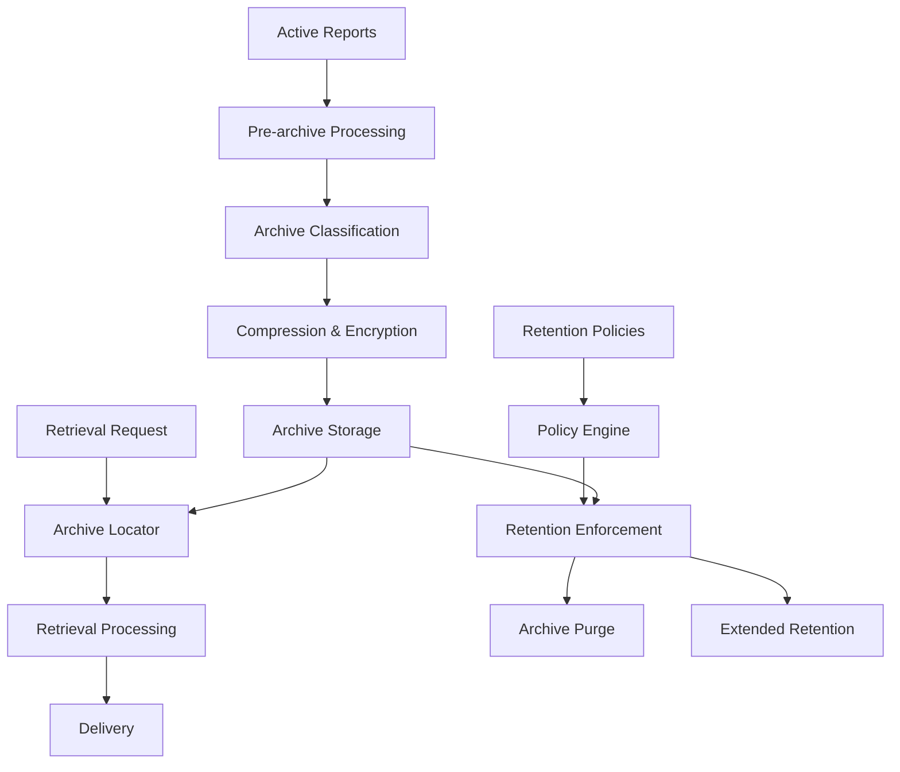

**Key Features**:
- **Policy-driven Archiving**: Automated archival processes
- **Retention Management**: Policy-based retention
- **Secure Storage**: Protected archival storage
- **Efficient Retrieval**: Rapid archive access
- **Compliance Support**: Regulatory-compliant archiving
- **Archive Analytics**: Archive composition analytics

### 7.4 Search & Discovery

**Responsibilities**:
- Index report content
- Provide search capabilities
- Enable content discovery
- Support refined search queries
- Implement relevance ranking
- Track search patterns

**Search Capabilities**:

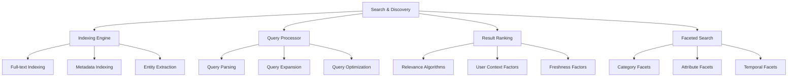

**Key Features**:
- **Comprehensive Indexing**: Complete content indexing
- **Advanced Search**: Sophisticated search capabilities
- **Faceted Navigation**: Multi-dimensional filtering
- **Intelligent Ranking**: Context-aware result ranking
- **Suggested Queries**: Search recommendation
- **Search Analytics**: Query pattern analysis

## 8. Use Cases

### 8.1 Security Operations Reporting

**Scenario**: Daily security operations reporting for SOC teams.

**Process Flow**:

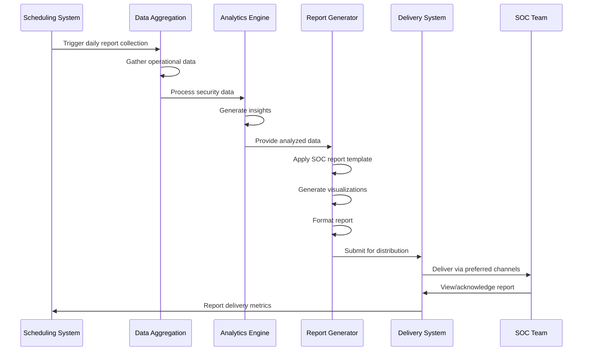

**Key Features**:
- **Automated Timing**: Scheduled daily generation
- **Comprehensive Coverage**: Complete operational view
- **Security Metrics**: Key performance indicators
- **Incident Summary**: Activity summary
- **Trend Analysis**: Pattern identification
- **Multi-channel Delivery**: Team-appropriate distribution

### 8.2 Executive Security Briefing

**Scenario**: Weekly executive security posture briefing.

**Process Flow**:

```mermaid
sequenceDiagram
    participant Scheduler as Scheduling System
    participant Data as Data Services
    participant Template as Executive Template
    participant Generator as Report Generator
    participant Personalize as Personalization Engine
    participant Delivery as Delivery Service
    participant Executives as Executive Team
    
    Scheduler->>Generator: Trigger executive briefing
    Generator->>Data: Request security data
    Data->>Generator: Return processed data
    
    Generator->>Template: Apply executive template
    Template->>Generator: Return formatted structure
    
    Generator->>Generator: Create high-level summary
    Generator->>Generator: Generate strategic visualizations
    Generator->>Generator: Include business impact analysis
    
    Generator->>Personalize: Apply executive preferences
    Personalize->>Generator: Return personalized reports
    
    Generator->>Delivery: Submit for distribution
    Delivery->>Executives: Deliver via executive channels
    
    Executives->>Delivery: Access/feedback on report
    Delivery->>Scheduler: Report engagement metrics
```

**Key Features**:
- **Business Context**: Business-focused security information
- **Strategic View**: High-level security posture
- **Risk Visualization**: Clear risk representation
- **Executive Summary**: Concise overview
- **Trend Highlight**: Significant pattern changes
- **Action Recommendations**: Strategic guidance

### 8.3 Incident Response Notifications

**Scenario**: Real-time incident notifications and updates.

**Process Flow**:

```mermaid
sequenceDiagram
    participant IMS as Incident Management System
    participant Alert as Alert Engine
    participant Notification as Notification Orchestrator
    participant Channels as Channel Manager
    participant Recipients as Response Team
    participant Status as Status Update System
    
    IMS->>Alert: Detect security incident
    Alert->>Alert: Evaluate severity
    Alert->>Notification: Generate incident alert
    
    Notification->>Channels: Determine optimal channels
    Channels->>Notification: Return channel selection
    
    Notification->>Recipients: Deliver initial notification
    Recipients->>Notification: Acknowledge notification
    
    loop Incident Progress
        IMS->>Status: Status change event
        Status->>Notification: Generate status update
        Notification->>Recipients: Deliver status update
    end
    
    IMS->>Alert: Incident resolution
    Alert->>Notification: Generate resolution notice
    Notification->>Recipients: Deliver closure notification
```

**Key Features**:
- **Real-time Alerting**: Immediate incident notification
- **Severity-based Routing**: Appropriate responder targeting
- **Acknowledgment Tracking**: Response verification
- **Progress Updates**: Ongoing status communication
- **Resolution Notification**: Closure communication
- **Post-incident Summary**: Comprehensive incident overview

### 8.4 Compliance Reporting

**Scenario**: Quarterly compliance status reporting.

**Process Flow**:

```mermaid
sequenceDiagram
    participant Scheduler as Scheduling System
    participant Compliance as Compliance Module
    participant Evidence as Evidence Collector
    participant Generator as Report Generator
    participant Review as Review System
    participant Delivery as Delivery Service
    participant Stakeholders as Compliance Stakeholders
    
    Scheduler->>Compliance: Trigger compliance reporting
    Compliance->>Evidence: Gather compliance evidence
    Evidence->>Compliance: Return evidence data
    
    Compliance->>Compliance: Assess compliance status
    Compliance->>Generator: Provide compliance data
    
    Generator->>Generator: Create compliance report
    Generator->>Generator: Generate compliance visualizations
    Generator->>Generator: Include evidence references
    
    Generator->>Review: Submit for compliance review
    Review->>Generator: Provide review feedback
    Generator->>Generator: Apply review comments
    
    Generator->>Delivery: Submit approved report
    Delivery->>Stakeholders: Deliver to compliance stakeholders
    
    Stakeholders->>Delivery: Access compliance report
    Delivery->>Scheduler: Report delivery metrics
```

**Key Features**:
- **Framework Mapping**: Regulatory framework alignment
- **Evidence Inclusion**: Supporting compliance evidence
- **Gap Identification**: Compliance shortfall highlighting
- **Remediation Tracking**: Issue resolution status
- **Control Effectiveness**: Control performance metrics
- **Audit Support**: Audit-ready documentation

### 8.5 Threat Intelligence Sharing

**Scenario**: Distribution of threat intelligence updates to security team.

**Process Flow**:

```mermaid
sequenceDiagram
    participant TIS as Threat Intelligence System
    participant Aggregator as Intelligence Aggregator
    participant Analyzer as Intelligence Analyzer
    participant Reporter as Report Generator
    participant Alert as Alert Engine
    participant Delivery as Delivery Service
    participant Team as Security Team
    
    TIS->>Aggregator: New threat intelligence
    Aggregator->>Aggregator: Process intelligence
    Aggregator->>Analyzer: Submit for analysis
    
    Analyzer->>Analyzer: Assess relevance
    Analyzer->>Analyzer: Determine priority
    
    alt High Priority Threat
        Analyzer->>Alert: Generate threat alert
        Alert->>Delivery: Immediate notification
        Delivery->>Team: Deliver urgent alert
    else Standard Intelligence
        Analyzer->>Reporter: Generate intelligence brief
        Reporter->>Delivery: Schedule distribution
        Delivery->>Team: Deliver intelligence update
    end
    
    Team->>Delivery: Access/acknowledge intelligence
    Delivery->>TIS: Report engagement metrics
```

**Key Features**:
- **Relevance Filtering**: Organization-specific intelligence
- **Priority Classification**: Threat importance assessment
- **Actionable Format**: Practical intelligence presentation
- **IOC Extraction**: Clear indicator identification
- **MITRE ATT&CK Mapping**: Technique correlation
- **Defensive Guidance**: Mitigation recommendations

## 9. Implementation Approach

### 9.1 System Architecture

**Component Architecture**:

```mermaid
flowchart TD
    subgraph "Presentation Layer"
        Dashboard["Interactive Dashboards"]
        Reports["Report Viewers"]
        Notifications["Notification Interfaces"]
        Alerts["Alert Displays"]
    end
    
    subgraph "Service Layer"
        ReportServices["Reporting Services"]
        NotificationServices["Notification Services"]
        AnalyticsServices["Analytics Services"]
        DeliveryServices["Delivery Services"]
    end
    
    subgraph "Processing Layer"
        ReportEngine["Report Processing Engine"]
        AlertEngine["Alert Processing Engine"]
        AnalyticsEngine["Analytics Processing Engine"]
        DeliveryEngine["Delivery Processing Engine"]
    end
    
    subgraph "Data Layer"
        EventStorage["Event Storage"]
        ReportStorage["Report Storage"]
        ConfigStorage["Configuration Storage"]
        MetricsStorage["Metrics Storage"]
    end
    
    %% Connections
    Dashboard & Reports & Notifications & Alerts --> ReportServices & NotificationServices & AnalyticsServices & DeliveryServices
    
    ReportServices --> ReportEngine
    NotificationServices --> AlertEngine
    AnalyticsServices --> AnalyticsEngine
    DeliveryServices --> DeliveryEngine
    
    ReportEngine & AlertEngine & AnalyticsEngine & DeliveryEngine --> EventStorage & ReportStorage & ConfigStorage & MetricsStorage
```

**Key Components**:
- **Presentation Layer**: User-facing interfaces
- **Service Layer**: Business logic services
- **Processing Layer**: Core processing engines
- **Data Layer**: Data storage and management

### 9.2 Integration Approach

**Integration Patterns**:

| Integration Type | Pattern | Usage |
|------------------|---------|-------|
| Security Tools | API Integration | Direct data collection from security tools |
| Data Sources | ETL Processes | Normalized data extraction and loading |
| Notification Channels | Gateway Pattern | Unified channel interface |
| External Systems | Service Bus | Message-based system integration |
| User Directories | Federation | Identity and role integration |
| Business Systems | API Gateway | Controlled business system access |

**Key Integration Considerations**:
- **Standardized Interfaces**: Consistent integration methods
- **Data Normalization**: Unified data representation
- **Authentication/Authorization**: Secured integration access
- **Performance Optimization**: Efficient integration design
- **Resilient Connections**: Fault-tolerant integration
- **Monitoring Capabilities**: Integration health tracking

### 9.3 Performance Requirements

**Performance Criteria**:

| Function | Requirement | Metric |
|----------|-------------|--------|
| Report Generation | High-volume processing | 100+ reports per hour |
| Report Delivery | Timely distribution | 1000+ recipients per minute |
| Notification Processing | Real-time alerting | < 5 second delivery time |
| Alert Handling | Mass alert capability | 10,000+ alerts per day |
| Search Performance | Rapid information retrieval | < 2 second query response |
| Dashboard Updates | Real-time visualization | < 10 second refresh rate |

**Scalability Considerations**:
- **Horizontal Scaling**: Add processing nodes for capacity
- **Vertical Scaling**: Enhanced node capabilities
- **Load Distribution**: Balanced workload allocation
- **Caching Strategy**: Strategic result caching
- **Asynchronous Processing**: Non-blocking operations
- **Resource Optimization**: Efficient resource utilization

### 9.4 Security Requirements

**Security Controls**:

1. **Data Protection**:
   - Encryption for data at rest
   - Encryption for data in transit
   - Secure storage of sensitive information
   - Data integrity validation

2. **Access Control**:
   - Role-based access control
   - Attribute-based access control
   - Principle of least privilege
   - Authentication integration

3. **Audit & Compliance**:
   - Comprehensive activity logging
   - Tampering prevention
   - Compliance-ready logging
   - Access audit trails

4. **System Security**:
   - Secure configuration
   - Vulnerability management
   - Patch management
   - Security monitoring

5. **Information Security**:
   - Data classification
   - Information handling policies
   - Data lifecycle management
   - Information security controls

## 10. Deployment Strategy

### 10.1 Phased Implementation

**Implementation Phases**:

| Phase | Focus | Components | Timeline |
|-------|-------|------------|----------|
| Foundation | Core functionality | Basic reporting, essential notifications | Months 1-2 |
| Enhancement | Advanced features | Analytics, personalization, optimization | Months 3-4 |
| Integration | External connections | Tool integration, delivery channels | Months 5-6 |
| Optimization | Performance tuning | Scalability, efficiency, refinement | Month 7-8 |

**Dependency Management**:
- **Critical Path Analysis**: Key dependency identification
- **Parallel Development**: Independent component development
- **Integration Points**: Clear interface definitions
- **Progressive Enhancement**: Incremental feature addition
- **Functional Testing**: Capability validation
- **Integration Testing**: Component interoperability

### 10.2 Migration Approach

**Migration Strategy**:

1. **Data Migration**:
   - Historical data assessment
   - Data transformation planning
   - Incremental data migration
   - Data verification and validation

2. **Process Migration**:
   - Current process mapping
   - Process gap analysis
   - Process transition planning
   - Parallel process operation

3. **User Migration**:
   - User identification and mapping
   - Permission translation
   - Personalization migration
   - Phased user transition

4. **System Cutover**:
   - Component cutover planning
   - Rollback procedures
   - Validation checkpoints
   - Support readiness

### 10.3 Success Metrics

**Key Performance Indicators**:

| Category | Metrics | Targets |
|----------|---------|---------|
| Reporting Effectiveness | Report usage, action generation | >80% usage, >40% action rate |
| Notification Efficiency | Delivery success, acknowledgment rate | >99% delivery, >90% acknowledgment |
| User Satisfaction | Satisfaction score, feedback ratings | >4.5/5 satisfaction, >85% positive feedback |
| System Performance | Load handling, response time | 100% SLA adherence, <2s response time |
| Business Impact | Time savings, error reduction | >40% time savings, >80% error reduction |

**Measurement Approach**:
- **Automated Metrics**: System-generated performance data
- **User Feedback**: Direct user experience measurement
- **Process Analysis**: Operational efficiency assessment
- **Comparative Analysis**: Before/after comparison
- **Continuous Monitoring**: Ongoing performance tracking
- **Regular Reporting**: Metric outcome communication