# Specialized Agent Types and Responsibilities

## 1. Overview

The Agentic SOC architecture implements 50+ specialized security agents organized into functional domains. Each agent has specific responsibilities, capabilities, and skills tailored to its security function. Agents operate within the hierarchical L1/L2/L3 structure, with specialized capabilities becoming more advanced at higher tiers.

```mermaid
graph TD
    classDef email fill:#f9d5e5,stroke:#d64161,stroke-width:2px
    classDef endpoint fill:#d5e8f9,stroke:#417cd6,stroke-width:2px
    classDef network fill:#e8f9d5,stroke:#7cd641,stroke-width:2px
    classDef cloud fill:#f9e8d5,stroke:#d6a041,stroke-width:2px
    classDef vuln fill:#d5f9e8,stroke:#41d6a0,stroke-width:2px
    classDef threat fill:#e5d5f9,stroke:#8141d6,stroke-width:2px
    classDef compliance fill:#f5f5f5,stroke:#888888,stroke-width:2px
    classDef forensic fill:#f9f9d5,stroke:#d6d641,stroke-width:2px
    classDef incident fill:#f9d5d5,stroke:#d64141,stroke-width:2px
    classDef intel fill:#d5f9f9,stroke:#41d6d6,stroke-width:2px
    classDef identity fill:#fff9d5,stroke:#d6bd41,stroke-width:2px
    classDef support fill:#e0e0e0,stroke:#666666,stroke-width:2px

    SOC[Agentic SOC<br>Orchestrator]

    %% Email Security Agents
    SOC --> EmailSec[Email Security<br>Agents]
    EmailSec --> PhishAnalyst[Phishing Analyst]
    EmailSec --> MalAttachAnalyst[Malicious Attachment<br>Analyst]
    EmailSec --> EmailGatewayMonitor[Email Gateway<br>Monitor]
    EmailSec --> BECAnalyst[BEC Analyst]
    EmailSec --> SpamFilter[Spam Filter<br>Analyst]

    %% Endpoint Security Agents
    SOC --> EndpointSec[Endpoint Security<br>Agents]
    EndpointSec --> EDRAgent[EDR<br>Analyst]
    EndpointSec --> EndpointConfig[Endpoint Configuration<br>Validator]
    EndpointSec --> MalwareAnalyst[Malware<br>Analyst]
    EndpointSec --> EndpointHunter[Endpoint<br>Hunter]
    EndpointSec --> MobileSecAgent[Mobile Security<br>Analyst]

    %% Network Security Agents
    SOC --> NetworkSec[Network Security<br>Agents]
    NetworkSec --> NetworkMonitor[Network<br>Monitor]
    NetworkSec --> FirewallManager[Firewall<br>Manager]
    NetworkSec --> NetworkHunter[Network<br>Hunter]
    NetworkSec --> DLPAgent[DLP<br>Analyst]
    NetworkSec --> IdsIpsAnalyst[IDS/IPS<br>Analyst]

    %% Cloud Security Agents
    SOC --> CloudSec[Cloud Security<br>Agents]
    CloudSec --> AwsSecAgent[AWS Security<br>Specialist]
    CloudSec --> AzureSecAgent[Azure Security<br>Specialist]
    CloudSec --> GcpSecAgent[GCP Security<br>Specialist]
    CloudSec --> SaasSecAgent[SaaS Security<br>Specialist]
    CloudSec --> CloudConfigAuditor[Cloud Configuration<br>Auditor]

    %% Vulnerability Management Agents
    SOC --> VulnMgmt[Vulnerability<br>Management Agents]
    VulnMgmt --> VulnScanner[Vulnerability<br>Scanner]
    VulnMgmt --> PatchManager[Patch<br>Manager]
    VulnMgmt --> VulnPrioritizer[Vulnerability<br>Prioritizer]
    VulnMgmt --> WebAppScanner[Web Application<br>Scanner]
    VulnMgmt --> SecurityDebtTracker[Security Debt<br>Tracker]

    %% Threat Intelligence Agents
    SOC --> ThreatIntel[Threat Intelligence<br>Agents]
    ThreatIntel --> IOCManager[IOC<br>Manager]
    ThreatIntel --> CveTracker[CVE<br>Tracker]
    ThreatIntel --> ThreatActorTracker[Threat Actor<br>Tracker]
    ThreatIntel --> TtpAnalyst[TTP<br>Analyst]
    ThreatIntel --> IntelFusionSpecialist[Intel Fusion<br>Specialist]

    %% Compliance and Governance Agents
    SOC --> Compliance[Compliance<br>Agents]
    Compliance --> ComplianceAuditor[Compliance<br>Auditor]
    Compliance --> PolicyAnalyst[Policy<br>Analyst]
    Compliance --> SecurityBaseliner[Security<br>Baseliner]
    Compliance --> RegReqTracker[Regulatory<br>Requirement Tracker]
    Compliance --> SecurityMetricsAnalyst[Security Metrics<br>Analyst]

    %% Forensics and Investigation Agents
    SOC --> Forensics[Forensics<br>Agents]
    Forensics --> MemAnalyst[Memory<br>Analyst]
    Forensics --> DiskAnalyst[Disk<br>Analyst]
    Forensics --> NetForensicsExpert[Network Forensics<br>Expert]
    Forensics --> LogAnalyst[Log<br>Analyst]
    Forensics --> ForensicTimelineBuilder[Timeline<br>Builder]
    Forensics --> CyberLegalAnalyst[Cyber-Legal<br>Analyst]

    %% Incident Response Agents
    SOC --> IncidentResp[Incident Response<br>Agents]
    IncidentResp --> IncidentManager[Incident<br>Manager]
    IncidentResp --> ContainmentSpecialist[Containment<br>Specialist]
    IncidentResp --> BridgeCoordinator[Bridge<br>Coordinator]
    IncidentResp --> EvidenceCollector[Evidence<br>Collector]
    IncidentResp --> RecoverySpecialist[Recovery<br>Specialist]
    IncidentResp --> PostIncidentAnalyst[Post-Incident<br>Analyst]

    %% Purple Team Agents
    SOC --> PurpleTeam[Purple Team<br>Agents]
    PurpleTeam --> RedTeamEmulator[Red Team<br>Emulator]
    PurpleTeam --> DefenseValidator[Defense<br>Validator]
    PurpleTeam --> ScenarioBuilder[Scenario<br>Builder]
    PurpleTeam --> ControlTester[Control<br>Tester]

    %% Identity and Access Agents
    SOC --> Identity[Identity & Access<br>Agents]
    Identity --> IamMonitor[IAM<br>Monitor]
    Identity --> PrivilegedAccessWatcher[Privileged Access<br>Watcher]
    Identity --> AuthAnalyst[Authentication<br>Analyst]
    Identity --> AccessReviewer[Access<br>Reviewer]

    %% Support and Service Agents
    SOC --> Support[Support & Service<br>Agents]
    Support --> TicketManager[Ticket<br>Manager]
    Support --> KbCurator[Knowledge Base<br>Curator]
    Support --> ReportGenerator[Report<br>Generator]
    Support --> DashboardManager[Dashboard<br>Manager]
    Support --> ServiceCatalogManager[Service Catalog<br>Manager]

    %% Classes for coloring
    class EmailSec,PhishAnalyst,MalAttachAnalyst,EmailGatewayMonitor,BECAnalyst,SpamFilter email
    class EndpointSec,EDRAgent,EndpointConfig,MalwareAnalyst,EndpointHunter,MobileSecAgent endpoint
    class NetworkSec,NetworkMonitor,FirewallManager,NetworkHunter,DLPAgent,IdsIpsAnalyst network
    class CloudSec,AwsSecAgent,AzureSecAgent,GcpSecAgent,SaasSecAgent,CloudConfigAuditor cloud
    class VulnMgmt,VulnScanner,PatchManager,VulnPrioritizer,WebAppScanner,SecurityDebtTracker vuln
    class ThreatIntel,IOCManager,CveTracker,ThreatActorTracker,TtpAnalyst,IntelFusionSpecialist threat
    class Compliance,ComplianceAuditor,PolicyAnalyst,SecurityBaseliner,RegReqTracker,SecurityMetricsAnalyst compliance
    class Forensics,MemAnalyst,DiskAnalyst,NetForensicsExpert,LogAnalyst,ForensicTimelineBuilder,CyberLegalAnalyst forensic
    class IncidentResp,IncidentManager,ContainmentSpecialist,BridgeCoordinator,EvidenceCollector,RecoverySpecialist,PostIncidentAnalyst incident
    class PurpleTeam,RedTeamEmulator,DefenseValidator,ScenarioBuilder,ControlTester intel
    class Identity,IamMonitor,PrivilegedAccessWatcher,AuthAnalyst,AccessReviewer identity
    class Support,TicketManager,KbCurator,ReportGenerator,DashboardManager,ServiceCatalogManager support
```

## 2. Email Security Agents

### 2.1 Phishing Analyst Agent
- **Tier Level**: L1/L2
- **Primary Responsibility**: Analysis and triage of suspected phishing emails
- **Key Capabilities**:
  - Email header analysis
  - URL sandbox analysis
  - Social engineering pattern recognition
  - Credential harvesting site detection
  - Lookalike domain identification
  - Phishing campaign correlation
- **Integration Points**: Email Gateway, Threat Intel Agents, Incident Response Agents
- **Tools Managed**: Proofpoint, Email sandbox solutions

### 2.2 Malicious Attachment Analyst Agent
- **Tier Level**: L1/L2/L3
- **Primary Responsibility**: Analysis of email attachments for malicious content
- **Key Capabilities**:
  - Document analysis (Office, PDF)
  - Macro detection and analysis
  - Embedded object extraction
  - File type verification
  - Payload extraction and analysis
  - Malware family identification
- **Integration Points**: Malware Analysis Agents, Threat Intel Agents
- **Tools Managed**: Email sandbox, File analysis tools

### 2.3 Email Gateway Monitor Agent
- **Tier Level**: L1
- **Primary Responsibility**: Monitoring and tuning email security gateway performance
- **Key Capabilities**:
  - Rule effectiveness analysis
  - Email traffic pattern monitoring
  - False positive/negative identification
  - Gateway performance optimization
  - Transport layer security validation
  - Blocklist management
- **Integration Points**: Spam Filter Agent, Email Security Platform
- **Tools Managed**: Proofpoint, Exchange Online Protection

### 2.4 Business Email Compromise (BEC) Analyst Agent
- **Tier Level**: L2/L3
- **Primary Responsibility**: Detection and investigation of BEC attacks
- **Key Capabilities**:
  - Sender behavior analysis
  - Executive impersonation detection
  - Financial request pattern analysis
  - Writing style analysis
  - Anomalous sender identification
  - Domain reputation assessment
- **Integration Points**: Phishing Analyst, Fraud Detection Systems
- **Tools Managed**: BEC detection tools, Email authentication systems

### 2.5 Spam Filter Analyst Agent
- **Tier Level**: L1
- **Primary Responsibility**: Management of spam detection and filtering
- **Key Capabilities**:
  - Spam pattern recognition
  - Filter rule optimization
  - Bulk mail classification
  - Sender reputation analysis
  - Content filtering tuning
  - Language analysis
- **Integration Points**: Email Gateway Monitor
- **Tools Managed**: Anti-spam systems, Reputation services

## 3. Endpoint Security Agents

### 3.1 EDR Analyst Agent
- **Tier Level**: L1/L2
- **Primary Responsibility**: Monitoring and response to endpoint detection alerts
- **Key Capabilities**:
  - Process analysis
  - Alert triage and investigation
  - Malicious behavior identification
  - Endpoint isolation execution
  - Containment action implementation
  - EDR rule tuning
- **Integration Points**: Incident Response Agents, Malware Analyst
- **Tools Managed**: CrowdStrike Falcon, Carbon Black, SentinelOne

### 3.2 Endpoint Configuration Validator Agent
- **Tier Level**: L1/L2
- **Primary Responsibility**: Ensuring endpoints adhere to security baselines
- **Key Capabilities**:
  - Configuration drift detection
  - Security control validation
  - Patch verification
  - Group policy verification
  - Endpoint hardening assessment
  - Compliance validation
- **Integration Points**: Vulnerability Management, Compliance Agents
- **Tools Managed**: SCCM, Intune, Endpoint management solutions

### 3.3 Malware Analyst Agent
- **Tier Level**: L2/L3
- **Primary Responsibility**: Analysis and classification of malware
- **Key Capabilities**:
  - Static malware analysis
  - Dynamic malware analysis
  - Code deobfuscation
  - Behavior analysis
  - IOC extraction
  - Malware family classification
  - Reverse engineering
- **Integration Points**: Threat Intel Agents, EDR Analyst
- **Tools Managed**: Malware analysis sandbox, Disassemblers, Debuggers

### 3.4 Endpoint Hunter Agent
- **Tier Level**: L2/L3
- **Primary Responsibility**: Proactive hunting for threats on endpoints
- **Key Capabilities**:
  - Behavioral anomaly detection
  - Living-off-the-land technique identification
  - Persistent threat hunting
  - Memory artifact analysis
  - Process relationship mapping
  - Historical data mining
- **Integration Points**: Threat Intel Agents, Forensics Agents
- **Tools Managed**: Hunting platforms, EDR query tools

### 3.5 Mobile Security Analyst Agent
- **Tier Level**: L2
- **Primary Responsibility**: Security monitoring for mobile devices
- **Key Capabilities**:
  - Mobile threat detection
  - Mobile app analysis
  - Mobile device configuration assessment
  - Mobile malware identification
  - BYOD policy enforcement
  - Mobile vulnerability assessment
- **Integration Points**: Endpoint Configuration, Vulnerability Management
- **Tools Managed**: MDM solutions, Mobile security platforms

## 4. Network Security Agents

### 4.1 Network Monitor Agent
- **Tier Level**: L1/L2
- **Primary Responsibility**: Monitoring network traffic for security anomalies
- **Key Capabilities**:
  - Traffic pattern analysis
  - Protocol anomaly detection
  - Network segment monitoring
  - Bandwidth anomaly detection
  - Connection tracking
  - Network baseline establishment
- **Integration Points**: Firewall Manager, IDS/IPS Analyst
- **Tools Managed**: Network monitoring tools, NetFlow analyzers

### 4.2 Firewall Manager Agent
- **Tier Level**: L2
- **Primary Responsibility**: Management and optimization of firewall rules
- **Key Capabilities**:
  - Rule set analysis and optimization
  - Access control verification
  - Rule conflict detection
  - Zero-trust policy implementation
  - Segmentation verification
  - Rule change impact analysis
- **Integration Points**: Network Monitor, Change Management
- **Tools Managed**: Next-gen firewalls, Cloud firewalls

### 4.3 Network Hunter Agent
- **Tier Level**: L2/L3
- **Primary Responsibility**: Proactive hunting for network-based threats
- **Key Capabilities**:
  - Protocol abuse detection
  - Command & control channel detection
  - Lateral movement identification
  - Data exfiltration detection
  - Network scanning detection
  - Uncommon protocol usage identification
- **Integration Points**: Threat Intel Agents, Endpoint Hunter
- **Tools Managed**: Network traffic analysis, Packet capture tools

### 4.4 Data Loss Prevention (DLP) Analyst Agent
- **Tier Level**: L2
- **Primary Responsibility**: Monitoring and response to potential data leakage
- **Key Capabilities**:
  - Sensitive data identification
  - Exfiltration channel detection
  - DLP rule tuning
  - False positive analysis
  - Data classification verification
  - Data movement pattern analysis
- **Integration Points**: Compliance Agents, Incident Response
- **Tools Managed**: DLP solutions, Content inspection tools

### 4.5 IDS/IPS Analyst Agent
- **Tier Level**: L1/L2
- **Primary Responsibility**: Management of intrusion detection/prevention systems
- **Key Capabilities**:
  - Signature tuning
  - Alert triage and validation
  - Rule effectiveness assessment
  - False positive reduction
  - Detection coverage analysis
  - Attack pattern identification
- **Integration Points**: Network Monitor, Firewall Manager
- **Tools Managed**: IDS/IPS systems, Network security monitoring

## 5. Cloud Security Agents

### 5.1 AWS Security Specialist Agent
- **Tier Level**: L2/L3
- **Primary Responsibility**: Security monitoring for AWS environments
- **Key Capabilities**:
  - AWS service configuration auditing
  - CloudTrail log analysis
  - S3 bucket security assessment
  - IAM permission analysis
  - VPC security validation
  - AWS-specific threat detection
- **Integration Points**: Cloud Configuration Auditor, IAM Monitor
- **Tools Managed**: AWS Security Hub, GuardDuty, CloudWatch

### 5.2 Azure Security Specialist Agent
- **Tier Level**: L2/L3
- **Primary Responsibility**: Security monitoring for Azure environments
- **Key Capabilities**:
  - Azure service security assessment
  - Azure Active Directory monitoring
  - Azure Resource Manager validation
  - Azure-specific threat detection
  - Tenant configuration review
  - Azure Security Center management
- **Integration Points**: Cloud Configuration Auditor, IAM Monitor
- **Tools Managed**: Azure Security Center, Sentinel, Azure Policy

### 5.3 GCP Security Specialist Agent
- **Tier Level**: L2/L3
- **Primary Responsibility**: Security monitoring for GCP environments
- **Key Capabilities**:
  - GCP service configuration auditing
  - Project security assessment
  - GCP IAM permission analysis
  - VPC security validation
  - Container security monitoring
  - GCP-specific threat detection
- **Integration Points**: Cloud Configuration Auditor, IAM Monitor
- **Tools Managed**: Google Security Command Center, Cloud Logging

### 5.4 SaaS Security Specialist Agent
- **Tier Level**: L2
- **Primary Responsibility**: Security monitoring for SaaS applications
- **Key Capabilities**:
  - SaaS configuration assessment
  - OAuth app review
  - Permission monitoring
  - Data sharing analysis
  - Multi-SaaS integration security
  - Admin activity monitoring
- **Integration Points**: IAM Monitor, DLP Analyst
- **Tools Managed**: CASB solutions, SaaS security tools

### 5.5 Cloud Configuration Auditor Agent
- **Tier Level**: L1/L2
- **Primary Responsibility**: Continuous validation of cloud security configurations
- **Key Capabilities**:
  - IaC template analysis
  - Cloud resource configuration scanning
  - Compliance mapping for cloud resources
  - Drift detection
  - Best practice validation
  - Multi-cloud security standard enforcement
- **Integration Points**: Vulnerability Management, Compliance Agents
- **Tools Managed**: Cloud Security Posture Management tools

## 6. Vulnerability Management Agents

### 6.1 Vulnerability Scanner Agent
- **Tier Level**: L1/L2
- **Primary Responsibility**: Management of vulnerability scanning operations
- **Key Capabilities**:
  - Scan scheduling and execution
  - Network discovery management
  - Scan configuration optimization
  - Asset grouping and management
  - Credentialed scan management
  - Scan result validation
- **Integration Points**: Vulnerability Prioritizer, Patch Manager
- **Tools Managed**: Rapid7, Qualys, Nessus

### 6.2 Patch Manager Agent
- **Tier Level**: L1/L2
- **Primary Responsibility**: Oversight of patch management process
- **Key Capabilities**:
  - Patch availability tracking
  - Patch deployment coordination
  - Patch validation verification
  - Patch cycle optimization
  - Emergency patch coordination
  - Patch dependency analysis
- **Integration Points**: Vulnerability Scanner, Change Management
- **Tools Managed**: SCCM, WSUS, Patch management solutions

### 6.3 Vulnerability Prioritizer Agent
- **Tier Level**: L2
- **Primary Responsibility**: Prioritization of vulnerabilities based on risk
- **Key Capabilities**:
  - Vulnerability impact assessment
  - Exploitability analysis
  - Business context integration
  - Remediation planning
  - Vulnerability trending analysis
  - Risk scoring customization
- **Integration Points**: Threat Intel Agents, Vulnerability Scanner
- **Tools Managed**: Risk-based vulnerability management tools

### 6.4 Web Application Scanner Agent
- **Tier Level**: L2
- **Primary Responsibility**: Management of web application security scanning
- **Key Capabilities**:
  - Web app discovery
  - DAST scan management
  - API security testing
  - Custom webapp testing
  - Authentication testing coordination
  - Scan result verification
- **Integration Points**: Vulnerability Prioritizer, DevSecOps integration
- **Tools Managed**: Web application scanners, OWASP ZAP

### 6.5 Security Debt Tracker Agent
- **Tier Level**: L2/L3
- **Primary Responsibility**: Management of long-term security vulnerabilities
- **Key Capabilities**:
  - Persistent vulnerability tracking
  - Compensating control validation
  - Remediation progress tracking
  - Risk acceptance management
  - Technical debt prioritization
  - Security debt reporting
- **Integration Points**: Compliance Agents, Vulnerability Prioritizer
- **Tools Managed**: GRC platforms, Security debt tracking systems

## 7. Threat Intelligence Agents

### 7.1 IOC Manager Agent
- **Tier Level**: L1/L2
- **Primary Responsibility**: Management of indicators of compromise
- **Key Capabilities**:
  - IOC collection and curation
  - IOC validation and enrichment
  - False positive elimination
  - IOC deployment to security tools
  - IOC lifecycle management
  - IOC effectiveness monitoring
- **Integration Points**: All detection systems, TTP Analyst
- **Tools Managed**: Threat intelligence platforms

### 7.2 CVE Tracker Agent
- **Tier Level**: L1/L2
- **Primary Responsibility**: Monitoring and analysis of new vulnerabilities
- **Key Capabilities**:
  - New vulnerability monitoring
  - CVE applicability assessment
  - Vendor advisory tracking
  - Zero-day tracking
  - Exploit availability monitoring
  - Vulnerability advisory creation
- **Integration Points**: Vulnerability Management Agents, Patch Manager
- **Tools Managed**: Vulnerability intelligence systems

### 7.3 Threat Actor Tracker Agent
- **Tier Level**: L2/L3
- **Primary Responsibility**: Monitoring threat actor activities and campaigns
- **Key Capabilities**:
  - Threat actor profiling
  - Campaign tracking
  - Target industry analysis
  - Geographic focus analysis
  - Motivation assessment
  - Strategic warning generation
- **Integration Points**: TTP Analyst, Intel Fusion Specialist
- **Tools Managed**: Threat actor tracking platforms

### 7.4 TTP Analyst Agent
- **Tier Level**: L2/L3
- **Primary Responsibility**: Analysis of tactics, techniques and procedures
- **Key Capabilities**:
  - MITRE ATT&CK mapping
  - TTP pattern identification
  - Detection strategy development
  - TTP-based hunting hypothesis creation
  - TTP trend analysis
  - Defense bypass analysis
- **Integration Points**: Hunter Agents, Intel Fusion Specialist
- **Tools Managed**: MITRE ATT&CK navigator, TTP analysis tools

### 7.5 Intel Fusion Specialist Agent
- **Tier Level**: L3
- **Primary Responsibility**: Integration of disparate threat intelligence sources
- **Key Capabilities**:
  - Multi-source intelligence correlation
  - Strategic intelligence development
  - Intelligence gap identification
  - Intelligence requirement management
  - Custom intelligence development
  - Strategic threat assessment
- **Integration Points**: All Threat Intel Agents, Hunter Agents
- **Tools Managed**: Intelligence fusion platforms

## 8. Compliance and Governance Agents

### 8.1 Compliance Auditor Agent
- **Tier Level**: L2/L3
- **Primary Responsibility**: Assessment of compliance with regulations and standards
- **Key Capabilities**:
  - Control effectiveness assessment
  - Compliance requirement mapping
  - Evidence collection management
  - Gap analysis
  - Continuous compliance monitoring
  - Audit facilitation
- **Integration Points**: Policy Analyst, Regulatory Requirement Tracker
- **Tools Managed**: GRC platforms, Compliance management tools

### 8.2 Policy Analyst Agent
- **Tier Level**: L2
- **Primary Responsibility**: Management of security policies and standards
- **Key Capabilities**:
  - Policy development and review
  - Policy exception management
  - Policy compliance assessment
  - Policy communication coordination
  - Policy effectiveness evaluation
  - Policy library management
- **Integration Points**: Compliance Auditor, Security Baseliner
- **Tools Managed**: Policy management systems

### 8.3 Security Baseliner Agent
- **Tier Level**: L2
- **Primary Responsibility**: Development and validation of security baselines
- **Key Capabilities**:
  - Baseline development
  - Baseline implementation validation
  - Configuration assessment
  - Hardening verification
  - Baseline exception tracking
  - Standard evolution management
- **Integration Points**: Endpoint Configuration, Cloud Configuration
- **Tools Managed**: Configuration management databases, Baseline tools

### 8.4 Regulatory Requirement Tracker Agent
- **Tier Level**: L2/L3
- **Primary Responsibility**: Monitoring evolving regulatory requirements
- **Key Capabilities**:
  - Regulatory change monitoring
  - Impact analysis
  - Requirement interpretation
  - Implementation planning
  - Regulatory reporting management
  - Regulatory examination preparation
- **Integration Points**: Compliance Auditor, Policy Analyst
- **Tools Managed**: Regulatory tracking systems, Compliance calendars

### 8.5 Security Metrics Analyst Agent
- **Tier Level**: L2/L3
- **Primary Responsibility**: Development and tracking of security metrics
- **Key Capabilities**:
  - KPI development and tracking
  - Security posture trend analysis
  - Comparative benchmarking
  - Metrics visualization
  - Risk metric development
  - Board-level metric preparation
- **Integration Points**: Dashboard Manager, Report Generator
- **Tools Managed**: Security metrics platforms, Analytics tools

## 9. Forensics and Investigation Agents

### 9.1 Memory Analyst Agent
- **Tier Level**: L3
- **Primary Responsibility**: Memory forensics for advanced threat detection
- **Key Capabilities**:
  - Memory acquisition verification
  - Process memory analysis
  - Memory-resident malware detection
  - Rootkit identification
  - Code injection detection
  - Memory timeline analysis
- **Integration Points**: Malware Analyst, Disk Analyst
- **Tools Managed**: Volatility, Memory forensics tools

### 9.2 Disk Analyst Agent
- **Tier Level**: L3
- **Primary Responsibility**: Disk forensics for evidence collection and analysis
- **Key Capabilities**:
  - Disk image verification
  - File system analysis
  - Deleted file recovery
  - File timeline analysis
  - Registry analysis
  - Artifact extraction and analysis
- **Integration Points**: Memory Analyst, Evidence Collector
- **Tools Managed**: EnCase, FTK, Disk forensics tools

### 9.3 Network Forensics Expert Agent
- **Tier Level**: L3
- **Primary Responsibility**: Analysis of network traffic for forensic investigation
- **Key Capabilities**:
  - PCAP analysis
  - Protocol reconstruction
  - Network timeline creation
  - Encrypted traffic analysis
  - Data exfiltration detection
  - Network IOC identification
- **Integration Points**: Network Hunter, Log Analyst
- **Tools Managed**: Wireshark, Network forensics platforms

### 9.4 Log Analyst Agent
- **Tier Level**: L2/L3
- **Primary Responsibility**: Advanced log analysis for security investigations
- **Key Capabilities**:
  - Multi-source log correlation
  - Log pattern recognition
  - Timeline reconstruction from logs
  - Log gap identification
  - Log tampering detection
  - Query optimization for log analysis
- **Integration Points**: SIEM platforms, Forensic Timeline Builder
- **Tools Managed**: Log management systems, SIEM platforms

### 9.5 Forensic Timeline Builder Agent
- **Tier Level**: L3
- **Primary Responsibility**: Creation of comprehensive event timelines
- **Key Capabilities**:
  - Multi-source timeline integration
  - Event sequencing
  - Timeline gap analysis
  - Causality determination
  - Visual timeline creation
  - Super timeline management
- **Integration Points**: All Forensics Agents, Incident Manager
- **Tools Managed**: Forensic timeline tools, Visualization platforms

### 9.6 Cyber-Legal Analyst Agent
- **Tier Level**: L3
- **Primary Responsibility**: Managing the legal aspects of digital evidence
- **Key Capabilities**:
  - Chain of custody management
  - Evidence preservation
  - Legal hold implementation
  - Forensic report preparation
  - Admissibility assessment
  - Expert testimony preparation
- **Integration Points**: Evidence Collector, Incident Manager
- **Tools Managed**: Chain of custody systems, Legal hold platforms

## 10. Incident Response Agents

### 10.1 Incident Manager Agent
- **Tier Level**: L2/L3
- **Primary Responsibility**: Overall management of security incidents
- **Key Capabilities**:
  - Incident classification
  - Response coordination
  - Resource allocation
  - Stakeholder communication
  - Incident status tracking
  - Incident closure verification
- **Integration Points**: All IR Agents, Bridge Coordinator
- **Tools Managed**: Incident management platforms, SOAR tools

### 10.2 Containment Specialist Agent
- **Tier Level**: L2/L3
- **Primary Responsibility**: Development and execution of containment strategies
- **Key Capabilities**:
  - Containment strategy development
  - Impact analysis for containment actions
  - Isolation procedure execution
  - Containment effectiveness monitoring
  - Threat lateral movement prevention
  - Containment verification
- **Integration Points**: EDR Analyst, Network Security Agents
- **Tools Managed**: Endpoint isolation tools, Network containment systems

### 10.3 Bridge Coordinator Agent
- **Tier Level**: L3
- **Primary Responsibility**: Running incident response bridges for major incidents
- **Key Capabilities**:
  - Bridge process management
  - Status update coordination
  - Action tracking
  - Cross-functional coordination
  - Decision documentation
  - Stakeholder engagement
- **Integration Points**: Incident Manager, All responders
- **Tools Managed**: Collaboration platforms, Bridge management tools

### 10.4 Evidence Collector Agent
- **Tier Level**: L2/L3
- **Primary Responsibility**: Collection and preservation of incident evidence
- **Key Capabilities**:
  - Evidence identification
  - Forensic acquisition management
  - Chain of custody documentation
  - Evidence triage
  - Collection prioritization
  - Evidence integrity verification
- **Integration Points**: Forensics Agents, Cyber-Legal Analyst
- **Tools Managed**: Evidence collection tools, Digital evidence management

### 10.5 Recovery Specialist Agent
- **Tier Level**: L2/L3
- **Primary Responsibility**: Planning and execution of recovery activities
- **Key Capabilities**:
  - Recovery strategy development
  - System restoration coordination
  - Clean state verification
  - Recovery testing
  - Business impact minimization
  - Service restoration prioritization
- **Integration Points**: Incident Manager, IT Operations
- **Tools Managed**: Backup systems, Disaster recovery platforms

### 10.6 Post-Incident Analyst Agent
- **Tier Level**: L3
- **Primary Responsibility**: Analysis of incidents for process improvement
- **Key Capabilities**:
  - Root cause analysis
  - Detection gap identification
  - Response effectiveness assessment
  - Lesson learned development
  - Improvement recommendation creation
  - Exercise scenario development
- **Integration Points**: Incident Manager, Knowledge Base Curator
- **Tools Managed**: Post-incident analysis tools, Knowledge management

## 11. Purple Team Agents

### 11.1 Red Team Emulator Agent
- **Tier Level**: L3
- **Primary Responsibility**: Emulation of attacker TTPs to test defenses
- **Key Capabilities**:
  - Attack simulation planning
  - TTP emulation
  - Evasion technique testing
  - Safe exploit execution
  - Adversary emulation
  - Attack chain simulation
- **Integration Points**: Defense Validator, TTP Analyst
- **Tools Managed**: Attack simulation platforms, Red team tools

### 11.2 Defense Validator Agent
- **Tier Level**: L3
- **Primary Responsibility**: Validation of defensive control effectiveness
- **Key Capabilities**:
  - Control testing coordination
  - Detection effectiveness measurement
  - Defense bypass assessment
  - Control gap identification
  - Blue team response assessment
  - Defense-in-depth validation
- **Integration Points**: Red Team Emulator, Control Tester
- **Tools Managed**: Defense validation frameworks, Detection systems

### 11.3 Scenario Builder Agent
- **Tier Level**: L3
- **Primary Responsibility**: Development of realistic attack scenarios
- **Key Capabilities**:
  - Attack scenario development
  - Multi-stage attack modeling
  - Industry-specific scenario creation
  - Threat actor emulation planning
  - Scenario difficulty calibration
  - Business impact mapping
- **Integration Points**: Threat Actor Tracker, Red Team Emulator
- **Tools Managed**: Scenario development platforms

### 11.4 Control Tester Agent
- **Tier Level**: L2/L3
- **Primary Responsibility**: Testing specific security controls
- **Key Capabilities**:
  - Control-specific test development
  - Control bypass testing
  - Control tuning assessment
  - Default configuration testing
  - Security product validation
  - Control failure impact analysis
- **Integration Points**: Security Baseliner, Defense Validator
- **Tools Managed**: Security control testing tools

## 12. Identity and Access Agents

### 12.1 IAM Monitor Agent
- **Tier Level**: L1/L2
- **Primary Responsibility**: Monitoring identity and access management systems
- **Key Capabilities**:
  - Permission change monitoring
  - User provisioning oversight
  - Role definition review
  - Identity life cycle tracking
  - Directory service monitoring
  - Federation monitoring
- **Integration Points**: Privileged Access Watcher, Authentication Analyst
- **Tools Managed**: IAM systems, Directory services

### 12.2 Privileged Access Watcher Agent
- **Tier Level**: L2
- **Primary Responsibility**: Monitoring high-privilege account activity
- **Key Capabilities**:
  - Privileged session monitoring
  - Privilege escalation detection
  - Service account activity analysis
  - Just-in-time access enforcement
  - Privileged account inventory management
  - Privileged access policy compliance
- **Integration Points**: IAM Monitor, Authentication Analyst
- **Tools Managed**: PAM systems, PIM platforms

### 12.3 Authentication Analyst Agent
- **Tier Level**: L1/L2
- **Primary Responsibility**: Monitoring and analyzing authentication systems
- **Key Capabilities**:
  - Authentication failure analysis
  - MFA enforcement monitoring
  - Password policy compliance
  - Authentication anomaly detection
  - SSO system monitoring
  - Authentication method security assessment
- **Integration Points**: IAM Monitor, Access Reviewer
- **Tools Managed**: Authentication systems, MFA platforms

### 12.4 Access Reviewer Agent
- **Tier Level**: L2
- **Primary Responsibility**: Coordination of access review processes
- **Key Capabilities**:
  - Access review automation
  - Entitlement creep detection
  - Separation of duties enforcement
  - Excessive rights identification
  - Access certification management
  - Orphaned account detection
- **Integration Points**: IAM Monitor, Compliance Auditor
- **Tools Managed**: Access governance platforms, IGA tools

## 13. Support and Service Agents

### 13.1 Ticket Manager Agent
- **Tier Level**: L1/L2
- **Primary Responsibility**: Management of security-related tickets and workflow
- **Key Capabilities**:
  - Ticket routing and prioritization
  - SLA tracking
  - Ticket correlation
  - Ticket status reporting
  - Ticket template management
  - Service desk integration
- **Integration Points**: All agent teams, Service Catalog
- **Tools Managed**: ITSM platforms, JIRA

### 13.2 Knowledge Base Curator Agent
- **Tier Level**: L2/L3
- **Primary Responsibility**: Management of security knowledge and documentation
- **Key Capabilities**:
  - Knowledge article creation
  - Documentation maintenance
  - Knowledge gap identification
  - Search optimization
  - Knowledge lifecycle management
  - Best practice documentation
- **Integration Points**: All agent teams, Report Generator
- **Tools Managed**: Knowledge base systems, Obsidian

### 13.3 Report Generator Agent
- **Tier Level**: L1/L2/L3
- **Primary Responsibility**: Creation of security reports and communications
- **Key Capabilities**:
  - Report template management
  - Data visualization
  - Executive summary creation
  - Custom report generation
  - Scheduled reporting
  - Compliance reporting
- **Integration Points**: Security Metrics Analyst, Dashboard Manager
- **Tools Managed**: Reporting platforms, BI tools

### 13.4 Dashboard Manager Agent
- **Tier Level**: L2
- **Primary Responsibility**: Development and maintenance of security dashboards
- **Key Capabilities**:
  - Dashboard creation and customization
  - Real-time metric visualization
  - Dashboard permission management
  - Data source integration
  - Filter and interaction design
  - Dashboard effectiveness assessment
- **Integration Points**: Report Generator, Security Metrics Analyst
- **Tools Managed**: Dashboard platforms, Data visualization tools

### 13.5 Service Catalog Manager Agent
- **Tier Level**: L2
- **Primary Responsibility**: Management of security service offerings
- **Key Capabilities**:
  - Service definition documentation
  - Service level agreement management
  - Service request automation
  - Service performance tracking
  - Service improvement planning
  - Service cost tracking
- **Integration Points**: Ticket Manager, Knowledge Base Curator
- **Tools Managed**: Service catalog platforms, ITSM tools

## 14. Agent Specialization Matrix

The following matrix illustrates the distribution of specialized agents across the security operations hierarchy:

| Domain | L1 Agents | L2 Agents | L3 Agents | Total |
|--------|-----------|-----------|-----------|-------|
| Email Security | 3 | 3 | 1 | 5 |
| Endpoint Security | 2 | 4 | 2 | 5 |
| Network Security | 2 | 4 | 1 | 5 |
| Cloud Security | 1 | 5 | 3 | 5 |
| Vulnerability Management | 2 | 4 | 1 | 5 |
| Threat Intelligence | 2 | 3 | 3 | 5 |
| Compliance and Governance | 0 | 4 | 3 | 5 |
| Forensics and Investigation | 0 | 2 | 6 | 6 |
| Incident Response | 0 | 3 | 6 | 6 |
| Purple Team | 0 | 1 | 4 | 4 |
| Identity and Access | 2 | 4 | 0 | 4 |
| Support and Service | 2 | 4 | 1 | 5 |
| **Total** | **16** | **41** | **31** | **60** |

## 15. Implementation Approach

### 15.1 Agent Development Prioritization

Agents will be developed and deployed in the following priority order:

1. **Core Operations Agents**: Essential for day-to-day security operations
   - Tier 1 SOC agents: Email security, EDR, and basic alert triage
   - Incident response coordination agents
   - Vulnerability scanning and management

2. **Specialized Analysis Agents**: Provide deeper expertise
   - Tier 2 analysis agents across domains
   - Threat intelligence integration agents
   - Cloud security specialists

3. **Advanced Capability Agents**: Highest sophistication
   - Forensics specialists
   - Advanced hunting agents
   - Purple team agents
   - Strategic intelligence agents

### 15.2 Agent Skill Development

Each agent will undergo a maturation process:

1. **Basic Capability**: Initial implementation with core functionality
2. **Enhanced Capability**: Expanded capabilities and improved accuracy
3. **Advanced Capability**: Sophisticated analysis and decision-making
4. **Expert Capability**: Near-human level expertise in specialized domain

### 15.3 Cross-Training and Collaboration

Agents will have built-in collaboration capabilities:

1. **Knowledge Sharing**: Automatic sharing of insights between related agents
2. **Joint Analysis**: Ability to form temporary teams for complex issues
3. **Handoff Protocols**: Standardized formats for transferring work
4. **Escalation Paths**: Clear paths for moving issues up the hierarchy
5. **Parallel Processing**: Coordinated concurrent investigation capabilities